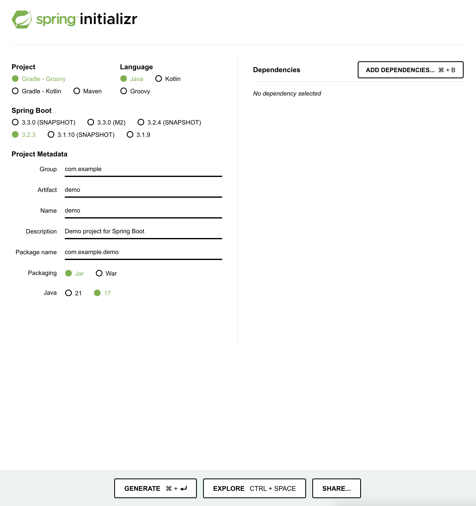
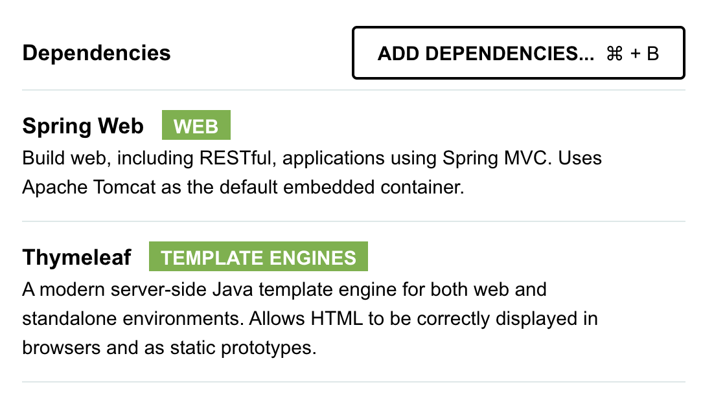
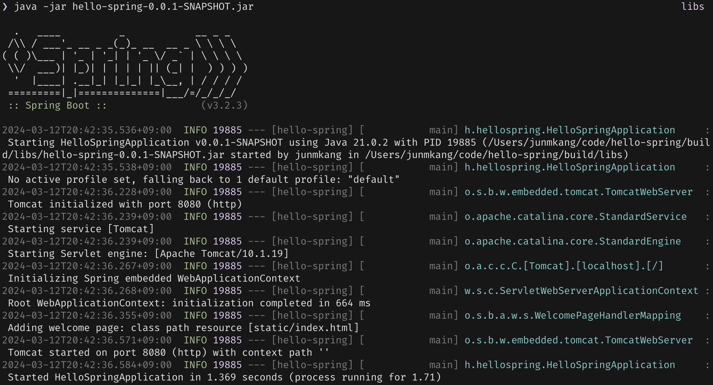

# 섹션 1. 프로젝트 환경설정



[](https://start.spring.io/)

기본적으로 `spring boot` 프로젝트를 시작하기에 앞서 프로젝트 설정을 쉽고 간편하게 진행할 수 있도록, 도움을 준다. ( 여러가지 설정이나 종속성 등 )

꼭 이 페이지를 사용해야만 `spring boot`를 시작할 수 있는것은 아니고, `spring boot`를 구성하는데 익숙하지않을 경우 사용하기에 좋다고 한다.

## Maven and Gradle

- 프로젝트를 빌드할때 사용하는 도구.
- 과거에는 `Maven`을 많이 사용하였지만 현재는 `Gradle`을 많이 사용한다고한다.

`Maven`은 `XML`을 기반으로 사용하고 `Gradle`은 `DSL`을 기반으로 사용한다고한다.

`Maven`에서 더욱 개선이되고 범용성 좋게 나온게 `Gradle`



spring boot를 시작하기전에 어떤 라이브러리를 가져와서 사용할건지 설정을 해줄 수 있다.

강의에서는 기본적으로 `Spring Web`과 `Thymeleaf`을 사용한다.

## **Spring Web**

웹 어플리케이션을 개발하는데 사용되는 핵심적인 라이브러리

- Spring MVC (Model-View-Controller)
    
    ](../img/junmkang_03.png)
    [https://developer.mozilla.org/ko/docs/Glossary/MVC](https://developer.mozilla.org/ko/docs/Glossary/MVC)
    
    `backend`에서 가장 범용적으로 많이 사용이 되는 `MVC` 디자인 패턴을 사용할 수 있게 지원을 해준다.
    
- RESTful 웹 서비스
`GET`, `POST`, `PUT`, `DELETE` 등
- 데이터 바인딩 및 유효성 검사
입력 데이터를 java 객체로 변환하거나, 유효성등의 검사를 할 수 있도록 지원 ( `Validator` )
- 뷰 템플릿
    
    ```java
        @GetMapping("hello")
        public String hello(Model model) {
            model.addAttribute("data", "hello!!");
            return "hello";
        }
    ```
    
    위와 같은 코드등을 사용해서 뷰 템플릿에게 전달하는 방식을 지원해준다.
    
- 인터셉터 및 필터
서블릿 컨테이너 수준에서 요청과 응답을 가로채고 처리하는 기능을 제공(?) 이라고 하나 정확하게 이해할만한 지식이 부족하므로 추후에 강의에서 다시 다뤄줄 내용인거같아서 일단은 보류
[https://mangkyu.tistory.com/173](https://mangkyu.tistory.com/173)
위에 링크에 잘 정리가 되어있는거 같으므로 추후에 참고필요.

## Thymeleaf

```html
<html xmlns:th="http://www.thymeleaf.org">
    <body>
        <p th:text="'안녕하세요 ' + ${data}">안녕하세요. 손님</p>
    </body>
</html>
```

위와 같은 코드에서 th를 사용하여 html을 동적으로 바꿀 수 있게 지원해주는 얘를 이야기한다고한다.

# java-spring 빌드하고 실행하기.

```bash
./gradlew build # build 생성하기

cd build/libs # *.jar 파일이 있는 경로로 이동

java -jar <file-name>.jar # jar파일을 바탕으로 실행하기

./gradlew clean # build 디렉토리 삭제
```



그러면 위와 같이 빌드 및 실행이 정상적으로 이루어진다.

`IntelliJ`에서 지원해주는 방식으로도 간단하게 실행할 수도있지만.

실제 내부적으로는 아래와 같은 방식으로 `build`를 진행해서 생성하고, `*jar` 를 실행하는 방식으로 동작을 한다고한다.

## *.jar

실제로 aws나 다른 클라우드 환경에 배포할 때는 주로 JAR 파일을 사용해서 배포를 한다고한다.