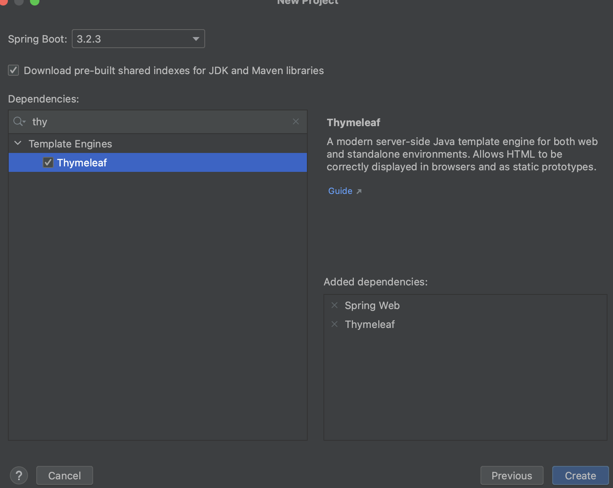
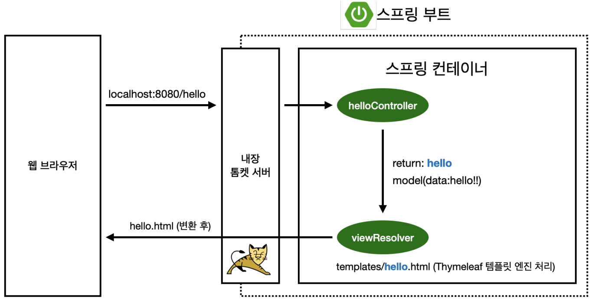

# 01. 프로젝트 환경설정

IDE jdk 등 프로젝트 환경설정을 진행하고, 빌드 툴, 빌드를 위한 라이브러리, 실행 시 기본적인 화면 출력 등을 학습한다.

## 1) 프로젝트 생성

### IDE

intellij

### jdk17

- 설치 후 설정

~~~sh
$ ls /Library/Java/JavaVirtualMachines

jdk-11.0.14.jdk  jdk-17.0.2.jdk   jdk-21.jdk       jdk1.7.0_75.jdk  jdk1.8.0_381.jdk
~~~

~~~sh
$ /usr/libexec/java_home -v 17

/Library/Java/JavaVirtualMachines/jdk-17.0.2.jdk/Contents/Home
~~~

~~~sh
vi ~/.zshrc
export JAVA_HOME=$(/usr/libexec/java_home -v 17) # add line
source ~/.zshrc
java -version # 17 버전 출력.
~~~

### 프로젝트 생성

### gradle 설정

~~~groovy
plugins {
    id 'java'
    id 'org.springframework.boot' version '3.2.3'
    id 'io.spring.dependency-management' version '1.1.4'
}

group = 'hello'
version = '0.0.1-SNAPSHOT'

java {
    sourceCompatibility = '17'
}

repositories {
    mavenCentral()
}

dependencies {
    implementation 'org.springframework.boot:spring-boot-starter-thymeleaf'
    implementation 'org.springframework.boot:spring-boot-starter-web'
    testImplementation 'org.springframework.boot:spring-boot-starter-test'

    implementation 'org.springframework.boot:spring-boot-starter-jdbc' // jdbc, dbctemplate
    implementation 'org.springframework.boot:spring-boot-starter-data-jpa' // jdbc, jpa
    runtimeOnly 'com.h2database:h2'
}

tasks.named('test') {
    useJUnitPlatform()
}
~~~

## 2) 라이브러리 살펴보기

스프링 프레임워크는 스프링의 핵심요소 3가지를 모두 구현한 스프링 프로젝트이다.

스프링 프레임워크는 내부적으로 20여개의 모듈을 포함하고 있다.([모듈 설명](https://github.com/seongtaekkim/spring-study/blob/master/docs/spring-architecture.md))

스프링 부트는 스프링 프레임워크를 포함한 여러 편의기능을 제공하고 있으며, 아래는 강의내용을 첨부하였다.

#### 스프링 부트 라이브러리

###### spring-boot-starter-web

- spring-boot-starter-tomcat: 톰캣 (웹서버)
- spring-webmvc: 스프링 웹 MVC

###### spring-boot-starter-thymeleaf: 타임리프 템플릿 엔진(View)

###### spring-boot-starter(공통): 스프링 부트 + 스프링 코어 + 로깅

- spring-boot
  - spring-core
- spring-boot-starter-logging
  - logback, slf4j

#### 테스트 라이브러리

spring-boot-starter-test

- junit: 테스트 프레임워크
- mockito: 목 라이브러리
- assertj: 테스트 코드를 좀 더 편하게 작성하게 도와주는 라이브러리
- spring-test: 스프링 통합 테스트 지원

## 3) View 환경설정

스프링부트의 아키텍처는 기본적으로 mvc 패턴으로 구성되어있다.

클라이언트인 웹 브라우저의 요청을 내장서버가 수신하여 정적파일을 response하거나 동적파일을 뷰 리졸버를 통해 response 한다.

#### Welcome Page -  [docs](https://docs.spring.io/spring-boot/docs/2.3.1.RELEASE/reference/html/spring-boot-features.html#boot-features-spring-mvc-welcome-page)

요청 파일이 없다면 기본적으로 `index.html` 이라는 정적파일을 response 하도록 구성되어 있다.

#### [thymeleaf](https://www.thymeleaf.org/) 템플릿 엔진

##### mvc의 view 부분 처리방식

컨트롤러에서 리턴 값으로 문자를 반환하면 뷰 리졸버(viewResolver)가 실제 화면을 찾아서 처리한다.

- 스프링 부트 템플릿엔진 기본 viewName 매핑
- 실제화면 위치: resources:templates/ +{ViewName}+ .html

템플릿 엔진 중 하나인 tymeleaf는 섹션2 에서 사용해 볼 예정이고 아래 사이트에서 자세히 살펴볼 수 있다.

[Serving Web Content with Spring MVC (튜토리얼)](https://spring.io/guides/gs/serving-web-content)

[Template Engines (spring docs)](https://docs.spring.io/spring-boot/docs/2.3.1.RELEASE/reference/html/spring-boot-features.html#boot-features-spring-mvc-template-engines)

## 4) 빌드하고 실행하기

#### build

##### case1) SpringApplication.run()

~~~java
@SpringBootApplication
public class HelloSpringApplication {
    public static void main(String[] args) {
        SpringApplication.run(HelloSpringApplication.class, args);
    }
}
~~~

##### case2) jar

~~~sh
./gradlew clean
./gradlew build
. cd build/libs
java -jar hello-spring-0.0.1-SNAPSHOT.jar
~~~

