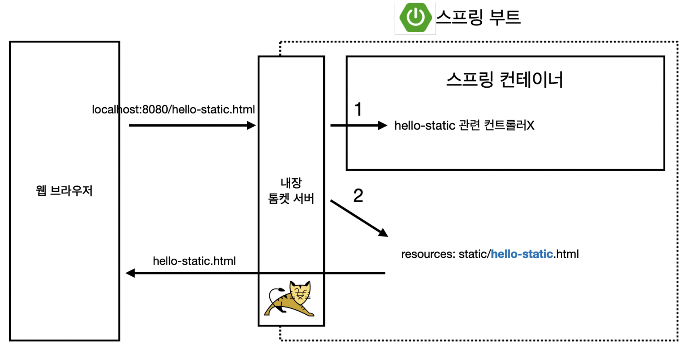
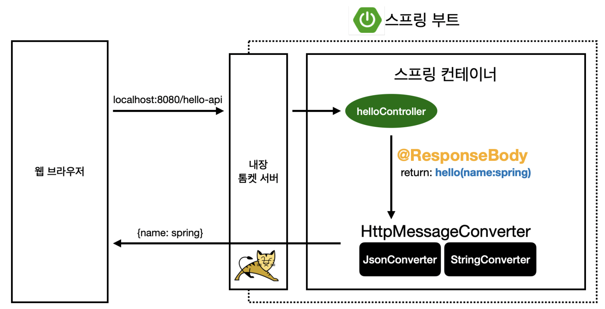

# 2. 스프링 웹 개발 기초

스프링 웹 동작을 크게 3가지로 나누어 간단한 테스트를 해보고, 중요 키워드들을 분류해본다.

## 1) [정적 컨텐츠](https://docs.spring.io/spring-boot/docs/2.3.1.RELEASE/reference/html/spring-boot-features.html#boot-features-spring-mvc-static-content)

아래 그림처럼 클라이언트가 리소스를 포함한 url을 서버에 요청하면, 웹서버는 해당하는 정적컨텐츠를 `resource: static` 에서 찾아서 response한다.

## 2) MVC와 템플릿 엔진

클라이언트가 url요청 시 웹서버는 동적컨텐츠 요청인지 분석 후 해당 url에 매칭되는 controller의 method를 찾아 호출한다.

Controller는 동적컨텐츠를 위한 데이터를 Model 객체에 담아 viewName으로 리턴하면

내부적으로 뷰 리졸버가 해당 파일을 찾는다. 이 때 템플릿 엔진에 의해 model 데이터를 html 파일에 담아 클라이언트로 response한다.

- hello/hellospring/controller/HelloController.java

~~~java
@Controller
public class HelloController {

    @GetMapping("hello")
    public String hello(Model model) {
        model.addAttribute("data","hello");
        return "hello";
    }
  ...
~~~

- resource/templates/hello.html

~~~html
<!DOCTYPE HTML>
<html xmlns:th="http://www.thymeleaf.org">
<head>
    <title>Hello</title>
    <meta http-equiv="Content-Type" content="text/html; charset=UTF-8" />
</head>
<body>

안녕하세요. 손님

</body>
</html>
~~~

## 3) API

2번과 다르게 화면이 아닌 특정 형식의 문자열을 response body에 추가 후 클라이언트에 response한다.

이를 위해 Controller에서 `@ResponseBody` 를 사용해야 하는데, 

이때 뷰 리졸버( viewResolver )는 생략되고 `HttpMessageConverter`가 동작한다.

`HttpMessageConverter`는 문자열 형식을 만들고, http status를 response body에 넣는다.

~~~java
    @GetMapping("hello-string")
    @ResponseBody
    public String helloString(@RequestParam("name") String name) {
        return "hello " + name;
    }

    @GetMapping("hello-api")
    @ResponseBody
    public Hello helloApi(@RequestParam("name") String name) {
        Hello hello = new Hello();
        hello.setName(name);
        return hello;
    }

    static class Hello {
        private String name;

        public String getName() {
            return name;
        }
        public void setName(String name) {
            this.name = name;
        }
    }
~~~

## 마치며

MVC동작에 위해 사용한 템플릿 엔진인 `thymeleaf`와 `뷰 리졸버`에 대한 자세한 이야기와 

API 동작을 위한 `ResponseBody`와 `HttpMessageConverter` 개념은 스프링 MVC 1,2편에서 학습할 예정이기에 생략하였다.

