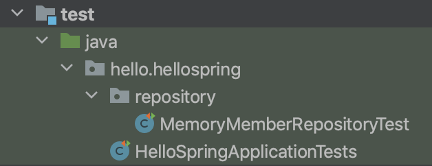
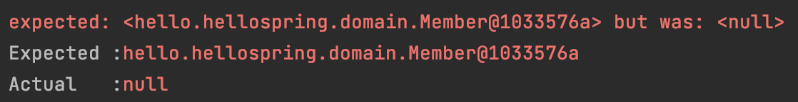

# 섹션 3. 회원 관리 예제 - 백엔드 개발

# 계층구조



- **컨트롤러**
웹 mvc의 컨트롤러 역할 
api를 생성하거나 등
- **서비스**
핵심 비지니스 로직들이 속할 파트
회원은 중복가입 불가능 등 ( mvc로 따지면 model )
- **리포지토리**
데이터베이스에 접근하거나 도메인 객체를 db의 저장하고 관리하는 역할 ( mvc로 따지면 model )
- **도메인**
비지니스 도메인 객체
****회원 주문 ****쿠폰처럼 데이터 베이스에 저장하고 관리되는것들

## 서비스와 리포지토리의 범위

서비스와 리포지토리가 서로 mvc의 같은 model을 가르키고있으니 정보에 대한 이해가 제대로 되지않았었다.
그래서 해당 정보를 찾아보니

- **리포지토리** 
실질적으로 직접 데이터에 접근해서 어떠한 값을 찾아온다던지 값을 추가적으로 저장한다던지 등을 담당하는 영역이라고 생각하면 된다.
- **서비스**
서비스 영역은 데이터에 직접접근하기보다는 리포지토리 영역에서 생성한 데이터접근 함수들을 가지고
어떠한 조건으로 데이터를 추가할건지, 회원가입조건 등을 걸어서 데이터를 간접적으로 추가하는 역할을 하는것들을 서비스 영역에서 담당한다고 생각하면된다.

# test code 작성

## test code란?

내가 작성한 메서드가 실제로 재대로 동작하는지 테스트 하는 코드이다

메서드가 실제로 동작이 정상적으로 이루어지고있는지를 일일이 확인하기는 어렵고,
프로젝트의 규모가 커지게 되면 일일이 확인하는것이 불가능하기때문에 `test code`라는 것을 작성해서 개발을 진행한다.



`java`에서 `test code`를 작성할때에는 위에 그림과 같은 경로에 `Test`를 진행할 파일을 생성해서 추가할 수 있고,

```java
@Test
public void findByName() {
    // test할 내용을 담을 코드
}
```

위에 코드와 같이 테스트로 돌려보고싶은 매개 함수를 만들고, `@Test` 라는 애노테이션을 붙여주게 되면
해당코드는 build를 진행할때 `test code`로 인식을 하게되어 build가 진행된다.

```java
@AfterEach
public void afterEach() {
    repository.clearStore();
}
```

`@AfterEach`에 경우에는 모든 `@test`  메소드가 실행되기전에 이 동작을 해야한다고 명시해줄 수 있다.
( 위에 코드에 경우에는 테스트를 돌릴때마다 이전에 테스트한 기록을 날리고싶어서 clearStore라는 매개함수를 선언하여 실행하고있다. )

## 테스트 결과를 확인하는 방법

test code가 동작한 이후에 test code내에서 동작이 정상적으로 이루어졌는지 그 결과값을 확인하는 방법에는 여러가지가 존재한다.

```java
System.out.println("result = " + (result == member));
```

- 위와 같이 단순하게 print를 찍어봐서 결과값이 정상적인지 확인하는 방식
일일이 `print`를 확인하는 행위자체가 비효율적이므로 추천하지않는 방식

```java
Assertions.assertEquals(Object expected, Object actual);

// ex
Assertions.assertEquals(member, result);
```

- 원하는 값과 결과적으로 나온값을 둘 다 넣어서 이 값 2개가 일치하는지 확인을 하는 방식
위와 같이 사용하고 `@Test` 함수를 실행하면 이 값이 같다면 오류없이 잘 나오고, 의도한 바대로 결과값이 잘 나오지않는다면 아래에 사진과 같이 기대한 값과 실제로 반환값이 나오게된다.


```java
Assertions.assertThat(member).isEqualTo(result);
```

- 원하는 값과 결과적으로 나온값을 둘 다 넣어서 이 값 2개가 일치하는지 확인을 하는 방식
전에 소개했던 `assertEquals` 과 똑같은 동작이 다 똑같지만 `value`를 넣는 방식에서 차이점이 달라진다.

## test 코드 의존관계

```java

class MemoryMemberRepositoryTest {
	@Test
	public void save() {
	    // test할 내용을 담을 코드
	}
	
	@Test
	public void findByName() {
	    // test할 내용을 담을 코드
	}
	
	@Test
	public void findAll() {
	    // test할 내용을 담을 코드
	}
}
```

위에 코드와 같이 여러개의 `@Test`들이 적힌 `class`를 동작시킨다고할때 내부적으로 선언되어있는 `@Test`들의 실행순서는 서로 보장되지않기때문에 의존적으로 설계를 진행을 해버리면 오류가 발생할 수 있다.

그러므로 **각 Test끼리는 시작순서가 보장되지않기때문에 의존적으로 설계를 해서는 안된다.**

`@AfterEach`를 사용해서 데이터를 초기화 시키는 등의 추가적은 설정을 해주는것이 좋다.

## **Optional**

```java
Optional<T>
```

 클래스는 값이 있을 수도 없을 수도 있는 객체를 감싸는 래퍼이고,
이것은 주로 NullPointerException을 방지하고 코드를 더 명확하게 만들기 위해 사용된다고한다.

service class에서는 비즈니스에 가까운 네이밍을 사용하는게 좋다.

서비스는 비즈니스의 의존적으로 설계

리포지토리에 경우에는 기계적으로 개발스럽게 용어선택을 많이한다고한다.

하는 역할에 맞춰서 네이밍 규칙을 설계

### command + control + t

command + contorl + t를 사용하면 손쉽게 `test code`의 툴을 구성할 수 있다.

### 한글

```java
@Test
void 회원가입() {
    // given
    Member member = new Member();
    member.setName("hello");

    // when
    Long saveId = memberService.join(member);

    // then
    Member findMember = memberService.findOne(saveId).get();
    assertThat(member.getName()).isEqualTo(findMember.getName());
}
```

`test code`에 경우에는 외부적으로 나가는 코드가 아니기때문에 한글로 함수의 이름을 구성하는 경우도 있다고 한다.

### given when then

```java
@Test
void 회원가입() {
    // given
    Member member = new Member();
    member.setName("hello");

    // when
    Long saveId = memberService.join(member);

    // then
    Member findMember = memberService.findOne(saveId).get();
    assertThat(member.getName()).isEqualTo(findMember.getName());
}
```

`test code` 를 작성할때 함수내부를 3가지 영역으로 나누어서 코드를 작성하는 경우가 있다고한다.
그래야 코드를 볼때 영역이 나누어져있어서 한눈에 알아보기 쉽게 볼 수 있다고한다.