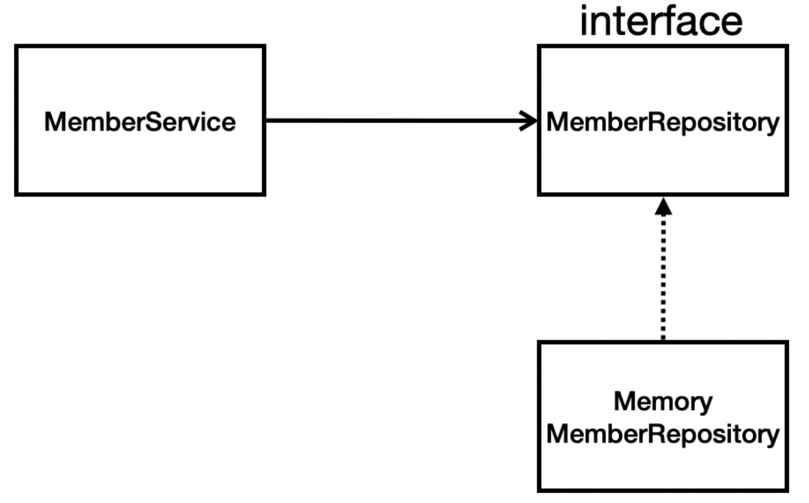

# 03. 회원 관리 예제 - 백엔드 개발

화면, DBMS가 제한된 상황에서 회원관리 비지니스로직만 주어진 상황에서 MVC 패턴을 적용하여 로직과 테스트코드를 작성해 보자.

## 1) 비즈니스 요구사항 정리

데이터: 회원ID, 이름

기능: 회원 등록, 조회

데이터 저장소 미지정 

- 메모리 기반의 데이터 저장소 사용
- 데이터저장소 변경에 대한 다형성 적용을 위해 인터페이스 설계필요

## 2) 회원 도메인과 리포지토리 만들기

##### repository : 도메인에 대한 실제 회원데이터에 접근하는 로직을 작성

1. 인터페이스 생성
   - MemberRepository
2. 구현체 생성
   - MemoryMemberRepository
   - 임시 저장소 `Map<Long, Member>` 을 `static` 으로 생성.

~~~java
public interface MemberRepository {
    Member save(Member member);
    Optional<Member> findById(Long id);
    Optional<Member> findByName(String name);
    List<Member> findAll();
}
~~~

~~~java
public class MemoryMemberRepository implements MemberRepository {
    private static Map<Long, Member> store = new HashMap<>();
    private static long sequence = 0L;
    @Override
    public Member save(Member member) {
        member.setId(++sequence);
        store.put(member.getId(), member);
        return member;
    }

    @Override
    public Optional<Member> findById(Long id) {
        return Optional.ofNullable(store.get(id));
    }

    @Override
    public Optional<Member> findByName(String name) {
        return store.values().stream().filter(m -> m.getName().equals(name)).findAny();
    }

    @Override
    public List<Member> findAll() {
        return new ArrayList<>(store.values());
    }
}
~~~

## 3) 회원 리포지토리 테스트 케이스 작성

- 필요한 기능만 테스트하기위해 JUnit프레임워크 를 이용해서 단위테스트를 진행한다.
- 단위테스트는 given, when, then 로 구획을나누어 연습하여 익숙해지자
- `@AfterEach` `@BeforeEach`: `@Test` 전후 마다 메서드를 실행하는 애노테이션
  - 테스트는 각각 독립적으로 실행되어야 하므로 자주 사용된다. 테스트 순서에 의존관계가 있는 것은 좋은 테스트가 아니다.
- `org.junit.jupiter.api.Assertions` 와 `org.assertj.core.api.Assertions` 를 주로 사용

~~~java
class MemoryMemberRepositoryTest {

    MemoryMemberRepository repository = new MemoryMemberRepository();

    @AfterEach
    void afterEach() {
        repository.clearStore();
    }

    @Test
    void save() {
        // given
        Member member = new Member( "seongtki");

        // when
        Member saved = repository.save(member);

        // then
        Member result = repository.findById(saved.getId()).get();
        Assertions.assertThat(result).isEqualTo(member);
    }

    @Test
    void findById() {
        // given
        Member m1 = new Member( "seongtki");

        // when
        repository.save(m1);

        // then
        Optional<Member> finded = repository.findById(m1.getId());
        Assertions.assertThat(finded.get().getId()).isEqualTo(m1.getId());
        Assertions.assertThat(finded.get()).isEqualTo(m1); // equals 비교
    }

    @Test
    void findByName() {
        // given
        Member m1 = new Member( "seongtki");

        // when
        repository.save(m1);

        // then
        Optional<Member> finded = repository.findByName(m1.getName());
        Assertions.assertThat(finded.get().getName()).isEqualTo(m1.getName());
    }

    @Test
    void findAll() {
        // given
        Member m1 = new Member( "seongtki");
        Member m2 = new Member( "seongtaekkim");

        // when
        repository.save(m1);
        repository.save(m2);

        // then
        Assertions.assertThat(2).isEqualTo(repository.findAll().size());
    }
}
~~~

## 4) 회원 서비스 개발

##### Service: Controller의 요청에 대해 Repository 데이터를 바탕으로 비지니스로직을 작성한다.

비지니스로직의 단위로서 주로 트랜잭션 단위로 사용한다.

~~~java
public class MemberService {
    private final MemberRepository memberRepository;

    public MemberService(MemberRepository memberRepository) {
        this.memberRepository = memberRepository;
    }

    /**
     * 회원가입
     */
    public Long join(Member member) {
        validateMember(member);
        memberRepository.save(member);
        return member.getId();
    }

    public List<Member> findMembers() {
        return memberRepository.findAll();
    }

    public Optional<Member> findOne(Long memberId) {
        return memberRepository.findById(memberId);
    }
  
      private void validateMember(Member member) {
        memberRepository.findByName(member.getName()).ifPresent(m -> {
            throw new IllegalStateException("already exist member");
        });
    }
}
~~~

## 5) 회원 서비스 테스트

~~~java
class MemberServiceTest {
    MemberService memberService;

    /**
     * 테스트에 직접 사용하지 않지만, 회원관리 리소스가 static 형태라서
     * 단위테스트마다 claer작업이 필요하여 작성함.
     */
    MemoryMemberRepository memberRepository;

    @BeforeEach
    void beforeEach() {
        memberRepository = new MemoryMemberRepository();
        memberService = new MemberService(memberRepository);
    }
    @AfterEach
    void afterEach() {
        memberRepository.clearStore();
    }

    @Test
    void join() {
        // given
        Member member = new Member("seongtki");

        // when
        Long id = memberService.join(member);
        Optional<Member> finded = memberService.findOne(id);

        // then
        Assertions.assertThat(member).isEqualTo(finded.get());
    }

    @Test
    void findMembers() {
        // given
        Member m1 = new Member( "seongtki");
        Member m2 = new Member( "seongtaekkim");

        // when
        memberService.join(m1);
        memberService.join(m2);
        List<Member> finded = memberService.findMembers();

        // then
        Assertions.assertThat(2).isEqualTo(finded.size());
    }

    @Test
    void findOne() {
        // given
        Member m1 = new Member( "seongtki");

        // when
        memberService.join(m1);
        Optional<Member> finded = memberService.findOne(m1.getId());

        // then
        Assertions.assertThat(m1).isEqualTo(finded.get());
    }

    @Test
    void 중복회원체크() {

        // given
        Member m1 = new Member( "seongtki");

        // when
        memberService.join(m1);

        // then
        assertThrows(IllegalStateException.class, () -> memberService.join(m1));
        Assertions.assertThat(1).isEqualTo(memberService.findMembers().size());
    }
}
~~~

