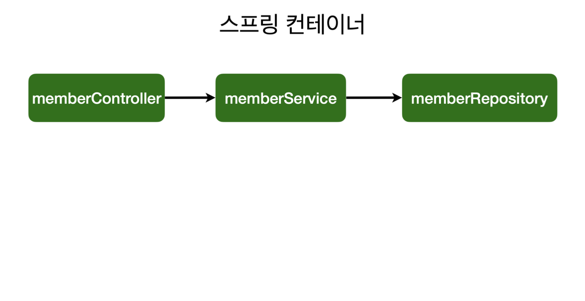
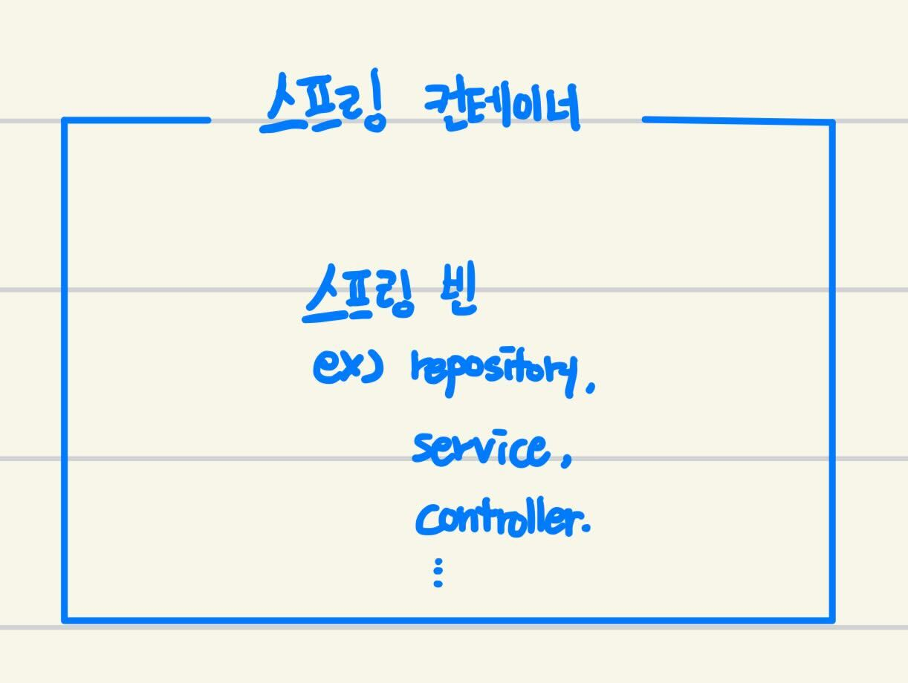

# 섹션 4. 스프링 빈과 의존관계



이전에 이야기를 이야기했던 [어플리케이션 계층구조](https://www.notion.so/3-4ee5136736404824bb84e2b1842b6769?pvs=21)를 서로 연결하는 작업을 해줘야한다.

다시 간단하게 정리를 하자면

- **리포지토리**
데이터의 직접 접근하여 데이터를 수정하거나 반환해주는 역할
- **서비스**
리포지토리 영역에서 만든 함수를 바탕으로 실질적인 서비스 로직을 구현하는 역할
- **컨트롤러**
서비스를 사용해서 **각각의** 웹페이지를 제공하주는 역할

이라고 생각하면된다.

# 컴포넌트 스캔과 자동 의존관계 설정

### di (**Dependency Injection)**

```java
@Autowired
public MemberController(MemberService memberService) {
    this.memberService = memberService;
}
```

그래서 이제 각각의 컴포넌트를 어떻게 하면 연결을 해줄 수 있냐하면
위의 코드는 어느 `Controller`의 생성자를 코드인데 `Controller`와 그것에 해당하는 `memberService`를 연결하는 코드부분에서는 `@Autowired`로 애노테이션을 지정해주면 **의존성 주입(Dependency Injection)**이라고 해서 `Controller`와 `memberService`을 연결해 줄 수 있게 된다.

추가적으로 di를 주입할때에는 생성자주입, setter주입, 필드주입이라고 해서 3가지의 방법이 있다고하는데
**생성자주입이 가장 좋은방법이라고한다.**

```java
@Repository
public class MemoryMemberRepository implements MemberRepository {}

@Service
public class MemberService {}

@Controller
public class MemberController {}
```

`@Autowired`을 지정하기전에 각각의 `Repository`, `Service`, `Controller` class들에게
애노테이션으로 `@Repository`, `@Service`, `@Controller`을 지정해줘야한다. ( 그래야만 서로를 인식할 수 있다.)

## 스프링 컨테이너? 스프링 빈?



스프링 컨테이너와 스프링 빈이라는 개념이 나와서 알아보니 위의 그림과 같다고 생각한다.

class들에게 `@Component`라는 애노테이션을 등록을 하면 `Spring Bean`이라는 이름으로 불리며 `Spring Container` 안에 등록이 된다고한다.
( `@Repository`, `@Service`, `@Controller` 이 애들도 `@Component`을 상속받고 있는 애들이라 동일한 동작을 한다. )

그러면 `@Autowired`키워드가 해당되는 객체를 찾을때 `Spring Container`라는 영역안에서 `Spring Bean`에 해당되는 객체가 있는지 확인하는 방식으로 연관된 객체를 찾는다고 한다.

`Spring Container`에 각각의 `Spring Bean`은 싱글톤으로 등록되어 사용된다고한다.

# 자바 코드로 직접 스프링 빈 등록하기

```java
@Configuration
public class SpringConfig {

    @Bean
    public MemberController memberController() {
        return new MemberController(memberService());
    }

    @Bean
    public MemberService memberService() {
        return new MemberService(memberRepository());
    }

    @Bean
    public MemberRepository memberRepository() {
        return new MemoryMemberRepository();
    }
}
```

위쪽에서 이야기했던 `@Repository`, `@Service`, `@Controller`으로 등록하는 방식말고도 디렉토리 최상단 위치에서 `SpringConfig`라는 파일을 생성해서 직접적으로 `Bean`을 등록하는 방식이 가능하다고한다.

### 왜 위의 방식을 써야하는지?

db를 변경할 사항이 생길때 컴포넌트 스캔 방식을 사용했다면 내부코드에서 직접바꿔주는 작업을 해야하지만
직접 `Bean`을 등록하는 방식을 사용했다면 `memberRepository`에서만 new하는 객체만 변경해주면 나머지들도 알아서 적용이 되기때문에 유동적으로 사용하기가 좋다.

2가지 방식을 같이 사용한다고했는데 그건 왜 그런지 알아볼 필요가 있다.