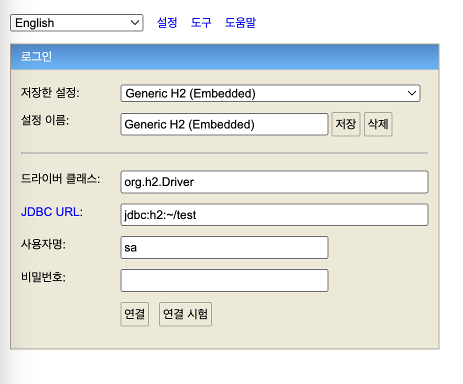
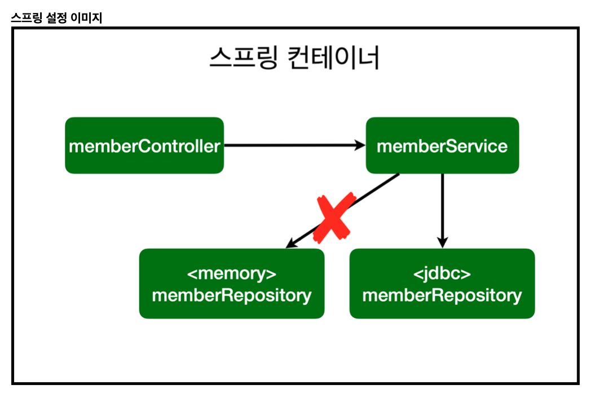
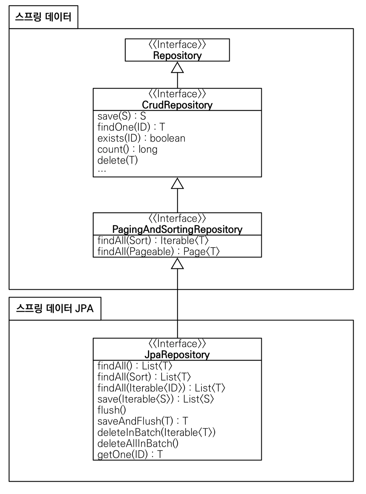

# 섹션 6. 스프링 DB 접근 기술

# H2 데이터베이스 설치

[https://www.h2database.com/html/main.html](https://www.h2database.com/html/main.html)

- 교육용으로 좋은 데이터베이스
- 용량이 작고 가볍다.
- 웹 관리할 수 있는 admin 화면 제공

다운로드 후에 압축해제 후 `h2/bin/h2.sh` 실행 



위와 같은 이미지의 페이지가 실행되게 되고, `[http://218.38.137.27:8082/](http://218.38.137.27:8082/)` 이런식으로 되어있을 url을 [`http://localhost:8082/`](http://218.38.137.27:8082/)로 변경을 해줘야한다.

```sql
drop table if exists member CASCADE;
create table member
(
		id   bigint generated by default as identity,
		name varchar(255),
    primary key (id)
);
```

그 후에는 위와 같은 sql문법을 사용해서 db를 생성하거나 

```sql
// db에 모든 항목 조회
SELECT * FROM MEMBER 

// db에 데이터 추가
insert into member(name) values('spring1')
```

위와 같은 문법들을 사용해서 조회하거나 데이터를 넣을 수 있다.

## ddl.sql

```sql
// sql/ddl.sql

drop table if exists member CASCADE;
create table member
(
    id   bigint generated by default as identity,
    name varchar(255),
    primary key (id)
);
```

데이터베이스 정의 언어(DDL, Data Definition Language)이라고해서 데이터베이스 객체를 정의하는 sql 스크립트 파일을 만든다고다고한다.

sql명령어들의 집합 주로 데이터베이스 객체의 정리를 기록하고 관리하는 용도로 사용된다.

# 순수 Jdbc



- 개방-폐쇄 원칙(OCP, Open-Closed Principle)
    - 확장에는 열려있고, 수정, 변경에는 닫혀있다.
- 스프링의 DI (Dependencies Injection)을 사용하면 **기존 코드를 전혀 손대지 않고, 설정만으로 구현 클
래스를 변경**할 수 있다.

```java
@Bean
public MemberService memberService() {
    return new MemberService(memberRepository());
}

@Bean
public MemberRepository memberRepository() {
//		return new MemoryMemberRepository();
    return new JdbcMemberRepository(dataSource);
}
```

위와 같은 코드에서 `return new MemoryMemberRepository()` 이 부분만 `return new JdbcMemberRepository(dataSource)` 이렇게 변경을 해주면 참고하고있던 db가 변경이되어도 간단한 수정만 진행하면 그대로 동작을 할 수 있다.

그러한 행위를 OCP라고 한다고한다.

# 스프링 통합 테스트

## `@SpringBootTest`

```java
@Transactional
class MemberServiceTest {
}
```

- 스프링 컨테이너와 테스트를 함께 실행해주는 애노테이션

## `@Transactional`

```java
@Transactional
class MemberServiceTest {
}
```

- 테스트 시작 전에 트랜잭션을 시작하고, 테 스트 완료 후에 항상 롤백한다. 이렇게 하면 **DB에 데이터가 남지 않으므로 다음 테스트에 영향을 주지 않는다**

스프링 컨테이너 없이 테스트를 할 수 있도록 하는게 시간적으로도 훨씬 효율적이기때문에 순수한 단위 테스트가 훨씬 좋은 테스트로 간주된다.

# 스프링 JdbcTemplate

반복적으로 작성한 코드들을 JdbcTemplate에서는 간편하게 중복없이 작성을 할수록 도와주는 역할이라고 생각하면 된다.

실제로 사용하지는 않을거같아서 일단 이런게 있구나 하고 넘기기.

테스트 코드를 잘 작성하는것이 중요하다. 실제로 실무에서도 테스트 코드를 작성하는데에 많은 시간을 할애해서 작성 한다고한다.

# JPA(Java Persistence API)

위쪽에서 계속 이야기가 나왔던 `Jdbc`를 개선한 방식을 이야기한다.

### 장점

- 기존의 반복 코드는 물론이고 기본적인 `SQL`도 `JPA`가 직접 만들어서 실행해준다고한다.
- `JPA`를 사용하면 `SQL`과 데이터 중심의 설계에서 객체 중심의 설계로 페러다임을 전환할 수 있다고한다.
- `JPA`를 사용하면 개발 생산성을 크게 높을 수 있다.

( JPA는 객체와 ORM이라고한다. )

`JPA(Java Persistence API)`가 현재 `java spring`시장에서 가장많이 사용되는 방식이라고한다.

jpa는 인터페이스

### JPQL

JPQL은 객체 지향적인 데이터베이스 접근을 위한 쿼리 언어라고하며 

```java
@Override
public List<Member> findAll() {
    return em.createQuery("select m from Member m", Member.class)
            .getResultList();
}
```

위와 같은 형식의 `sql`과 비슷한 문법을 사용하는 방식을 이야기한다.
데이터베이스 테이블을 직접적으로 다루는 것이 아니라, 엔티티 객체와 그들의 관계를 기반으로 쿼리를 작성할 수 있게 해준다.

위에 방식보다 더 개선이 된 `spring data jpa`라는 방식이 있어서 알고만 넘어가면 될거같다.

```java
@Id @GeneratedValue(strategy = GenerationType.IDENTITY)
    private Long id;
```

# 스프링 데이터 JPA



`spring data jpa`내부에서 기본으로 제공해주는 함수들이 많아서 기본적으로 생각할 수 있는 데이터관련 함수들은 다 가지고있고,

db구조의 따라 달라질 수 있는 `findByName(String name)` 같은 함수들은 직접구현이 필요하다.

그런데 추가적으로 더 지원을 해주는것이 

```java
  @Override
  Optional<Member> findByName(String name);
```

위와 같이 함수를 `findBy<data>(String <data>);` 형식으로 선언만 진행하더라도, 알아서 메서드 이름만으로 조회기능을 제공한다고한다.

`JPA관련해서 이해가 아직 잘 이해가 되지않아서 추가적인 공부가 필요할거같다..`