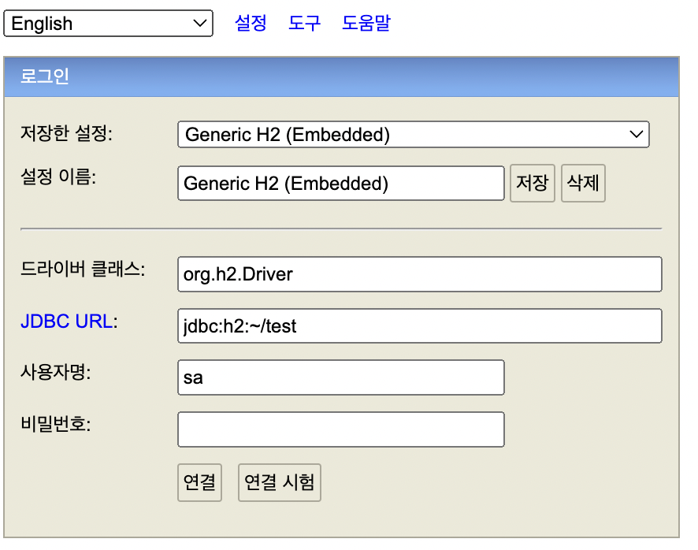
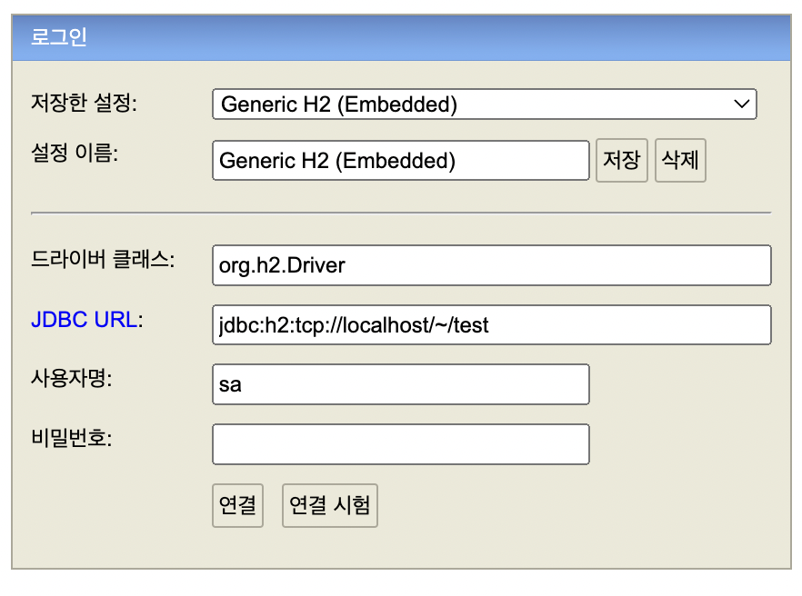
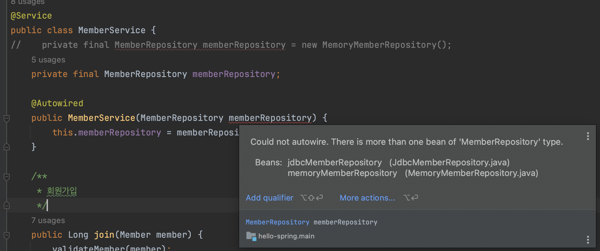

# 06. 스프링 DB 접근 기술

데이터저장소에 접근해서 데이터를 관리할 repository 구현기술들을 소개한다.

초창기 방식인 JDBC 부터시작해서 JDBCTemplate, JPA, Spring JPA에 이르기까지 앞 섹션까지 사용했던 repository 와 같은 기능을 작성하면서

간략하게나마 어느관점에서 편해지고 발전해왔는지 학습한다.

## 1) H2 데이터베이스 설치

개발이나 테스트 용도로 가볍고 편리한 DB, 웹 화면 제공

[h2 설치](https://www.h2database.com/)

- h2 데이터베이스 버전은 스프링 부트 버전에 맞춘다.
- 권한  chmod 755 h2.sh
- 실행: ./h2.sh
- 데이터베이스 파일 생성 방법
  - jdbc:h2:~/test (최초 한번)
  - ~/test.mv.db 파일 생성 확인
  - 이후부터는 jdbc:h2:tcp://localhost/~/test <-- 접속

- DB접속 후 아래 테이블 생성

~~~sql
drop table if exists member CASCADE;
create table member
(
id bigint generated by default as identity,
 name varchar(255),
 primary key (id)
);
~~~

- 다시 접속 시 아래처럼 소켓으로 접속 (웹과 jar 두개 동시 실행 시 충돌이 날 수 있다고 함)

#### H2 데이터베이스가 정상 생성되지 않을 때

- url 을 localhost 로 변경하여 다시 접속

## 2) 순수 Jdbc

### jdbc 관련 라이브러리 추가

- gradle

~~~groovy
implementation 'org.springframework.boot:spring-boot-starter-jdbc'
runtimeOnly 'com.h2database:h2'
~~~

- application.properties

~~~properties
spring.datasource.url=jdbc:h2:tcp://localhost/~/test
spring.datasource.driver-class-name=org.h2.Driver
spring.datasource.username=sa
~~~

### Jdbc 리포지토리 구현

#### Could not autowire

- 새로운 리포지토리 JdbcMemberRepository를 확장하게 되면 아래 그림처럼 Could not autowire 에러가 발생하게 된다.
- 컴파일 시점에는 같은 인터페이스를 확장한 두개이상의 구현체 중 어느것을 autowire 할 지 모르기 때문에 컴파일에러가 발생한다.
  - 해결법은 @Autowire 대신 @Qualifier 를 사용해 구현체이름을 지정해 주거나 (구현체 작성 자체가 객체지향적이지 않음)
  - 애초에 인터페이스가 아닌 구현체 이름을 생성자에 작성하는 방법이 있다. (다형성 버려?)
  - 여기 예제에서는 빈등록을 자바로 작성하여 해결하였다.

~~~java
@Repository
public class JdbcMemberRepository implements MemberRepository {
...
~~~

~~~java
@Repository
public class MemoryMemberRepository implements MemberRepository {
...
~~~

- 아래처럼 작성하면 컴파일타임에 MemberRepository가 어떤 객체인지 컴파일타임에 드러난다.
- 추가적으로 기존의 @Repository, @Service는 삭제한다.

~~~java
@Configuration
public class SpringConfig {

    private final DataSource dataSource;

    @Autowired
    public SpringConfig(DataSource dataSource) {
        this.dataSource = dataSource;
    }

    @Bean
    public MemberRepository memberRepository() {
        return new JdbcMemberRepository(dataSource);;
    }

    @Bean
    public MemberService memberService() {
        return new MemberService(memberRepository());
    }
~~~

### JdbcMemberRepository 작성

- Connection 객체를 얻고, sql문을 통해 PreparedStatement를 작성한 뒤
- 파라메터를 세팅하고 결과를 ResultSet 으로 리턴받는 로직을 작성한다.
- 과정에서 예외 처리를 하고
- 종료 후 리소스를 닫아준다. 

~~~java
    @Override
    public Member save(Member member) {
        String sql = "insert into member(name) values(?)";
        Connection conn = null;
        PreparedStatement pstmt = null;
        ResultSet rs = null;
        try {
            conn = getConnection();
            pstmt = conn.prepareStatement(sql, Statement.RETURN_GENERATED_KEYS);
            pstmt.setString(1, member.getName());
            pstmt.executeUpdate();
            rs = pstmt.getGeneratedKeys();
            if (rs.next()) {
                member.setId(rs.getLong(1));
            } else {
                throw new SQLException("id 조회 실패");
            }
            return member;
        } catch (Exception e) {
            throw new IllegalStateException(e);
        } finally {
            close(conn, pstmt, rs);
        }
    }
~~~

위 로직은 모든 메서드마다 비슷하고 긴 로직을 작성해야 한다. 물론 현재는 사용하지 않는 위험한 코드이다.

어려워보이긴 하지만 객체지향적 리펙토링 (SOLID)과 템플릿 메서드 & 콜백 및 전략패턴을 통해 4번 JdbcTemplate으로 개선할 수 있다.

토비의 스프링 1권에서 해당 내용이 자세하게 나와있어 책을 참고하거나 필자가 연습삼아 단계를 나누어 작성한 [코드](https://github.com/seongtaekkim/TIL/tree/master/java/effective-java/effective-java/src/main/java/me/staek/issue/simple_jdbctemplate)를 보면 쉽게 이해할 수 있다.

해당 코드를 반복하면 웬만한 수준의 객체지향적 사고에 도움이 된다고 생각한다.

## 3) 스프링 통합 테스트

@SpringBootTest 

- 스프링 컨테이너와 테스트를 함께 실행한다.

@Transactional

- 테스트 케이스에 이 애노테이션이 있으면, 테스트 시작 전에 트랜잭션을 시작하고, 테스트 완료 후에 항상 롤백한다.
- 이렇게 하면 DB에 데이터가 남지 않으므로 다음 테스트에 영향을 주지 않는다.

~~~java
@SpringBootTest
@Transactional
public class MemberServiceIntegrationTest {

    @Autowired MemberService memberService;

    @Test
    void 회원가입() {

        // given
        Member member = new Member("seongtki");

        // when
        Long id = memberService.join(member);

        // then
        Optional<Member> finded = memberService.findOne(id);
        Assertions.assertThat(finded.get().getName()).isEqualTo(member.getName());
    }

    @Test
    public void 중복_회원_예외() {
        // given
        Member member = new Member("seongtki");

        // when
        Long id = memberService.join(member);

        // then
        org.junit.jupiter.api.Assertions.assertThrows(IllegalStateException.class, () -> memberService.join(member));
    }
}
~~~

해당 테스트는 실제 스프링부트를 실행시켜 테스트를 진행한다.

통합테스트를 진행한다면 어울리지만

그렇지 않다면 단위테스트로 나누어 작성하는게 좋다

- 위와같은 코드는 테스트시간이 오래걸리고
- 프로젝트 전체가 동작해야 하므로 (예를들어 백앤드만 테스트하고 싶지만 프론트앤드 실행까지 강요됨) 그리 권장되지 않는다.
  - 섹션3 에서 백앤드만 테스트했음을 기억해보자.

## 4) 스프링 JdbcTemplate

스프링 JdbcTemplate과 MyBatis 같은 라이브러리는 JDBC API에서 본 반복 코드를 대부분 제거해준다. 하지만 SQL은 직접 작성해야 한다.

~~~java
public class JdbcTemplateMemberRepository implements MemberRepository {

    private final JdbcTemplate jdbcTemplate;

    public JdbcTemplateMemberRepository(DataSource dataSource) {
        this.jdbcTemplate = new JdbcTemplate(dataSource);
    }

    @Override
    public Optional<Member> findById(Long id) {
        List<Member> result = jdbcTemplate.query("select * from member where id = ?", memberRowMapper(), id);
        return result.stream().findAny();
    }
    ...
~~~

~~~java
@Configuration
public class SpringConfig {

    private final DataSource dataSource;

    @Autowired
    public SpringConfig(DataSource dataSource) {
        this.dataSource = dataSource;
    }

    @Bean
    public MemberRepository memberRepository() {
        return new JdbcTemplateMemberRepository(dataSource);;
    }

    @Bean
    public MemberService memberService() {
        return new MemberService(memberRepository());
    }
~~~

## 5) JPA

JPA는 기존의 반복 코드는 물론이고, 기본적인 SQL도 JPA가 직접 만들어서 실행해준다.

JPA를 사용하면, SQL과 데이터 중심의 설계에서 객체 중심의 설계로 패러다임을 전환을 할 수 있다.

JPA를 사용하면 개발 생산성을 크게 높일 수 있다.

- gradle 의존라이브러리 추가

~~~groovy
implementation 'org.springframework.boot:spring-boot-starter-data-jpa' // jdbc, jpa
~~~

- application.properties
  - show-sql : JPA가 생성하는 SQL을 출력한다.
  - ddl-auto : JPA는 테이블을 자동으로 생성하는 기능을 제공하는데 none 를 사용하면 해당 기능을 끈다.
    - create 를 사용하면 엔티티 정보를 바탕으로 테이블도 직접 생성해준다.

~~~properties
spring.jpa.show-sql=true
spring.jpa.hibernate.ddl-auto=none
~~~

### entity 매핑

~~~java
@Entity
public class Member {
    @Id @GeneratedValue(strategy = GenerationType.IDENTITY)
    private Long id;
    private String name;

    public Member(Long id, String name) {
        this.id = id;
        this.name = name;
    }

...
}

~~~

~~~java
public class JpaMemberRepository implements MemberRepository {

    private final EntityManager entityManager;

    public JpaMemberRepository(EntityManager entityManager) {
        this.entityManager = entityManager;
    }

    @Override
    public Member save(Member member) {
        System.out.println(entityManager);
        entityManager.persist(member);
        System.out.println(member.getId() + " " + member.getName());
        return member;
    }

    @Override
    public Optional<Member> findById(Long id) {
        Member member = entityManager.find(Member.class, id);
        return Optional.ofNullable(member);
    }
  ...
~~~

~~~java
@Configuration
public class SpringConfig {

    private final DataSource dataSource;
    private final EntityManager entityManager;

    @Autowired
    public SpringConfig(DataSource dataSource, EntityManager entityManager) {
        this.dataSource = dataSource;
        this.entityManager = entityManager;
    }

    @Bean
    public MemberRepository memberRepository() {
        return new JpaMemberRepository(entityManager);
    }

    @Bean
    public MemberService memberService() {
        return new MemberService(memberRepository());
    }
~~~

#### 서비스 계층에 트랜잭션 추가 

- class 혹은 method 에 추가가능

- 스프링은 해당 클래스의 메서드를 실행할 때 트랜잭션을 시작하고, 메서드가 정상 종료되면 트랜잭션을 커밋한다.
  만약 런타임 예외가 발생하면 롤백한다.

- JPA를 통한 모든 데이터 변경은 트랜잭션 안에서 실행해야 한다.

~~~java
public class MemberService {
...
    @Transactional
    public Long join(Member member) {
        validateMember(member);
        memberRepository.save(member);
        return member.getId();
    }
    ..
~~~

## 6) 스프링 데이터 JPA

- JPA 커버해서 만들었다.
- 인터페이스를 만들고 필요한 메서드를 작성하면 구현코드는 컴파일타임에 알아서 작성된다.
- 생산성이 높아지지만, 너무 당연하게도 JPA를 자세히 알아야 한다.
- 저자는 JPA는 이제 필수라고 말하고 있다. 

~~~java
public interface SpringDataJpaMemberRepository extends JpaRepository<Member,
        Long>, MemberRepository {

    Optional<Member> findByName(String name);
}
~~~

~~~java
@Configuration
public class SpringConfig {

    private final MemberRepository memberRepository;

    public SpringConfig(MemberRepository memberRepository) {
        this.memberRepository = memberRepository;
    }

    @Bean
    public MemberService memberService() {
        return new MemberService(memberRepository);
    }
~~~

## 마치며

초창기 방식인 JDBC 부터시작해서 JDBCTemplate, JPA, Spring JPA에 이르기까지 많은 DB접근기술에 대해 간단히 학습하였다.

스프링 DB 2편에서 SQL 매퍼기술 (JDBCTemplate, mybatis) 이나 ORM (JPA) 등에 대해 조금 더 자세히 학습할 예정이나

깊게 다루지 않기 때문에 저자가 작성한 JPA 강의 와 책을 추가적으로 공부하는게 좋을 것 같다.

