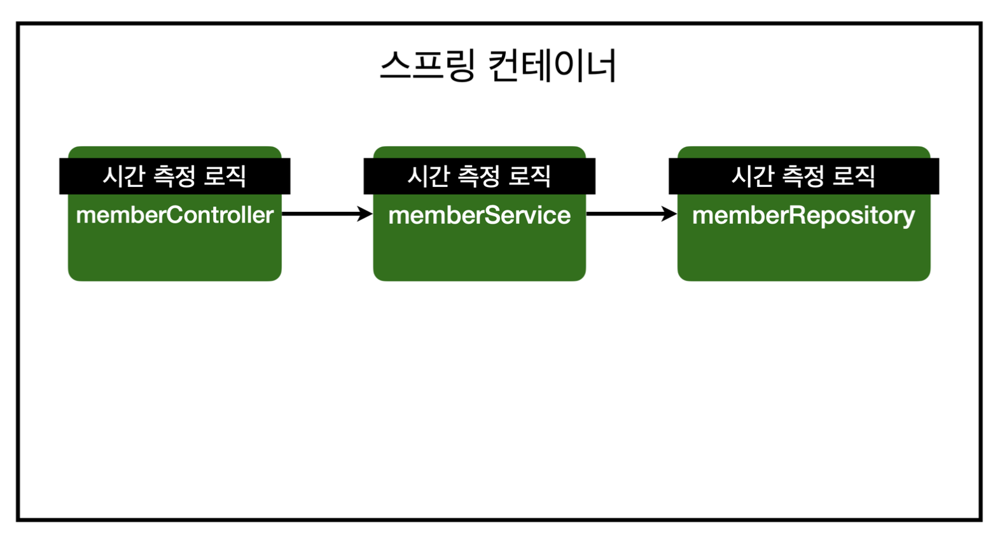
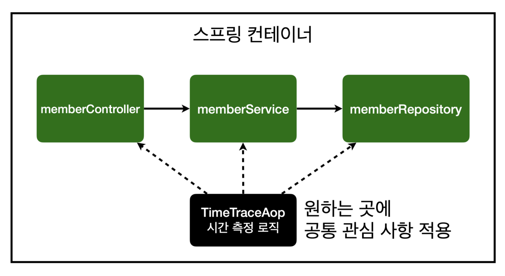

# 섹션 7. AOP

# AOP란?

관점 지항 프로그래밍이라고 불리며,
공통 관심 사항(cross-cutting concern) vs 핵심 관심 사항(core concern) 으로 나눠진다고한다.



위와 같이 다양한 메서드에 시간측정로직을 붙인다고할때 모든 로직에 일일이 붙어야했던 것들을
공통 관심사항과 핵심관심사항으로 나누어 



위와 같이 시간측정로직은 한번만 작성을 하고 내가 원하는곳에 적용하는 방식을 `AOP`라고 이야기한다.

### **Basic structure**

```java
public Object execute(ProceedingJoinPoint joinPoint) throws Throwable {
    System.out.println("Before executing target method");
    Object result = joinPoint.proceed(); // 타겟 메서드 실행
    System.out.println("After executing target method");
    return result;
}
```

### 시간 측정 aop

```java
@Aspect
public class TimeTraceAop {

    @Around("execution(* hello.hellospring..*(..))")
    public Object execute(ProceedingJoinPoint joinPoint) throws Throwable {
        long start = System.currentTimeMillis();
        System.out.println("START :" + joinPoint.toString());
        try {
            return joinPoint.proceed();
        } finally {
            long finish = System.currentTimeMillis();
            long timeMs = finish - start;
            System.out.println("END :" + joinPoint.toString() + " " + timeMs + "ms");
        }
    }
}
```

위에 코드는 모든 메서드에 `TimeTraceAop`를 적용시켜서 시간을 측정하는 로직이다. 중요한 로직을 해석을 해보자면

`@Aspect`

```java
@Aspect
public class TimeTraceAop {
}
```

위와 같이 `aop`로 사용할 `class`위에 `@Aspect`를 붙여줘야만 `aop`로 사용할 수 있다.

```java
Around("execution(* hello.hellospring..*(..))")
```

어느범위에 메서드에 적용을 시킬건지 지정을 해주는 방식인데 위에 코드에서는 `hello.hellospring` 아래에 있는 모든 하위에 다 적용을 시키겠다는 의미이다.

```java
ProceedingJoinPoint joinPoint
```

타겟 메서드를 나타내는 자료형을 이야기한다.

```java
return joinPoint.proceed();
```

타겟 메서드의 실행위치를 나타낸다.
aop를 지정할때 다양한 로직을 매칭할 수 있어야하는데 `return joinPoint.proceed();`을 통해서 어느 위치에서 타겟 메서드를 실행할건지를 지정할 수 있다.