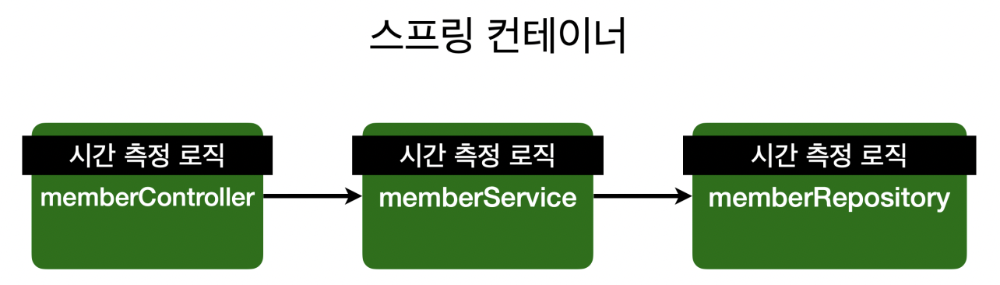
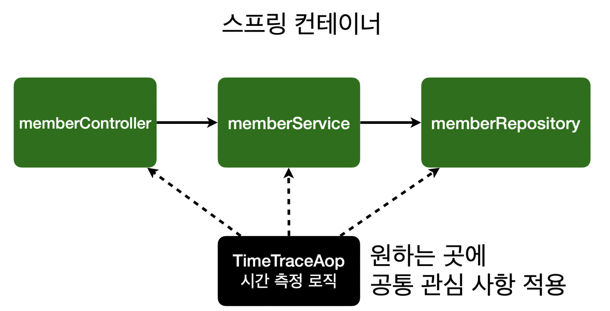

# 07. AOP

AOP는 스프링 3대 요소 중 하나로서 러닝커브가 다소 있지만 효용성이 매우높은 기술이다.

주로 원하는 메서드에 어떤 기능을 한번에 적용하고 싶을 때 사용하게 된다.

해당 섹션에서는 aspect 라이브러리를 매우 간단한 예제를 작성하며, 그 필요성과 효용성을 체험해본다.

## 1) AOP가 필요한 상황

- 모든 메소드의 호출 시간을 측정하고 싶다면?
- 공통 관심 사항(cross-cutting concern) vs 핵심 관심 사항(core concern)
- 회원 가입 시간, 회원 조회 시간을 측정하고 싶다면?

#### MemberService 회원 조회 시간 측정 로직 추가

~~~java
public class MemberService {

 public Long join(Member member) {
 long start = System.currentTimeMillis();
 try {
 	validateDuplicateMember(member); //중복 회원 검증
 	memberRepository.save(member);
 	return member.getId();
 } finally {
 	long finish = System.currentTimeMillis();
 	long timeMs = finish - start;
 	System.out.println("join " + timeMs + "ms");
 }
 }
}
~~~

#### 문제점

- 회원가입, 회원 조회에 시간을 측정하는 기능은 `핵심 관심 사항`이 아니다.
- 시간을 측정하는 로직은 `공통 관심 사항`이다.
- 시간을 측정하는 로직과 핵심 비즈니스의 로직이 섞여서 유지보수가 어렵다.
- 시간을 측정하는 로직을 별도의 공통 로직으로 만들기 매우 어렵다
- 시간을 측정하는 로직을 변경할 때 모든 로직을 찾아가면서 변경해야 한다.

## 2) AOP 적용

- AOP: Aspect Oriented Programming
- 공통 관심 사항(cross-cutting concern) vs 핵심 관심 사항(core concern) 분리

##### 시간 측정 AOP 등록

~~~java
@Component
@Aspect
public class TimeTraceAop {
    @Around("execution(* hello.hellospring..*(..))")
    public Object execute(ProceedingJoinPoint joinPoint) throws Throwable {
        long start = System.currentTimeMillis();
        System.out.println("START: " + joinPoint.toString());
        try {
            return joinPoint.proceed();
        } finally {
            long finish = System.currentTimeMillis();
            long timeMs = finish - start;
            System.out.println("END: " + joinPoint.toString()+ " " + timeMs + "ms");
        }
    }
}
~~~

- 회원가입, 회원 조회등 핵심 관심사항과 시간을 측정하는 공통 관심 사항을 분리한다.
- 시간을 측정하는 로직을 별도의 공통 로직으로 만들었다.
- 핵심 관심 사항을 깔끔하게 유지할 수 있다.
- 변경이 필요하면 이 로직만 변경하면 된다.
- 원하는 적용 대상을 선택할 수 있다.

###  스프링의 AOP 동작 방식 설명 ?

강사님이 그림과 함께 프록시 동작을 설명하였으나 워낙 추상적이었기에 강좌만으로 정리하기에 무리가 있다.

AOP는 데코레이터 & 프록시패턴 과 리플렉션 학습 후 단계별 리팩토링을 통해 이해할 수 있다.

이후 강의 중 스프링 핵심 원리 - 고급편 에서 해당내용이 등장하는데, 토비의스프링과 곁들여 학습하면 보다 깊은 이해가 가능해 보인다.

