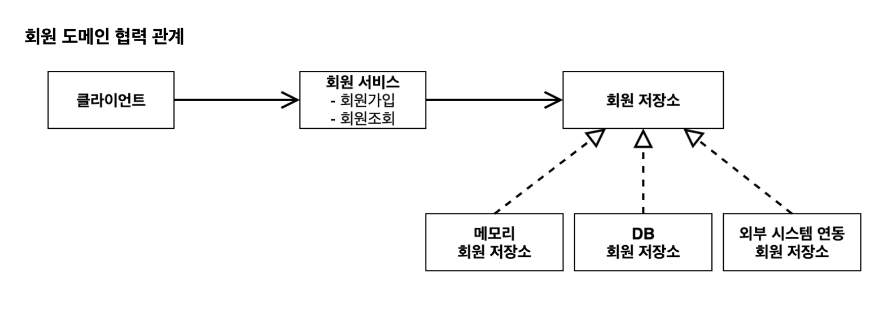
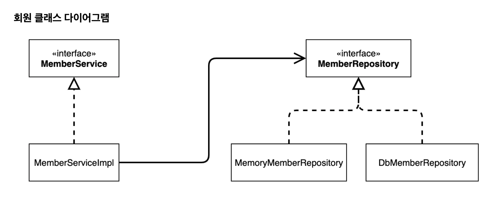

# 섹션 2. 스프링 핵심 원리 이해1 - 예제 만들기






```java
private final MemberRepository memberRepository = new MemoryMemberRepository();
```

위와 같은 코드를 보면 `MemberRepository`를 의존함으로서 추상화에 의존을 하고있고,
`new MemoryMemberRepository()`을  할당 받음으로서 구체화에도 의존을 하고있다.

`SOLID`를 위반하는 설계이므로 잘못된 설계로 볼 수 있다.