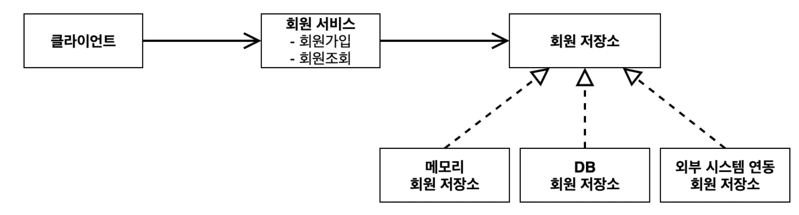
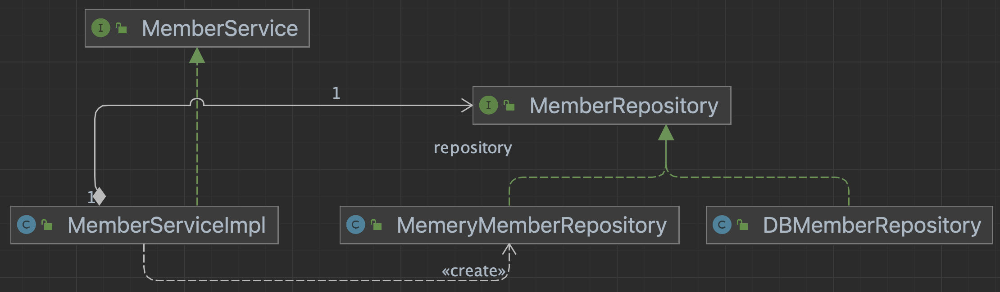
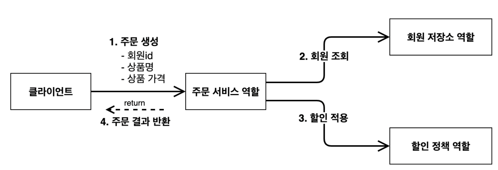
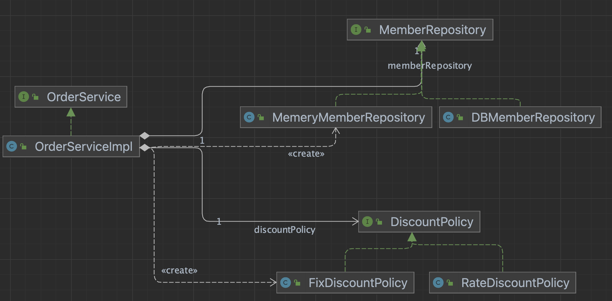
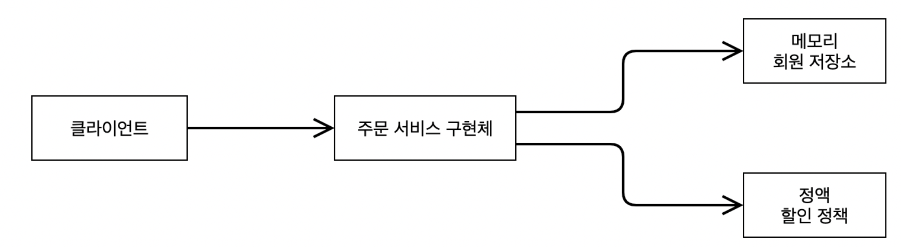

# 02. 스프링핵심원리이해1 - 예제

회원, 주문과 할인정책 요구사항에 대해 인터페이스를 설계하고 구현체를 생성해서 개발, 테스트를 진행한다.

클래스타임과 런타임에 클래스 간 관계를 살펴보고 역할에 대한 구현체가 변경되었을 때 어떤 문제점이 있을지 파악해본다.

## 1) 프로젝트 생성

jdk17, springboot 3.2.3 gradle project 생성

##### gradle

~~~groovy
dependencies {
    implementation 'org.springframework.boot:spring-boot-starter'
    testImplementation 'org.springframework.boot:spring-boot-starter-test'
}
~~~

## 2) 비즈니스 요구사항과 설계

회원 요구사항

~~~
회원을 가입하고 조회할 수 있다.
회원은 일반과 VIP 두 가지 등급이 있다.
회원 데이터는 자체 DB를 구축할 수 있고, 외부 시스템과 연동할 수 있다. (미확정)
~~~

주문과 할인 정책 요구사항

~~~
회원은 상품을 주문할 수 있다.
회원 등급에 따라 할인 정책을 적용할 수 있다.
할인 정책은 모든 VIP는 1000원을 할인해주는 고정 금액 할인을 적용해달라. (나중에 변경 될 수 있다.)
할인 정책은 변경 가능성이 높다. 회사의 기본 할인 정책을 아직 정하지 못했고, 오픈 직전까지 고민을 미루고 싶다.
최악의 경우 할인을 적용하지 않을 수 도 있다. (미확정)
~~~

## 3) 회원 도메인

##### 도메인 설계도

##### 클래스 다이어그램

##### 객체 다이어그램

#### 문제점

- 클래스 다이어그램을 보면, `MemberServiceImpl`이 `MemoryMemberRepository` 를 생성하고 있다.
  ~~~java
  public class MemberServiceImpl implements MemberService {
      private final MemberRepository repository = new MemeryMemberRepository(); // DIP 위반
      ...
  ~~~

- 이는  MemberRepository 의 구현체라 변경될 때마다 MemberServiceImpl 파일내용을 수정해야 한다는 의미이고
  DIP, OCP 를 위반한 사례가 된다.

## 4) 주문과 할인 도메인

##### 도메인 설계도

##### 클래스 다이어그램

##### 객체 다이어그램

#### 문제점

- 회원 도메인 설계와 같은 이슈로, `OrderServiceImpl`는 `Repository`, `DiscountPolicy` 의 구현체를 직접 생성하고 있어
  OCP, DIP를 위반하고 있다.

  ~~~java
  public class OrderServiceImpl implements OrderService {
      private final MemberRepository memberRepository = new MemeryMemberRepository();
      private final DiscountPolicy discountPolicy = new FixDiscountPolicy();
      ...
  ~~~

  

