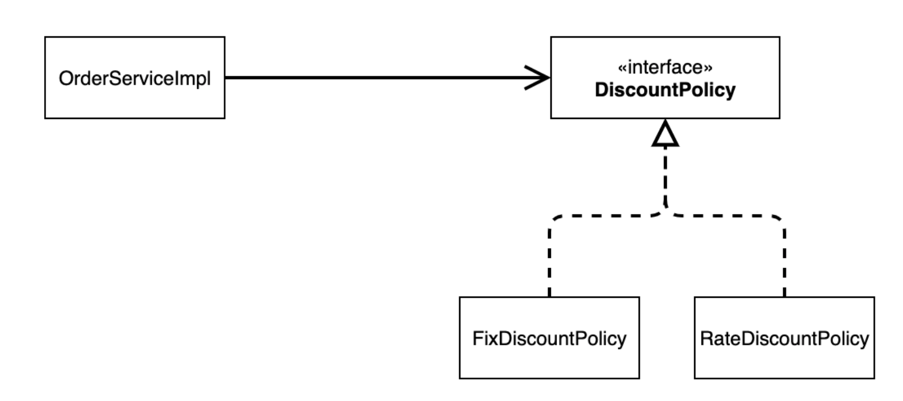
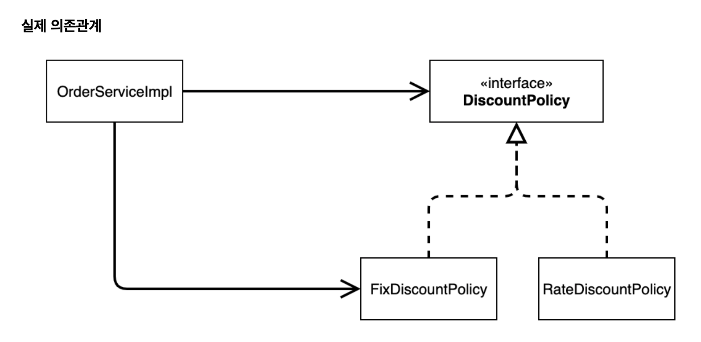
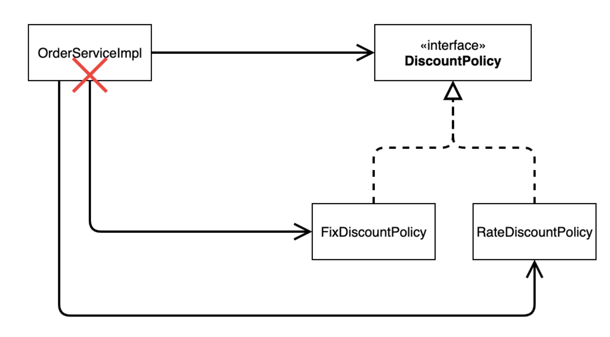
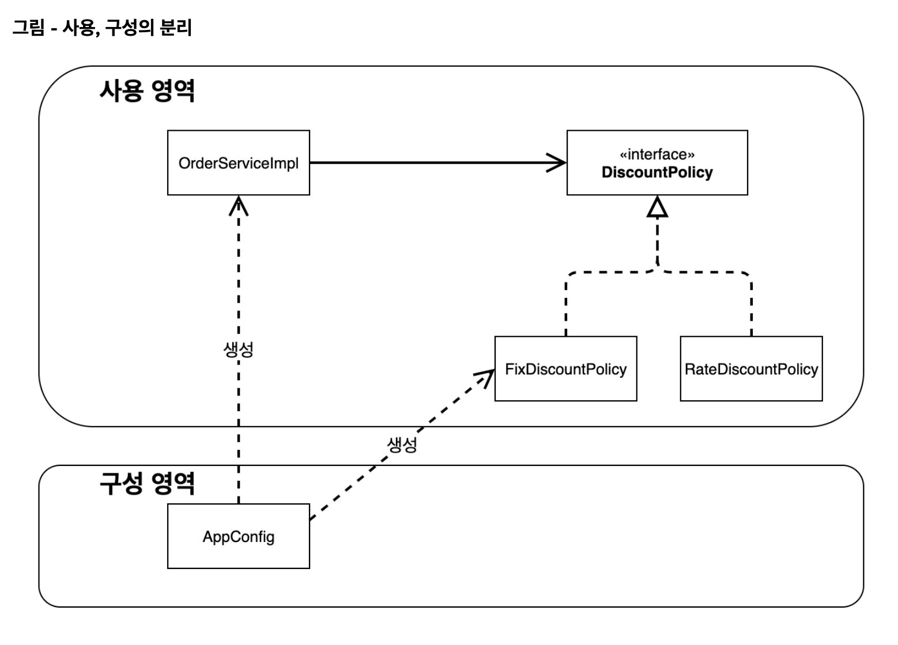

# 섹션 3. 스프링 핵심 원리 이해2 - 객체 지향 원리 적용

## 문제점

```java
private final DiscountPolicy discountPolicy = new FixDiscountPolicy();
```

위와 같은 코드방식의 의존관계를 사용하면



위에 그림과 같이 의존을 했어야했는데



실제적으로는 `MemberRepository`를 의존함으로서 추상화에 의존을 하고있고,
`new MemoryMemberRepository()`을  할당 받음으로서 구체화에도 의존을 하고있다.

`SOLID`에서의 **DIP를 위반하는 설계로 볼 수 있다고 한다.**

## 정책 변경



그래서 위에 그림과 같이 `OrderServiceImpl`에서 의존하고있던 주체를 변경하게 되면
`OrderServiceImpl`의 소스코드도 함께 변경이 이루어져야함으로 **OCP를 위반하는것으로 볼 수 있다.**

## 해결방법

이 문제를 해결하려면 누군가가 클라이언트인 `OrderServiceImpl` 에 `DiscountPolicy` 의 구현 객체를 대 신 생성하고 주입해주어야 한다.

```java
// OrderServiceImpl.java
private final MemberRepository memberRepository;
private final DiscountPolicy discountPolicy;

public OrderServiceImpl(MemberRepository memberRepository, DiscountPolicy discountPolicy) {
    this.memberRepository = memberRepository;
    this.discountPolicy = discountPolicy;
}

// Config.java
public class AppConfig {

    public MemberService memberService() {
        return new MemberServiceImpl(new MemoryMemberRepository());
    }

    public OrderService orderService() {
        return new OrderServiceImpl(
                new MemoryMemberRepository(),
                new FixDiscountPolicy()
        );
    }
}
```

그래서 내부코드에서 직접 넣는 방식이 아니라 위와 같이 생성자를 통해서 주입을 할 수 있도록 변경을 하고,
따로 **관심사를 분리**하여 따로 할당을 진행해줄 수 있는 `Config.java` 파일을 생성하는 방식으로 진행하면 위와 같은 문제를 해결할 수 있다.


그래서 실제 의존관계는 위와 같이 변경이 된다.

```java
// Before
MemberService memberService = new MemberServiceImpl();

// After
AppConfig appConfig = new AppConfig();
MemberService memberService = appConfig.memberService();
```

그래서 실제로 `test code`등에서도 위와 같은 형식으로 바꾸는 과정도 필요

`AppConfig`는 애플리케이션이 어떻게 동작할지 전체 구성을 책임진다.

## AppConfig refactor

```java
public class AppConfig {

    public MemberService memberService() {
        return new MemberServiceImpl(memberRepository());
    }

    public MemoryMemberRepository memberRepository() {
        return new MemoryMemberRepository();
    }

    public OrderService orderService() {
        return new OrderServiceImpl(memberRepository(), discountPolicy());
    }

    public DiscountPolicy discountPolicy() {
        return new FixDiscountPolicy();
    }
}
```

위와 같은 형식으로 한눈에 보기쉽고, 추후에 변경에 용이하게 변경.



**구성영역과** **사용영역으로** 구분을 하여 코드를 변경할때 **구성영역이** 속해있는 `AppConfig`만 변경을 하는 방식으로 사용한다

## **제어의 역전** IoC(Inversion of Control)

프로그램의 제어 흐름을 직접 제어하는것이 아니라 외부에서 관리하는 것을 제어의 역전(IoC)라고 한다.

## **의존관계 주입** DI(Dependency Injection)

## IoC컨테이너, DI 컨테이너

- AppConfig처럼 객체를 생성하고 관리하면서 의존관계를 연결해 주는 것을 
**IoC 컨테이너** 또는 **DI 컨테이너**라 한다.
최근에는 **DI 컨테이너**라고한다.

## spring으로 변경

```java
ApplicationContext applicationContext = new AnnotationConfigApplicationContext(AppConfig.class);
```

spring 컨테이너에다가 다 집어넣어서 관리를 해준다.

```java
MemberService memberService = applicationContext.getBean("memberService", MemberService.class);
```

실제로 원하는 bean을 꺼내서 사용할때에는 `getBean`을 사용해서 꺼낼 수 있다.

## 스프링 컨테이너

- `ApplicationContext` 를 스프링 컨테이너라 한다.
- 스프링 컨테이너는 `@Configuration` 이 붙은 `AppConfig` 를 설정(구성) 정보로 사용한다. 여기서 `@Bean` 이 라 적힌 메서드를 모두 호출해서 반환된 객체를 스프링 컨테이너에 등록한다. 이렇게 스프링 컨테이너에 등록된 객체를 스프링 빈이라 한다.
- 스프링 빈은 `@Bean` 이 붙은 메서드의 명을 스프링 빈의 이름으로 사용한다.