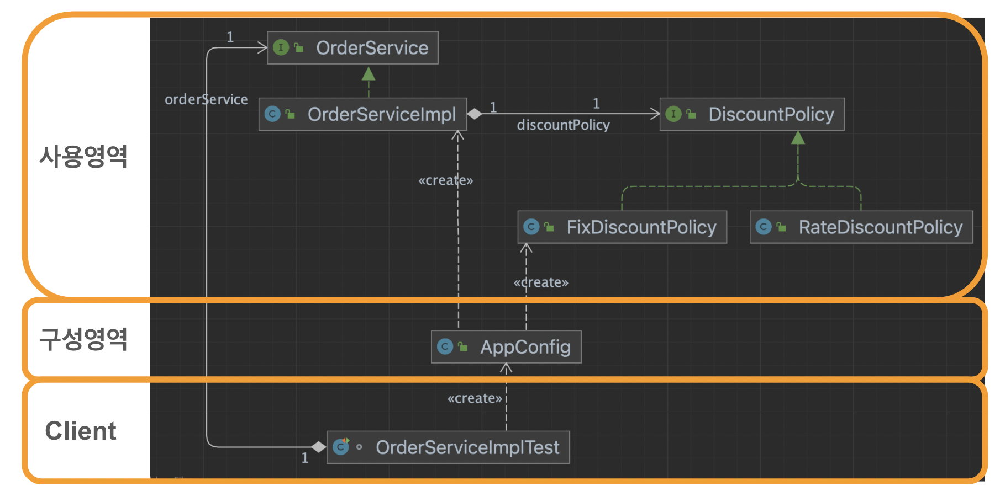

# 03. 스프링핵심원리이해2 - 객체지향원리적용

## 1) 관심사 분리

#### 문제점 인식

이전 섹션에서 주문 시 할인정책은 고정금액을 깎아주는 방식이었다. 의사결정에 따라 일정비율로 금액을 깎아주는 방식으로 변경되었다면

코드는 어느곳이 변경될까?

~~~java
public class OrderServiceImpl implements OrderService {
		...
    private final DiscountPolicy discountPolicy = new FixDiscountPolicy(); // RateDiscountPolicy로 변경해야함
~~~

할인정책(DiscountPolicy) 이 변경되었는데 뜬금없이 주문 구현체 (OrderServiceImpl) 코드가 변경되어야 한다.
아래 메서드에서 DiscountPolicy의 기능을 사용해야 하기 때문이다.

~~~java
@Override
public Order createOrder(Long memberId, String itemName, int itemPrice) {
    Member member = memberRepository.findById(memberId);
    int discount = discountPolicy.discount(member);
    return new Order(member.getId(), itemName, itemPrice, discount);
}
~~~

할인정책을 생성하는 곳과 사용하는 곳이 같다. 다른 관심사 2개가 한곳에 있다. 
SRP와 DIP를 명시적으로 위반하였고, 이에따라 변경 시 OCP도 위반하게 되었다.
우리는 관심사를 하나로 바꾸어야 한다.

사용을 위해 `OrderServiceImpl`를 만들었으니 생성을 다른곳을 옮기고 싶다.

여기서 Factory라는 개념이 등장한다. Factory는 사용할 인스턴스를 미리 생성해주는 곳이다.

이렇게 `관심사를 분리` 할 수 있다면 좀더 객체지향적인 어플리케이션이 된다.

#### 관심사 분리

##### Factory는 AppConfig라는 이름의 class로 생성한다.

애플리케이션의 전체 동작 방식을 구성(config)하기 위해, 구현 객체를 생성하고, 연결하는 책임을 가지는 별도의 설정 클래스이다.

여기서 말하는 연결은 특정 class가 사용할 인스턴스를 주입해주면서 생성함을 의미한다. (OrderServiceImpl)

~~~java
public class AppConfig {
    public MemberService memberService() {
        return new MemberServiceImpl(memberRepository());
    }
    public OrderService orderService() {
        return new OrderServiceImpl(memberRepository(), discountPolicy());
    }

    public DiscountPolicy discountPolicy() {
        return new FixDiscountPolicy();
//        return new RateDiscountPolicy();
    }

    public MemeryMemberRepository memberRepository() {
        return new MemeryMemberRepository();
    }
}
~~~

- OrderServiceImpl 와 같은 클래스는 사용할 인스턴스를 주입받아 사용할 수 있도록 아래처럼 구성한다.

~~~java
public class OrderServiceImpl implements OrderService {

    private final MemberRepository memberRepository;
    private final DiscountPolicy discountPolicy;

    public OrderServiceImpl(MemberRepository memberRepository, DiscountPolicy discountPolicy) {
        this.memberRepository = memberRepository;
        this.discountPolicy = discountPolicy;
    }
    ...
~~~

- 클라이언트는 Factory에서 인스턴스를 받아와서 실제 로직에 사용한다.

~~~java
class OrderServiceImplTest {
    private MemberService memberService;
    private OrderService orderService;

    @BeforeEach
    void beforeEach() {
        AppConfig appConfig = new AppConfig();
        memberService = appConfig.memberService();
        orderService = appConfig.orderService();
    }

    @Test
    void createOrder() {
        // given
        Long memberId = 1L;
        Member member = new Member(memberId, "seongtki", Grade.VIP);
        memberService.join(member);

        // when
        Order order01 = orderService.createOrder(memberId, "item01", 20000);
        int ordredPrice = order01.calculatedPrice();
        // then
        Assertions.assertThat(19000).isEqualTo(ordredPrice);
    }
}
~~~

#### 무엇이 개선되었나

- 할인정책이 변경되면 `구성영역` 코드만 변경되어 역할과 책임에 맞게 개선되었다고 할 수 있다.
- 생성하는곳(Factory)과 사용하는곳(Service)을 의존성주입 (DIP)을 통해 관심사가 분리되었고 (SRP) 할인정책과 같은 구현체가 변경되었을 때
  해당 역할에대한 부분만 변경 (OCP) 되도록 개선되었다.

## 2) IoC 와 DI

#### 제어의 역전 IoC(Inversion of Control)

어떤 객체 사용을 위해 인스턴스를 생성하고 로직을 전개한다.
이는 개발자가 제어를 갖고 있다는 의미이다.

하지만 이번 섹션에서 관심사 분리를 통해 인스턴스를 생성하는 부분을 나누었다.
개발자는 생성되어있는 객체를 가져다 사용하기만 하면 된다.

이렇게 제어흐름을 개발자가 아닌 프로그램이 관리하는것을 제어의역전이라 일반적으로 표현한다.

#### 의존관계 주입 DI(Dependency Injection)

구현체A가 인터페이스B에 의존한다. 
구현체A 인스턴스가 생성되기 위해서는 인터페이스B의 구현체 인스턴스를 갖고 있어야 한다.

클래스타임에는 알 수 없지만 런타임에 실제 구현체B가 구현체A에 주입되어 관계가 결정될 수 있도록 연결해주는 기술을 
우리는 DI라 부른다.

#### IoC 컨테이너, DI 컨테이너

~~~
AppConfig 처럼 객체를 생성하고 관리하면서 의존관계를 연결해 주는 것을 IoC 컨테이너 또는 DI 컨테이너라 한다.
의존관계 주입에 초점을 맞추어 최근에는 주로 DI 컨테이너라 한다.
또는 어샘블러, 오브젝트 팩토리 등으로 불리기도 한다.
~~~

## 3) 스프링으로 전환하기

`@Configuration` 와 `@Bean` 를 이용해서 빈을 생성할 대상을 작성하고 `ApplicationContext` 로 빈 생성 및 조회 기능을 테스트해보자.

#### Configuration

java실행 시 스프링 컨테이너는 지정된 범위 혹은 파일에서 `@Configuration` 가 붙은 Class를 찾고, 내부에 `@Bean`이 붙은 method 혹은 annotation interface 를 찾아 빈으로 등록한다.

~~~java
@Configuration
public class AppConfig {

    @Bean
    public MemberService memberService() {
        return new MemberServiceImpl(memberRepository());
    }
    @Bean
    public OrderService orderService() {
        return new OrderServiceImpl(memberRepository(), discountPolicy());
    }
    @Bean
    public DiscountPolicy discountPolicy() {
        return new FixDiscountPolicy();
//        return new RateDiscountPolicy();
    }
    @Bean
    public MemeryMemberRepository memberRepository() {
        return new MemeryMemberRepository();
    }
}
~~~

#### ApplicationContext

`new AnnotationConfigApplicationContext(AppConfig.class);`에서 지정된 java 파일에서 Bean을 생성하고 
`getBean` 메서드를 통해 해당 인스턴스를 사용할 수 있다.

스프링 빈은 @Bean 이 붙은 메서드의 명을 스프링 빈의 이름으로 사용한다. ( memberService, orderService )

~~~java
class OrderServiceImplTest {
    private MemberService memberService;
    private OrderService orderService;

    @BeforeEach
    void beforeEach() {
        ApplicationContext context = new AnnotationConfigApplicationContext(AppConfig.class);
        memberService = context.getBean("memberService", MemberService.class);
        orderService = context.getBean("orderService", OrderService.class);
    }

    @Test
    void createOrder() {
        // given
        Long memberId = 1L;
        Member member = new Member(memberId, "seongtki", Grade.VIP);
        memberService.join(member);
        // when
        Order order01 = orderService.createOrder(memberId, "item01", 20000);
        int ordredPrice = order01.calculatedPrice();
        // then
        Assertions.assertThat(19000).isEqualTo(ordredPrice);
    }
}
~~~

