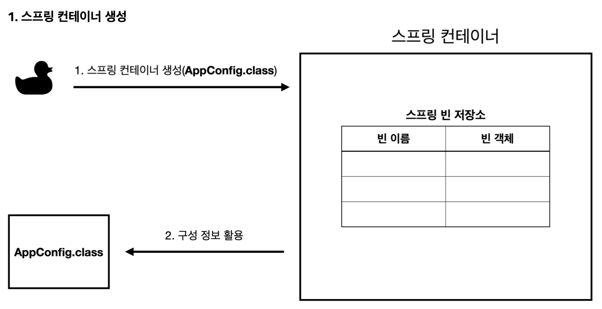
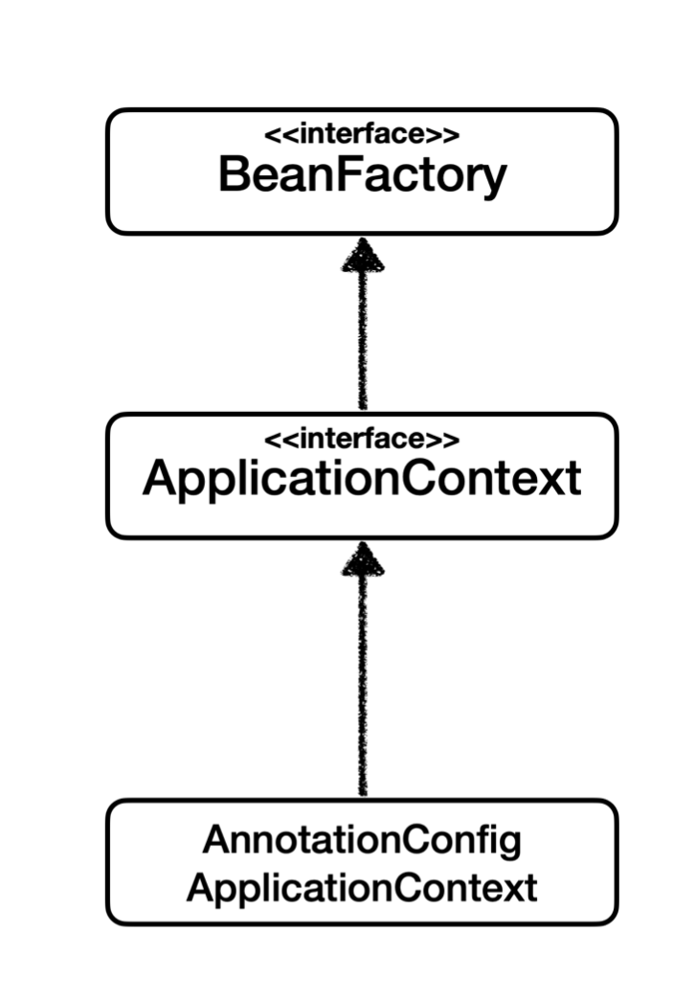
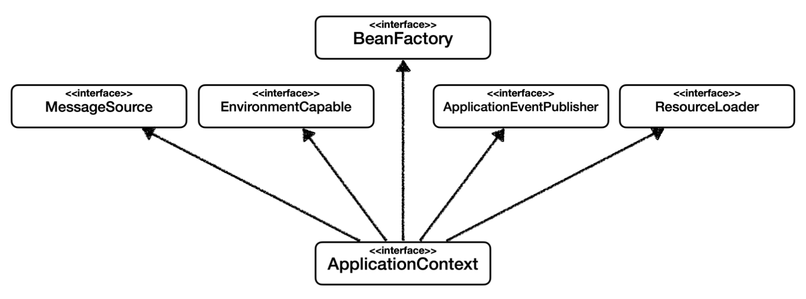
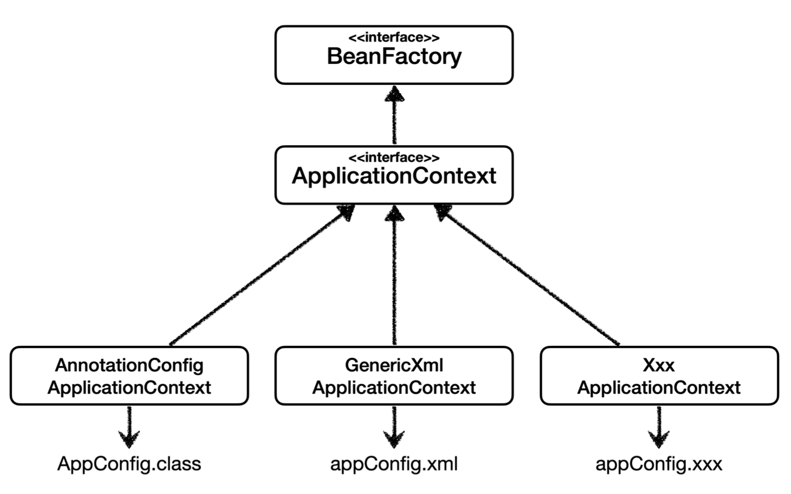
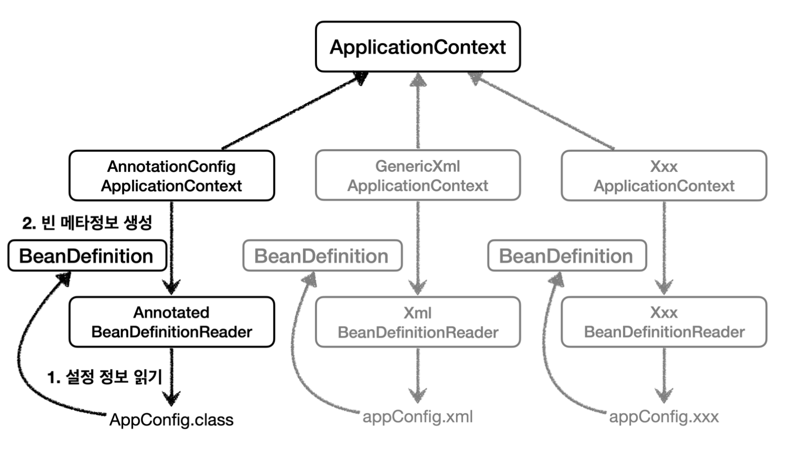

# 섹션 4. 스프링 컨테이너와 스프링 빈



스프링은 빈을 생성하고, 의존관계를 주입하는 단계로 나누어져 있다.

## 스프링 컨테이너 조회하기

```java
@Test
@DisplayName("모든 빈 출력하기")
void findAllBean() {
    String[] beanDefinitionNames = ac.getBeanDefinitionNames();
    for (String beanDefinitionName : beanDefinitionNames) {
        Object bean = ac.getBean(beanDefinitionName);
        System.out.println("name = " + beanDefinitionName + " object = " + bean);
    }
}
```

위와 같은 방식으로 `getBeanDefinitionNames` 을 사용해서 값을 가져오면 스프링컨테이너 내부에 어떠한 `bean`들이 등록이 되어있는지 확인할 수 있다고 한다.

```java
for (String beanDefinitionName : beanDefinitionNames) {
    BeanDefinition beanDefinition = ac.getBeanDefinition(beanDefinitionName);
    
    //Role ROLE_APPLICATION: 직접 등록한 애플리케이션 빈
    //Role ROLE_INFRASTRUCTURE: 스프링이 내부에서 사용하는 빈
    if (beanDefinition.getRole() == BeanDefinition.ROLE_APPLICATION) {
        Object bean = ac.getBean(beanDefinitionName);
        System.out.println("name = " + beanDefinitionName + " object = " + bean);
    }
}
```

로직을 위와같은 형식으로 변경해서 사용하면 `bean`들의 조건에 따라 조회를 다르게 설정해줄 수 있다.

## 스프링 빈 조회

```java
@Test
@DisplayName("빈 이름으로 조회")
void findBeanByName() {
    MemberService memberService = ac.getBean("memberService", MemberService.class);
    assertThat(memberService).isInstanceOf(MemberServiceImpl.class);
}

@Test
@DisplayName("이름 없이 타입으로만 조회")
void findBeanByType() {
    MemberService memberService = ac.getBean(MemberService.class);
    assertThat(memberService).isInstanceOf(MemberServiceImpl.class);
}

@Test
@DisplayName("구체 타입으로 조회")
void findBeanByName2() { // 유연성이 떨어진다.
    MemberServiceImpl memberService = ac.getBean("memberService", MemberServiceImpl.class);
    assertThat(memberService).isInstanceOf(MemberServiceImpl.class);
}

@Test
@DisplayName("빈 이름으로 조회X")
void findBeanByNameX() {
    assertThrows(NoSuchBeanDefinitionException.class,
            () -> ac.getBean("xxxxx", MemberService.class));
}
```

위와 같이 다양한 방법들을 사용해서 `spring bean`을 조회할 수 있다.
상황에 따라서 다양하게 접근하고 테스트할 수 있어서 상황에 맞춰서 사용하는것이 좋을 거 같다.

### 중복 타입

```java
@Test
@DisplayName("타입으로 조회시 같은 타입이 둘 이상 있으면, 중복 오류가 발생한다.")
void findBeanByTypeDuplicate() {
    assertThrows(NoUniqueBeanDefinitionException.class,
            () -> ac.getBean(MemberRepository.class));
}

@Test
@DisplayName("타입으로 조회시 같은 타입이 둘 이상 있으면, 중복 오류가 발생한다.")
void findBeanByName() {
    MemberRepository memberRepository = ac.getBean("memberRepository1", MemberRepository.class);
    assertThat(memberRepository).isInstanceOf(MemberRepository.class);
}

@Test
@DisplayName("특정 타입을 모두 조회하기")
void findAllBeanByType() {
    Map<String, MemberRepository> beansOfType = ac.getBeansOfType(MemberRepository.class);
    for (String key : beansOfType.keySet()) {
        System.out.println("key = " + key + " value = " + beansOfType.get(key));
    }
    System.out.println("beansOfType = " + beansOfType);
    assertThat(beansOfType.size()).isEqualTo(2);
}
```

위와 같은 방법을 사용하여 같은 타입이 있는경우, 특정타입을 기준으로 조회하기 등 다양한 조건을 넣어서 조회하는 방법을 알 수 있다.

### 부모 타입으로  조회


```java
@Test
@DisplayName("부모 타입으로 조회시, 자식이 둘 이상 있으면 빈 이름을 지정하면 된다.")
void findBeanByParentTypeBeanName() {
    DiscountPolicy rateDiscountPolicy = ac.getBean("rateDiscountPolicy", DiscountPolicy.class);
    assertThat(rateDiscountPolicy).isInstanceOf(RateDiscountPolicy.class);
}

@Test
@DisplayName("특정 하위 타입으로 조회")
void findBeanBySubType() {
    RateDiscountPolicy bean = ac.getBean(RateDiscountPolicy.class);
    assertThat(bean).isInstanceOf(RateDiscountPolicy.class);
}

@Test
@DisplayName("부모 타입으로 모두 조회하기")
void findAllBeanByParentType() {
    Map<String, DiscountPolicy> beansOfType = ac.getBeansOfType(DiscountPolicy.class);
    assertThat(beansOfType.size()).isEqualTo(2);
    for (String key : beansOfType.keySet()) {
        System.out.println("key = " + key + " value = " + beansOfType.get(key));
    }
}

@Test
@DisplayName("부모 타입으로 모두 조회하기 - Object")
void findAllBeanByObjectType() {
    Map<String, Object> beansOfType = ac.getBeansOfType(Object.class);
    for (String key : beansOfType.keySet()) {
        System.out.println("key = " + key + " value = " + beansOfType.get(key));
    }
}
```

의존관계 주입등의 개념인지 필요

### 결론

실제로 개발할때는 애플리케이션 컨텍스트에서 bean을 조회하는 경우는 거의 없다.
하지만 되게 기본 기능이기도 하고 가끔 순수한 java에서 어플리케이션을 생성해서 써야할경우도 있기때문에 알아두는 것이 좋다.

## 스프링컨테이너



스프링 컨테이너의 기본적인 상속구조는 위와 같은 그림을 나타내고 있다고한다.

기존에 계속 사용하면 스프링 컨테이너인 `ApplicationContext`는 위와 같은 구조를 가지고있어서
`BeanFactory`를 상속받아서 구현이 되어있고, 



`ApplicationContext`는 `BeanFactory`뿐만 아니라 

- **메시지소스를 활용한 국제화 기능**
예를 들어서 한국에서 들어오면 한국어로, 영어권에서 들어오면 영어로 출력
- **환경변수**
로컬, 개발, 운영등을 구분해서 처리
- **애플리케이션 이벤트**
이벤트를 발행하고 구독하는 모델을 편리하게 지원
- **편리한 리소스 조회**
파일, 클래스패스, 외부 등에서 리소스를 편리하게 조회

위와 같이 다양한 기능들을 가진 `interface`들도 상속을 받고있다.

그래서 실제로는 `BeanFactory`을 바로 사용하는 일은 거의 없고 부가기능이 포함되어있는 `ApplicationContext`을 사용한다고한다.

`BeanFactory`나 `ApplicationContext`를 스프링 컨테이너라 한다.

## 다양한 설정 형식 지원 - 자바 코드, XML



```java
AnnotationConfigApplicationContext ac = new AnnotationConfigApplicationContext(TestConfig.class);
```

기존에는 이와 같이 `AnnotationConfigApplicationContext(TestConfig.class)`을 사용해서 `AppConfig.class`형식의 타입도 같이 사용을 했었는데 `AppConfig.xml`이나 `AppConfig.xxx` 형식의 파일을 사용하는 방식도 가능하다고한다.

하지만 `spring boot`로 넘어오면서 `XML`기반의 설정은 거의 사용하지않는다고 한다. 그리고
”또 XML을 사용하면 컴파일 없이 빈 설정 정보를 변경할 수 있는 장점도 있으므로 한번쯤 배워두는 것도 괜찮다.” 라고한다.

### appConfig.class

```java
// appConfig.class
@Configuration
public class AppConfig {

    @Bean
    public MemberService memberService() {
        return new MemberServiceImpl(memberRepository());
    }

    @Bean
    public MemoryMemberRepository memberRepository() {
        return new MemoryMemberRepository();
    }

    @Bean
    public OrderService orderService() {
        return new OrderServiceImpl(memberRepository(), discountPolicy());
    }

    @Bean
    public DiscountPolicy discountPolicy() {
        return new RateDiscountPolicy();
    }
}
```

### appConfig.xml

```java
// appConfig.xml
<?xml version="1.0" encoding="UTF-8"?>
<beans xmlns="http://www.springframework.org/schema/beans"
       xmlns:xsi="http://www.w3.org/2001/XMLSchema-instance"
       xsi:schemaLocation="http://www.springframework.org/schema/beans http://www.springframework.org/schema/beans/spring-beans.xsd">

    <bean id="memberService" class="hello.core.member.MemberServiceImpl">
        <constructor-arg name="memberRepository" ref="memberRepository" />
    </bean>

    <bean id="memberRepository" class="hello.core.member.MemoryMemberRepository"/>

    <bean id="orderService" class="hello.core.order.OrderServiceImpl">
        <constructor-arg name="memberRepository" ref="memberRepository"/>
        <constructor-arg name="discountPolicy" ref="discountPolicy"/>
    </bean>

    <bean id="discountPolicy" class="hello.core.discount.RateDiscountPolicy"/>
</beans>
```

`xml`문법으로 기존에 사용했던 `appConfig.class` 파일을 넣으면 위와 같이 작성할 수 있다고 한다.

xml형식이랑 class형식이랑 거의 1대1 매칭이 가능한문법이라 크게 어렵지않게 이해할 수 있다.

## 스프링 빈 설정 메타 정보 - BeanDefinition

## **BeanDefinition이란?**



```java
@Test
@DisplayName("빈 설정 메터정보 확인")
void findApplicationBean() {
    String[] beanDefinitionNames = ac.getBeanDefinitionNames();
    for (String beanDefinitionName : beanDefinitionNames) {
        BeanDefinition beanDefinition = ac.getBeanDefinition(beanDefinitionName);

        if (beanDefinition.getRole() == BeanDefinition.ROLE_APPLICATION) {
            System.out.println("beanDefinitionName = " + beanDefinitionName +
                    " beanDefinition = " + beanDefinition);
        }
    }
}
```

위와 같은 코드를 사용하면 `BeanDefinition`안에 어떠한 정보들을 들고있고 가지고있는지 확인할 수 있다.

**BeanDefinition 정보**

- BeanClassName: 생성할 빈의 클래스 명(자바 설정 처럼 팩토리 역할의 빈을 사용하면 없음)
- factoryBeanName: 팩토리 역할의 빈을 사용할 경우 이름, 예) appConfig
- factoryMethodName: 빈을 생성할 팩토리 메서드 지정, 예) memberService
- Scope: 싱글톤(기본값)
- lazyInit: 스프링 컨테이너를 생성할 때 빈을 생성하는 것이 아니라, 실제 빈을 사용할 때 까지 최대한 생성을 지연 처리 하는지 여부
- InitMethodName: 빈을 생성하고, 의존관계를 적용한 뒤에 호출되는 초기화 메서드 명
- DestroyMethodName: 빈의 생명주기가 끝나서 제거하기 직전에 호출되는 메서드 명
- Constructor arguments, Properties: 의존관계 주입에서 사용한다. (자바 설정 처럼 팩토리 역할의 빈을 사용 하면 없음)