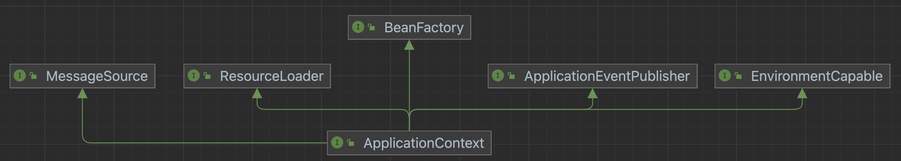
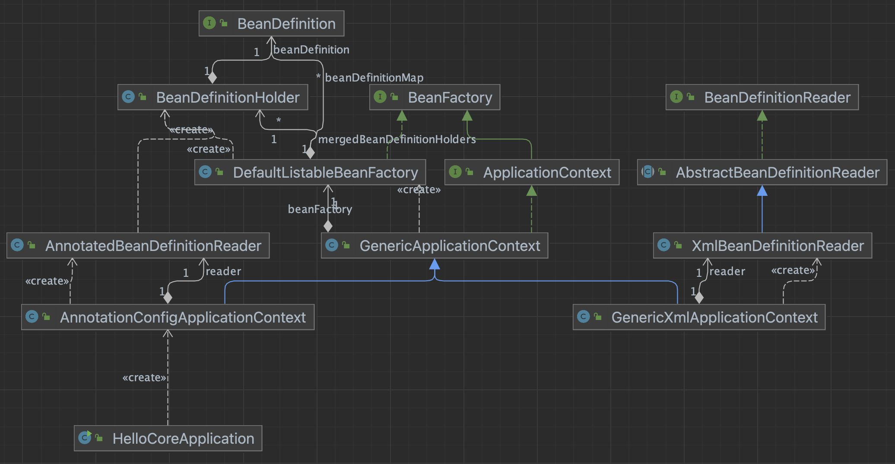

# 04. 스프링 컨테이너와 스프링 빈

이전 장에서 `@Bean`이 설정된 객체를 `ApplicationContext` 를 이용해서 스프링 빈으로 등록하고 런타임에 인스턴스를 가져와서 사용하였다.

스프링 빈을 저장, 관리하는 `스프링 컨테이너`와 스프링 빈을 관리하는 `BeanDefinition` 는 무엇이고 조회는 어떻게 하는지 알아보자.

## 1) 스프링 컨테이너 생성

- 스프링 컨테이너 생성 예제코드

~~~java
ApplicationContext applicationContext =
 new AnnotationConfigApplicationContext(AppConfig.class);
~~~

- ApplicationContext를 스프링 컨테이너라 한다.

~~~
스프링 컨테이너는 XML을 기반으로 만들 수 있고, 애노테이션 기반의 자바 설정 클래스로 만들 수 있다.
이전예제에서 AppConfig를 사용했던 방식이 애노테이션 기반의 자바 설정 클래스로 스프링 컨테이너를 만든 것이다.
~~~

### 스프링 컨테이너의 생성 과정

1. ##### 스프링 컨테이너 생성

- `new AnnotationConfigApplicationContext(AppConfig.class)`
  - 스프링 컨테이너를 생성할 때는 구성 정보를 지정해주어야 한다.
- 물론 위 방식은 컨테이너를 생성하는 여러 방법 중 하나일 뿐이다. (앞으로 학습할 섹션들에 하나씩 등장할 것 같다.)

2. ##### 스프링 빈 등록

- 스프링 컨테이너는 파라미터로 넘어온 설정 클래스 정보를 사용해서 스프링 빈을 등록한다.
  ~~~java
  @Bean
  public MemberService memberService() {
      return new MemberServiceImpl(memberRepository());
  }
  @Bean
  public OrderService orderService() {
      return new OrderServiceImpl(memberRepository(), discountPolicy());
  }
  @Bean
  public DiscountPolicy discountPolicy() {
      return new FixDiscountPolicy();
  }
  @Bean
  public MemeryMemberRepository memberRepository() {
      return new MemeryMemberRepository();
  }
  ~~~

  

3. ##### 스프링 빈 의존관계 설정

   ~~~java
   @Bean
   public OrderService orderService() {
       return new OrderServiceImpl(memberRepository(), discountPolicy());
   }
   ~~~

   - 스프링은 빈을 생성하고, 의존관계를 주입하는 단계가 나누어져 있다.

   - `OrderServiceImpl` 와 같은경우에 생성자를 호줄하면서 의존관계 주입이 한번에 되는데, 이는 `의존관계 자동주입` 에서 상세히 학습한다.

     

## 2) 스프링 빈 조회

- 컨테이너에 등록된 모든 빈 조회
- 스프링의 빈, 개발자가 등록한 빈 조회
- 동일한 타입의 여러 빈을 조회
- 스프링 빈의 상속관계

`AnnotationConfigApplicationContext` 의 `getBean` 혹은 `getBeansOfType` 메서드를 이용해서 여러 상황, 타입의 빈을 가져올 수 있다.
예제코드에 작성된 내용을 반복 작성하며 학습하자.

## 3) BeanFactory와 ApplicationContext

##### BeanFactory

~~~
스프링 컨테이너의 최상위 인터페이스다.
스프링 빈을 관리하고 조회하는 역할을 담당한다.
getBean() 을 제공한다.
지금까지 우리가 사용했던 대부분의 기능은 BeanFactory가 제공하는 기능이다.
~~~

##### ApplicationContext

~~~
BeanFactory 기능을 모두 상속받아서 제공한다.
빈을 관리하고 검색하는 기능을 BeanFactory가 제공해주는데, 그러면 둘의 차이가 뭘까?
애플리케이션을 개발할 때는 빈을 관리하고 조회하는 기능은 물론이고, 수 많은 부가기능이 필요하다. 
~~~

#### ApplicatonContext가 제공하는 부가기능

##### 메시지소스를 활용한 국제화 기능

- 예를 들어서 한국에서 들어오면 한국어로, 영어권에서 들어오면 영어로 출력

##### 환경변수

- 로컬, 개발, 운영등을 구분해서 처리

##### 애플리케이션 이벤트

- 이벤트를 발행하고 구독하는 모델을 편리하게 지원

##### 편리한 리소스 조회

- 파일, 클래스패스, 외부 등에서 리소스를 편리하게 조회

#### 요약

- ApplicationContext는 BeanFactory의 기능을 상속받는다.
- ApplicationContext는 빈 관리기능 + 편리한 부가 기능을 제공한다.
- BeanFactory를 직접 사용할 일은 거의 없다. 부가기능이 포함된 ApplicationContext를 사용한다.
- BeanFactory나 ApplicationContext를 스프링 컨테이너라 한다.

## 

## 4) 스프링 빈 설정 메타 정보 - BeanDefinition

### BeanDefinition 정보

- BeanClassName: 생성할 빈의 클래스 명(자바 설정 처럼 팩토리 역할의 빈을 사용하면 없음)
- factoryBeanName: 팩토리 역할의 빈을 사용할 경우 이름, 예) appConfig
- factoryMethodName: 빈을 생성할 팩토리 메서드 지정, 예) memberService
- Scope: 싱글톤(기본값)
- lazyInit: 스프링 컨테이너를 생성할 때 빈을 생성하는 것이 아니라, 실제 빈을 사용할 때 까지 최대한 생성을 지연
  처리 하는지 여부
- InitMethodName: 빈을 생성하고, 의존관계를 적용한 뒤에 호출되는 초기화 메서드 명
- DestroyMethodName: 빈의 생명주기가 끝나서 제거하기 직전에 호출되는 메서드 명
- Constructor arguments, Properties: 의존관계 주입에서 사용한다. (자바 설정 처럼 팩토리 역할의 빈을 사용
  하면 없음)

### BeanDefinition 생성절차

- `new AnnotationConfigApplicationContext(AppConfig.class); ` 으로 생성
- AnnotatedBeanDefinitionReader가 `AppConfig.class` 파일을 읽어 `BeanDefinition을` 생성하고 `beanFactory` 에 저장한다.

#### AnnotatedBeanDefinitionReader

~~~java
private <T> void doRegisterBean(Class<T> beanClass, @Nullable String name,
    @Nullable Class<? extends Annotation>[] qualifiers, @Nullable Supplier<T> supplier,
    @Nullable BeanDefinitionCustomizer[] customizers) {

    ...

  BeanDefinitionHolder definitionHolder = new BeanDefinitionHolder(abd, beanName);
  definitionHolder = AnnotationConfigUtils.applyScopedProxyMode(scopeMetadata, definitionHolder, this.registry);
  BeanDefinitionReaderUtils.registerBeanDefinition(definitionHolder, this.registry);
}
~~~

#### BeanDefinitionHolder

~~~java
	public BeanDefinitionHolder(BeanDefinition beanDefinition, String beanName, @Nullable String[] aliases) {
		Assert.notNull(beanDefinition, "BeanDefinition must not be null");
		Assert.notNull(beanName, "Bean name must not be null");
		this.beanDefinition = beanDefinition;
		this.beanName = beanName;
		this.aliases = aliases;
	}
~~~

#### GenericApplicationContext

~~~java
	@Override
	public void registerBeanDefinition(String beanName, BeanDefinition beanDefinition)
			throws BeanDefinitionStoreException {

		this.beanFactory.registerBeanDefinition(beanName, beanDefinition);
	}
~~~

#### DefaultListableBeanFactory

~~~java
@Override
public void registerBeanDefinition(String beanName, BeanDefinition beanDefinition)
  throws BeanDefinitionStoreException {
		this.beanDefinitionMap.put(beanName, beanDefinition);
		...
~~~

