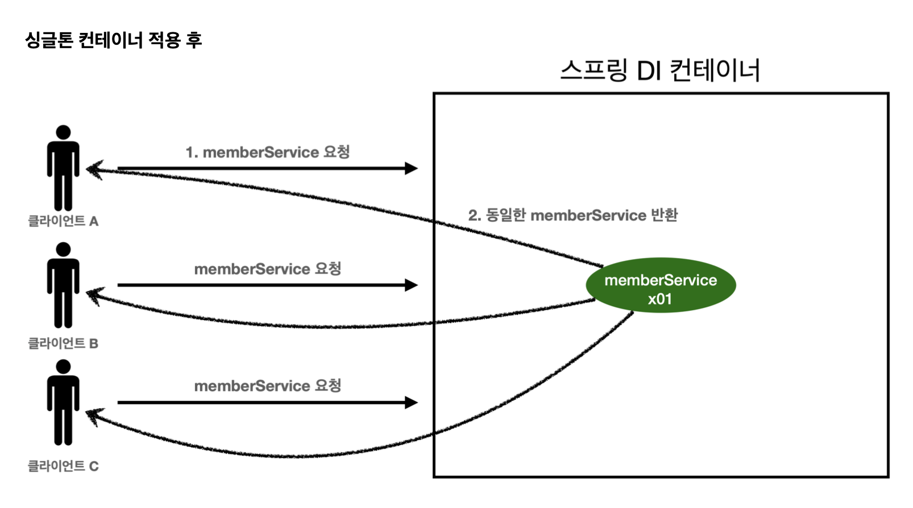
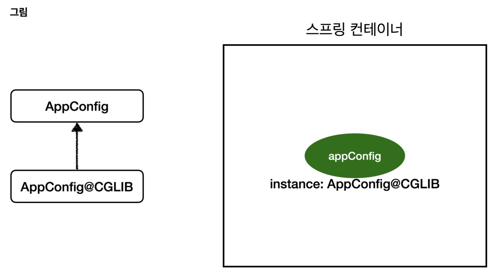

# 섹션 5. 싱글톤 컨테이너

## 웹 애플리케이션과 싱글톤

```java
@Test
@DisplayName("스프링 없는 순수한 Di 컨테이너")
void pureContainer() {
    AppConfig appConfig = new AppConfig();
    // 1. 조회: 호출할 때 마다 객체를 생성
    MemberService memberService1 = appConfig.memberService();

    // 2. 조회: 호출할 때 마다 객체를 생성
    MemberService memberService2 = appConfig.memberService();

    // 참조 값이 다른 것을 확인
    System.out.println("memberService1 = " + memberService1);
    System.out.println("memberService2 = " + memberService2);

    // memberService1 != memberService2 
    Assertions.assertThat(memberService1).isNotSameAs(memberService2);
}
```

기존에 계속 작성하면 DI컨테이너를 `test code`를 작성해서 확인해보니 요청이 들어올때마다 매번 새롭게 객체를 생성하는것을 확인할 수 있었다.

위와 같은 상황은 고객의 트래픽이 많으면 그만큼 수많은 객체를 생성하고 소멸하다보니 **메모리의 낭비가 심하다는 문제점이 있었다.**

해당 사항을 컨테이너에 싱글톤 패턴을 적용시켜서 **메모리의 낭비없이 컨테이너를 공유해서 사용할 수 있도록 구현을 다르게 하면 된다.** 

## 싱글톤 패턴

```java
package hello.core.singleton;

public class SingletonService {

     private static final SingletonService instance = new SingletonService();

    public static SingletonService getInstance() {
        return instance;
    }

    private SingletonService() {
    }

    public void logic() {
        System.out.println("싱글톤 객체 로직 호출");
    }
}
```

자바에서 싱글톤 패턴을 간단하게 구현을 하면 위와 같은 모습이 나타난다.

`SingletonService instance`을 static으로 선언을 진행하여 하나만 생성이 되게 제한을 걸어두고,
해당 `instance`를 참조할 수 있는 방법을 `getInstance`를 통해서만 선언을 할 수 있도록 해두면 싱글톤패턴의 형식이 된다.

추가적으로 하나의 객체 인스턴스만 존재해야하므로 **생성자를 private으로 막아두어** 외부에서 생성을 하지못하도록 막아야한다.

위와 같이 싱글톤 패턴을 적용시키면 사용자의 요청이 올 때 마다 객체를 생성하는 것이 아니라 이미 만들어진 객체를 공유해서 효율적으로 사용하는 것이 가능하다.

**싱글톤 패턴 문제점**
싱글톤 패턴을 구현하는 코드 자체가 많이 들어간다.
의존관계상 클라이언트가 구체 클래스에 의존한다. DIP를 위반한다.
클라이언트가 구체 클래스에 의존해서 OCP 원칙을 위반할 가능성이 높다.
테스트하기 어렵다.
내부 속성을 변경하거나 초기화 하기 어렵다.
private 생성자로 자식 클래스를 만들기 어렵다.
결론적으로 유연성이 떨어진다.
안티패턴으로 불리기도 한다.

라고 하여 위와 같은 단점들이 존재하는데

싱글톤 컨테이너에서는 위와 같은 문제점들을 해결한 방법을 사용하고있다고한다.

## 싱글톤 컨테이너

spring 컨테이너는 기본값이 싱글톤으로 동작을 한다.

```java
@Test
@DisplayName("스프링 컨테이너와 싱글톤")
void springContainer() {

//        AppConfig appConfig = new AppConfig();
    ApplicationContext ac = new AnnotationConfigApplicationContext(AppConfig.class);
    MemberService memberService1 = ac.getBean("memberService", MemberService.class);
    MemberService memberService2 = ac.getBean("memberService", MemberService.class);

    System.out.println("memberService1 = " + memberService1);
    System.out.println("memberService2 = " + memberService2);

    Assertions.assertThat(memberService1).isSameAs(memberService2);
}
```

위와 같이 spring 컨테이너를 사용하는 방식을 쓰면 위와 같은 테스트가 정상적으로 동작이 되는것을 보아 spring 컨테이너 내부적으로 싱글톤으로 동작하고있음을 확인할 수 있다.



실제 동작은 위의 그림과 같이 동작한다.

스프링의 기본 빈 등록방식은 싱글톤이지만 설정에 따라 새로운 객체를 생성해서 반환하도록 할수도 있다

## 싱글톤 방식의 주의점

싱글톤 방식을 사용하면 객체 인스턴스를 하나만 생성해서 공유하여 사용하는 방식이기때문에
싱글톤 객체는 상태를 유지하게 설계해서는 안된다. 무상태로 설계를 진행해야한다.

특정 클라이언트에 의존적인 필드가 있으면 안된다.
특정 클라이언트가 값을 변경할 수 있는 필드가 있으면 안된다!

가급적 읽기만 가능해야 한다.

필드 대신에 자바에서 공유되지 않는, 지역변수, 파라미터, ThreadLocal 등을 사용해야 한다.

```java
void statefulServiceSingleton() {
    ApplicationContext ac = new AnnotationConfigApplicationContext(TestConfig.class);
    StatefulService statefulService1 = ac.getBean(StatefulService.class);
    StatefulService statefulService2 = ac.getBean(StatefulService.class);

    statefulService1.order("userA", 10000);
    statefulService2.order("userB", 20000);

    int price = statefulService1.getPrice();
    System.out.println("price = " + price);
    
    Assertions.assertThat(statefulService1.getPrice()).isEqualTo(20000);
}
```

위와 같이 싱글톤 패턴으로 구성되어있고,  `private int price;` 이와 같이 `private`객체를 가지고 있으며 `order`이라는 함수를 호출해서 `price` 의 값을 바꿀 수 있는 싱글톤 패턴을 구성했다고 했을때 위와 같은 코드를 사용하면 하나의 인스턴스만 생성해서 공유하는 방식이기때문에 `price`의 값이 서로 공유가 되는 형식이된다. 그래서 `getPrice`를 통해 자신이 구매한 값을 조회할려고해도 원하는 결과값이 나오지않게 되는 현상이 나올 수 있다.

```java
void statefulServiceSingleton() {
    ApplicationContext ac = new AnnotationConfigApplicationContext(TestConfig.class);
    StatefulService statefulService1 = ac.getBean(StatefulService.class);
    StatefulService statefulService2 = ac.getBean(StatefulService.class);

    int userAPrice = statefulService1.order("userA", 10000);
    int userBPrice = statefulService2.order("userB", 20000);

    System.out.println("price = " + userAPrice);
    
    Assertions.assertThat(userAPrice).isEqualTo(10000);
}
```

그래서 실제로 싱글톤 방식을 사용할때는 위와 같이 지연변수를 활용하는 방식을 써야한다.
공유필드를 조심해서 사용해야하고, 스프링 빈은 항상 무상태(stateless)로 설계해야한다.

## Configuration과 싱글톤

```java
@Configuration
public class AppConfig {

    @Bean
    public MemberService memberService() {
		    System.out.println("call AppConfig.memberService");
        return new MemberServiceImpl(memberRepository());
    }

    @Bean
    public MemoryMemberRepository memberRepository() {
		    System.out.println("call AppConfig.orderService");
        return new MemoryMemberRepository();
    }

    @Bean
    public OrderService orderService() {
		    System.out.println("call AppConfig.memberRepository");
        return new OrderServiceImpl(memberRepository(), discountPolicy());
    }

    @Bean
    public DiscountPolicy discountPolicy() {
        return new RateDiscountPolicy();
    }
}
```

`@Configuration`에 대한 정보가 없는 상태로 위와  같은 코드가 각각 몇번 실행이 될지 예측을 해보면

`memberRepository` 인스턴스는 `memberService`와 `orderService`에서 매개변수로 넘겨지고있기때문에 여러면 `memberRepository`가 실행이 되어 여러개의 인스턴스가 만들어진다고 생각이 될 수 있다. 하지만 실제로 위의 코드에서 `println(call)` 이 몇번 실행이 되는지 직접확인을 해보면

```java
call AppConfig.memberService
call AppConfig.memberRepository
call AppConfig.orderService
```

위와 같이 각각 1번씩만 호출이 되는것을 확인할 수 있다.

그로인해 **spring 컨테이너에 bean이 등록되는 과정에서도 싱글톤 패턴이 유지되고 있음을 확인할 수 있다.**

## Configuration과 바이트코드 조작의 마법

위에서 이야기했던 **“spring 컨테이너에 bean이 등록되는 과정에서도 싱글톤 패턴이 유지되고 있음을 확인할 수 있다”** 해당 내용이 어떻게 가능한것인지 이야기를 해보자.



실제로 동작되는 방식이 위와 같다고한다.

```java
ApplicationContext ac = new AnnotationConfigApplicationContext(AppConfig.class);
```

위와 같은 코드가 사용되어 `AppConfig`가 `bean`으로 spring 컨테이너에 등록이 되면
내가 직접 등록한 `class hello.core.AppConfig` 이 클래스가 등록되는 것이 아니라 복제가 되어 `AppConfig@CGLIB`라고 되어있는 또 다른 `AppConfig`가 등록되는 방식이라고 한다.

그 임의로 등록이 된 `AppConfig`가 내부적으로 중복이 되는 `bean`이 존재한다면 추가적인 등록을 하지않도록 싱글톤 패턴을 유지시켜주는 역할을 해준다고 한다. (바이트 코드를 조작해서 작성되어 있다고한다)

### `@Configuration`

위의 애노테이션의 역할은 bean들이 등록이 될때 싱글톤으로만 등록이 될 수 있도록 제한을 걸어주는 역할을 한다.

실제로 위에 애노테이션을 제거한 후에 해당 코드를 실행해보면 `class hello.core.AppConfig`자체가 등록이 이루어지고

```java
call AppConfig.memberService
call AppConfig.memberRepository
call AppConfig.orderService
call AppConfig.memberRepository
call AppConfig.memberRepository
```

위와 같이 싱글톤 형식이 아니라 호출 횟수에 맞춰 여러개의 class들이 생성되는것을 확인할 수 있다.

### 결론

`@Configuration` 을 붙이면 바이트코드를 조작하는 CGLIB 기술을 사용해서 싱글톤을 보장.

실제로는 왠만하면 거의 다 싱글톤으로 사용하기때문에 항상 `@Configuration`을 붙이는게 좋다.