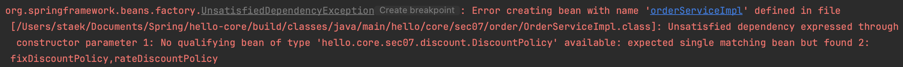
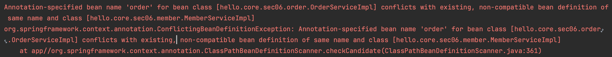
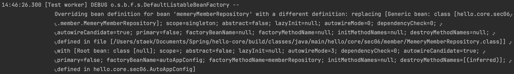
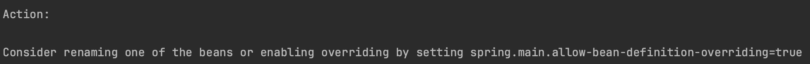

# 06. 컴포넌트 스캔

@ComponentScan 를 이용하여 보다 간편하게 스프링 빈 생성방법을 학습한다.

그 전에 [어노테이션 개념](https://github.com/seongtaekkim/TIL/blob/master/java/effective-java/docs/05-generics/item27/annotation.md) 과 [어노테이션 예제코드](https://github.com/seongtaekkim/TIL/tree/master/java/effective-java/effective-java/src/main/java/me/staek/chapter05/item27) 를 먼저 살펴보면 좋다.

## 1) 컴포넌트 스캔과 의존관계 자동 주입 시작하기

지금까지 스프링 빈을 등록할 때는 @Bean 등을 통해서 설정 정보에 직접 등록할 스프링 빈을 나열했다.
프로젝트가 커지면 관리포인트가 커진다.
그래서 스프링은 설정 정보가 없어도 자동으로 스프링 빈을 등록하는 컴포넌트 스캔이라는 기능을 제공한다. 
또 의존관계도 자동으로 주입하는 @Autowired 라는 기능도 제공한다.

##### 컴포넌트 스캔은 이름 그대로 @Component 애노테이션이 붙은 클래스를 스캔해서 스프링 빈으로 등록한다. 

~~~java
@Component
public class MemberServiceImpl implements MemberService {}
...
~~~

##### @ComponentScan 설정

- excludeFilters
  - 기존의 AppConfig 의 Configuration 를 제외한다. (중복 설정임)
    - 왜냐하면 `@Configuration` 내부에 `@Component` 이 존재하기 때문

~~~java
@Configuration
@ComponentScan(
 excludeFilters = @Filter(type = FilterType.ANNOTATION, classes = Configuration.class))
public class AutoAppConfig {}
~~~

##### @Autowired 오류

- 같은 타입을 가지는 빈이 여러개인 경우 선택할 수 없어 오류가 발생한다.
- **해결방법은 1강에서 소개했었고, 차후에 더 자세히 소개할 것 같다.**

~~~java
@Component
public class FixDiscountPolicy implements DiscountPolicy {}
@Component
public class RateDiscountPolicy implements DiscountPolicy {}

@Component
public class OrderServiceImpl implements OrderService {
    @Autowired
    public OrderServiceImpl(MemberRepository memberRepository, DiscountPolicy discountPolicy) {}
~~~

#### 빈 이름 정하기 

- `@Component("order")`

~~~java
@Component("order")
public class OrderServiceImpl implements OrderService {}
~~~

- result

~~~
beanDefinitionName: autoAppConfig
beanDefinitionName: rateDiscountPolicy
beanDefinitionName: memberServiceImpl
beanDefinitionName: memeryMemberRepository
beanDefinitionName: order
~~~

## 2) 탐색 위치와 기본 스캔 대상

- `@ComponentScan`의 옵션에 스캔을 하는 기본패키지 위치를 정할 수 있다.

~~~java
@Configuration
@ComponentScan(
        excludeFilters = @ComponentScan.Filter
                (type = FilterType.ANNOTATION, classes = Configuration.class)
        , basePackages = "hello.core.sec06.member"
)
public class AutoAppConfig {}
~~~

- @SpringBootApplication 설정

~~~java
@Target(ElementType.TYPE)
@Retention(RetentionPolicy.RUNTIME)
@Documented
@Inherited
@SpringBootConfiguration
@EnableAutoConfiguration
@ComponentScan(excludeFilters = { @Filter(type = FilterType.CUSTOM, classes = TypeExcludeFilter.class),
		@Filter(type = FilterType.CUSTOM, classes = AutoConfigurationExcludeFilter.class) })
public @interface SpringBootApplication {
~~~

~~~
@Controller : 스프링 MVC 컨트롤러로 인식
@Repository : 스프링 데이터 접근 계층으로 인식하고, 데이터 계층의 예외를 스프링 예외로 변환해준다.
@Configuration : 앞서 보았듯이 스프링 설정 정보로 인식하고, 스프링 빈이 싱글톤을 유지하도록 추가 처리를 한다.
@Service : 사실 @Service 는 특별한 처리를 하지 않는다. 대신 개발자들이 핵심 비즈니스 로직이 여기에 있겠구나 라고 비즈니스 계층을 인식하는데 도움이 된다.
~~~

## 3) 필터

- includeFilters : 컴포넌트 스캔 대상을 추가로 지정한다.
- excludeFilters : 컴포넌트 스캔에서 제외할 대상을 지정한다.

#### 테스트를 위한 코드세팅

~~~java
@Target(ElementType.TYPE)
@Retention(RetentionPolicy.RUNTIME)
@Documented
public @interface MyExcludeComponent {}

@Target(ElementType.TYPE)
@Retention(RetentionPolicy.RUNTIME)
@Documented
public @interface MyIncludeComponent {}

@MyIncludeComponent
public class BeanA {}

@MyExcludeComponent
public class BeanB {}
~~~

#### 테스트코드 작성

~~~java
public class ComponentFilterAppConfigTest {
    @Test
    void filterScan() {
        AnnotationConfigApplicationContext ac = new
                AnnotationConfigApplicationContext(ComponentFilterAppConfig.class);
        BeanA beanA = ac.getBean("beanA", BeanA.class);
        assertThat(beanA).isNotNull();
        Assertions.assertThrows(
                NoSuchBeanDefinitionException.class,
                () -> ac.getBean("beanB", BeanB.class));

        String[] beanDefinitionNames = ac.getBeanDefinitionNames();
        for (String beanDefinitionName : beanDefinitionNames) {
            BeanDefinition beanDefinition = ac.getBeanDefinition(beanDefinitionName);
            if (beanDefinition.getRole() == BeanDefinition.ROLE_APPLICATION) {
                System.out.println("beanDefinitionName: " + beanDefinitionName);
            }
        }
    }
    @Configuration
    @ComponentScan(
            includeFilters = @Filter(type = FilterType.ANNOTATION, classes = MyIncludeComponent.class),
            excludeFilters = @Filter(type = FilterType.ANNOTATION, classes = {MyExcludeComponent.class, Configuration.class}),
            basePackages = "hello.core.sec06"
    )
    static class ComponentFilterAppConfig {
    }
}
~~~

- `beanA` 는 생성되었고` beanB` 는 생성 안되었다.

~~~
beanDefinitionName: componentFilterAppConfigTest.ComponentFilterAppConfig
beanDefinitionName: beanA
beanDefinitionName: rateDiscountPolicy
beanDefinitionName: memberServiceImpl
beanDefinitionName: memeryMemberRepository
beanDefinitionName: orderServiceImpl
~~~

#### FilterType 

~~~
ANNOTATION: 기본값, 애노테이션을 인식해서 동작한다. ex) org.example.SomeAnnotation
ASSIGNABLE_TYPE: 지정한 타입과 자식 타입을 인식해서 동작한다. ex) org.example.SomeClass
ASPECTJ: AspectJ 패턴 사용 ex) org.example..*Service+
REGEX: 정규 표현식 ex) org\.example\.Default.*
CUSTOM: TypeFilter 이라는 인터페이스를 구현해서 처리 ex) org.example.MyTypeFilter
~~~

- 스프링 부트는 컴포넌트 스캔을 기본으로 제공하는데, 개인적으로는 옵션을 변경하면서 사용하기 보다 는 스프링의 기본 설정에 최대한 맞추어 사용하는 것을 권장하고, 선호하는 편이다
- `@ComponentScan`를 포함한 패키지 하위가 빈 생성 대상이다.

## 4) 중복 등록과 충돌

빈 이름이 같을 때 스프링은 어떻게 동작할까?

### 자동 빈 등록 vs 자동 빈 등록

~~~java
@Component("order")
public class MemberServiceImpl implements MemberService {}
~~~

~~~java
@Component("order")
public class OrderServiceImpl implements OrderService {}
~~~

컴포넌트 스캔에 의해 자동으로 스프링 빈이 등록되는데, 그 이름이 같은 경우 스프링은 오류를 발생시킨다.
(ConflictingBeanDefinitionException 예외 발생)

### 수동 빈 등록 vs 자동 빈 등록

##### 같은이름의 수동빈과 자동빈을 @ComponentScan을 이용해서 테스트

~~~java
@Configuration
@ComponentScan(
        excludeFilters = @ComponentScan.Filter
                (type = FilterType.ANNOTATION, classes = Configuration.class)
        , basePackages = "hello.core.sec06.member"
)
public class AutoAppConfig {
    @Bean(name = "memeryMemberRepository")
    public MemberRepository memberRepository() {
        return new MemeryMemberRepository();
    }
}
~~~

수동빈이 자동빈보다 우선순위가 높아서 덮어버린다.

#### @SpringBootApplication 

- 앞의 예제와 달리 기본적으로 실행되지 않는다.

~~~java
@Configuration
@ComponentScan(
        excludeFilters = @ComponentScan.Filter
                (type = FilterType.ANNOTATION, classes = Configuration.class)
        , basePackages = "hello.core.sec06.member"
)
public class AutoAppConfig {
    @Bean(name = "memeryMemberRepository")
    public MemberRepository memberRepository() {
        return new MemeryMemberRepository();
    }
}
~~~

~~~java
@SpringBootApplication
public class HelloCoreApplication2 {
    public static void main(String[] args) {
        SpringApplication.run(HelloCoreApplication2.class, args);
    }
}
~~~

- 아래와 같이 예외가 발생하며, properties 설정후에 정상실행된다.

- application.properties

~~~properties
spring.main.allow-bean-definition-overriding=true
~~~

