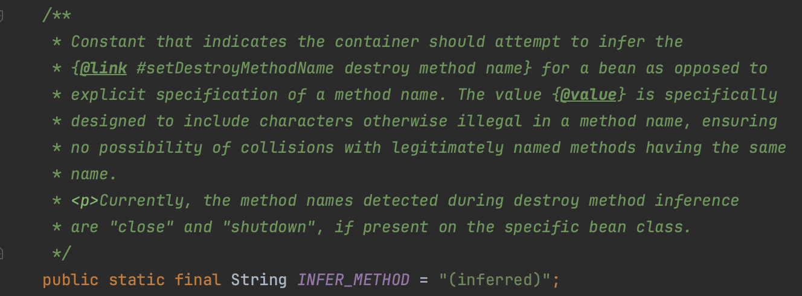

# 08. 빈생명주기 콜백

스프링 빈이 생성되고, 종료될 때 호출하고 싶은 로직이 있다면 어떻게 작성할 수 있을까?

여러 방법이 시간이 지남에 따라 개선되어 왔는데, 대표적으로 3가지를 함께 살펴보자.

## 1) 빈 생명주기 콜백 시작

빈을 등록하고 초기화가 되지 않고 기능이 동작하게 되는 경우가 있다.

아래 같은 경우, 인스턴스 생성 후 setUrl()으로 필요한 정보를 세팅하고 connect() 를 실행해야 하는데, null 이 입력된다.

- url을 생성자에 세팅하지 않는 이유는, 생성자는 말 그대로 인스턴스 생성에 필수적인 요소 설정에만 집중해야하고
  url은 connect() 와 같은 인스턴스가 하는 일에 필요한 값이기에 분리해야 한다고 강사가 설명 하였다.
- 이유는 공감이 가지만 아래 로직자체는 조금 설득이 부족ㅎㅎ;

~~~java
public class NetworkClient {
    private String url;
    public NetworkClient() {
        System.out.println("생성자 호출, url = " + url);
        connect();
        call("초기화 연결 메시지");
    }
    public void setUrl(String url) {
        this.url = url;
    }
    //서비스 시작시 호출
    public void connect() {
        System.out.println("connect: " + url);
    }
    public void call(String message) {
        System.out.println("call: " + url + " message = " + message);
    }
    //서비스 종료시 호출
    public void disconnect() {
        System.out.println("close: " + url);
    }
}
~~~

~~~java
@Configuration
static class LifeCycleConfig {
    @Bean
    public NetworkClient networkClient() {
        NetworkClient networkClient = new NetworkClient();
        networkClient.setUrl("http://hello-spring.dev");
        return networkClient;
    }
}
~~~

#### 결과

~~~jav
생성자 호출, url = null
connect: null
call: null message = 초기화 연결 메시지
~~~

## 2) 인터페이스 InitializingBean, DisposableBean

InitializingBean 은 afterPropertiesSet() 메서드로 초기화를 지원한다.

DisposableBean 은 destroy() 메서드로 소멸을 지원한다.

~~~java
public class NetworkClient2 implements InitializingBean, DisposableBean {
    private String url;
    public NetworkClient2() {
        System.out.println("생성자 호출, url = " + url);
    }
    public void setUrl(String url) {
        this.url = url;
    }
    //서비스 시작시 호출
    public void connect() {
        System.out.println("connect: " + url);
    }
    public void call(String message) {
        System.out.println("call: " + url + " message = " + message);
    }
    //서비스 종료시 호출
    public void disConnect() {
        System.out.println("close + " + url);
    }
    @Override
    public void destroy() throws Exception {
        disConnect();
    }

    @Override
    public void afterPropertiesSet() throws Exception {
        connect();
        call("초기화 연결 메시지");
    }
}
~~~

#### 결과

~~~
생성자 호출, url = null
connect: http://hello-spring.dev
call: http://hello-spring.dev message = 초기화 연결 메시지
close + http://hello-spring.dev
~~~

- 출력 결과를 보면 초기화 메서드가 주입 완료 후에 적절하게 호출 된 것을 확인할 수 있다.
- 스프링 컨테이너의 종료가 호출되자 소멸 메서드가 호출 된 것도 확인할 수 있다.

#### 단점

이 인터페이스는 스프링 전용 인터페이스다. 해당 코드가 스프링 전용 인터페이스에 의존한다.

초기화, 소멸 메서드의 이름을 변경할 수 없다.

내가 코드를 고칠 수 없는 외부 라이브러리에 적용할 수 없다.

## 3) 빈 등록 초기화, 소멸 메서드 지정

2번과 달리 빈 대상 객체는 자바로만 이루어져 있다. 

하지만 @Bean 태그에는 아래와같이 초기화, 소멸 메서드를 직접 입력해야 한다. (컴파일타임에 메서드이름 검사함)

~~~java
@Configuration
static class LifeCycleConfig {
    @Bean(initMethod = "init", destroyMethod = "close")
    public NetworkClient3 networkClient() {
        NetworkClient3 networkClient = new NetworkClient3();
        networkClient.setUrl("http://hello-spring.dev");
        return networkClient;
    }
}
~~~

~~~java
public class NetworkClient3 {
    private String url;

    public NetworkClient3() {
        System.out.println("생성자 호출, url = " + url);
    }

    public void setUrl(String url) {
        this.url = url;
    }

    //서비스 시작시 호출
    public void connect() {
        System.out.println("connect: " + url);
    }

    public void call(String message) {
        System.out.println("call: " + url + " message = " + message);
    }

    //서비스 종료시 호출
    public void disConnect() {
        System.out.println("close + " + url);
    }

    public void init() {
        System.out.println("NetworkClient.init");
        connect();
        call("초기화 연결 메시지");
    }

    public void close() {
        System.out.println("NetworkClient.close");
        disConnect();
    }
}
~~~

#### 결과

~~~ja
생성자 호출, url = null
NetworkClient.init
connect: http://hello-spring.dev
call: http://hello-spring.dev message = 초기화 연결 메시지
NetworkClient.close
close + http://hello-spring.dev
~~~

##### 설정 정보 사용 특징

- 메서드 이름을 자유롭게 줄 수 있다.
- 스프링 빈이 스프링 코드에 의존하지 않는다.
- 코드가 아니라 설정 정보를 사용하기 때문에 코드를 고칠 수 없는 외부 라이브러리에도 초기화, 종료 메서드를 적용할 수 있다.

##### 종료 메서드 추론

- @Bean의 destroyMethod 속성에는 아주 특별한 기능이 있다.
  라이브러리는 대부분 close , shutdown 이라는 이름의 종료 메서드를 사용한다.
- @Bean의 destroyMethod 는 기본값이 (inferred) (추론)으로 등록되어 있다. (`AbstractBeanDefinition.java`)
  이 추론 기능은 close , shutdown 라는 이름의 메서드를 자동으로 호출해준다. 이름 그대로 종료 메서드를 추론해서 호출해준다.
  따라서 직접 스프링 빈으로 등록하면 종료 메서드는 따로 적어주지 않아도 잘 동작한다.
  추론 기능을 사용하기 싫으면 destroyMethod="" 처럼 빈 공백을 지정하면 된다.
  
- 자바에서는 리소스를 종료해주는 강력한 기능인 `AutoCloseable` 이 존재한다.( [try-with-resources](https://github.com/seongtaekkim/TIL/blob/master/java/effective-java/docs/02-creating-and-destroying-objects/item09/item09.md) )

#### 단점

- 빈 새성 코드에 생성, 소멸메서드를 직접 입력해야 한다

## 4) 애노테이션 @PostConstruct, @PreDestroy

~~~java
public class NetworkClient4 {
    private String url;

    public NetworkClient4() {
        System.out.println("생성자 호출, url = " + url);
    }

    public void setUrl(String url) {
        this.url = url;
    }

    //서비스 시작시 호출
    public void connect() {
        System.out.println("connect: " + url);
    }

    public void call(String message) {
        System.out.println("call: " + url + " message = " + message);
    }

    //서비스 종료시 호출
    public void disConnect() {
        System.out.println("close + " + url);
    }

    @PostConstruct
    public void init() {
        System.out.println("NetworkClient.init");
        connect();
        call("초기화 연결 메시지");
    }
    @PreDestroy
    public void close() {
        System.out.println("NetworkClient.close");
        disConnect();
    }
}

~~~

#### 결과

~~~java
생성자 호출, url = null
NetworkClient.init
connect: http://hello-spring.dev
call: http://hello-spring.dev message = 초기화 연결 메시지
NetworkClient.close
close + http://hello-spring.dev
~~~

#### @PostConstruct, @PreDestroy 애노테이션 특징

##### 장점

- 최신 스프링에서 가장 권장하는 방법이다.
- 애노테이션 하나만 붙이면 되므로 매우 편리하다.
- 패키지를 잘 보면 javax.annotation.PostConstruct 이다. 스프링에 종속적인 기술이 아니라 JSR-250라는 자바 표준이다.
- 컴포넌트 스캔과 함께 사용가능.

##### 단점

외부 라이브러리에는 적용하지 못한다는 것이다. 외부 라이브러리를 초기화, 종료 해야 하면 3번을 이용하자.

## 정리 

@PostConstruct, @PreDestroy 애노테이션을 사용하자
코드를 고칠 수 없는 외부 라이브러리를 초기화, 종료해야 하면 @Bean 의 initMethod , destroyMethod 를 사용하자.

