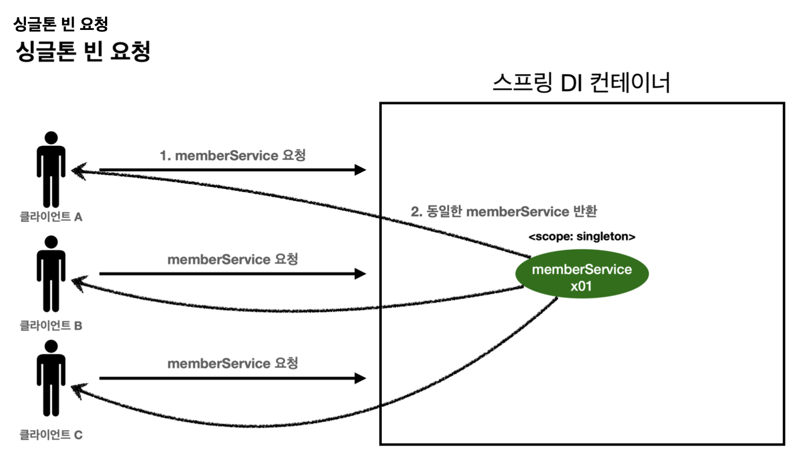
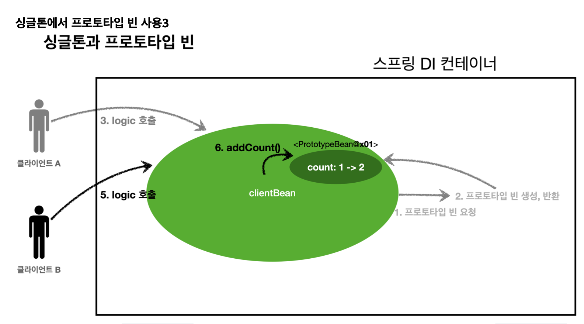
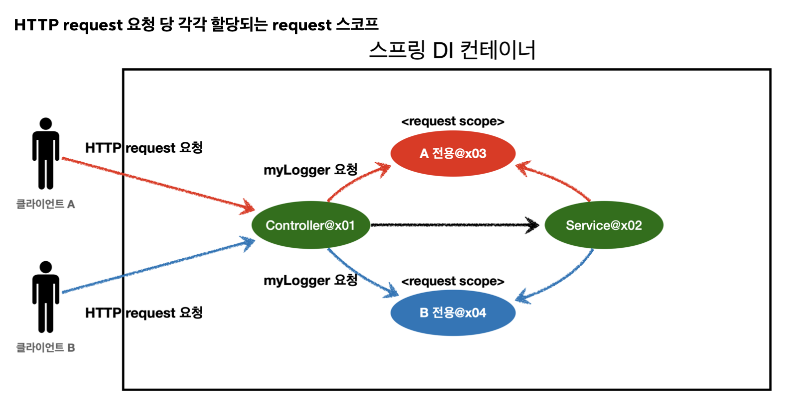
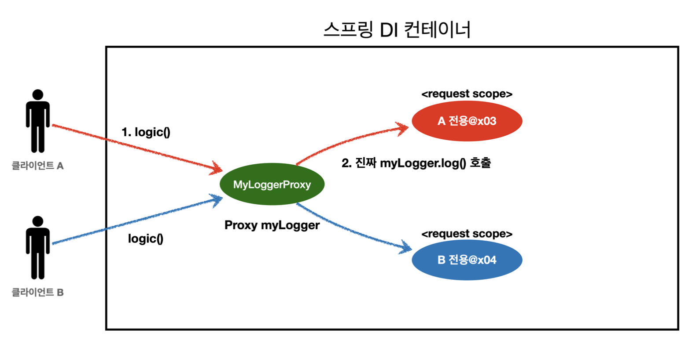

# 섹션 9. 빈 스코프

## 빈 스코프란?

스프링 빈은 스프링 컨테이너의 시작과 함께 생성이되어서 스프링 컨테이너가 종료가 될 때 까지 유지가 되는데
이것이 가능한 이유가 스프링 빈이 싱글톤 스코프로 생성이 되기때문이라고한다.
빈이 존재할 수 있는 범위를 의미한다.

스코프에는 다양한 종류들이 있는데

- 싱글톤: 가장 기본이되는 스코프, 스프링 컨테이너의 시작부터 종료까지 유지가되며 가장 넓은 범위의 스코프를 이야기한다.
- 프로토타입: 빈의 생성과 의존관계 주입까지만 관여를 하고 이후에는 더는 관리하지않는 매우 짧은 범위의 스코프
- 웹 관련 스코프
    - request: 웹 요청이 들어오고 나갈때까지 유지되는 스코프
    - session: 웹 세션이 생성되고 종료될 때까지 유지되는 스코프
    - application: 웹의 서블릿 컨텍스트와 같은 범위로 유지되는 스코프

`해당 내용이 생명주기랑 관련이 있다고 생각한다. 빈스코프에 따라 생성이 되는 시점에 **초기화 콜백**을 사용하고, 빈스코프가 마무리 되는 시점에 **소멸전 콜백**을 사용하고.`

## 프로토타입 스코프

### 프로토타입 스코프란?

빈의 생성과 의존관계 주입까지만 관여를 하고 이후에는 더는 관리하지않는 매우 짧은 범위의 스코프

### 기존의 형태 ( 싱글톤 )



### 프로토타입의 형태


그림으로 되어있는 이야기하기 쉬운 방식이 있어서 해당 방식을 참고해보자면

기존에는 여러 클라이언트가 `bean` 을 요구할때마다 스프링 컨테이너에 기본동작 방식이 싱글톤 방식이다보니 하나의 bean을 공유자원처럼 모두가 같이 사용을 했었는데.

프로토타입은 위와 같이 싱글톤 형식이긴하지만 클라이언트가 요청을 할때마다 새롭게 복사를 하여 생성하여 클라이언트에게 반환을 해주는 방식을 이야기한다.

그렇다보니 클라이언트가 직접 받게되는 bean은 서로 다르다.

추가적인 특징이 위에서도 이야기를 했다시피 프로토타입 스코프의 경우에는 컨테이너의 손을 떠나 클라이언트에게 전달이 된 이후에는 더 이상 관여를 하지않는다. 그렇다보니 `@PreDestroy` 같은 소멸전 콜백이 따로 실행되지않는다.

동작 방식이 복사해서 생성 후 전달을 하기때문에 `@PostConstruct` 은 실행이 이루어진다.

클라이언트에게 빈을 전달할때 복사본을 전달한다는 느낌..?

### 사용방식

```java
@Scope("prototype")
static class Bean {
}
```

위와 같이 bean을 사용할때 `@Scope`라는 애노테이션을 지정해서 사용할 수 있는데.

그 안에 위와 같이 `“prototype”` 라는 키워드를 적어서 넣게 되면 해당 bean은 prototype으로 동작을 하게된다.

## 프로토타입 스코프 - 싱글톤 빈과 함께 사용시 문제점



강의에서 이야기하고 있는 프로토타입과 싱글톤을 같이 사용했을때에 문제점은 위에 그림에서 확인할 수 있다.

위에 그림은 `싱글톤형식`으로 되어있는 `clientBean` 이라는 애가 `프로토타입` 형식으로 되어있는 `PrototypeBean` 을 가지고 있을때 문제가 발생된다고 이야기를 한다.

`PrototypeBean` 을 사용한다는 이야기가 공유자원을 가지고있지않고 매번 새롭게 복사해서 사용하여 `PrototypeBean`이 가지고 있는 값을 각각 따로 사용하겠다고 사용한다는 것인데 그러한 `PrototypeBean` 을 `싱글톤형식`인 `clientBean` 이 가지고 있으면 `PrototypeBean` 내부에 자원은 `clientBean`으로 묶여있기때문에 서로 공유가 된다는 이야기다.

```java
public ClientBean(PrototypeBean prototypeBean) {
    this.prototypeBean = prototypeBean;
}
```

그거에 대한 이유는 위에 코드를 통해 알 수 있다.

위에 코드는 `ClientBean`에 생성자를 나타내는 코드인데 생성자가 실행될때 `prototypeBean` 의 의존관계를 주입받는다. 그렇다보니 `ClientBean` 이 맨 처음 생성되고 의존관계를 주입받는 시점에 `prototypeBean` 이 이미 정해져있다보니 `ClientBean`을 사용할때 항상 같은 `prototypeBean` 을 사용하게 된다는 이야기이다.

### 의문점

해당 강의에서는 의도한 동작이 아니라 잘못된 방식이라고 이야기하는데.

`싱글톤 ← 싱글톤` 방식과 `싱글톤 ← 프로토타입` 방식은 엄연히 차이가 존재한다고 생각한다.

그렇다보니 `싱글톤 ← 프로토타입` 방식도 사용할때가 있을거같은데 왜 잘못된 방식이라고 이야기를 하는걸까..?

## 프로토타입 스코프 - 싱글톤 빈과 함께 사용시 Provider로 문제 해결
웹 스코프

전에 이야기가 나왔던 `싱글톤 ← 프로토타입` 인 경우에 어떻게 해야 싱글톤 내부에서 사용하는 프로토타입을 프로토타입형태로 사용할 수 있는가? 에 대한 해결책을 이야기한다.

다양한 방법들이 많이 있지만 많은 사용하는 방법에는 크게 2가지가 존재하는데.

- ObjectFactory, ObjectProvider
- JSR-330 Provider

### ObjectFactory, ObjectProvider

```java
@Autowired
private ObjectProvider<PrototypeBean> prototypeBeanProvider;

public int logic() {
	PrototypeBean prototypeBean = prototypeBeanProvider.getObject(); 
	prototypeBean.addCount();
	int count = prototypeBean.getCount();
	return count;
}
```

위와 같이  프로토타입 그대로로 사용하고 싶은 `bean`에다가 위와 같이 `ObjectProvider<bean_name>` 으로 선언을 할 수 있고, 실제로 가져다가 사용할때에는 `prototypeBeanProvider.getObject();` 이와 같이 `getObject()` 를 사용해서 항상 새로운 `PrototypeBean` 을 가져올 수 있다.

`ObjectProvider` 의 `getObject()` 를 호출하면 내부에서는 스프링 컨테이너를 통해 해당 빈을 찾아서 반환한다. (**DL**)

`ObjectFactory`와 `ObjectProvider`는 서로 호환이 되어서 둘 다 똑같이 사용될 수 있지만
`ObjectProvider` 가 조금 더 최신의 방식으로 `ObjectProvider` 을 사용하는 것을 권장한다.

( 알다시피 logic파트에서 매번 새롭게 `getObject()` 을 하는 방식이다보니 logic에 count값은 항상 초기화가 된다. )

### JSR-330 Provider

```java
@Autowired
private Provider<PrototypeBean> provider;

public int logic() {
	PrototypeBean prototypeBean = provider.get(); 
	prototypeBean.addCount();
	int count = prototypeBean.getCount();
	return count;
}
```

위에서 사용했던 `ObjectProvider` 와 문법에서만 약간의 차이가 있을 뿐 모든것이 똑같이 동작한다.

다만 차이점은 위에서 사용했던 `ObjectProvider` 은 spring에서 제공을 해주는 얘 이고,
`JSR-330 Provider` 에 경우에는 javax 가 지원해주는 형태라고 한다. ( java 표준에서 제공 )

 (`JSR-330 Provider` 을 사용할 경우에는 별도로 라이브러리를 등록해서 사용해야한다. )

위와 같이 `ObjectProvider` 와 `JSR-330 Provider` 가 똑같이 동작을 하다보니 어떤것을 사용할까라는 고민이 생기는데. 결론만 이야기하자면
보편적으로는 자바 표준에서 제공해주는 방식을 사용하는 것이 좋긴하지만 `ObjectProvider` 에 경우에는 많이 사용되는 spring에서 제공해주는 방식이다보니 `ObjectProvider` 사용하는 방식도 크게 문제가 되지는 않는다고 한다. 
( 또한 `JSR-330 Provider` 는 따로 라이브러리를 등록해서 사용해야한다는 불편함도 가지고있기 때문에 한목하는 것도 있을 거 같다. )

## 웹 스코프

- 웹 관련 스코프
    - request: HTTP 요청 하나가 들어오고 나갈 때 까지 유지되는 스코프, 각각의 HTTP 요청마다 별도의 빈 인스턴스가 생성되고, 관리된다.
    - session: 웹 세션이 생성되고 종료될 때까지 유지되는 스코프
    - application: 웹의 서블릿 컨텍스트와 같은 범위로 유지되는 스코프



이야기 나온 그대로 http 요청이 들어오고 나갈때 까지 유지되는 스코프를 이야기한다.

그리고 당연하게도 여러 클라이언트가 해당 웹 스코프를 요청할 때마다 각각 만들어서 반환을 하게된다. 

## request 스코프 예제 만들기

해당 파트에서는 실제로 request를 어떻게 사용할 수 있는지 간단한 예제를 만들어보는 파트였다.

```java
@Component
@Scope(value = "request")
public class MyLogger {
	...
}
```

일단 request로 사용할 bean에는 위와 같이 `@Scope(value = "request")` 을 통해 지정해줄 수 있다.

( `@Scope("request")`랑 `@Scope(value = "request")` 은 같은 의미 )

**참고:** requestURL을 MyLogger에 저장하는 부분은 컨트롤러 보다는 공통 처리가 가능한 스프링 인터셉터나
서블릿 필터 같은 곳을 활용하는 것이 좋다. 여기서는 예제를 단순화하고, 아직 스프링 인터셉터를 학습하지 않은
분들을 위해서 컨트롤러를 사용했다. 스프링 웹에 익숙하다면 인터셉터를 사용해서 구현해보자.

## error!

```java
@Controller
@RequiredArgsConstructor
public class LogDemoController {

    private final LogDemoService logDemoService;
    private final MyLogger myLogger;

    @RequestMapping("log-demo")
    @ResponseBody
    public String logDemo(HttpServletRequest request) {
        String requestURL = request.getRequestURL().toString();
        myLogger.setRequestURL(requestURL);

        myLogger.log("controller test");
        logDemoService.logic("testId");

        return "OK!";
    }
}
```

로직을 다 작성한 후에 실행을 해보면 `private final MyLogger myLogger;` 해당 파트에서 오류가 발생된다.

위에서 이야기한 그대로 http 요청이 들어와야와야 `request` bean이 생성이 되는데 아직 요청이 따로 들어오지않았기때문에 의존관계 대입하는 행위 자체가 불가능하게 된다.

그래서 의존단계에서 의존관계를 주입하는것이 아니라 실제 고객 요청이 왔을때를 기준으로 뒤로 지연을 시켜야한다.

## 스코프와 Provider

위에서 발생했던 문제를 해결하는 방법으로 전에 이야기가 나왔던 `provider` 를  사용하면 해당 코드를 해결 할 수 있다.

```java
@Controller
@RequiredArgsConstructor
public class LogDemoController {

    private final LogDemoService logDemoService;
    private final ObjectProvider<MyLogger> myLoggerProvider;

    @RequestMapping("log-demo")
    @ResponseBody
    public String logDemo(HttpServletRequest request) {
        String requestURL = request.getRequestURL().toString();
        MyLogger myLogger = myLoggerProvider.getObject(); // init
        myLogger.setRequestURL(requestURL);

        myLogger.log("controller test");
        logDemoService.logic("testId");

        return "OK!";
    }
}
```

코드는 위와 같은 구조로 되어있는데. 전에 사용했던 `ObjectProvider<MyLogger>` 방식을 사용하면 실질적으로 request bean이 생성되는 시점은 `myLoggerProvider.getObject()` 부분에서 `getObject` 를 진행하면서 생성이 되기때문에 위에서 나왔던 오류를 해결 할 수 있다.
`myLoggerProvider.getObject()`가 실행되는 시점에는 이미 http 요청이 진행중인 상황이므로 정상적인 처리가 가능하게 된다.

그리고 당연하다시피 `myLoggerProvider.getObject()` 에 경우에는 `request`마다 따로 생성이 된다.

### 추가정보

`objectProvider.getObject()`를 `LogDemoController`, `LogDemoService` 에서 각각 한번씩 따로 호출해도 같은 HTTP 요청이면 같은 스프링 빈이 반환된다! 

## 스코프와 프록시

### 프록시란?

다른 객체에 대한 간접적인 접근을 제공하는 객체
대상 객체에 대한 호출을 중간에 가로채고, 호출을 대신 수행하거나 보조 작업을 추가할 수 있다.

```java
private final ObjectProvider<MyLogger> myLoggerProvider;
```

위에서 `Provider` 를 사용하던 방식을 프록시로 대체해서 사용하는 것이 가능하다.

기존에는 위와 같은 코드의 방식을 사용해서 데이터의 생성 자체를 늦추는 방식을 사용했었는데

프록시를 사용하면 

```java
@Scope(value = "request", proxyMode = ScopedProxyMode.TARGET_CLASS)
public class MyLogger {
	...
}

public class LogDemoController {
	...
	private final MyLogger myLogger;
	...
	myLogger.setRequestURL(requestURL);
	...
}
```

위와 같이 Scope자체에 프록시를 등록시켜서 위와 같이 예전에 사용했던 방식 그대로 사용 할 수 있게 된다.



그것이 어떠한 형식으로 돌아가게 되냐면 프록시를 사용하면 `MyLogger$$EnhancerBySpringCGLIB` 형식으로 가짜 프록시 객체를 등록하게 되고 실질적으로 사용을 하게되는 요청이 들어오게 되면 그때 내부에서 진짜 bean을 찾아서 반환하게 된다.

### **동작 정리**

- CGLIB라는 라이브러리로 내 클래스를 상속 받은 가짜 프록시 객체를 만들어서 주입한다.
- 이 가짜 프록시 객체는 실제 요청이 오면 그때 내부에서 실제 빈을 요청하는 위임 로직이 들어있다.
- 가짜 프록시 객체는 실제 request scope와는 관계가 없다. 그냥 가짜이고, 내부에 단순한 위임 로직만 있고, 싱글톤 처럼 동작한다.

### **특징 정리**

- 프록시 객체 덕분에 클라이언트는 마치 싱글톤 빈을 사용하듯이 편리하게 request scope를 사용할 수 있다.
- 사실 Provider를 사용하든, 프록시를 사용하든 핵심 아이디어는 진짜 객체 조회를 꼭 필요한 시점까지 지연처리한다는 점이다.
- 단지 애노테이션 설정 변경만으로 원본 객체를 프록시 객체로 대체할 수 있다. 이것이 바로 다형성과 DI 컨테이너가 가진 큰 강점이다.
- 꼭 웹 스코프가 아니어도 프록시는 사용할 수 있다.

### **주의점**

- 마치 싱글톤을 사용하는 것 같지만 다르게 동작하기 때문에 결국 주의해서 사용해야 한다.
- 이런 특별한 scope는 꼭 필요한 곳에만 최소화해서 사용하자, 무분별하게 사용하면 유지보수하기 어려워진다.