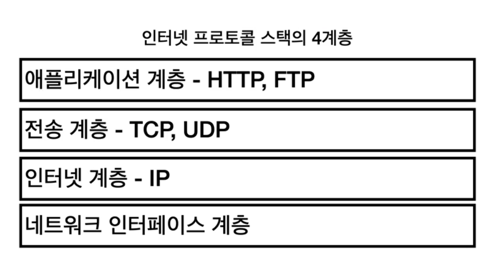
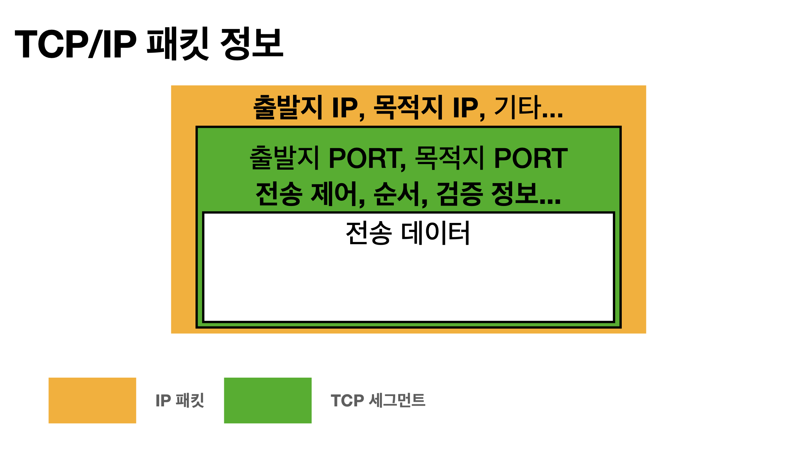

# 섹션 1. 인터넷 네트워크

# IP

### 인터넷 프로토콜 역할

- 지정한 IP 주소(IP Address)에 데이터 전달
- 패킷(Packet)이라는 통신 단위로 데이터 전달

- 비연결성
    - 패킷을 받을 대상이 없거나 서비스 불능상태여도 패킷 전송
- 비신뢰성
    - 중간에 패킷이 사라져도 알아차릴 수 없다.
    - 패킷의 순서를 보장할 수 없다.
- 프로그램 구분
    - 같은 IP에서 여러작업을 인터넷과 통해서 해도,
     인터넷에서는 각 작업들을 따로 인식해서 판별하게 되는데 그게 왜 가능한가?

# 패킷

컴퓨터 네트워크가 전달하는 데이터의 형식화된 블록

데이터를 어떻게 보낼지 형식을 지정해둔것

# TCP UDP

# TCP

### 전송 제어 프로토콜(Transmission Control Protocol)

- 연결 지향 - TCP 3 way handshake (가상 연결)
    - 연결을 한 다음에 메세지를 보내는 방식
    연결을 할때 `3 way handshake` 이라는 기법을 사용해서 서버와 클라이언트를 서로 연동한다.
    `3 way handshake` 에 경우에는 실제로 연결이 되는거는 아니고 데이터 전송을 통해 잘 전달이 되고 받는게 잘 되었으니 연결이 되었다고 논리적으로 판별하는 방식
- 데이터 전달 보증
    - 데이터를 전송한 이후에 데이터를 잘 받아졌다고 응답을 다시 보내는 방식
- 순서 보장
    - 패킷마다 순서를 지정 후 데이터를 전달하고,
    서버 측에서 받은 데이터가 순서가 이상하다면, 클라이언트에게 데이터를 다시 보내달라고 요청

- 신뢰할 수 있는 프로토콜
- 현재는 대부분 TCP 사용

IP에서 생기는 문제점들를 보완해주는 역할

# UDP

### IP + PORT + 체크섬 정도 추가 = UDP

- 연결 지향 - TCP 3 way handshake (가상 연결) X
- 데이터 전달 보증 X
- 순서 보장 X

# PORT

### 서버안에서 돌아가는 애플리케이션을 구분하는 역할

- 0 ~ 65535 할당가능
- 0 ~ 1023 잘 알려진 포트, 사용하지않는것이 좋음 ex) http - 80, https - 443 …

# DNS

### 도메인 네임 시스템 ( Domain Name System )

- 전화번호부
- 도메인 명을 IP 주소로 변환
    - map 형식마냥 `도메인 명 - IP 주소`를 서로 연결하는 방식