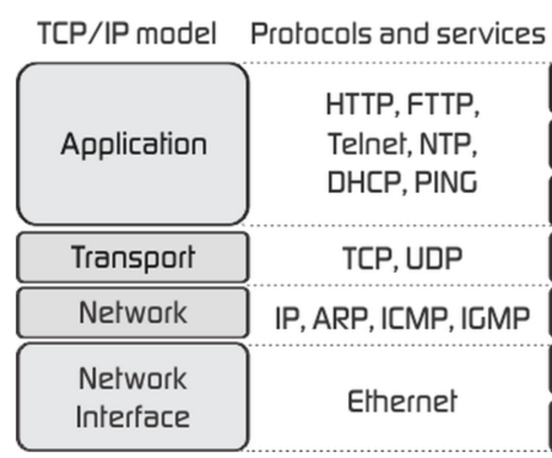

### 학습내용

- 인터넷 프로토콜
- DNS

# 인터넷 프로토콜

## 인터넷 프로토콜 4계층

- 응용계층: 
- 전송계층:
- 인터넷 계층:
- 네트워크 인터페이스 계층:

## IP

- 지정한 IP 주소에 데이터 전달
- 패킷이라는 통신 단위로 데이터 전달한다.(출발지, 목적지 ip 주소…)

### 단점

- 비연결성: 연결되었는지 아닌지 확인 불가 상태로 전송
    
    → 패킷 소실
    
- 비신뢰성: 중간에 사라지면? 순서대로 도착?
    
    → 패킷 도착 순서 문제
    

---

- 프로그램 구분: 같은 IP 사용 서버에 통신하는 app 두개 이상?

## TCP (Transmission Control Protocol)

- 연결 지향: 3 way handshake(가상 연결)
- 데이터 전달 보증
- 순서 보장

⇒ 신뢰 가능, 대부분 TCP 사용

### 단점

- 연결시간 오래 걸림

## UDP(User Datagram Protocol)

- IP + Port + checksum
- 데이터 전달 및 순서 보장되지 않음
- 단순하고 빠르다

→ 응용계층에서 추가 작업 필요 (TCP 최적화에 사용 되는 경우도 있다. - http3)

### 단점

tcp의 장점

## port

각 서비스 별 패킷 구분 위해 있음

⇒ TCP 세그먼트에 출발지, 목적지 port 명시

- 0 ~ 1023: well-known

# DNS

아이피주소가 기억하기 어렵고 변경 가능하다는 점을 해결하기 위해 등장한 서버
- 도메인 네임을 ip 주소로 변환해 준다.