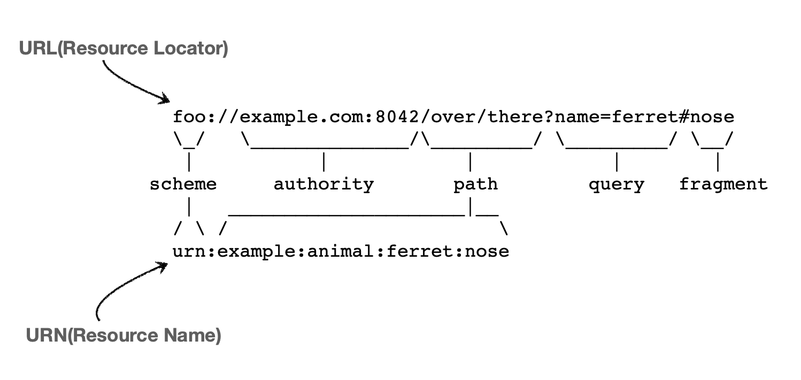

# 섹션 2. URI와 웹 브라우저 요청 흐름

# URI ( Uniform Resource Identifier )

### 리소스를 식별하는 통합적인 방법

- **Uniform**
리소스 식별하는 통일된 방식
- **Resource**
자원, URI로 식별할 수 있는 모든 것 (제한 없음)
- **Identifier**
다른 항목과 구분하는데 필요한 정보

# URL, URN

## URL ( Resource Locator )

### 리소스가 있는 위치를 지정

- 흔히들 많이 사용하는 인터넷 ( [https://www.google.com/](https://www.google.com/) ) 위치를 이야기하는 방식

`scheme://[userinfo@]host[:port][/path][?query][#fragment]`

`ex) [https://www.google.com:443/search?q=hello&hl=ko](https://www.google.com/search?q=hello&hl=ko)`

- `scheme` 프로토콜(https)
    - http, https, ftp 등등
- `[userinfo@]`
    - URL에 사용자정보를 포함해서 인증
    - 거의 사용하지 않음
- `host` 호스트명([www.google.com](http://www.google.com/))
    - 도메인명 또는 ip
- `[:port]` 포트 번호(443)
    - 일반적으로 생략, 생략시 프로토콜에 해당하는 기본포트로 이동
- `[/path]` 패스(/search)
    - 리소스 경로
    ex ) `pet/dog` , `pet/cat` 등
- `[?query]` 쿼리 파라미터(q=hello&hl=ko)
    - key=value 형태
    - ?로 시작, &로 추가 가능 ex) q=hello&hl=ko
- `[#fragment]`
    - html 내부 북마크 등에 사용
    - 거의 사용하지 않음

## URN ( Resource Name )

### 리소스에 이름을 부여

- 리소스에 이름을 부여해서 찾을 수 있는 방법을 만들려고 했으나 보편화 X
- 잘 사용하지 않는 방식

# 웹 브러우저 요청 흐름

1. 클라이언트가 위와 같이 패킷을 생성해서 서버에 요청
2. 서버는 해당 정보를 받아 패킷을 확인 후 응답 메시지를 생성
3. 서버가 클라이언트에게 응답 메세지 전송
4. 클라이언트 측에서는 정상적인 응답을 받았다면 페이지 생성