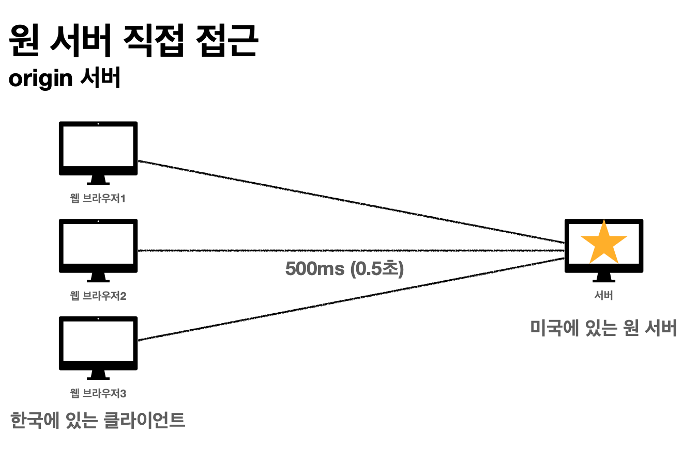
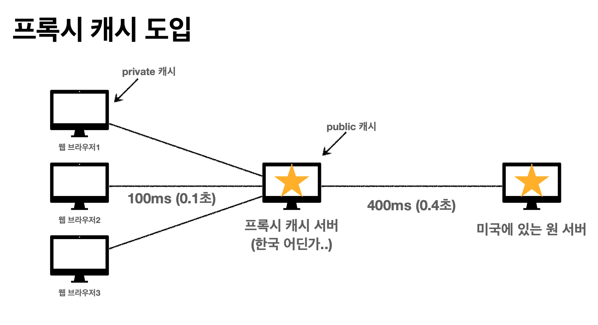

# 섹션 8. HTTP 헤더2 - 캐시와 조건부 요청

## 캐시 기본 동작

### **캐시가 없을 때**

- 데이터가 변경되지 않아도 계속 네트워크를 통해서 데이터를 다운로드 받아야 한다.
- 인터넷 네트워크는 매우 느리고 비싸다.
- 브라우저 로딩 속도가 느리다.
- 느린 사용자 경험

### **캐시 적용**

- 캐시 덕분에 캐시 가능 시간동안 네트워크를 사용하지 않아도 된다.
- 비싼 네트워크 사용량을 줄일 수 있다.
- 브라우저 로딩 속도가 매우 빠르다.
- 빠른 사용자 경험

### **캐시 시간 초과**

- 캐시 유효 시간이 초과하면, 서버를 통해 데이터를 다시 조회하고, 캐시를 갱신한다.
- 이때 다시 네트워크 다운로드가 발생한다.

위와 같이 캐시의 시간이 초과된 경우에 서버를 통해 다시 같은 데이터를 다시 받는 작업을 진행하면 메모리적으로 손해가 크다. ( 어처피 같은 이미지를 다시 받는 작업을 하기때문에 )

그것을 해결할 수 있는 방법이 아래에서 이야기하는 방법을 통해 해결할 수 있다.

## **검증 헤더와 조건부 요청**

- **검증 헤더**
    - 캐시 데이터와 서버 데이터가 같은지 검증하는 데이터
    - Last-Modified , ETag
- **조건부 요청 헤더**
    - 검증 헤더로 조건에 따른 분기
    - If-Modified-Since: Last-Modified 사용
    - If-None-Match: ETag 사용
    - 조건이 만족하면 200 OK
    - 조건이 만족하지 않으면 304 Not Modified

## 검증 헤더와 조건부 요청1

**Last-Modified, If-Modified-Since**

### **캐시 시간 초과**

- 캐시 유효 시간이 초과해서 서버에 다시 요청하면 다음 두 가지 상황이 나타난다.
1. 서버에서 기존 데이터를 변경함
2. 서버에서 기존 데이터를 변경하지 않음

- 캐시 만료후에도 서버에서 데이터를 변경하지 않음
- 생각해보면 데이터를 전송하는 대신에 저장해 두었던 캐시를 재사용 할 수 있다.
- 단 클라이언트의 데이터와 서버의 데이터가 같다는 사실을 확인할 수 있는 방법 필요

```json
HTTP/1.1 200 OK
Content-Type: image/jpeg
**cache-control: max-age=60**
**Last-Modified: 2020년 11월 10일 10:00:00**
Content-Length: 34012

lkj123kljoiasudlkjaweioluywlnfdo912u34ljko98udjklasl
kjdfl;qkawj9;o4ruawsldkal;skdjfa;ow9ejkl3123123
```

위와 같이 검증헤더를 추가하여 데이터의 최종수정일을 캐시에 같이 저장한다.

```json
GET /star.jpg
if-modified-since: 2020년 11월 10일 10:00:00
```

그러면 클라이언트에서는 `cache-control` 값이 만료가 되어버리면 서버에게 데이터를 요청할때 `if-modified-since` 이와 같이 검증헤더를 같이 보낸다.

그랬을때 서버측에서 `304 status code`와 헤더 데이터만 보내면서 클라이언트는 그대로 데이터를 사용해도 된다고 인식하여 추가적으로 다시 캐시 데이터를 요청하지않고, 계속 사용

반대로 데이터가 변경이 되었다면 `200 status code`를 보내면서 모든 데이터를 전송한다.

### **정리**

- 캐시 유효 시간이 초과해도, 서버의 데이터가 갱신되지 않으면 
304 Not Modified + 헤더 메타 정보만 응답(바디X)
- 클라이언트는 서버가 보낸 응답 헤더 정보로 캐시의 메타 정보를 갱신
- 클라이언트는 캐시에 저장되어 있는 데이터 재활용
- 결과적으로 네트워크 다운로드가 발생하지만 용량이 적은 헤더 정보만 다운로드
- 매우 실용적인 해결책

### 단점

- 1초 미만(0.x초) 단위로 캐시 조정이 불가능
- 날짜 기반의 로직 사용
- 데이터를 수정해서 날짜가 다르지만, 같은 데이터를 수정해서 데이터 결과가 똑같은 경우
- 서버에서 별도의 캐시 로직을 관리하고 싶은 경우
    - 예) 스페이스나 주석처럼 크게 영향이 없는 변경에서 캐시를 유지하고 싶은 경우

## **검증 헤더와 조건부 요청2**

- ETag(Entity Tag)
- 캐시용 데이터에 임의의 고유한 버전 이름을 달아둠
- 예) ETag: "v1.0", ETag: "a2jiodwjekjl3"
- 데이터가 변경되면 이 이름을 바꾸어서 변경함(Hash를 다시 생성)
- 예) ETag: "aaaaa" -> ETag: "bbbbb"
- 진짜 단순하게 ETag만 보내서 같으면 유지, 다르면 다시 받기!

```json
HTTP/1.1 200 OK
Content-Type: image/jpeg
**cache-control: max-age=60**
**ETag: "aaaaaaaaaa"**
Content-Length: 34012

lkj123kljoiasudlkjaweioluywlnfdo912u34ljko98udjklasl
kjdfl;qkawj9;o4ruawsldkal;skdjfa;ow9ejkl3123123
```

위와 같이 서버에서 데이터를 전달해줄때 `ETag` 라는 것을 사용해서 같이 데이터를 전달해주고

```json
GET /star.jpg
If-None-Match: "aaaaaaaaaa"
```

클라이언트에서는 `cache-control` 값이 만료가 되어버리면 `If-None-Match` 를 통해 다시 캐시 재검증을 받는다

### **ETag, If-None-Match 정리**

- 진짜 단순하게 ETag만 서버에 보내서 같으면 유지, 다르면 다시 받기!
- **캐시 제어 로직을 서버에서 완전히 관리**
- 클라이언트는 단순히 이 값을 서버에 제공(클라이언트는 캐시 메커니즘을 모름)
- 예)
    - 서버는 배타 오픈 기간인 3일 동안 파일이 변경되어도 ETag를 동일하게 유지
    - 애플리케이션 배포 주기에 맞추어 ETag 모두 갱신
    

## **캐시 제어 헤더**

- Cache-Control: 캐시 제어
- Pragma: 캐시 제어(하위 호환)
- Expires: 캐시 유효 기간(하위 호환)

### **Cache-Control**

**캐시 지시어(directives)**

- Cache-Control: max-age
- 캐시 유효 시간, 초 단위
- Cache-Control: no-cache
- 데이터는 캐시해도 되지만, 항상 원(origin) 서버에 검증하고 사용
- Cache-Control: no-store
- 데이터에 민감한 정보가 있으므로 저장하면 안됨

(메모리에서 사용하고 최대한 빨리 삭제)

### **Pragma**

**캐시 제어(하위 호환)**

- Pragma: no-cache
- HTTP 1.0 하위 호환

### **Expires**

**캐시 만료일 지정(하위 호환)**

- expires: Mon, 01 Jan 1990 00:00:00 GMT
- 캐시 만료일을 정확한 날짜로 지정
- HTTP 1.0 부터 사용
- 지금은 더 유연한 Cache-Control: max-age 권장
- Cache-Control: max-age와 함께 사용하면 Expires는 무시

### 정리

- **검증 헤더 (Validator)**
    - **ETag**: "v1.0", **ETag**: "asid93jkrh2l"
    - **Last-Modified**: Thu, 04 Jun 2020 07:19:24 GMT
- **조건부 요청 헤더**
    - If-Match, If-None-Match: ETag 값 사용
    - If-Modified-Since, If-Unmodified-Since: Last-Modified 값 사용
    

## 프록시 캐시





프록시 캐시라는 개념은 위의 그림과 같다. 1번째 그림에서 보다시피 한국에서 사용중인 클라이언트가
미국에 있는 원 서버에 접근할려고하면 거리로인해 로딩속도가 엄청 느리게 동작을 하게 되는데 그러한 문제점을 해결하기 위해서 나온것이 `**프록시 캐시**`라고한다.

프록시 캐시는 클라이언트와 같은 국가내에 있는 서버에게 클라이언트가 요청을 보내고 해당 요청을 받은 프록시 캐시 서버가 다른 나라에 있는 원서버에 프록시 캐시가 요청을 해서 데이터를 받아오는 형식으로 동작을한다.
그렇게 되면 프록시 캐시 서버가 타국에 있는 원서버로부터 데이터를 받아와서 그 데이터를 저장하고있기때문에
다른 웹브라우저에서는 빠르게 프록시 캐시 서버를 통해 동작이 이루어질 수 있다.

### **캐시 지시어(directives) - 기타**

- **Cache-Control: public**
    - 응답이 public 캐시에 저장되어도 됨
- **Cache-Control: private**
    - 응답이 해당 사용자만을 위한 것임, private 캐시에 저장해야 함(기본값)
- **Cache-Control: s-maxage**
    - 프록시 캐시에만 적용되는 max-age
- **Age: 60** (HTTP 헤더)
    - 오리진 서버에서 응답 후 프록시 캐시 내에 머문 시간(초)

## 캐시 무효화

캐시를 적용을 안한다고 해서 캐시화가 안되는것이 아니라 웹 브라우저들이 GET 요청인 경우에는 임의로 캐시를 해버리는 경우가 있다고 한다. 그래서 나온개념이 캐시 무효화이다.

- **Cache-Control: no-cache, no-store, must-revalidate**
- **Pragma: no-cache**
- HTTP 1.0 하위 호환

- **Cache-Control: no-cache**
    - 데이터는 캐시해도 되지만, 항상 **원 서버에 검증**하고 사용(이름에 주의!)
- **Cache-Control: no-store**
    - 데이터에 민감한 정보가 있으므로 저장하면 안됨
    (메모리에서 사용하고 최대한 빨리 삭제)
- **Cache-Control: must-revalidate**
    - 캐시 만료후 최초 조회시 **원 서버에 검증**해야함
    - 원 서버 접근 실패시 반드시 오류가 발생해야함 - 504(Gateway Timeout)
    - must-revalidate는 캐시 유효 시간이라면 캐시를 사용함
- **Pragma: no-cache**
    - HTTP 1.0 하위 호환
    
    ### **no-cache vs must-revalidate**
    
    서버마다 다르지만 프록시 캐시에 경우 원서버에 접근하지못할경우 에러가 날바에
    옛날 데이터를 보여주는 설정을 해주는 경우도 있다고한다. 하지만 상황에 따라 위와 같은 경우 에러가 나는것이 나을 수도 있기때문에 `must-revalidate` 설정을 넣어주어서 원서버에 접근 실패시 반드시 504에러가 나도록 넣어주어야한다고한다.
    
    그래서 `no-cache vs must-revalidate` ****은 서로 차이점이 있고, 그로 인해 2개를 모두 다 적는다고 한다.