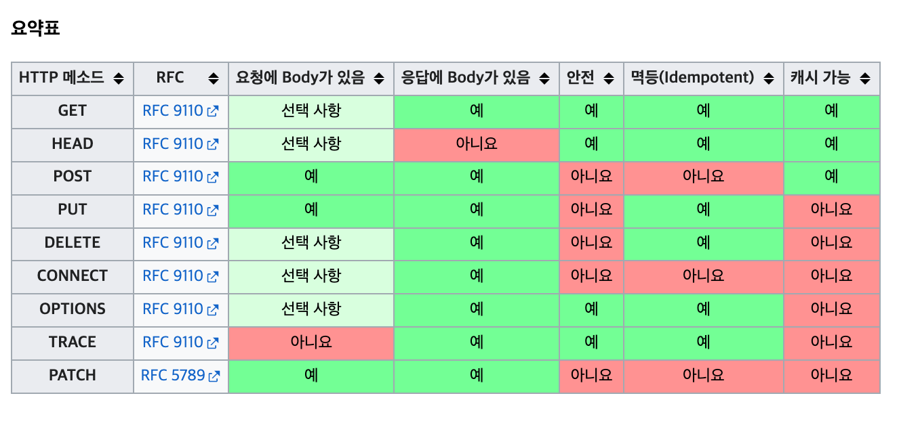

# 섹션 4. HTTP 메서드

# API URI 설계

- 회원 목록 조회
- 회원 조회
- 회원 등록
- 회원 수정
- 회원 삭제

위와 같은 회원정보에 관한 url을 설계할려면 어떻게 해야하는가?

### 리소스 식별

api를 설계할때는 **리소스**를 중점으로 잡고 설계를 진행해야한다.

위와 같은 경우는 리소스가 회원이라는 개념 자체가 리소스가 된다.

## 잘못된 방법

- 회원 목록 조회 /read-member-list
- 회원 조회 /read-member-by-id
- 회원 등록 /create-member
- 회원 수정 /update-member
- 회원 삭제 /delete-member

위에서 이야기가 나온대로 **리소스**를 기준으로 설계를 했어야했는데 잘못된 방법에 경우

- 리소스: 회원
- 행위: 조회, 등록, 수정, 삭제

로 봐서 리소스와 행위를 모두 설계에 포함시켜서 좋은 방법이 아니다.

## 좋은 방법

- **회원** 목록 조회 /members
- **회원** 조회 /members/{id}
- **회원** 등록 /members/{id}
- **회원** 수정 /members/{id}
- **회원** 삭제 /members/{id}
- 참고: 계층 구조상 상위를 컬렉션으로 보고 복수단어 사용 권장(member -> members)

# HTTP 메서드

- **GET**: 리소스 조회
- **POST**: 요청 데이터 처리, 주로 등록에 사용
- **PUT**: 리소스를 대체, 해당 리소스가 없으면 생성
- **PATCH**: 리소스 부분 변경
- **DELETE**: 리소스 삭제

**잘 사용하지않음**

- **HEAD:** GET과 동일하지만 메시지 부분을 제외하고, 상태 줄과 헤더만 반환
- **OPTIONS:** 대상 리소스에 대한 통신 가능 옵션(메서드)을 설명(주로 CORS에서 사용)
- **CONNECT:** 대상 리소스로 식별되는 서버에 대한 터널을 설정
- **TRACE:** 대상 리소스에 대한 경로를 따라 메시지 루프백 테스트를 수행

### GET

- 리소스 조회

### **POST**

- 요청 데이터 처리, 주로 등록에 사용
- 메시지 바디를 통해 서버로 요청 데이터 전달
- 주로 전달된 데이터로 신규 리소스 등록, 프로세스 처리에 사용

### **PUT**

- 리소스를 완전히 대체
- 해당 리소스가 없으면 생성
- 클라이언트가 리소스를 식별
    - 클라이언트가 리소스 위치를 알고 URI 지정
    - POST와 차이점

### **PATCH**

- 리소스 부분 변경
- 혹시나 patch를 지원하지않을경우 post사용

### **DELETE**

- 리소스 삭제

## 속성

- **안전(Safe Methods)**
호출해도 리소스를 변경하지 않는다.
- **멱등(Idempotent Methods)**
한 번 호출하든 두 번 호출하든 100번 호출하든 결과가 똑같다.
    - 멱등은 외부 요인으로 중간에 리소스가 변경되는 것까지는 고려하지않는다.
    - POST에 경우에서는 멱등을 적용해서는 안된다.
    ex) 결제등에서 멱등을 적용시키면 오류가 발생할 수 있다.
- **캐시가능(Cacheable Methods)**
클라이언트의 로컬 스토리지에 저장하여, 이후 동일한 리소스에 대한 요청을 처리할 때 서버로부터 다시 받지 않고 로컬 스토리지에서 직접 가져와 사용할 수 있는 기능
    - GET, HEAD, POST, PATCH 캐시가능
    - 실제로는 GET, HEAD 정도만 캐시로 사용
    POST, PATCH는 본문 내용까지 캐시 키로 고려해야 하는데, 구현이 쉽지않다.

위와 같은 3가지 사항을 지켜서 메서드를 설계해야한다.