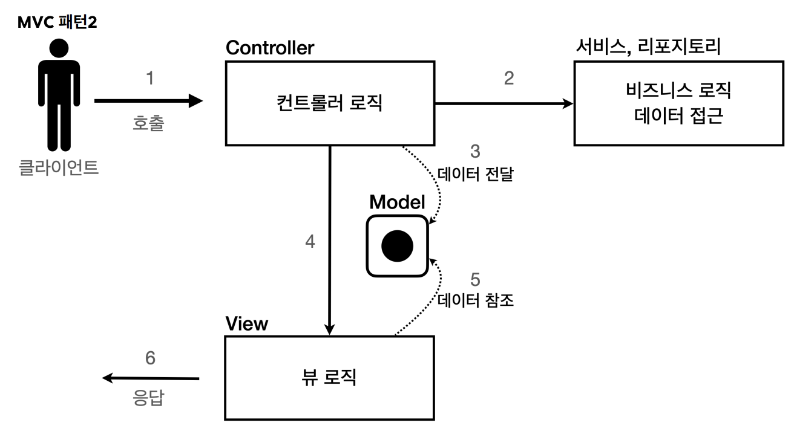

# 학습내용

회원관리 웹 어플리케이션을 서블릿 → JSP → MVC 순서대로 구현해보며, 백엔드 진화과정 및 MVC 이해하기

# 회원 관리 웹 어플리케이션 요구 사항

회원의 이름과 나이를 입력받아 저장하고, 저장된 회원 목록을 보여주는 웹 어플리케이션 제작

- 회원 도메인, 회원 저장소 코드 생성하였다.
    - 회원 저장소는 `스프링 핵심원리` 강의에서 학습하였던 싱글톤 방식으로 제작하였다.

# 서블릿으로 구현

## 코드 예시

```java
@WebServlet(name = "memberFormServlet", urlPatterns = "/servlet/members/newform")
public class MemberFormServlet extends HttpServlet {
	@Override
	protected void service(HttpServletRequest request, HttpServletResponse response) throws ServletException, IOException {
		response.setContentType("text/html");
		response.setCharacterEncoding("utf-8");
		PrintWriter w = response.getWriter();
		w.write("<!DOCTYPE html>\n" +
		"<html>\n" +
		"<head>\n" +
		" <meta charset=\"UTF-8\">\n" +
		" <title>Title</title>\n" +
		"</head>\n" +
		"<body>\n" +
		"<form action=\"/servlet/members/save\" method=\"post\">\n" +
		" username: <input type=\"text\" name=\"username\" />\n" +
		" age: <input type=\"text\" name=\"age\" />\n" +
		" <button type=\"submit\">전송</button>\n" +
		"</form>\n" +
		"</body>\n" +
		"</html>\n");
	}
}
```

## 문제점

자바코드로 HTML 코드를 작성하므로 문법오류 등 체크할 수 없고 번거롭다.

자바코드에 HTML코드 삽입보다, HTML 코드에 동작이 필요한 부분만 자바코드를 삽입할 수 있다면 더 편리할 것이다.

## 대안: 템플릿 엔진

템플리 엔진은 템플릿(HTML)에 데이터를 결합하여 새로운 문서나 프로그램을 생성하는 소프트웨어이다. 이러한 템플릿엔진을 이용해 HTML에 필요한 부분에 자바 코드를 적용해 동적으로 변경하는 것이 가능하다.

- 예) JSP, Thymleaf, Velocity 등

# JSP로 구현

## 라이브러리 추가
`build.gradle`에 다음 코드 추가
```groovy
implementation 'org.apache.tomcat.embed:tomcat-embed-jasper'
implementation 'jakarta.servlet:jakarta.servlet-api' //스프링부트 3.0 이상
implementation 'jakarta.servlet.jsp.jstl:jakarta.servlet.jsp.jstl-api' //스프링부트 3.0 이상
implementation 'org.glassfish.web:jakarta.servlet.jsp.jstl' //스프링부트 3.0 이상
```

## 코드 예시

```java
<%@ page import="hello.servlet.domain.member.MemberRepository" %>
<%@ page import="hello.servlet.domain.member.Member" %>
<%@ page contentType="text/html;charset=UTF-8" language="java" %>
<%
    // request, response 사용 가능
    MemberRepository memberRepository = MemberRepository.getInstance();
    System.out.println("save.jsp");
    String username = request.getParameter("username");
    int age = Integer.parseInt(request.getParameter("age"));
    Member member = new Member(username, age);
    System.out.println("member = " + member);
    memberRepository.save(member);
%>
<html>
    <head>
        <meta charset="UTF-8">
    </head>
    <body>
        성공
        <ul>
        <li>id=<%=member.getId()%></li>
        <li>username=<%=member.getUsername()%></li>
        <li>age=<%=member.getAge()%></li>
        </ul>
        <a href="/index.html">메인</a>
    </body>
</html> 
```

## Servlet과 JSP의 한계

서블릿은 뷰를 위한 HTML이 자바코드에 섞여있어 지저분했고, JSP는 HTML을 편리하게 작성할 수 있지만, 여전히 많은 비즈니스 로직이 포함되어 있다. 이 경우 JSP에 너무 많은 역할이 지워져있어 유지보수가 어렵다.

따라서 비즈니스 로직은 다른 곳에서 처리하고, JSP는 목적에 맞도록 HTML로 화면을 그리는 일에 집중할 수 있도록 하는 MVC 패턴이 등장했다.

# MVC 패턴으로 구현

## 개요

### 도입 이전 문제점

- 너무 많은 역할: 비즈니스 로직 + 뷰 렌더링
- **변경의 라이프 사이클**:
    - 뷰 ↔ 비즈니스 로직 간 변경의 라이프 사이클이 다르고, 서로에 영향을 주지 않을 확률이 높다
    - 변경의 라이플 사이클이 다른 부분을 하나의 코드로 관리 → 유지 보수에 좋지 않다.
- 기능 특화: 화면을 렌더링하는데 특화된 JSP를 화면 렌더링하는데만 사용하자.

### Model View Controller




## 적용

서블릿을 컨트롤러로, JSP를 뷰로, 모델은 HttpServletRequest 객체를 사용해 MVC 패턴을 적용하였다

- HttpServletRequest 안에 attribute라는 내부 저장소를 가지고 있다.

### 컨트롤러

```java
@WebServlet(name = "mvcMemberSaveServlet", urlPatterns = "/servlet-mvc/members/save")
public class MvcMemberSaveServlet extends HttpServlet {
    private MemberRepository memberRepository = MemberRepository.getInstance();
    @Override
    protected void service(HttpServletRequest request, HttpServletResponse response) throws ServletException, IOException {
        String username = request.getParameter("username");
        int age = Integer.parseInt(request.getParameter("age"));
        Member member = new Member(username, age);
        System.out.println("member = " + member);

        memberRepository.save(member);
        request.setAttribute("member", member); //Model에 데이터를 보관한다.
        
        String viewPath = "/WEB-INF/views/save-result.jsp";
        RequestDispatcher dispatcher = request.getRequestDispatcher(viewPath);
        dispatcher.forward(request, response);
    }
}
```

- `/WEB-INF`: 이 디렉터리 안에 존재는 파일은 브라우저에서 직접 요청할 수 없다.
- `redirect` vs `foward`: redirect는 브라우저로 리다이렉트하라는 요청이 간 후, 브라우저가 새로운 url로 요청을 보내지만, foward는 서버 내부에서 일어나는 호출이므로 url 변경이 없다.

### 뷰

```java
<%@ page contentType="text/html;charset=UTF-8" language="java" %>
<html>
<head>
 <meta charset="UTF-8">
</head>
<body>
성공
<ul>
 <li>id=${member.id}</li>
 <li>username=${member.username}</li>
 <li>age=${member.age}</li>
</ul>
<a href="/index.html">메인</a>
</body>
</html>
```

## 한계

- 포워드 중복: 뷰로 이동하는 코드가 항상 중복호출된다. 이 부분을 메서드로 공통화하더라도, 해당 메서드를 중복호출해야 하는 문제가 생긴다.
    
    ```java
    RequestDispatcher dispatcher = request.getRequestDispatcher(viewPath);
    dispatcher.forward(request, response); 
    ```
    
- ViewPath 내부 중복:
    - `/WEB-INF/views/new-form.jsp`에서 `/WEB-INF/views/` + `.jsp` 의 중복이 발생한다.
    - 만약 템플릿 엔진을 교체하거나, 뷰 파일의 위치를 변경한다면 모든 파일의 코드를 수정해야 한다는 문제 발생한다.
- 사용하지 않는 코드:
    - `HttpServletRequest` , `HttpServletResponse` 를 사용하지 않는 경우가 많으며, 이를 사용하는 코드는 테스트케이스를 작성하기도 어렵다.
- 공통 처리 어려움:
    - 기능이 복잡해질 수록 공통 처리 부분이 증가한다. 공통 처리부분을 메서드로 묶더라도 호출하는 것 자체가 중복이다.

⇒ **프론트 컨트롤러 패턴**을 도입해 해결할 수 있다. (스프링 MVC의 핵심!)