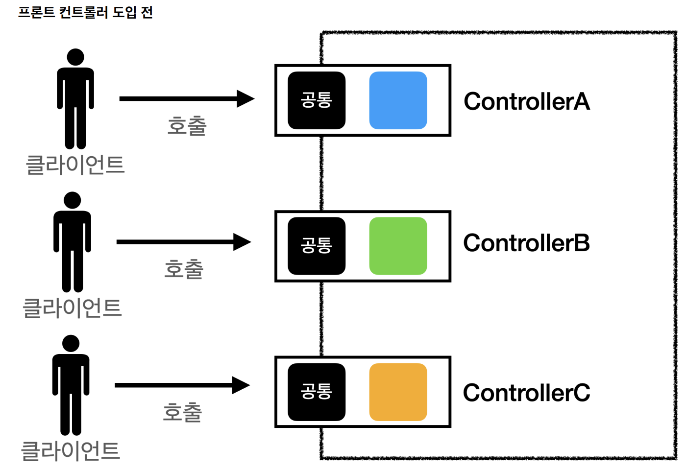
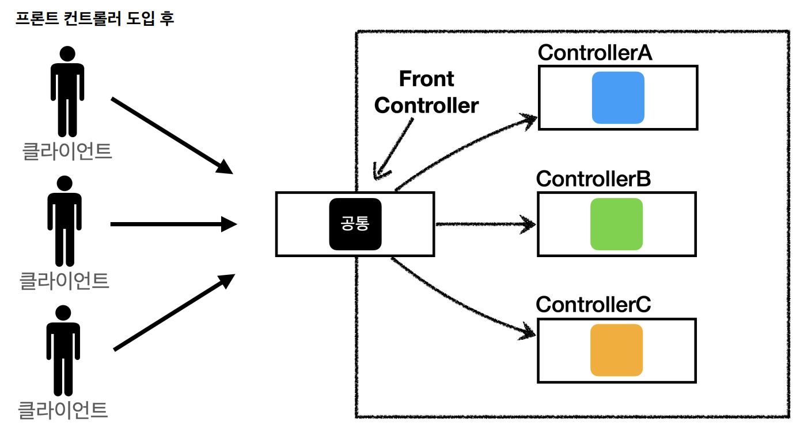
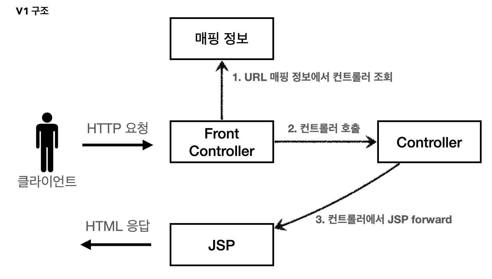
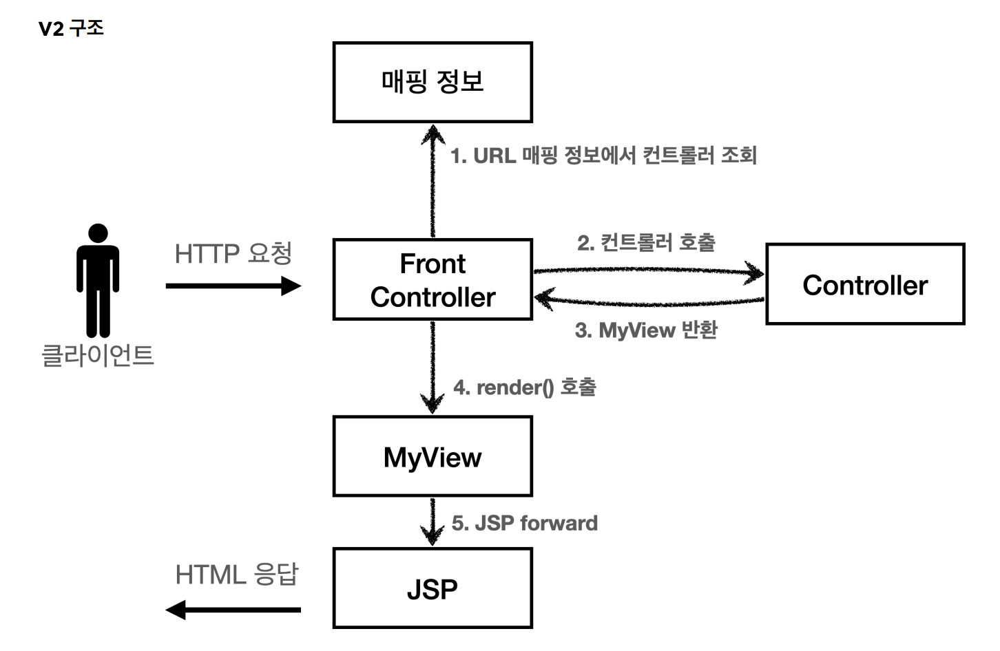
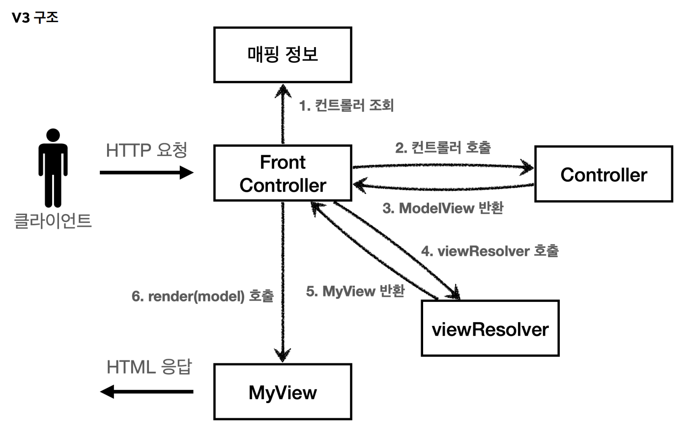
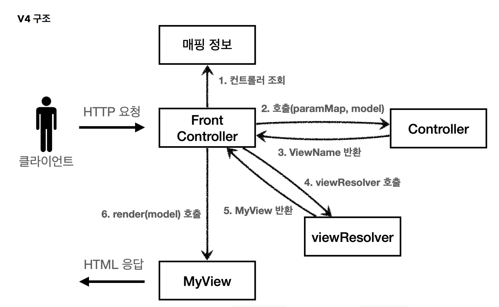
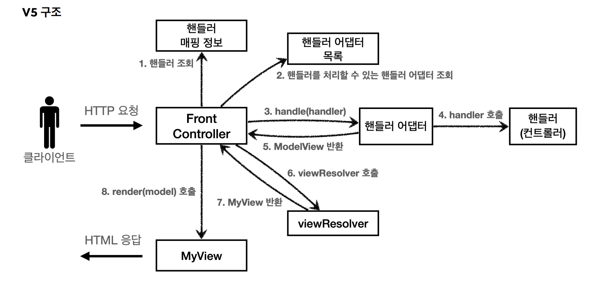

# 학습내용
프론트컨트롤러를 도입 및 점진적으로 개선하면서 spring mvc 의 구조를 이해한다.
# 프론트 컨트롤러 패턴이란
## 도입 전후 차이


## 특징
- 프론트 컨트롤러 서블릿 하나로 클라이언트의 모든 요청을 받는다
- 프론트 컨트롤러가 요청에 일치하는 컨트롤러를 찾아 호출한다.
- 여러 컨트롤러의 공통 기능을 한 번에 처리 가능하다.
- 나머지 컨트롤러는 서블릿을 사용하지 않아도 된다.
## 스프링 MVC의 핵심 기능
스프링 웹 MVC의 `DispatcherServlet`이 이 패턴으로 구현되었다.
# V1: 프론트 컨트롤러 도입
기존코드 최대한 유지 & 프론트 컨트롤러 도입
## 구조


## 코드
### 컨트롤러 인터페이스
```java
public interface ControllerV1 {
    void process(HttpServletRequest request, HttpServletResponse response) throws ServletException, IOException;
}
```
각 컨트롤러는 이 인터페이스를 구현 -> 로직의 일관성을 가진다.
### 컨트롤러 구현
```java
public class MemberSaveControllerV1 implements ControllerV1 {
    private MemberRepository memberRepository = MemberRepository.getInstance();

    @Override
    public void process(HttpServletRequest request, HttpServletResponse response) throws ServletException, IOException {
        String username = request.getParameter("username");
        int age = Integer.parseInt(request.getParameter("age"));

        Member member = new Member(username, age);
        memberRepository.save(member);

        //Model에 데이터 보관
        request.setAttribute("member", member);

        String viewPath = "/WEB-INF/views/save-result.jsp";
        RequestDispatcher requestDispatcher = request.getRequestDispatcher(viewPath);
        requestDispatcher.forward(request, response);
    }
}
```
내부 로직은 기존 서블릿과 거의 같다.
### 프론트 컨트롤러
```java
@WebServlet(name="frontControllerServletV1", urlPatterns = "/front-controller/v1/*")
public class FrontControllerServletV1 extends HttpServlet {
    private Map<String, ControllerV1> controllerMap = new HashMap<>();

    public FrontControllerServletV1() {
        controllerMap.put("/front-controller/v1/members/new-form", new MemberFormControllerV1());
        controllerMap.put("/front-controller/v1/members/save", new MemberSaveControllerV1());
        controllerMap.put("/front-controller/v1/members", new MemberListControllerV1());
    }

    @Override
    protected void service(HttpServletRequest request, HttpServletResponse response) throws ServletException, IOException {
        System.out.println("FrontControllerServletV1.service");
        String requestURI = request.getRequestURI();
        ControllerV1 controller = controllerMap.get(requestURI);
        if (controller == null){
            response.setStatus(HttpServletResponse.SC_NOT_FOUND);
            return;
        }
        controller.process(request, response);
    }
}
```
- `urlPattern`의 `*`: 하위 모든 요청은 이 서블릿에서 받아들인다.
- `controllerMap`: `url` - `controller` 매핑
- `service`: requestURI를 조회해 controllerMap에 해당 url에 매핑되어있는 컨트롤러 있는지 확인 -> 있다면 해당 컨트롤러 실행

# V2: View 분리
아직 모든 컨트롤러에서 뷰로 이동하는 부분에 중복이 있다.
```java
String viewPath = "/WEB-INF/views/new-form.jsp";
RequestDispatcher dispatcher = request.getRequestDispatcher(viewPath);
dispatcher.forward(request, response);
```
## 구조

## 코드
### View 분리
```java
public class MyView {
    private String viewPath;
    public MyView(String viewPath) {
        this.viewPath = viewPath;
    }
    public void render(HttpServletRequest request, HttpServletResponse response) throws ServletException, IOException {
        RequestDispatcher dispatcher = request.getRequestDispatcher(viewPath);
        dispatcher.forward(request, response);
    }
}
```
- `viewPath`를 저장하고 렌더링하는 기능 수행

### controller interface
```java
public interface ControllerV2 {
 MyView process(HttpServletRequest request, HttpServletResponse response) throws ServletException, IOException;
}
```
리턴 타입이 void -> MyView로 변경되었다.

### controller
```java
public class MemberSaveControllerV2 implements ControllerV2 {
    private MemberRepository memberRepository = MemberRepository.getInstance();

    @Override
    public MyView process(HttpServletRequest request, HttpServletResponse response) throws ServletException, IOException {
        String username = request.getParameter("username");
        int age = Integer.parseInt(request.getParameter("age"));

        Member member = new Member(username, age);
        memberRepository.save(member);

        //Model에 데이터 보관
        request.setAttribute("member", member);

        return new MyView("/WEB-INF/views/save-result.jsp");
    }
}
```
viewPath 찾아서 forward 하던 로직이 없어지고, MyView에 viewPath를 넣어서 리턴한다.
### 프론트 컨트롤러
```java
@WebServlet(name="frontControllerServletV2", urlPatterns = "/front-controller/v2/*")
public class FrontControllerServletV2 extends HttpServlet {
    private Map<String, ControllerV2> controllerMap = new HashMap<>();

    @Override
    protected void service(HttpServletRequest request, HttpServletResponse response) throws ServletException, IOException {
        System.out.println("FrontControllerServletV2.service");
        String requestURI = request.getRequestURI();
        ControllerV2 controller = controllerMap.get(requestURI);
        if (controller == null){
            response.setStatus(HttpServletResponse.SC_NOT_FOUND);
            return;
        }
        MyView view = controller.process(request, response);
        view.render(request, response);
    }
}
```
컨트롤러 실행 후 MyView 객체를 리턴받아 렌더하는 부분이 추가되었다.
### 정리
공통 로직인 foward 부분을 MyView를 리턴받은 프론트 컨트롤러가 처리하도록 변경되었다.

# V3: Model 추가
## 목표
- 서블릿 종속성 제거: 
    - 요청파라미터 정보는 자바의 Map으로 넘기도록 함
    - 별도의 Model 객체를 만들어 반환하자
        - 컨트롤러가 서블릿 기술(HttpServletRequest, HttpServletResonse 등)을 몰라도 된다
        - 단순해지고 테스트 코드 작성 쉽다
- 뷰 이름 중복 제거:
    - 컨트롤러가 뷰의 논리 이름 반환하도록 처리
        - 뷰의 폴더 위치 이동해도 프론트 컨트롤러만 고치면 된다.
## 구조 

- 서블릿에 종속적인 HttpServletRequest 대신 paramMap 전달
- ModelView: Model & viewPath 가진다.
- viewResolver: 논리이름 -> 실제 이름으로 변경
## 코드
### ModelView
```java
@Getter @Setter
public class ModelView {
    private String viewName;
    private Map<String, Object> model = new HashMap<>();

    public ModelView(String viewName) {
        this.viewName = viewName;
    }
}
```
springMVC에는 ModelAndView라는 비슷한 객체가 존재한다
### 컨트롤러 인터페이스
```java
public interface ControllerV3 {
    ModelView process(Map<String, String> paramMap);
}
```
리턴타입이 MyView 에서 ModelView로 변경되었다.
### 컨트롤러
```java
public class MemberSaveControllerV3 implements ControllerV3 {
    MemberRepository memberRepository = MemberRepository.getInstance();
    @Override
    public ModelView process(Map<String, String> paramMap) {
        String username = paramMap.get("username");
        int age = Integer.parseInt(paramMap.get("age"));

        Member member = new Member(username, age);
        memberRepository.save(member);

        ModelView mv = new ModelView("save-result");
        mv.getModel().put("member", member);
        return mv;
    }
}
```
MyView가 아닌 ModelView를 리턴하며, ModelView에 Model과 논리 이름을 삽입하였다.
### 프론트 컨트롤러
```java
@WebServlet(name="frontControllerServletV3", urlPatterns = "/front-controller/v3/*")
public class FrontControllerServletV3 extends HttpServlet {
    private Map<String, ControllerV3> controllerMap = new HashMap<>();

    @Override
    protected void service(HttpServletRequest request, HttpServletResponse response) throws ServletException, IOException {
        System.out.println("FrontControllerServletV2.service");
        String requestURI = request.getRequestURI();
        ControllerV3 controller = controllerMap.get(requestURI);
        if (controller == null){
            response.setStatus(HttpServletResponse.SC_NOT_FOUND);
            return;
        }
        Map<String, String> paramMap = createParamMap(request);
        ModelView mv = controller.process(paramMap);

        String viewName = mv.getViewName();//논리이름
        MyView view = viewResolver(viewName);
        view.render(mv.getModel(), request, response);
    }

    private static MyView viewResolver(String viewName) {
        return new MyView("/WEB-INF/views/" + viewName + ".jsp");
    }

    //너무 디테일한 로직
    private static Map<String, String> createParamMap(HttpServletRequest request) {
        //paramMap
        Map<String, String> paramMap = new HashMap<>();
        request.getParameterNames().asIterator()
                .forEachRemaining(paramName -> paramMap.put(paramName, request.getParameter(paramName)));
        return paramMap;
    }
}
```
- controller 호출 전 model을 만들어 넘긴다.
- request객체 대신 paramMap을 만들어 넘긴다
- viewResolver를 통해 실제 이름을 찾는다
- render시 모델을 넘긴다.

# V4: 단순 & 실용적인 컨트롤러
매번 모델뷰 생성 및 리턴 귀찮...
## 구조 

viewName만 반환한다.
## 코드
### 컨트롤러 인터페이스
```java
public interface ControllerV4 {
    String process(Map<String, String> paramMap, Map<String, Object> model);
}
```
뷰네임을 리턴하도록 리턴타입이 String으로 바뀌었고, model을 인자로 받는다
### 컨트롤러
```java
public class MemberSaveControllerV4 implements ControllerV4 {
    MemberRepository memberRepository = MemberRepository.getInstance();

    @Override
    public String process(Map<String, String> paramMap, Map<String, Object> model) {
        String username = paramMap.get("username");
        int age = Integer.parseInt(paramMap.get("age"));

        Member member = new Member(username, age);
        memberRepository.save(member);

        model.put("member", member);
        return "save-result";
    }
}
```
인자로 받은 model에 모델을 넣고, 뷰네임을 리턴한다.
### 프론트 컨트롤러
```java
@WebServlet(name="frontControllerServletV4", urlPatterns = "/front-controller/v4/*")
public class FrontControllerServletV4 extends HttpServlet {
    private Map<String, ControllerV4> controllerMap = new HashMap<>();

    @Override
    protected void service(HttpServletRequest request, HttpServletResponse response) throws ServletException, IOException {
        System.out.println("FrontControllerServletV2.service");
        String requestURI = request.getRequestURI();
        ControllerV4 controller = controllerMap.get(requestURI);
        if (controller == null){
            response.setStatus(HttpServletResponse.SC_NOT_FOUND);
            return;
        }
        Map<String, String> paramMap = createParamMap(request);
        Map<String, Object> model = new HashMap<>(); // 추가되었다.
        String viewName = controller.process(paramMap, model);

        MyView view = viewResolver(viewName);
        view.render(model, request, response);
    }

    private static MyView viewResolver(String viewName) {
        return new MyView("/WEB-INF/views/" + viewName + ".jsp");
    }
}
```
- 컨트롤러 호출 전 model 생성 해 인자로 넘겨준다.
- ModelView에서 viewName을 얻는 과정이 없어졌다.
# V5: 유연한 컨트롤러
v3와 v4의 컨트롤러를 모두 취하고 싶을 때? 어댑터 패턴을 적용하면 된다!

## 구조 

- 핸들러 어댑터: 여러 종류의 컨트롤러 호출 가능하도록 해준다
- 핸들러: 컨트롤러의 확장 개념, 어댑터가 존재하므로 어떤 것이든 해당종류의 핸들러만 있다면 실행 가능하다.
## 코드
### 핸들러 어댑터 인터페이스
```java
public interface MyHandlerAdapter {
    boolean supports(Object handler);

    ModelView handle(HttpServletRequest request, HttpServletResponse response, Object handler) throws ServletException, IOException;
}
```
- surpports: 인자로 받은 핸들러를 해당 핸들러가 지원하는가?
- handle: 핸들러 처리
- 여기선 ModelView를 리턴하도록 하였으므로 v3, v4어댑터는 모두 ModelView를 리턴하게 된다.

### v3용 어댑터 
```java
public class ControllerV3HandlerAdapter implements MyHandlerAdapter {
    @Override
    public boolean supports(Object handler) {
        return (handler instanceof ControllerV3);
    }

    @Override
    public ModelView handle(HttpServletRequest request, HttpServletResponse response, Object handler) throws ServletException, IOException {
        ControllerV3 controller = (ControllerV3) handler;
        Map<String, String> paramMap = createParamMap(request);
        ModelView mv = controller.process(paramMap);
        return mv;
    }
}
```
front controller의 일부 코드가 넘어왔다.
### v4용 어댑터 
```java
public class ControllerV4HandlerAdapter implements MyHandlerAdapter {
    @Override
    public boolean supports(Object handler) {
        return (handler instanceof ControllerV4);
    }

    @Override
    public ModelView handle(HttpServletRequest request, HttpServletResponse response, Object handler) throws ServletException, IOException {
        ControllerV4 controller = (ControllerV4) handler;
        Map<String, String> paramMap = createParamMap(request);
        HashMap<String, Object> model = new HashMap<>();

        String viewName = controller.process(paramMap, model);

        ModelView mv = new ModelView(viewName);
        mv.setModel(model);
        return mv;
    }
}
```
리턴받은 뷰네임을 ModelView에 저장해 리턴한다.
### 프론트 컨트롤러
```java
@WebServlet(name="frontControllerServletV5", urlPatterns = "/front-controller/v5/*")
public class FrontControllerServletV5 extends HttpServlet {
    private final Map<String, Object> handerMappingMap = new HashMap<>();
    private final List<MyHandlerAdapter> handlerAdapters = new ArrayList<>();

    public FrontControllerServletV5(){
        initHandlerMappingMap();
        initHandlerAdapters();
    }

    @Override
    protected void service(HttpServletRequest request, HttpServletResponse response) throws ServletException, IOException {
        Object handler = getHandler(request);
        if (handler == null){
            response.setStatus(HttpServletResponse.SC_NOT_FOUND);
            return;
        }

        MyHandlerAdapter adapter = getHandlerAdapter(handler);

        ModelView mv = adapter.handle(request, response, handler);

        String viewName = mv.getViewName();
        MyView view = viewResolver(viewName);

        view.render(mv.getModel(), request, response);
    }

    private MyHandlerAdapter getHandlerAdapter(Object handler) {
        for (MyHandlerAdapter adapter : handlerAdapters) {
            if (adapter.supports(handler))
                return adapter;
        }
        throw new IllegalArgumentException("handler adapter를 찾을 수 없습ㄴ디ㅏ. handler = " + handler);
    }

    private Object getHandler(HttpServletRequest request) {
        String requestURI = request.getRequestURI();
        Object handler = handerMappingMap.get(requestURI);
        return handler;
    }

    private static MyView viewResolver(String viewName) {
        return new MyView("/WEB-INF/views/" + viewName + ".jsp");
    }
}
```
- 어댑터를 저장할 list 추가됨
- 해당 어댑터를 찾는 로직 추가