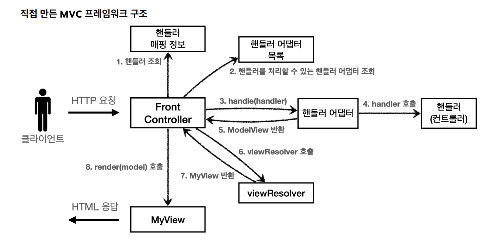
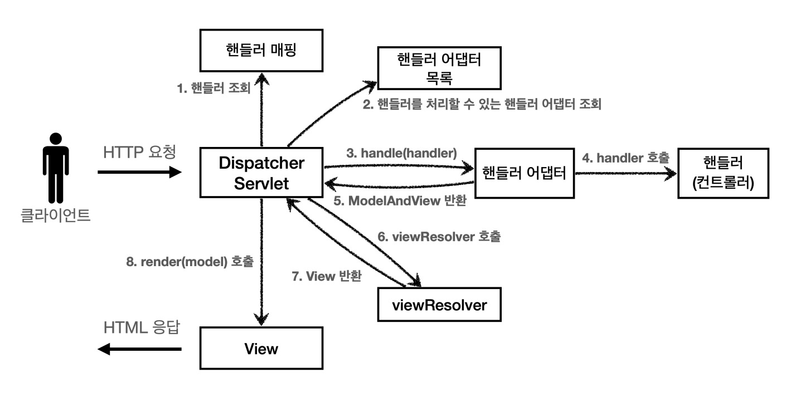

# 학습내용
이전 섹션했던 mvc 프레임워크를 기반으로 실제 스프링 MVC가 어떻게 구현되어있는지, 어떤 방식으로 사용하는지에 대해 학습한다.
# 스프링 MVC 전체 구조
## 우리가 구현 한 구조

## 스프링 MVC 구조

- FrontController -> DispatcherServlet
- handlerMappingMap -> HandlerMapping
- MyHandlerAdapter -> HandlerAdapter
- ModelView -> ModelAndView
- viewResolver -> ViewResolver
- MyView -> View
## DispatchServlet
### 특징
- 프론트 컨트롤러 패턴으로 구현되어 있다
- 스프링 mvc의 핵심
- HttpServlet의 자식, 서블릿으로 동작한다.
  - `urlPatterns="/"`에 매핑되어 있다. (더 자세한 경로의 우선순위가 더 높기때문에 기존에 등록한 서블릿도 함께 동작한다)
### 요청 흐름
- 서블릿 호출 시 service() 호출
- 스프링 MVC는 DispatcherServlet 의 부모인 FrameworkServlet 에서 service() 를 오버라이드 해두었다.
- FrameworkServlet.service() 를 시작으로 여러 메서드가 호출되면서 DispatcherServlet.doDispatch() 가 호출된다
- doDispatch의 로직은 다음과 같다
```java
protected void doDispatch(HttpServletRequest request, HttpServletResponse
response) throws Exception {
HttpServletRequest processedRequest = request;
HandlerExecutionChain mappedHandler = null;
ModelAndView mv = null;
// 1. 핸들러 조회
mappedHandler = getHandler(processedRequest);
if (mappedHandler == null) {
noHandlerFound(processedRequest, response);
return;
}
// 2. 핸들러 어댑터 조회 - 핸들러를 처리할 수 있는 어댑터
HandlerAdapter ha = getHandlerAdapter(mappedHandler.getHandler());
// 3. 핸들러 어댑터 실행 -> 4. 핸들러 어댑터를 통해 핸들러 실행 -> 5. ModelAndView 반환
mv = ha.handle(processedRequest, response, mappedHandler.getHandler());
processDispatchResult(processedRequest, response, mappedHandler, mv,
dispatchException);
}
private void processDispatchResult(HttpServletRequest request,
HttpServletResponse response, HandlerExecutionChain mappedHandler, ModelAndView
mv, Exception exception) throws Exception {
// 뷰 렌더링 호출
render(mv, request, response);
}
protected void render(ModelAndView mv, HttpServletRequest request,
HttpServletResponse response) throws Exception {
View view;
String viewName = mv.getViewName();
// 6. 뷰 리졸버를 통해서 뷰 찾기, 7. View 반환
view = resolveViewName(viewName, mv.getModelInternal(), locale, request);
// 8. 뷰 렌더링
view.render(mv.getModelInternal(), request, response);
}
```
## 동작 순서
1. 핸들러 조회: 핸들러 매핑을 통해 요청 URL에 매핑된 핸들러(컨트롤러)를 조회한다.
2. 핸들러 어댑터 조회: 핸들러를 실행할 수 있는 핸들러 어댑터를 조회한다.
3. 핸들러 어댑터 실행: 핸들러 어댑터를 실행한다.
4. 핸들러 실행: 핸들러 어댑터가 실제 핸들러를 실행한다.
5. ModelAndView 반환: 핸들러 어댑터는 핸들러가 반환하는 정보를 ModelAndView로 변환해서 반환한다.
6. viewResolver 호출: 뷰 리졸버를 찾고 실행한다.
7. View 반환: 뷰 리졸버는 뷰의 논리 이름을 물리 이름으로 바꾸고, 렌더링 역할을 담당하는 뷰 객체를 반환한다.
8. 뷰 렌더링: 뷰를 통해서 뷰를 렌더링 한다.
## 핸들러 매핑과 핸들러 어댑터
### 스프링 부트가 자동 등록하는 핸들러 매핑과 핸들러 어댑터
1. 핸들러 매핑으로 핸들러 조회
2. 핸들러 어댑터 조회
3. 핸들러 실행

**HandlerMapping**
```
0 = RequestMappingHandlerMapping : 애노테이션 기반의 컨트롤러인 @RequestMapping에서 사용
1 = BeanNameUrlHandlerMapping : 스프링 빈의 이름으로 핸들러를 찾는다.
```
**HandlerAdapter**
```
0 = RequestMappingHandlerAdapter : 애노테이션 기반의 컨트롤러인 @RequestMapping에서 사용
1 = HttpRequestHandlerAdapter : HttpRequestHandler 처리
2 = SimpleControllerHandlerAdapter : Controller 인터페이스(애노테이션X, 과거에 사용) 처리
```

## 뷰 리졸버
```
1 = BeanNameViewResolver : 빈 이름으로 뷰를 찾아서 반환한다. (예: 엑셀 파일 생성 기능
에 사용)
2 = InternalResourceViewResolver : JSP를 처리할 수 있는 뷰를 반환한다.
```
1. 핸들러 어댑터 호출
    - 핸들러 어댑터를 통해 new-form 이라는 논리 뷰 이름을 획득한다.
2. ViewResolver 호출
    - new-form 이라는 뷰 이름으로 viewResolver를 순서대로 호출한다.
    - BeanNameViewResolver 는 new-form 이라는 이름의 스프링 빈으로 등록된 뷰를 찾아야 하는데 없다.
    - InternalResourceViewResolver 가 호출된다.
3. InternalResourceViewResolver
    - 이 뷰 리졸버는 InternalResourceView 를 반환한다.
4. 뷰 - InternalResourceView
    - InternalResourceView 는 JSP처럼 포워드 forward() 를 호출해서 처리할 수 있는 경우에 사용한다.
5. view.render()
    - view.render() 가 호출되고 InternalResourceView 는 forward() 를 사용해서 JSP를 실행한다

```
다른 뷰는 실제 뷰를 렌더링하지만, JSP의 경우 forward() 통해서 해당 JSP로 이동(실행)해야 렌더링이 된다.
JSP를 제외한 나머지 뷰 템플릿들은 forward() 과정 없이 바로 렌더링 된다.
```
# 스프링 MVC
## 시작
```java
@Component("/springmvc/old-controller") //springbean 이름 url에 맞춘다.
public class OldController  implements Controller {
    @Override
    public ModelAndView handleRequest(HttpServletRequest request, HttpServletResponse response) throws Exception {
        System.out.println("OldController.handleRequest");
        return new ModelAndView("new-form");
    }
}
```
```java
@org.springframework.stereotype.Controller
@Component("/springmvc/old-controller") //springbean 이름 url에 맞춘다.
public class OldController  implements Controller {
    @Override
    public ModelAndView handleRequest(HttpServletRequest request, HttpServletResponse response) throws Exception {
        System.out.println("OldController.handleRequest");
        return new ModelAndView("new-form");
    }
}
```
## v1: 
```java
@Controller
public class SpringMemberFormControllerV1 {
    @RequestMapping("springmvc/v1/members/new-form")
    public ModelAndView process(){
        return new ModelAndView("new-form");
    }
}
```
## v2: 컨트롤러 통합
```java
@Controller
@RequestMapping("springmvc/v2/members")
public class SpringMemberControllerV2 {
    MemberRepository memberRepository = MemberRepository.getInstance();

    @RequestMapping("new-form")
    public ModelAndView newForm(){
        return new ModelAndView("new-form");
    }

    @RequestMapping("save")
    public ModelAndView save(HttpServletRequest request, HttpServletResponse response) {
        ...
        return mv;
    }

    @RequestMapping
    public ModelAndView list(Map<String, String> paramMap) {
        List<Member> members = memberRepository.findAll();
        ModelAndView mv = new ModelAndView("members");
        mv.addObject("members", members);
        return mv;
    }
}
```
## v3:실용적인 방식
```java
@Controller
@RequestMapping("springmvc/v3/members")
public class SpringMemberControllerV3 {
    MemberRepository memberRepository = MemberRepository.getInstance();

    @RequestMapping(value = "/new-form", method= RequestMethod.GET)
    public String newForm(){
        return "new-form";
    }

    @PostMapping("/save")
    public String save(@RequestParam("username") String username, @RequestParam("age") int age, Model model) {
        ...
        return "save-result";
    }

    @GetMapping
    public String list(Model model) {
        ...
        return "members";
    }
}
```