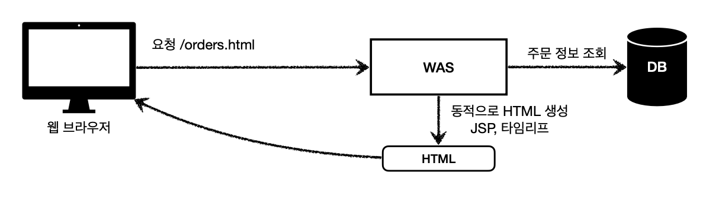

### 학습 내용: 웹 어플리케이션의 이해
- 웹 시스템 구성
- Servlet: 내부 로직 구현
- Thread: 동시 요청 처리
- 정적 페이지, html page, http api: 전송 데이터
- csr, ssr: 렌더링 방식
- 백엔드 기술 역사
# Web Server
HTML, CSS, JS 등 정적 파일 전송해주는 서버
- HTTP 기반 동작
- 예) NGINX, APACHE
  
# WAS
프로그램 실행해 어플리케이션 로직 수행 하는 서버
웹 서버의 기능도 한다.
- Web Application Server의 약자
- HTTP로 기반
- 예) Tomcat Jetty, Undertow...

- 언어마자 정의가 조금 씩 다르다.
	- JAVA: Servlet 사용하는가?
		- 예) Servlet, JSP, 스프링 MVC 등
		- 근데 Servlet 사용하지 않는 WAS 도 있음...

## 단점
- 하는 일이 많다
	- 과부화 우려
	- 다른 일 처리하다가 핵심인 비즈니스 로직 처리 못하는 경우 발생
- 장애 시, 오류 페이지 노출 불가

# Web Servser VS WAS
차이점. 애매하다.
- Web Server: 어플리케이션 실행 가능 (ex. CGI)
- WAS: 정적 리소스 제공
- 자바는 서블릿 컨테이너 기능 제공 시 WAS 로 판단하지만, 그렇지 않은 서버 프레임워크 존재

## 판단 기준
**정적 리소스 제공**(Web Server)과 **어플리케이션 로직 제공**(WAS) 중 어떤 것이 더 중요시 되는가?

# 웹 시스템 구성
## Web, WAS, DB

- 정적 리소스는 Web Server가 처리
- 애플리케이션 로직만 WAS가 처리
### 장점
1. WAS는 어플리케이션 로직 처리에만 집중 가능
2. WAS 장애 발생 시, Web Server가 에러 페이지 전달 가능
3. 서버의 특성에 맞춘 효율적인 리소스 관리 가능
	- 정적 리소스 많으면 Web, 동적 리소스 많으면 WAS 증설


## WAS, DB
CDN을 사용하거나 API 서버를 운영한다면 Web Server 없어도 된다.

## CDN
**캐시 서버를 분산 배치**하여 전 세계 사용자가 지리적 제약 없이 빠르고 안전하게 컨텐츠를 전달 받을 수 있도록 하는 컨텐츠 전송 기술
- Content Delivery Network의 약자
- 특정 국가나 지역 타깃인 경우 사용하지 x 
	- 불필요한 연결지점으로 성능 저하 가능
- 예) Netflix의 자체 CDN

---
---
# Servlet
A **servlet** is a Java programming language class that is used to extend the capabilities of servers that host applications accessed by means of a request-response programming model. [link](https://docs.oracle.com/javaee/5/tutorial/doc/bnafe.html)
# WAS의 등장
## WAS의 등장

Servlet을 지원하는 WAS의 등장으로 공통 로직을 작성하지 않아도 됨
-> 의미 있는 비즈니스 로직만 작성 가능(Servlet)
## 특징
```java
@WebServlet(name = "helloServlet", urlPatterns = "/hello")
public class HelloServlet extends HttpServlet {
	@Override
	protected void service(HttpServletRequest request, HttpServletResponse response){
		//애플리케이션 로직
	}
}
```
- `urlPatterns`의 url 호출 시 서블릿 코드 실행(`service()`)
- `HttpServletRequest`의 사용으로 HTTP 요청 정보를 쉽게 확인할 수 있다
- `HttpServletResponse`의 사용으로 HTTP 응답 정보를 쉽게 제공할 수 있다
=> 개발자가 HTTP 스펙 쉽게 사용 가능

## HTTP 요청, 응답 흐름

1. HTTP 요청 들어온다
2. WAS가 Request, Response 객체 생성 후 서블릿 객체 호출
3. Servlet에서 Request 정보 사용하고 Response에 정보 입력한다.
4. WAS가 Response 객체를 기반으로 응답 메시지 만들어 전송한다.

# Servlet Container
Servlet 지원하는 WAS이다.

## 기능
- 서블릿 객체의 생명주기(생성, 초기화, 호출, 종료) 관리
- 동시 요청을 위한 멀티 쓰레드 처리 지원
## 특징
- Servlet객체를 싱글톤으로 관리
	- 최초 로딩 시점에 미리 생성 후 재활용
	- 공유 변수 사용 주의
- JSP도 서블릿으로 변환되어 사용

---
---
# Thread
A thread of execution is the smallest sequence of programmed instructions that can be managed independently by a scheduler, which is typically a part of the operating system. [wiki](https://en.wikipedia.org/wiki/Thread_(computing))
 App 코드 순차적으로 실행
- 자바 실행 => main 이름을 가진 쓰레드 실행
- 한 번에 하나의 코드 라인만 수행
- 동시 처리 필요 시, 쓰레드 추가 생성(Multithreaded)

# Multithreading

## 장단점
### 장점
- 동시 요청 처리 가능
- 리소스(CPU, 메모리)가 허용될 때까지 처리 가능
- 하나의 스레드가 지연되어도 나머지 쓰레드는 정상 동작한다
### 단점
- 쓰레드 생성 비용이 매우 비싸다
	- 고객 요청 시마다 쓰레드 생성 시 응답 속도 느려진다
- Context Switching 비용이 발생한다.
- 쓰레드 생성에 제한이 없다.
	- 고객 요청이 너무 많이 오면, CPU, 메모리 임계점을 넘어 서버가 죽을 수 있다

# Thread Pool

- 필요한 쓰레드를 쓰레드 풀에 보관 및 관리 
- 쓰레드 풀에 생성 가능한 쓰레드의 최대치 관리
	- 톰캣 기본설정: 200개
##  원리
- 쓰레드 필요 시, 이미 생성되어 있는 쓰레드를 꺼내서 사용
- 사용 종료 시, 해당 쓰레드 반납
- 쓰레프 풀에 쓰레드가 없다면, 거절하거나 특정 숫자만큼 대기하도록 설정 가능
## 장점
- 미리 생성되어 있으므로, 생성 및 종료 비용이 절약 => 빠르다
- 생성 가능 최대치 존재 => 너무 많은 요청이 들어와도 안전하게 처리 가능

# WAS의 동시 요청 처리
WAS가 멀티 쓰레드 처리하므로 개발자는 관련 코드 신경쓰지 않아도 된다
	- 싱글 쓰레드 프로그래밍 하듯 편리하게 개발
- 단, 싱글톤 객체는 주의해서 사용할 것
## 최대 쓰레드 수
WAS의 주요 튜닝 포인트는 `최대 쓰레드(max Thread) 수` 이다.
- 너무 낮게 설정
	- 동시 요청이 많으면, 리소스는 여유롭지만 클라이언트 응답 지연 발생
	- cpu 50%는 되어야 한다.
- 너무 높게 설정
	- 동시 요청이 많으면 CPU, 메모리 리소스 임계점 초과로 서버 다운 가능
- 장애 발생 시
	- 클라우드 o: 서버 늘리고 이후 튜닝
	- 클라우드 x: 평소에 열심히 튜닝...
- 적정 쓰레드 수 측정?
	- 어플리케이션 로직의 복잡도, CPU, 메모리, IO 리소스 상황에 따라 모두 다르다.
	- 테스트 해보는 방법밖에 없다.
		- Ex) Apache ab, 제이미터, nGrinder(naver)
---
---
# 서버 전송 데이터
## 정적 리소스
고정된 HTML, CSS, JS, 이미지, 영상 등을 제공
- 주로 웹브라우저가 요청
	
## HTML 페이지
동적으로 필요한 HTML 파일을 생성해 전달
- 웹 브라우저: HTML 해석
	
## HTTP API
HTML이 아닌 데이터를 전달
- 주로 JSON 형식 사용
- 웹 클라이언트, 앱 클라이언트 서버 등 다양한 시스템에서 호출
	- 웹 클라이언트(React, Vue.js): 자바스크립트로 호출
	

# 웹 렌더링 방식
## SSR
Server Side Rendering
- 서버에서 최종 HTML을 생성해 클라이언트에 전달
- 주로 정적인 화면에서 사용
- ex) JSP, Thymeleaf 등 => Backend
	
- SSR 사용 시에도, 자바 스크립트를 사용해 일부 화면 동적 수정 가능
## CSR
Client Side Rendering

HTML 결과를 자바스크립트를 이용해 웹 브라우저에서 동적으로 생성해 적용
- 주로 동적인 화면에 사용, 웹에서 필요한 부분 변경 가능
	- ex) 구글 지도, gmail
- ex) React, Vue.js => Frontend

## SSR + CSR
ssr + csr의 장점을 취한 프레임워크 등장

---
---
# 자바 웹 기술 역사
## 웹 기술 역사
### 과거 기술
- Servlet
	- html 생성 어려움
- JSP
	- html 생성 편리하지만, 너무 많은 역할(비즈니스 로직 + 뷰) 담당
- Servlet + JSP + MVC 패턴
- MVC 프레임워크 춘추 전국 시대
	- 많은 프레임워크 등장
### 현재 기술
- 어노테이션 기반 스프링 mvc 등장
- 스프링 부트 등장
### 최신 기술
스프링 웹 기술의 분화
- Web Servlet - Spring MVC
- Web Reactive - Spring WebFlux
#### Spring WebFlux
특징
- 비동기 논 블로킹 처리
- Cpu core 수 ( + 1) == 쓰레드 수 => Thread Context Switching 비용 최소화
- 함수형 스타일로 개발 -> 동시 처리 코드 효율
- 서블릿 기술 사용 X
한계점
- 러닝 커브 크다
- RDB 지원 부족
- MVC도 충분히 빠름
=> 실무에서 많이 사용하지 않음
## 뷰템플릿 역사
- JSP
	- 속도 느림, 기능 부족
- Freemarker, Velocity
	- 속도 문제 해결, 다양한 기능 제공
- Thymeleaf
	- 네추럴 템플릿: HTML 모양 유지 & 뷰 템플릿 적용 간으
	- 스프링 mvc와 강력한 기능 통합
	- 최선의 선택, 단 성능은 Freemarker, Velocity가 더 우수함