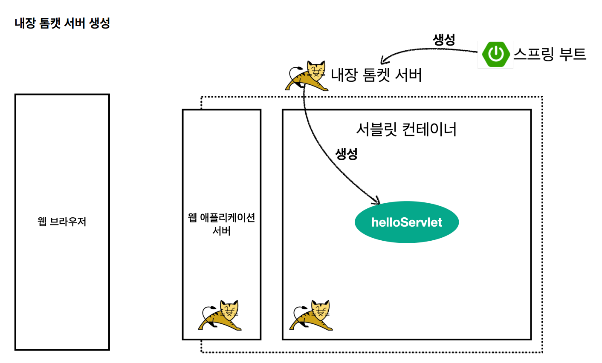
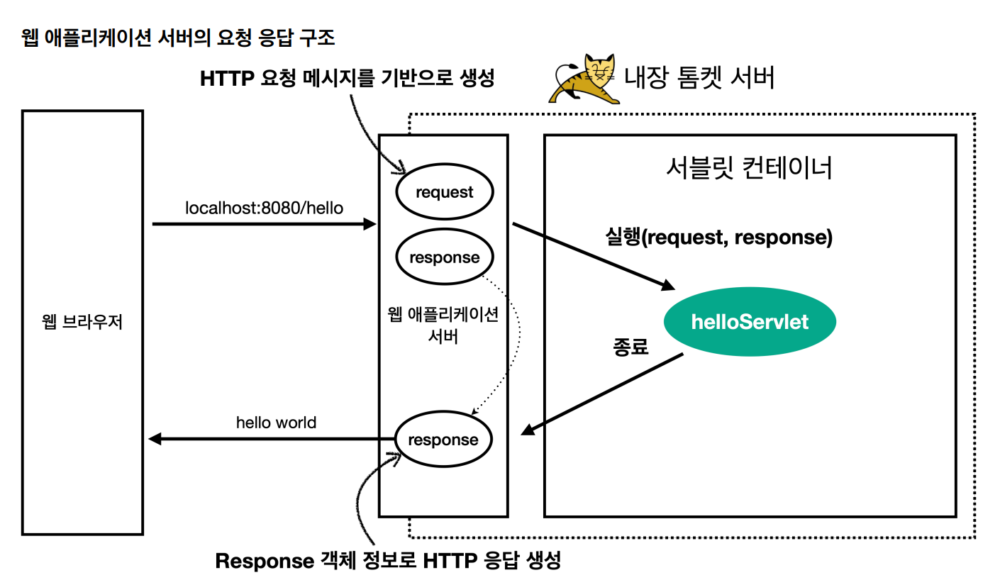

# 학습내용
Servlet을 이용해 어떻게 요청/응답 처리하는가
# Servlet 사용을 위한 설정
## 프로젝트 생성
- 패키징: `.war`
- Dependency: `spring web`, `lombok`

# Hello Servlet
## 스프링부트 서블릿 환경 구성
원래는 WAS 서버 위에 servlet 코드를 빌드해서 올린 다음 WAS(톰캣)을 실행해야 하지만, 스프링부트에서 서블릿 등록 사용을 지원한다.
```java
@ServletComponentScan //서블릿 자동 등록
@SpringBootApplication
public class ServletApplication {
	public static void main(String[] args) {
		SpringApplication.run(ServletApplication.class, args);
	}
}
```
## Servlet 등록
```java
@WebServlet(name="servletname", urlPatterns="/hello")
public class HelloServlet extends HttpServlet {
	@Override
	protected void service(HttpServletRequest request, HttpServletResponse response) throws ServletException, IOException {
	 System.out.println("request = " + request);
	 System.out.println("response = " + response);
 }
}
```

## HTTP 요청/응답 메시지 처리

응답에서 Content-Length는 WAS가 자동으로 생성해준다.
## HTTP 요청 메시지 로깅
`src/java/resources/application.properties`
```
logging.level.org.apache.coyote.http11=trace
```
운영서버에 모든 요청정보 남길 시 성능저하 발생 가능
# HttpServletRequest 기본 사용법
`http://localhost:8080/request-header?q1=test&q2=age`에 `GET`으로 접근 시
```java
//Start Line 관련 메소드
request.getMethod(); //GET
request.getProtocol(); // HTTP/1.1
request.getScheme(); // http
request.getRequestURL(); // http://localhost:8080/request-header
request.getRequestURI(); // /request-header
request.getQueryString(); //q1=test&q2=age
request.isSecure(); //false

//Header 관련 메소드
request.getHeader("headerName"); //headerName의 값
request.getHeaders("headerName"); //headerName의 모든 값
request.getHeaderNames(); //모든 header의 name을 얻을 수 있다.

////모든 헤더 얻기
request.getHeaderNames().asIterator()
	.forEachRemaining(headerName->request.getHeader(headerName));

////헤더 편의 조회
request.getServerName(); //localhost
request.getServerPort(); //8080

//모든 accept-Language 편의 조회
request.getLocale(); //ko_KR
request.getLocales().asIterator()
	.forEachRemaining(locale -> System.out.println(locale));//ko_KR ko en_US en

//쿠키 편의 조회
if (request.getCookies() != null) {
	for (Cookie cookie : request.getCookies()) {
		System.out.println(cookie.getName() + ": " + cookie.getValue());
	}
}

//content 편의 조회
request.getContentType(); //null <- GET 이라 그렇다.
request.getContentLength() //-1
request.getCharacterEncoding(); //UTF-8

// 기타 조회
request.getRemoteHost(); //0:0:0:0:0:0:0:1
request.getRemoteAddr(); //0:0:0:0:0:0:0:1
request.getRemotePort();//61819

request.getLocalName(); //localhost
request.getLocalAddr(); //0:0:0:0:0:0:0:1
request.getLocalPort(); //8080
```
# Http 요청 데이터
## GET + 쿼리

URL의 쿼리 파라미터:  `?키=값&키=값` 

```java
String paramValue = request.getParameter("paramName");
String[] paramValues = request.getParameterValues("paramName");

Enumeration<String> paramNames = request.getParameterNames();
Map<Stirng, String[]> paramMap = request.geParameterMap();
```

키 값이 중복된다면, `request.getParameter()`에서 첫 번째 값만 리턴한다. 모든 값을 얻기 위해선 `request.getParameterValues()` 를 사용해야 한다. 

## POST + HTML Form
- MIME: `application/x-www-form-urlencoded`
- 메시지 바디에 쿼리 파라미터 형식으로 데이터 전달한다. `키=값&키=값`
⇒ 쿼리 파라미터 조회 메서드 그대로 사용한다

## BODY + Text, JSON
### Text
InputStream으로 읽을 수 있다.
  -> byte타입으로 읽으므로 string타입으로 변환 필수!
```java
ServletInputStream inputStream = request.getInputStream();
String messageBody = StreamUtils.copyToString(inputStream, StandardCharsets.UTF_8);
```

### JSON
- 파싱할 수 있는 객체 필요
- JSON을 파싱해 자바 객체로 변환하는 JSON 변환라이브러리 추가 해 사용해야 한다
  - Spring MVC: Jackson 라이브러리(ObjectMapper) 기본 제공
```java
//필드
private ObjectMapper objectMapper = new ObjectMapper();

@Override
protected void service(HttpServletRequest request, HttpServletResponseresponse) throws ServletException, IOException {
  ServletInputStream inputStream = request.getInputStream();
  String messageBody = StreamUtils.copyToString(inputStream, StandardCharsets.UTF_8);
  System.out.println("messageBody = " + messageBody);
  
  HelloData helloData = objectMapper.readValue(messageBody,HelloData.class);
  System.out.println("helloData.username = " + helloData.getUsername());
  System.out.println("helloData.age = " + helloData.getAge());
  response.getWriter().write("ok");
}
```

# HTTPServletResponse 기본 사용법
```java
//[status-line]
response.setStatus(HttpServletResponse.SC_OK); //200
//[response-headers]
response.setHeader("Content-Type", "text/plain;charset=utf-8");
response.setHeader("Cache-Control", "no-cache, no-store, mustrevalidate");
response.setHeader("Pragma", "no-cache");
response.setHeader("my-header","hello");

//[message body]
PrintWriter writer = response.getWriter();
writer.println("ok");

//[content]
response.setContentType("text/plain");
response.setCharacterEncoding("utf-8");
//response.setContentLength(2); //(생략시 자동 생성)

//[cookie]
Cookie cookie = new Cookie("myCookie", "good");
cookie.setMaxAge(600); //600초
response.addCookie(cookie);

//[redirect]
response.sendRedirect("/basic/hello-form.html");
```

# HTTP 응답 데이터
## 단순 텍스트
`request.getWriter().println("ok");`

### HTML
```java
response.setContentType("text/html");
response.setCharacterEncoding("utf-8");

PrintWriter writer = response.getWriter();
writer.println("<html>");
writer.println("<body>");
writer.println(" <div>안녕?</div>");
writer.println("</body>");
writer.println("</html>");
```

## API JSON
```java
@WebServlet(name = "responseJsonServlet", urlPatterns = "/response-json")
public class ResponseJsonServlet extends HttpServlet {
  private ObjectMapper objectMapper = new ObjectMapper();
  @Override
  protected void service(HttpServletRequest request, HttpServletResponse response) throws ServletException, IOException {
    response.setHeader("content-type", "application/json");
    response.setCharacterEncoding("utf-8");

    HelloData data = new HelloData();
    data.setUsername("kim");
    data.setAge(20);

    //{"username":"kim","age":20}
    String result = objectMapper.writeValueAsString(data);
    response.getWriter().write(result);
  }
}
```
`application/json`은 스펙 상 utf-8 형식 사용하도록 정의하므로 characerEncoding을 따로 지정하지 않아야 한다. response.getWrite()는 `charset`을 자동으로 추가하므로, response.getOutputStream()를 사용해야 한다.