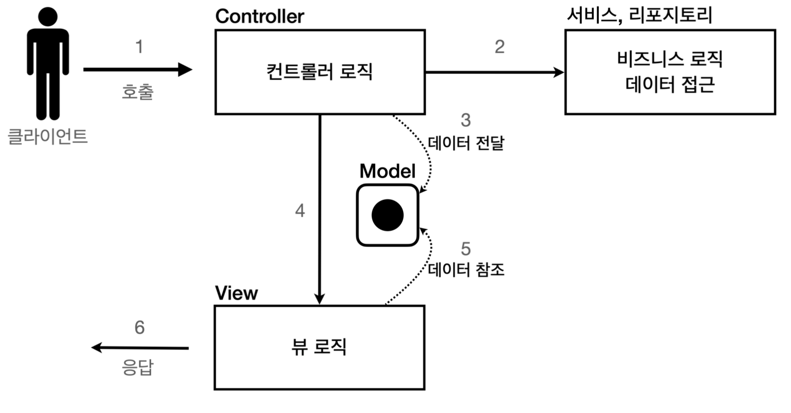

# 섹션 3. 서블릿, JSP, MVC 패턴

이제 전에 배웠던 서블릿 개념을 바탕으로 간단한 웹 애플리케이션을 구현해보는 과정을 진행해본다.

진행을 해보면서 서블릿이 어떤점이 불편한지, jsp는 어떤점이 불편한지를 단계적으로 직접 체험해보는 과정

## 웹 애플리케이션 기본전제

**회원 관리 웹 애플리케이션 요구사항**

- **회원 정보**
    - 이름: `username`
    - 나이: `age`
- **기능 요구사항**
    - 회원 저장
    - 회원 목록 조회
    

## 서블릿

```java
...
    protected void service(HttpServletRequest request, HttpServletResponse response) throws ServletException, IOException {

        List<Member> members = memberRepository.findAll();

        response.setContentType("text/html");
        response.setCharacterEncoding("utf-8");

        PrintWriter w = response.getWriter();
        w.write("<html>");
        w.write("<head>");
        w.write("    <meta charset=\"UTF-8\">");
        w.write("    <title>Title</title>");
        w.write("</head>");
        w.write("<body>");
        w.write("<a href=\"/index.html\">메인</a>");
        w.write("<table>");
        w.write("    <thead>");
        w.write("    <th>id</th>");
        w.write("    <th>username</th>");
        w.write("    <th>age</th>");
        w.write("    </thead>");
        w.write("    <tbody>");

        for (Member member : members) {
            w.write("    <tr>");
            w.write("        <td>"+member.getId()+"</td>");
            w.write("        <td>"+member.getUsername()+"</td>");
            w.write("        <td>"+member.getAge()+"</td>");
            w.write("    </tr>");
        }

        w.write("    </tbody>");
        w.write("</table>");
        w.write("</body>");
        w.write("</html>");
    }
...
```

위와 같이 서블릿을 사용하면 기존 java에서는 불가능했던 동적인 html을 만드는것이 가능하게 해준다는 장점이 존재한다.

### 문제점

하지만 위에 코드에서 알 수 있다시피 서블릿을 사용해서 html을 작성하는 것 자체가 굉장히 복잡하고 비효율적임을 확인할 수 있다.

그래서 해당 개념에서 자바코드로 html을 만들어 내는것보다 차라리 html문서에서 동적으로 변경해야하는 부분만 자바코드를 넣는 방법이 나오게 되는데 그것에 템플릿 엔진이 나온 이유가 된다.

템플릿 엔진을 사용하면 직접 자바코드로 통해 html을 작성하는것이 아니라 html문서에서 필요한 부분만 자바코드를 적용해서 동작으로 데이터를 변경할 수 있다.

템플릿 엔진에는 JSP, Thymeleaf, Freemarker, Velocity등이 있다.

## JSP

```java
<%@ page import="hello.servlet.domain.member.Member" %>
<%@ page import="hello.servlet.domain.member.MemberRepository" %>
<%@ page contentType="text/html;charset=UTF-8" language="java" %>
<%
    // request, response 사용 가능
    MemberRepository memberRepository = MemberRepository.getInstance();

    System.out.println("MemberSaveServlet.service");
    String username = request.getParameter("username");
    int age = Integer.parseInt(request.getParameter("age"));

    Member member = new Member(username, age);
    memberRepository.save(member);
%>
<html>
<head>
    <title>Title</title>
</head>
<body>
성공
<ul>
    <li>id=<%=member.getId()%></li>
    <li>username=<%=member.getUsername()%></li>
    <li>age=<%=member.getAge()%></li>
</ul>
<a href="/index.html">메인</a>
</body>
</html>

```

jsp에 동작코드에 대한 간단한 예제는 위와 같다.

JSP는 자바 코드를 그대로 다 사용할 수 있다.

- `<%@ page contentType="text/html;charset=UTF-8" language="java" %>`
JSP를 사용하기위해서는 필수적으로 포함되어야하는 부분이다.
- `<%@ page import="hello.servlet.domain.member.MemberRepository" %>`
자바의 import 문과 같다.
- `<% ~~ %>`
이 부분에는 자바 코드를 입력할 수 있다.
- `<%= ~~ %>`
이 부분에는 자바 코드를 출력할 수 있다.

### 문제점

위에서 사용했던 서블릿에 비해서는 확실히 코드가 깔끔하게 html에 java코드를 넣는것이 가능하게 바뀌었다.
하지만 그래도 코드를 보면 하나의 jsp파일에서 java코드, 데이터를 조회하는 리포지토리 등등 너무 많은 역할을 하는 것을 볼 수 있다. 
이러면 나중에 코드를 유지보수하기에도 힘들고 코드를 알아보기에 힘든 문제점이 존재한다.

**MVC패턴**

그래서 나온것이 mvc패턴이라고 하며 jsp는 목적에 맞게 html로 화면(View)를 그리는 일에만 집중하고,
다른 java코드, 데이터를 조회하는 리포지토리 등등 역할에 맞게 서로 분리하는 코드방식을 지향하고 이야기한다.

### MVC **패턴**

**기능 분리**

하나의 서블릿이나 jsp만으로 비즈니스 로직과 뷰 렌더링을 모두 처리하면 하나가 너무 많은 역할을 하게되고,
그리고인해 유지보수가 어려워진다.

**기능 특화**
그래서 jsp같이 뷰 템플릿은 화면을 렌더링 하는데 최적화가 되어있다.
그래서 각자 각각의 역할에 맞게 기능을 분리하는것이 좋다.

**변경의 라이프 사이클**

둘 사이에 변경의 라이프 사이클이 다르다는 점이다. 예를 들어서 UI를 일부 수정 하는 일과 비즈니스 로직을 수정하는 일은 각각 다르게 발생할 가능성이 매우 높고 대부분 서로에게 영향을 주지 않는 다. 이렇게 변경의 라이프 사이클이 다른 부분을 하나의 코드로 관리하는 것은 유지보수하기 좋지 않다. (물론 UI가 많 이 변하면 함께 변경될 가능성도 있다.)

### MVC



**컨트롤러**: 
HTTP 요청을 받아서 파라미터를 검증하고, 비즈니스 로직을 실행한다. 그리고 뷰에 전달할 결과 데이터를 조회해서 모델에 담는다.
**모델**:
뷰에 출력할 데이터를 담아둔다. 뷰가 필요한 데이터를 모두 모델에 담아서 전달해주는 덕분에 뷰는 비즈니스 로직이나 데이터 접근을 몰라도 되고, 화면을 렌더링 하는 일에 집중할 수 있다.

**뷰**: 
모델에 담겨있는 데이터를 사용해서 화면을 그리는 일에 집중한다. 여기서는 HTML을 생성하는 부분을 말한다.

```java
@WebServlet(name = "mvcMemberFormServlet", urlPatterns = "/servlet-mvc/members/new-form")
public class MvcMemberFormServlet extends HttpServlet {
    @Override
    protected void service(HttpServletRequest request, HttpServletResponse response) throws ServletException, IOException {
        String viewPath = "/WEB-INF/views/new-form.jsp";
        RequestDispatcher dispatcher = request.getRequestDispatcher(viewPath);
        dispatcher.forward(request, response);
    }
}
```

- `dispatcher.forward()` 
다른 서블릿이나 JSP로 이동할 수 있는 기능이다. 서버 내부에서 다시 호출이 발생한다.

**redirect vs forward**

리다이렉트는 실제 클라이언트(웹 브라우저)에 응답이 나갔다가, 클라이언트가 redirect 경로로 다시 요청한다.
따라서 클라이언트가 인지할 수 있고, URL 경로도 실제로 변경된다. 반면에 포워드는 서버 내부에서 일어나는 호
출이기 때문에 클라이언트가 전혀 인지하지 못한다.

`/WEB-INF`

이 경로안에 JSP가 있으면 외부에서 직접 JSP를 호출할 수 없다. 
우리가 기대하는 것은 항상 컨트롤러를 통해서 JSP를 호출하는 것이다.

```java
@Override
protected void service(HttpServletRequest request, HttpServletResponse response) throws ServletException, IOException {
    String username = request.getParameter("username");
    int age = Integer.parseInt(request.getParameter("age"));

    Member member = new Member(username, age);
    memberRepository.save(member);

    // Model에 데이터를 보관
    request.setAttribute("member", member);

    String viewPath = "/WEB-INF/views/save-result.jsp";
    RequestDispatcher dispatcher = request.getRequestDispatcher(viewPath);
    dispatcher.forward(request, response);
}
```

```java
...
<ul>
  <li>id=${member.id}</li>
  <li>username=${member.username}</li>
  <li>age=${member.age}</li>
</ul>
...
```

위쪽에 `service`로직에서 `request.setAttribute("member", member);` 을 통해 model에 member라는 이름의 값일 저장해서 담았으니 html에서는 그냥 member class를 사용하여 값을 가져올 수 있다.

### 문제점

```java
RequestDispatcher dispatcher = request.getRequestDispatcher(viewPath);
dispatcher.forward(request, response);
```

기존에 예제를 통해서 작성했던 위와 같이 항상 중복으로 실행을 해야했던 코드들이 나오게 된다.
이러한 부분들을 공통으로 처리해야하는 부분이 점점 많이 증가하기때문에 코드가 늘어날 수록 문제점으로 잡히게 된다.
그래서 나온 개념이 **프론트 컨트롤러(Front Controller) 패턴** 이라는 개념이 나와서 어떠한 문제를 해결할려면 컨트롤러를 호출하기 프론트 컨트롤러라는 곳을 꼭 거쳐야만 로직이 돌아갈 수 있도록 설계하는 것이
스프링 MVC의 핵심이라고한다.