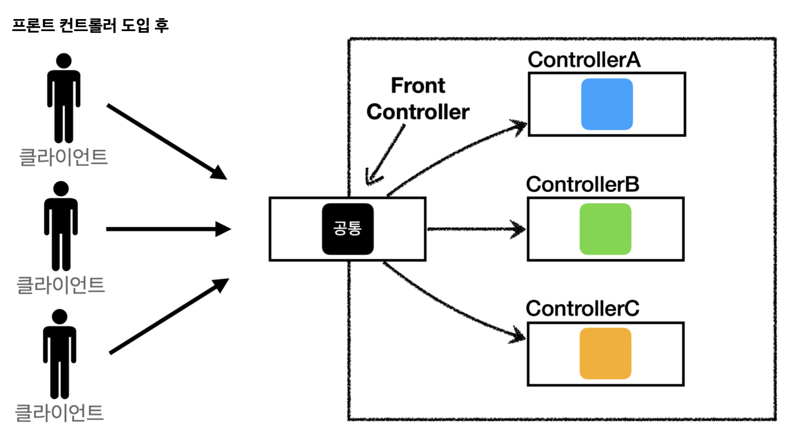
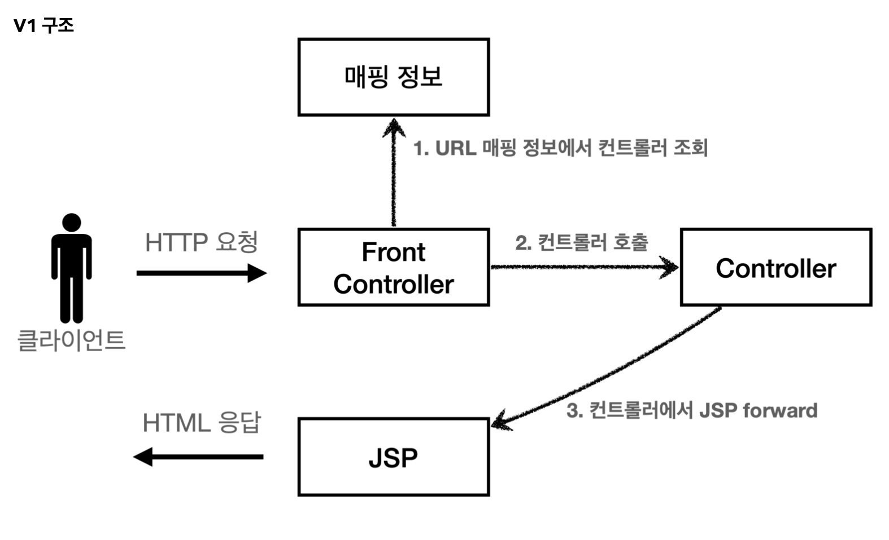
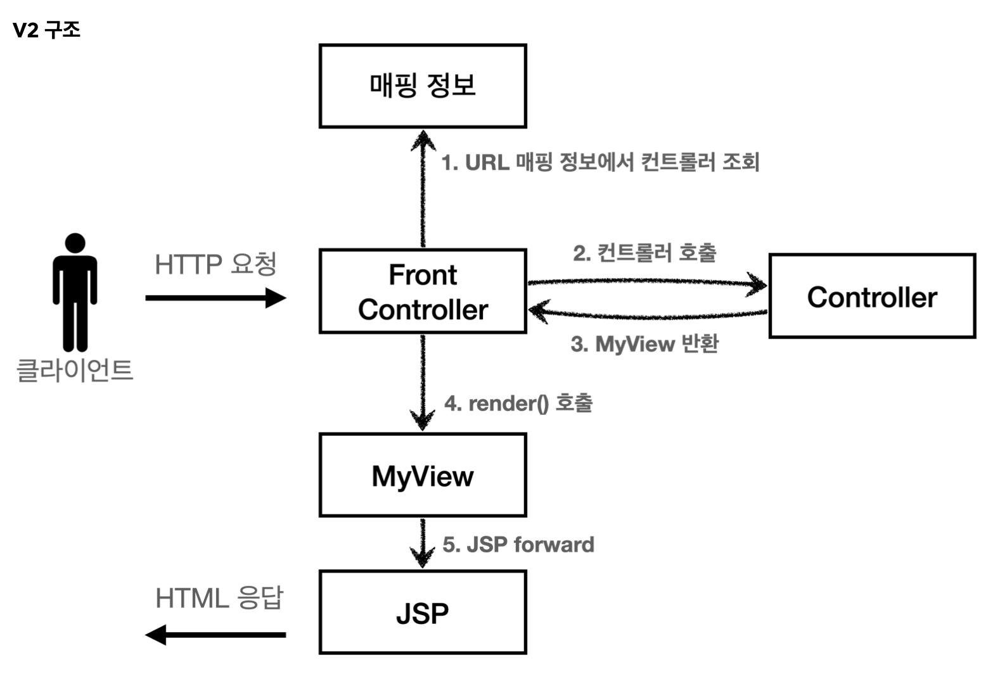
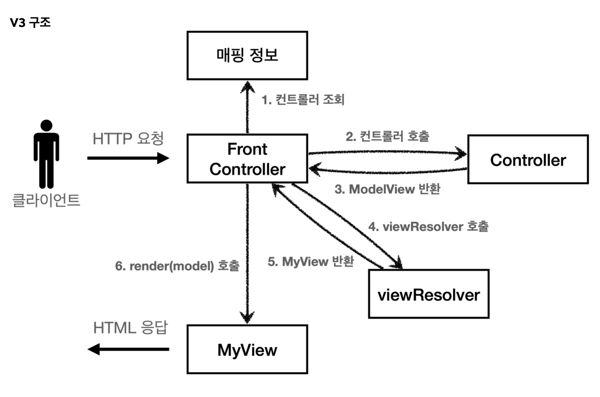
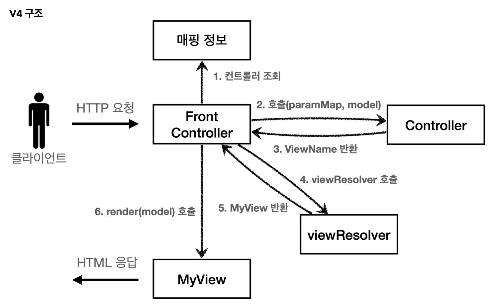
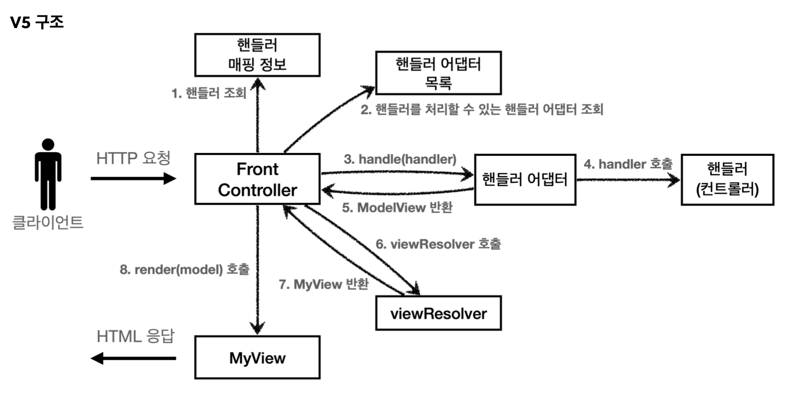

# 섹션 4. MVC 프레임워크 만들기

## 프론트 컨트롤러



### **FrontController 패턴 특징**

- 프론트 컨트롤러 서블릿 하나로 클라이언트의 요청을 받음
- 프론트 컨트롤러가 요청에 맞는 컨트롤러를 찾아서 호출
- 입구를 하나로!
- 공통 처리 가능
- 프론트 컨트롤러를 제외한 나머지 컨트롤러는 서블릿을 사용하지 않아도 됨

그래서 이번에는 순차적으로 기존에 작성했던 코드를 개선하는 과정을 진행해본다.

코드를 리펙토리을 진행할때에는 한번에 모든것들을 건들이지말고 준위가 같은 것부터 우선적으로 개선을 하는게 좋다. ( 구조를 바꾼다면 구조만 )

## **프론트 컨트롤러 도입** - v1

### 문제점

기존에 코드에서는 중복으로 사용되는 코드들이 많았는데
그러한 점을 해결하기위해서 프론트 컨트롤러를 도입하는 과정



### 해결방법

```java
@WebServlet(name = "frontControllerServletV1", urlPatterns = "/front-controller/v1/*")
public class FrontControllerServletV1 extends HttpServlet {

    private Map<String, ControllerV1> controllerMap = new HashMap<>();

    public FrontControllerServletV1() {
        controllerMap.put("/front-controller/v1/members/new-form", new MemberFormControllerV1());
        controllerMap.put("/front-controller/v1/members/save", new MemberSaveControllerV1());
        controllerMap.put("/front-controller/v1/members", new MemberListControllerV1());
    }

    @Override
    protected void service(HttpServletRequest request, HttpServletResponse response) throws ServletException, IOException {
        System.out.println("FrontControllerServletV1.service");

        String requestURI = request.getRequestURI();

        ControllerV1 controller = controllerMap.get(requestURI);
        if (controller == null) {
            System.out.println("FrontControllerServletV1.service test");
            response.setStatus(HttpServletResponse.SC_NOT_FOUND);
            return;
        }
        controller.process(request, response);
    }
}
```

`frontController`를 대입하는 과정은 위와 같다.
기존에는 controller들을 모두 서블릿으로 등록하여 입구가 여러개인 상황이었는데 이제는 `frontController`라는 것을 만들어서 하나의 `controller`가 받은 URL을 바탕으로 해당 URL이 존재하는지 확인 및 URL에 해당되는 로직 실행을 전담하는 형식으로 변경되었다.

## View **분리** - v2

### 문제점

```java
...
String viewPath = "/WEB-INF/views/new-form.jsp";
RequestDispatcher dispatcher = request.getRequestDispatcher(viewPath);
dispatcher.forward(request, response);
...
```

기존에 계속 봤었던 해당 로직이 중복되어 사용되는것을 볼 수 있었다. 
이번에는 해당 로직을 통합할 수 있도록 개선하는 과정을 진행한다.



### 해결

기존에 controller에서 직접 forward를 실행했던 로직을 분리하여

```java
public class MyView {
    private String ViewPath;

    public MyView(String viewPath) {
        this.ViewPath = viewPath;
    }

    public void render(HttpServletRequest request, HttpServletResponse response) throws ServletException, IOException {
        RequestDispatcher dispatcher = request.getRequestDispatcher(ViewPath);
        dispatcher.forward(request, response);
    }
}
```

위와 같은 MyView라는 클래스로 따로 분리를 진행한다.

```java
public MyView process(HttpServletRequest request, HttpServletResponse response) throws ServletException, IOException {
		return new MyView("/WEB-INF/views/new-form.jsp");
}
```

그렇게 되면 맨 위에서 언급이 되었던 문제점있던 코드들을 MyView라는 값을 반환하도록 수정을 거치면
깔끔하게 로직을 구성할 수 있게 되고

```java
        ...		
        MyView view = controller.process(request, response);
        view.render(request, response);
        ...
```

FrontController에서는 위에 코드와 같이 다른 controller에게 view 값을 받고 그 값을 바탕으로 render를 실행시키는 방식을 사용하면 중복되던 문제점 코드를 깔끔하게 개선할 수 있게 된다.

## Model **추가** - v3

### 문제점

1. **서블릿 종속성 제거**
    
    ```java
        ...
        @Override
        public MyView process(HttpServletRequest request, HttpServletResponse response) throws ServletException, IOException {
            return new MyView("/WEB-INF/views/new-form.jsp");
        }
        ...
    ```
    
    해당 코드는 `MemberFormController` 에 일부분인 코드인데 위와 같은 코드를 보면 
    controller가 request, response을 전부 보내주고 있는데 위와 같은 코드에서는 사용하지않고있다.
    물론 `controller`에 따라서 `request` 의 정보가 필요한 경우도 있는데 그런경우에는 따로 자바의 Map 형식을 사용해서 대신 넘기도록 하면 지금 구조에서는 컨트롤러가 서블릿 기술을 몰라도 동작할 수 있다.
    
2. **뷰 이름 중복 제거**
컨트롤러에서 지정하는 뷰 이름에 중복이 있는 것을 확인할 수 있다.
컨트롤러는 **뷰의 논리 이름**을 반환하고, 실제 물리 위치의 이름은 프론트 컨트롤러에서 처리하도록 단순화 하자.
이렇게 해두면 향후 뷰의 폴더 위치가 함께 이동해도 프론트 컨트롤러만 고치면 된다.

****`/WEB-INF/views/new-form.jsp` → **new-form**
`/WEB-INF/views/save-result.jsp` → **save-result**
`/WEB-INF/views/members.jsp` → **members**



### 해결

1. **서블릿 종속성 제거**

```java
public class ModelView {
    private String viewName;
    private Map<String, Object> model = new HashMap<>();
		...
}
```

```java
    @Override
    public ModelView process(Map<String, String> paramMap) {
        return new ModelView("new-form");
    }
```

값을 전달할때 기존과 같이 `request`, `response`를 반환해주는 방식말고, ModelView라는 class를 만들어서 `ModelView`안에 `model` 에 사용할려고 하는 request안에 있는 값들을 미리 담아서 전달을 해주게 되면 `MemberFormController` 에서는 paramMap만 사용해도 충분히 해결이 가능하다.

1. **뷰 이름 중복 제거**

`/WEB-INF/views/new-form.jsp` → **new-form**
`/WEB-INF/views/save-result.jsp` → **save-result**
`/WEB-INF/views/members.jsp` → **members**

위와 같이 논리 이름만 사용해서 view를 반환하기 위해서는 controller에서는 논리 이름만 반환하도록 하고

```java
    private MyView viewResolver(String viewName) {
        return new MyView("/WEB-INF/views/" + viewName + ".jsp");
    }
```

중복되는 값들은 위에 코드와 같이 후 보정을 해서 값을 붙여주게 되면 중복을 제거할 수 있게 된다.

이로 인해 view들의 경로가 통째로 바뀌더라도 `viewResolver`안에 있는 약간의 경로만 수정을 해주면 되니 크게 어려움 없이 변경할 수 있다.

## **단순하고 실용적인 컨트롤러** - v4

### 문제점

앞서 만든 v3 컨트롤러는 서블릿 종속성을 제거하고 뷰 경로의 중복을 제거하는 등, 잘 설계된 컨트롤러이다. 그런데 실제 컨트톨러 인터페이스를 구현하는 개발자 입장에서 보면, 항상 ModelView 객체를 생성하고 반환해야 하는 부분이 조금은 번거롭다.
좋은 프레임워크는 아키텍처도 중요하지만, 그와 더불어 실제 개발하는 개발자가 단순하고 편리하게 사용할 수 있어야한다. 소위 실용성이 있어야 한다.



기본적인 구조는 V3와 같다. 대신에 컨트롤러가 `ModelView` 를 반환하지 않고, `ViewName` 만 반환한다.

### 해결

```java
    public ModelView process(Map<String, String> paramMap) {
        List<Member> members = memberRepository.findAll();
        ModelView mv = new ModelView("members");
        mv.getModel().put("members", members);
        return mv;
    }
```

기존에는위에 있는 코드와 같이 process내부에서 직접 ModelView를 생성하고 생성된 mv를 직접 반환해주는 형식을 사용했었는데. 그부분을

```java
    @Override
    public String process(Map<String, String> paramMap, Map<String, Object> model) {
        List<Member> members = memberRepository.findAll();

        model.put("members", members);
        return "members";
    }
```

위에 있는 코드와 같이 직접 model을 외부에서 생성해서 넘겨주도록 로직을 갱신하였다.
그로인해 코드를 작성할때 위와 같이 조금 더 간편하고 직관적으로 사용할 수 있게 바꿀수 있게 되었다.

## **유연한 컨트롤러**1 - v5

### 문제점

```java
public interface ControllerV3 {
	ModelView process(Map<String, String> paramMap);
}
```

```java
public interface ControllerV4 {
	String process(Map<String, String> paramMap, Map<String, Object> model);
}
```

```java
private Map<String, ControllerV4> controllerMap = new HashMap<>();
```

문제점이라고 보기에는 개선할만한 사항으로 이야기하는 것은 이 내용이다.
프로그램을 작성할때 상황에 따라서 `V3`버전도 사용하고 `V4`버전도 사용하고싶은데
기존에 사용했던 방식은 `Map<String, ControllerV4>` 이와 같이 직접 어떠한 버전의 컨트롤러를 사용할지 직접 명시하여 `ControllerV4` 이런식으로 적어주었기때문에 하나의 버전에 Controller만 사용할 수 있었다. 
”이러한 상황에서 `V3`와 `V4`를 둘 다 사용할 수 있도록 유연하게 코드를 작성할려면 어떻게 할 수 있는가?”
가 지금의 문제점으로 이야기한다.

### 어댑터 패턴

어댑터 패턴을 사용해서 프론트 컨트롤러가 다양한 방식의 컨트롤러를 처리할 수 있도록 변경하는 방식



- **핸들러 어댑터**: 중간에 어댑터 역할을 하는 어댑터가 추가되었는데 이름이 핸들러 어댑터이다. 여기서 어댑터 역할을 해주는 덕분에 다양한 종류의 컨트롤러를 호출할 수 있다.
- **핸들러**: 컨트롤러의 이름을 더 넓은 범위인 핸들러로 변경했다. 그 이유는 이제 어댑터가 있기 때문에 꼭 컨트롤러의 개념 뿐만 아니라 어떠한 것이든 해당하는 종류의 어댑터만 있으면 다 처리할 수 있기 때문이다.

```java
public interface MyHandlerAdapter {

    boolean supports(Object handler);
    ModelView handle(HttpServletRequest request, HttpServletResponse response, Object handler) throws ServletException, IOException;
}
```

```java
public class ControllerV4HandlerAdapter implements MyHandlerAdapter {
	...
}

public class ControllerV3HandlerAdapter implements MyHandlerAdapter {
	...
}
```

동작방식은 위와 같다.
로직이 돌아갈때 `paramMap` 만 받는 v3라는 로직과
`paramMap`과 `model`을 둘 다 받아서 처리하는 v4라는 로직을 둘 다 사용할 수 있도록 범용적으로 바꿔야하는데.
그것을 `MyHandlerAdapter` 라는 것을 사용해서 항상 `ModelView` 를 만들어서 반환하도록 반환형식을 정의 해 버리는 것으로 해결을 하였다.

### 정리

**v1: 프론트 컨트롤러를 도입**

- 기존 구조를 최대한 유지하면서 프론트 컨트롤러를 도입

**v2: View 분류**

- 단순 반복 되는 뷰 로직 분리

**v3: Model 추가**

- 서블릿 종속성 제거
- 뷰 이름 중복 제거

**v4: 단순하고 실용적인 컨트롤러**

- v3와 거의 비슷
- 구현 입장에서 ModelView를 직접 생성해서 반환하지 않도록 편리한 인터페이스 제공

**v5: 유연한 컨트롤러**

- 어댑터 도입
- 어댑터를 추가해서 프레임워크를 유연하고 확장성 있게 설계