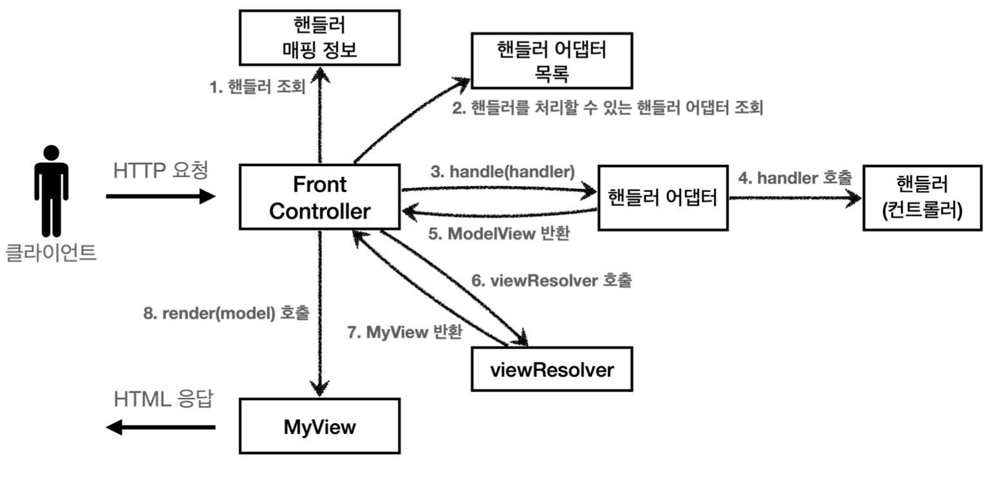
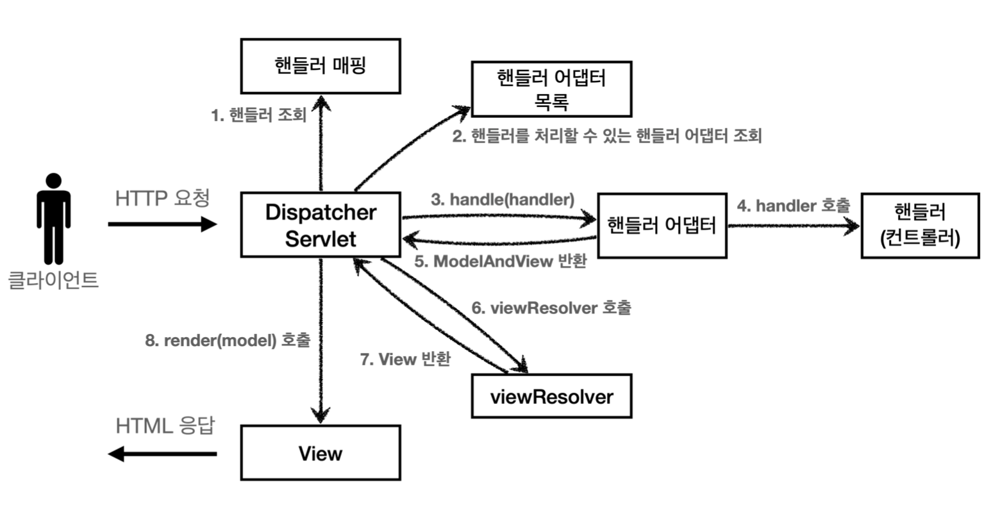
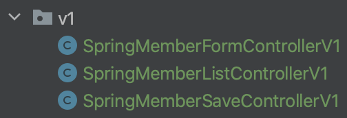

# 섹션 5. 스프링 MVC - 구조 이해

## 스프링 MVC 전체 구조

**직접 만든 MVC 프레임워크 구조**



**spring MVC 구조**



이전에 v1 ~ v5까지 직접 만들었던 MVC 프레임 워크의 구조와 실제 spring MVC의 구조가 똑같은 것을 확인할 수 있다.

**직접 만든 프레임워크 스프링 MVC 비교**

```java
FrontController → DispatcherServlet
handlerMappingMap → HandlerMapping
MyHandlerAdapter → HandlerAdapter
ModelView → ModelAndView
viewResolver → ViewResolver
MyView → View
```

위와 같이 직접 만들어 보았던 mvc 프레임워크랑 1대1로 매칭이 되는것을 확인해볼 수 있다.

spring mvc도 `DispatcherServlet` 이라는 우리로 따지면 `FrontController` 라는 것을 핵심이라고 할 수 있는데. `DispatcherServlet` 안에 있는 `doDispatch()` 를 간단하게 보면

```java
protected void doDispatch(HttpServletRequest request, HttpServletResponse response) throws Exception {
	HttpServletRequest processedRequest = request; 
	HandlerExecutionChain mappedHandler = null; 
	ModelAndView mv = null;
	
	// 1. 핸들러 조회
	mappedHandler = getHandler(processedRequest); 
	if (mappedHandler == null) {
		noHandlerFound(processedRequest, response);
		return; 
	}
	
	//2.핸들러 어댑터 조회-핸들러를 처리할 수 있는 어댑터
	HandlerAdapter ha = getHandlerAdapter(mappedHandler.getHandler());
	
	// 3. 핸들러 어댑터 실행 -> 4. 핸들러 어댑터를 통해 핸들러 실행 -> 5. ModelAndView 반환 
	mv = ha.handle(processedRequest, response, mappedHandler.getHandler());
	
	processDispatchResult(processedRequest, response, mappedHandler, mv, dispatchException);
}

private void processDispatchResult(HttpServletRequest request, HttpServletResponse response, HandlerExecutionChain mappedHandler, ModelAndView mv, Exception exception) throws Exception {
	// 뷰 렌더링 호출
	render(mv, request, response);
}

protected void render(ModelAndView mv, HttpServletRequest request,
 HttpServletResponse response) throws Exception {
	View view;
	String viewName = mv.getViewName(); 
	
	//6. 뷰 리졸버를 통해서 뷰 찾기, 7. View 반환
	view = resolveViewName(viewName, mv.getModelInternal(), locale, request);
	
	// 8. 뷰 렌더링
	view.render(mv.getModelInternal(), request, response); 
}	
```

위와 같은 코드 구조를 가지고있음을 알 수 있다.

함수의 명이나 매개변수가 조금씩은 달라서 한눈에 알아보기는 쉽지않기는한데 
구조를 위주로 파악을 해보면 직접 만든 mvc 프레임워크와 구조가 상당히 비슷한것을 확인할 수 있다.

**SpringMVC 동작 순서**

1. **핸들러 조회**: 핸들러 매핑을 통해 요청 URL에 매핑된 핸들러(컨트롤러)를 조회한다.
2. **핸들러 어댑터 조회**: 핸들러를 실행할 수 있는 핸들러 어댑터를 조회한다.
3. **핸들러 어댑터 실행**: 핸들러 어댑터를 실행한다.
4. **핸들러 실행**: 핸들러 어댑터가 실제 핸들러를 실행한다.
5. **ModelAndView 반환**: 핸들러 어댑터는 핸들러가 반환하는 정보를 ModelAndView로 **변환**해서 반환한다.
6. **viewResolver 호출**: 뷰 리졸버를 찾고 실행한다.
    - JSP의 경우: `InternalResourceViewResolver` 가 자동 등록되고, 사용된다.
7. **View 반환**: 뷰 리졸버는 뷰의 논리 이름을 물리 이름으로 바꾸고, 렌더링 역할을 담당하는 뷰 객체를 반환한다. 
    - JSP의 경우 `InternalResourceView(JstlView)` 를 반환하는데, 내부에 `forward()` 로직이 있다.
8. **뷰 렌더링**: 뷰를 통해서 뷰를 렌더링 한다.

## 핸들러 매핑과 핸들러 어댑터

컨트롤러가 호출되기위해서는 2가지가 필요하다고한다.

- **HandlerMapping(핸들러 매핑)**
핸들러 매핑에서 이 컨트롤러를 찾을 수 있어야 한다.
예) **스프링 빈의 이름으로 핸들러를 찾을 수 있는 핸들러 매핑**이 필요하다.
- **HandlerAdapter(핸들러 어댑터)**
핸들러 매핑을 통해서 찾은 핸들러를 실행할 수 있는 핸들러 어댑터가 필요하다.
예) `Controller` 인터페이스를 실행할 수 있는 핸들러 어댑터를 찾고 실행해야 한다.

**스프링 부트가 자동 등록하는 핸들러 매핑과 핸들러 어댑터**
(실제로는 더 많지만, 중요한 부분 위주로 설명하기 위해 일부 생략)

**HandlerMapping**

```java
0 = RequestMappingHandlerMapping : 애노테이션 기반의 컨트롤러인 @RequestMapping에서 사용
1 = BeanNameUrlHandlerMapping : 스프링 빈의 이름으로 핸들러를 찾는다.
```

**HandlerAdapter**

```java
0 = RequestMappingHandlerAdapter : 애노테이션 기반의 컨트롤러인 @RequestMapping에서 사용
1 = HttpRequestHandlerAdapter : HttpRequestHandler 처리
2 = SimpleControllerHandlerAdapter : Controller 인터페이스(애노테이션X, 과거에 사용) 처리
```

핸들러 매핑도, 핸들러 어댑터도 모두 순서대로 찾고 만약 없으면 다음 순서로 넘어간다.

**1. 핸들러 매핑으로 핸들러 조회**

`HandlerMapping` 을 순서대로 실행해서, 핸들러를 찾는다.

**2. 핸들러 어댑터 조회**

`HandlerAdapter` 의 `supports()` 를 순서대로 호출한다.

**3. 핸들러 어댑터 실행**

디스패처 서블릿이 조회한 `SimpleControllerHandlerAdapter` 를 실행하면서 
핸들러 정보도 함께 넘겨준다.

### @RequestMapping

가장 우선순위가 높고 가장 많이 사용되는 핸드러 매핑과 핸드러 어댑터는 `@RequestMapping` 이다.
다른것들은 지금에서는 사용 X

## 뷰 리졸버

**뷰 리졸버 - InternalResourceViewResolver**

```java
// application.properties
spring.mvc.view.prefix=/WEB-INF/views/ 
spring.mvc.view.suffix=.jsp
```

스프링 부트는 `InternalResourceViewResolver` 라는 뷰 리졸버를 자동으로 등록하는데, 이때
`application.properties` 에 등록한 `spring.mvc.view.prefix` , `spring.mvc.view.suffix` 설정 정보를 사용해서 등록한다.

참고로 권장하지는 않지만 설정 없이 다음과 같이 전체 경로를 주어도 동작하기는 한다.
`return new ModelAndView("/WEB-INF/views/new-form.jsp");`

**스프링 부트가 자동 등록하는 뷰 리졸버**

```java
1 = BeanNameViewResolver : 빈 이름으로 뷰를 찾아서 반환한다. (예: 엑셀 파일 생성 기능 에 사용)
2 = InternalResourceViewResolver : JSP를 처리할 수 있는 뷰를 반환한다.
```

1. **핸들러 어댑터 호출**
    
    핸들러 어댑터를 통해 `new-form` 이라는 논리 뷰 이름을 획득한다.
    
2. **ViewResolver 호출**
`new-form`이라는 뷰 이름으로 `viewResolver`를 순서대로 호출한다.
`BeanNameViewResolver`는 `new-form` 이라는 이름의 스프링 빈으로 등록된 뷰를 찾아야 하는데 없다.
`InternalResourceViewResolver` 가 호출된다.
3. **InternalResourceViewResolver**
이 뷰 리졸버는 `InternalResourceView` 를 반환한다.
4. **뷰 InternalResourceView**
`InternalResourceView` 는 JSP처럼 포워드 `forward()` 를 호출해서 처리할 수 있는 경우에 사용한다.
5. **view.render()**
`view.render()` 가 호출되고 `InternalResourceView` 는 `forward()` 를 사용해서 JSP를 실행한다.

## 스프링 MVC - 시작하기

기존에 직접 만든 MVC 프레임워크가 실제 spring mvc에서는 어떻게 구현이 되어있고, 어떻게 사용할 수 있는지 비교하며 분석을 해보자.

`@RequestMapping`

- RequestMappingHandlerMapping
- RequestMappingHandlerAdapter

앞서 보았듯이 가장 우선순위가 높은 핸들러 매핑과 핸들러 어댑터는 `RequestMappingHandlerMapping`,
`RequestMappingHandlerAdapter` 이다.
`@RequestMapping` 의 앞글자를 따서 만든 이름인데, 이것이 바로 지금 스프링에서 주로 사용하는 애노테이션 기반의 컨트롤러를 지원하는 핸들러 매핑과 어댑터이다. **실무에서는 99.9% 이 방식의 컨트롤러를 사용**한다.

```java
@Controller
public class SpringMemberFormControllerV1 {

    @RequestMapping("/springmvc/v1/members/new-form")
    public ModelAndView process() {
        return new ModelAndView("new-form");
    }
}
```

- `@Controller`:
    - 스프링이 자동으로 스프링 빈으로 등록한다. 
    (내부에 `@Component` 애노테이션이 있어서 컴포넌트 스캔의대상이 됨)
    - 스프링 MVC에서 애노테이션 기반 컨트롤러로 인식한다.
- `@RequestMapping`: 
요청 정보를 매핑한다. 해당 URL이 호출되면 이 메서드가 호출된다. 
애노테이션을 기반 으로 동작하기 때문에, 메서드의 이름은 임의로 지으면 된다.
- `ModelAndView` : 
모델과 뷰 정보를 담아서 반환하면 된다.

`RequestMappingHandlerMapping`

스프링 빈 중에서 `@RequestMapping` 또는 `@Controller` 가 클래스 레벨에 붙어 있는 경우에 매핑 정보로 인식한다.

( 클래스 레벨에 `@Controller` 혹은 `@Component` `@RequestMapping` 둘 다 붙어있는 경우에 핸들러 매팅으로 동작하게 된다는 이야기다. )

## 스프링 MVC - 컨트롤러 통합



기존에 `@Controller` 를 작성할때에는 하나의 파일에 하나의 `@RequestMapping` 함수만 사용해서 작성을 했었는데. 당연하게도 하나의 `@Controller` 안에 여러개의 `@RequestMapping`를 작성하는 것도 가능하다.

```java
@Controller
@RequestMapping("/springmvc/v2/members")
public class SpringMemberControllerV2 {

    private MemberRepository memberRepository = MemberRepository.getInstance();

    @RequestMapping("/new-form")
    public ModelAndView newForm() {
        return new ModelAndView("new-form");
    }

    @RequestMapping("/save")
    public ModelAndView save(HttpServletRequest request, HttpServletResponse response) {
        String username = request.getParameter("username");
        int age = Integer.parseInt(request.getParameter("age"));

        Member member = new Member(username, age);
        memberRepository.save(member);

        ModelAndView mv = new ModelAndView("save-result");
        mv.addObject("member", member);
        return mv;
    }

    @RequestMapping
    public ModelAndView members() {
        List<Member> members = memberRepository.findAll();
        ModelAndView mv = new ModelAndView("members");
        mv.addObject("members", members);
        return mv;
    }
}
```

기존에 작성했던 `@RequestMapping` 들을 하나의 `@Controller` 안에 통합을 진행하였고,
class딴에서 `@RequestMapping("/springmvc/v2/members")` 을 적어줘서 중복으로 사용되던 `/springmvc/v2/members` 을 안적어도 되도록 추가해주는 작업을 진행하였다. 

## 스프링 MVC - 실용적인 방식

기존에 작성 v2방식을 개선하는 코드를 제시한다.

```java
@Controller
@RequestMapping("/springmvc/v3/members")
public class SpringMemberControllerV3 {

    private MemberRepository memberRepository = MemberRepository.getInstance();

    @GetMapping("/new-form")
    public String newForm() {
        return "new-form";
    }

    @PostMapping("/save")
    public String save(
            @RequestParam("username") String username,
            @RequestParam("age") int age,
            Model model) {
        Member member = new Member(username, age);
        memberRepository.save(member);

        model.addAttribute("member", member);
        return "save-result";
    }

    @GetMapping
    public String members(Model model) {
        List<Member> members = memberRepository.findAll();

        model.addAttribute("members", members);
        return "members";
    }
}
```

v2의 방식의 코드를 실무에서는 보통 어떻게 사용하는지 위와 같은 코드를 보고 알 수 있다.

간단하게 분석을 해보자면

**Model 파라미터 && @RequestParam 사용**

이전에 v3 v4를 둘 다 받을 수 있게 어댑터 패턴을 도입한것처럼 실제 spring mvc에서 엄청나게 유연하게 파라미터를 받는것이 가능하다. `save`나 `member`를 보면 Model model을 받는것도 가능하고,
내부에서 `request.getParameter()` 을 통해 직접 값을 꺼내오는 것이 아니라 `@RequestParam("username") String username` 이와 같이 값 자체를 미리꺼내서 받는것도 가능하다.

**@RequestMapping → @GetMapping, @PostMapping**

URL로만 매칭을 하는것이 아니라 특정 HTTP Method를 지정하여 매칭하는 것도 가능하다. 위에 코드와 같이 `@GetMapping, @PostMapping` 를 사용해서 지정하여 특정 Method만을 받게 설정할 수도있다.

**ViewName 직접 반환**

기존에는 계속 `ModelAndView`라는 것을 반환값으로 지정을 하였었는데
위에 코드와 같이 반환값을 `String`으로 지정하여 더욱 편리하고 간편하게 코드를 직성하는것이 가능하다.