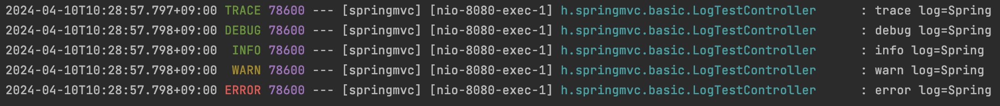
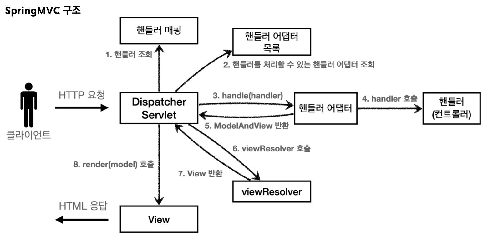
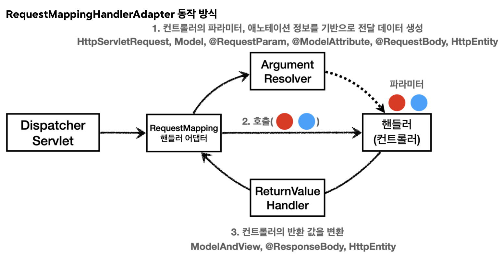
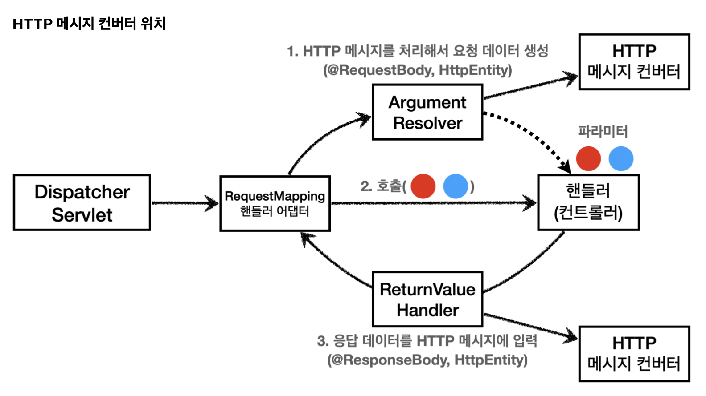

# 섹션 6. 스프링 MVC - 기본 기능

기존에 학습했던 내용을 바탕으로 이번에는 진짜 spring mvc에서는 어떻게 사용하고 있고,
어떻게 사용을 하면 좋은지를 이야기한다.

## 프로젝트 생성

[https://start.spring.io/](https://start.spring.io/)

## 로깅 간단히 알아보기

실무에서 코드에 대한 테스트를 할 경우에는 `System.out.println()` 형식을 사용하지않고,
로깅 라이브러리를 사용하여 로그를 사용한다고한다.

### 출력해보기

```java
// private static final Logger log = LoggerFactory.getLogger(Xxx.class)
private final Logger log = LoggerFactory.getLogger(getClass());

		...
		String name = "String";
		log.trace("trace log={}", name); 
		log.debug("debug log={}", name);
		log.info("info log={}", name);
		log.warn("warn log={}", name);
		log.error("error log={}", name);
		...
```



위와 같이 println을 사용하는 방식이 아닌 log를 사용해서 출력을 진행할 수 있다.

해당 출력에서는 `{}` 값이 오른쪽에 있는 값으로 치환이 되어 출력이 이루어지고,
위와 같은 방식을 사용하면 출력문 뿐만아니라 부가적인 정보들도 더 얻을 수 있고, 상황에 따라 로그레벨을 다르게 주고 판별을 할 수 있기때문에 더 좋은 방법이라고 이야기한다.

### {}

```java
log.trace("trace log=" + name);
log.trace("trace log={}", name);
```

위와 같은 코드를 보면 둘 다 출력되는 결과물의 경우 똑같이 나오게 된다.
하지만 내부 코드에서는 `+` 에 경우에는 미리 연산을 다 진행한 이후에 해당 데이터를 가지고 있는 방식이기때문에 추가적인 메모리를 사용하게 된다. 
log에 경우에는 log level에 따라서 출력이 되어야하는 로그도 있지만 출력이 안되는 로그로 존재하기때문에 쓸모없는 리소스를 사용을 방지하기 위해서 `+` 방식말고 `{}`방식을 사용해줘야한다.

### 의문점

그렇다면 `{}` 방식이 메모리사용측면에서 더 효율적이라는 것인데. 왜 `println`에 경우에는 `+`를 사용하는 걸까?
`println`도 메모리 관리측면에서 효율적인 `{}`를 사용하는 것이 좋지않을까?

→ 확인해보니 println같은 경우에는 `{}` 해당 문법자체를 지원해주지않는다. 그래서 그냥 사용이 불가능 :X

### 로그레벨 설정

```java
// application.properties
logging.level.hello.springmvc=debug
```

위와 같이 로그 레벨을 따로 설정을 해주고 변경을 해서 출력하는 것이 가능한데.

보통 해당 프로그램을 사용하는 서버에 따라서 로그레벨을 다르게 주어 운영을 한다고한다.
 `개발서버: debug`, `운영서버: info`

```java
// default : info
logging.level.root=info
```

위에 코드와 같이 따로 설정을 해주지않아도 기본값이 info로 되어있는데.
위에 코드를 수정하여 기본적인 root log level을 변경하는 것도 가능하다.
( 그렇게 되면 직접작성한 프로젝트뿐만아니라 spring boot 등 다양한 곳에서의 로그를 모두 볼 수 있다. )

```java
@Slf4j
public class LogTestController {
	// private final Logger log = LoggerFactory.getLogger(getClass());
	// lombok
	...
}
```

사용할때 클래스딴에서 `@Slf4j` 이라는 애노테이션을 적어주게 되면 lombok을 통해 자동으로 처리가 된다고한다.

### **로그 사용시 장점**

- 쓰레드 정보, 클래스 이름 같은 부가 정보를 함께 볼 수 있고, 출력 모양을 조정할 수 있다.
- 로그 레벨에 따라 개발 서버에서는 모든 로그를 출력하고, 운영서버에서는 출력하지 않는 등 로그를 상황에 맞게 조절할 수 있다.
- 시스템 아웃 콘솔에만 출력하는 것이 아니라, 파일이나 네트워크 등, 로그를 별도의 위치에 남길 수 있다. 특히 파일로 남길 때는 일별, 특정 용량에 따라 로그를 분할하는 것도 가능하다.
- 성능도 일반 System.out보다 좋다. (내부 버퍼링, 멀티 쓰레드 등등) 그래서 실무에서는 꼭 로그를 사용해야 한다.

### @RestController

`@Controller`:  반환 값이 `String` 이면 뷰 이름으로 인식된다. 그래서 **뷰를 찾고 뷰가 랜더링**
`@RestController`:  반환 값으로 뷰를 찾는 것이 아니라, **HTTP 메시지 바디에 바로 입력**

## 요청 매핑

요청이 왔을때 어떠한 컨트롤러가 호출이 되어야하는지를 매핑하는 것

**@RequestMapping**

```java
@RequestMapping("/hello-basic")
public String helloBasic() {
    log.info("helloBasic");
    return "ok";
}
```

기본적인 형식으로 `@RequestMapping()` 에 해당되는 url값으로 클라이언트가 접근하면 해당 메소드를 실행시킨다.

**method = RequestMethod.GET**

```java
@RequestMapping(value = "/hello-basic", method = RequestMethod.GET)
public String helloBasic() {
	...
}
```

클라이언트가 value에 해당되는 url로 접근할때 method를 지정하여 해당 method로만 접근을 할 수 있도록 제한을 걸 수 있다.

**@GetMapping**

```java
@GetMapping("/hello-basic")
public String helloBasic() {
    ...
}
```

위에서 method를 작성한 방식과 똑같이 동작이 이루어진다. 코드를 더 깔끔하게 적는방식

**@PathVariable**

```java
@GetMapping("/mapping/{userId}")
public String mappingPath(@PathVariable("userId") String data) {
    log.info("mappingPath userId={}", data);
    return "ok";
}
```

Mapping에서 URL경로를 템플릿화 하여 @PathVariable을 사용하면 매칭되는 부분을 편리하게 가져와 조회할 수 있다.

`@PathVariable String userId`
위와 같이 `@PathVariable` 의 이름과 파라미터 이름이 같으면 생략할 수 있다.

```java
@GetMapping("/mapping/users/{userId}/orders/{orderId}")
public String mappingPath(@PathVariable String userId, @PathVariable Long orderId) {
	log.info("mappingPath userId={}, orderId={}", userId, orderId);
	return "ok";
}
```

위와 같이 다중으로 맵핑하는것도 물론 가능하다.

**특정 파라미터 조건 매핑**

```java
/**
* 파라미터로 추가 매핑
* params="mode",
* params="!mode"
* params="mode=debug"
* params="mode!=debug" (! = )
* params = {"mode=debug","data=good"} 
*/
@GetMapping(value = "/mapping-param", params = "mode=debug") 
public String mappingParam() {
	log.info("mappingParam");
	return "ok"; 
}
```

위와 같은 메소드를 실행하기 위해서는 위와 같이 조건을 걸어 특정 파라미터가 있어야만 접근할 수 있게 설정하는 것도 가능하다.
( `“/mapping-param?mode=debug”` 인 경우에만 접근가능 )

**특정 헤더 조건 매핑**

```java
/**
 *특정 헤더로 추가 매핑
 * headers="mode",
 * headers="!mode"
 * headers="mode=debug"
 * headers="mode!=debug" (! = )
 */
@GetMapping(value = "/mapping-header", headers = "mode=debug") 
public String mappingHeader() {
	log.info("mappingHeader");
	return "ok";
}
```

해당 메소드를 접근할때 클라이언트가 요청을 보내는 헤더에 내가 설정한 headers의 정보가 같게 있어야만 접근할 수 있도록 설정

**미디어 타입 조건 매핑 - HTTP 요청 Content-Type, consume**

```java
/**
* Content-Type 헤더 기반 추가 매핑 Media Type * consumes="application/json"
* consumes="!application/json"
* consumes="application/*"
* consumes="*\/*"
* MediaType.APPLICATION_JSON_VALUE
*/
@PostMapping(value = "/mapping-consume", consumes = "application/json") 
public String mappingConsumes() {
	log.info("mappingConsumes");
	return "ok"; 
}
```

이것도 똑같이 특정 미디어 타입을 조건으로 매핑하여 처리하는것이 가능하다.
( 위에서 소개한 headers를 사용해도 똑같이 구현이 가능하긴하지만 spring mvc에서 consumes를 사용하는 것을 권장 )

**미디어 타입 조건 매핑 - HTTP 요청 Accept, produce**

```java
/**
 * Accept 헤더 기반 Media Type * produces = "text/html"
 * produces = "!text/html"
 * produces = "text/*"
 * produces = "*\/*"
 */
@PostMapping(value = "/mapping-produce", produces = "text/html")
public String mappingProduces() {
    log.info("mappingProduces");
    return "ok";
}
```

HTTP 요청의 Accept 헤더를 기반으로 미디어 타입으로 매핑한다. 
만약 맞지 않으면 HTTP 406 상태코드(Not Acceptable)을 반환한다.

## 요청 매핑 - API 예시

회원 관리를 HTTP API로 만든다 생각하고 매핑을 어떻게 하는지 알아보자.

- 회원 목록 조회: GET `/users`
- 회원 등록: POST `/users`
- 회원 조회: GET `/users/{userId}`
- 회원 수정: PATCH `/users/{userId}`
- 회원 삭제: DELETE `/users/{userId}`

```java
@RestController
@RequestMapping("/mapping/users")
public class MappingClassController {

    @GetMapping
    public String user() {
        return "get users";
    }

    @PostMapping
    public String addUser() {
        return "post user";
    }

    @GetMapping("/{userId}")
    public String findUser(@PathVariable String userId) {
        return "get userId =" + userId;
    }

    @PatchMapping("/{userId}")
    public String updateUser(@PathVariable String userId) {
        return "update userId =" + userId;
    }

    @DeleteMapping("/{userId}")
    public String deleteUser(@PathVariable String userId) {
        return "delete userId =" + userId;
    }
}
```

이전에 배웠던 내용 그대로 위에 코드와 같이 특정 요청을 매핑

## HTTP 요청 - 기본, 헤더 조회

```java
@RequestMapping("/headers")
public String hedaers(HttpServletRequest request,
                      HttpServletResponse response,
                      HttpMethod httpMethod,
                      Locale locale,
                      @RequestHeader MultiValueMap<String, String> headerMap,
                      @RequestHeader("host") String host,
                      @CookieValue(value = "myCookie", required = false) String cookie
                      ) {
    ...
}
```

- `HttpServletRequest`
- `HttpServletResponse`
- `HttpMethod` : HTTP 메서드를 조회한다. `org.springframework.http.HttpMethod`
- `Locale` : Locale 정보를 조회한다.
- `@RequestHeader MultiValueMap<String, String> headerMap`
    - 모든 HTTP 헤더를 MultiValueMap 형식으로 조회한다.
- `@RequestHeader("host") String host`
    - 특정 HTTP 헤더를 조회한다.
    - 속성
        - 필수 값 여부: `required`
        - 기본 값 속성: `defaultValue`
- `@CookieValue(value = "myCookie", required = false) String cookie`
    - 특정 쿠키를 조회한다.
    - 속성
        - 필수 값 여부: `required`
        - 기본 값: `defaultValue`

### `MultiValueMap`

MAP과 유사한데, 하나의 키에 여러 값을 받을 수 있다.

HTTP header, HTTP 쿼리 파라미터와 같이 하나의 키에 여러 값을 받을 때 사용한다.

```java
MultiValueMap<String, String> map = new LinkedMultiValueMap(); 
map.add("keyA", "value1");
map.add("keyA", "value2");

//[value1,value2]
List<String> values = map.get("keyA");
```

기존적으로 많이 사용하는 파라미터의 경우에는 위와 같고 그 외에도 추가적인 파라미터에 대해서 알아보고싶으면 해당 링크에서 확인해 볼 수 있다.

**`@Controller` 사용 가능한 파라미터**

[https://docs.spring.io/spring-framework/reference/web/webmvc/mvc-controller/ann-methods/arguments.html](https://docs.spring.io/spring-framework/reference/web/webmvc/mvc-controller/ann-methods/arguments.html)

**`@Controller` 사용 가능한 응답 값**

[https://docs.spring.io/spring-framework/reference/web/webmvc/mvc-controller/ann-methods/return-types.html](https://docs.spring.io/spring-framework/reference/web/webmvc/mvc-controller/ann-methods/return-types.html)

## HTTP 요청 파라미터 - 쿼리 파라미터, HTML Form

이전에도 계속 배웠었지만 http 요청으로 데이터를 보내는 방식은 크게 3가지가 있다고한다.

- **GET - 쿼리 파라미터**
    - /url**?username=hello&age=20**
    - 메시지 바디 없이, URL의 쿼리 파라미터에 데이터를 포함해서 전달
    - 예) 검색, 필터, 페이징등에서 많이 사용하는 방식
- **POST** **-** **HTML Form**
    - content-type: application/x-www-form-urlencoded
    - 메시지 바디에 쿼리 파리미터 형식으로 전달 username=hello&age=20
    - 예) 회원 가입, 상품 주문, HTML Form 사용
- **HTTP message body**에 데이터를 직접 담아서 요청
    - HTTP API에서 주로 사용, JSON, XML, TEXT
    - 데이터 형식은 주로 JSON 사용
    - POST, PUT, PATCH

### **RequestParamController**

```java
    @RequestMapping("/request-param-v1")
    public void requestParamV1(HttpServletRequest request, HttpServletResponse response) throws IOException {
        String username = request.getParameter("username");
        int age = Integer.parseInt(request.getParameter("age"));

        log.info("username={}, age={}", username, age);

        response.getWriter().write("ok");
    }
```

이전에 계속 학습했던 방식 그대로 클라이언트가 `“/request-param-v1?username=hello&age=20”` 으로 접근하면 위와 같은 메소드에서 값을 받아 처리할 수 있다.

## HTTP 요청 파라미터 - @RequestParam

### @ResponseBody

해당 메소드를 가지고 있는 class가 `@Controller` 로 되어있다보면 해당 메소드가 종료될때 반환되는 값을 기준으로 그 이름의 맞는 html 파일을 찾게 되는데.
메소드에 `@ResponseBody` 이라는 애노테이션을 넣게 되면 html파일을 찾지않고, body에 데이터를 넣어서 바로 반환을 해준다.

```java
@ResponseBody
@RequestMapping("/request-param-v2")
public String requestParamV2(
        @RequestParam("username") String memberName,
        @RequestParam("age") int memberAge) {
    
    log.info("username={}, age={}", memberName, memberAge);
    return "ok";
}
```

위에서 이야기한 `RequestParamController` 방식에서 조금 더 개선하여 위와 같은 방식을 사용할 수 있다.

클라이언트가 쿼리 파라미터로 보낸값을 바로 받아서 처리하는 방식

### name 생략

```java
@ResponseBody
@RequestMapping("/request-param-v3")
public String requestParamV3(
        @RequestParam String username,
        @RequestParam int age) {

    log.info("username={}, age={}", username, age);
    return "ok";
}
```

쿼리파라미터 데이터를 받을때 `@RequestParam` 의 값을 생략하고 이름이 일치하는 방식으로 사용도 가능

HTTP 파라미터 이름이 변수 이름과 같으면 `@RequestParam(name="xx")` 생략 가능

### @RequestParam 생략

```java
@ResponseBody
@RequestMapping("/request-param-v4")
public String requestParamV4(String username, int age) {

    log.info("username={}, age={}", username, age);
    return "ok";
}
```

아예 `@RequestParam` 을 생략하는 방법도 가능 ( 파라미터와 이름이 일치한다는 전재하에 )

`String`, `int`, `Integer` 등의 단순 타입이면`@RequestParam`도 생략 가능

이렇게 애노테이션을 완전히 생략해도 되는데, 너무 없는 것도 약간 과하다는 주관적 생각이 있다.
`@RequestParam` 이 있으면 명확하게 요청 파리미터에서 데이터를 읽는다는 것을 알 수 있다.

### @RequestParam(required = false)

기본적으로 requestParam에 경우에는 required가 true로 설정이 되어있어서 받을려고 하는 파라미터중에 하나라도 들어오지않으면 에러가 발생하게 된다.

```java
    @ResponseBody
    @RequestMapping("/request-param-required")
    public String requestParamRequired(
            @RequestParam(required = false) String username,
            @RequestParam(required = false) int age) {

        log.info("username={}, age={}", username, age);
        return "ok";
    }
```

만약 그러한 상황을 원하지않을경우 위에 코드와 같이 required를 false로 해두면 들어오지않아도 에러가 발생하지않게 설정해줄 수 있다. ( 파라미터가 들어오지않은 경우에는 해당값은 null로 된다. )

int에 경우에는 null이 들어갈 수 없기때문에 위와 같이 `@RequestParam(required = false) int age` 형태의 코드를 사용하고싶다면 `@RequestParam(required = false) Integer age` 형태로 사용해야한다.

- `@RequestParam.required` 
파라미터 필수 여부
기본값이 파라미터 필수( `true` )이다.

**주의! - 파라미터 이름만 사용**
`/request-param-required?username=`

파라미터 이름만 있고 값이 없는 경우 빈문자로 통과

**주의! - 기본형(primitive)에 null 입력**
`/request-param` 요청
`@RequestParam(required = false) int age`

null이 들어갈 수 없는 변수에는 조심해서 사용할것

### **기본 값 적용 - requestParamDefault**

```java
@ResponseBody
@RequestMapping("/request-param-default")
public String requestParamDefault(
        @RequestParam(defaultValue = "guest") String username,
        @RequestParam(defaultValue = "-1") int age) {

    log.info("username={}, age={}", username, age);
    return "ok";
}
```

쿼리파라미터의 값이 들어오지않는다면 defaultValue의 값으로 사용하고 들어온다면 그 값으로 사용하는 방식

defaultValue에 경우에는 클라이언트가 `username=` 이와 같이 보낸것도 데이터가 없다고 인식하여 defaultValue 사용

### **파라미터를 Map으로 조회하기 - requestParamMap**

```java
@ResponseBody
@RequestMapping("/request-param-map")
public String requestParamMap(@RequestParam Map<String, Object> paramMap) {

    log.info("username={}, age={}", paramMap.get("username"), paramMap.get("age"));
    return "ok";
}
```

쿼리파라미터의 key 상관없이 무엇이 오든지 항상받도록 map으로 받는것도 가능하다.

파라미터의 값이 1개가 확실하다면 `Map` 을 사용해도 되지만, 그렇지 않다면 `MultiValueMap` 을 사용하자.

## HTTP 요청 파라미터 - @ModelAttribute

쿼리파라미터로 들어온 값을 저장하거나 사용할때 위에서 소개한 방법말고도 model을 사용해서 바로 데이터를 저장하고 사용하는 방법도 존재한다.

```java
@Data
public class HelloData {
    private String username;
    private int age;
}
```

`@Data`: `lombok`

lombok에 있는 애들중 하나로 `@Getter`, `@Setter`, `@ToString`, `@EqualsAndHashCode`, `@RequiredArgsConstructor`을 지원해줘서 흔히사용되는 애들을 자동으로 적용해준다.

```java
@ResponseBody
@RequestMapping("/model-attribute-v1")
public String modelAttributeV1(@ModelAttribute HelloData helloData) {
    log.info("username = {}, age = {}", helloData.getUsername(), helloData.getAge());
    log.info("helloData = {}", helloData);

    return "ok";
}
```

위에 코드와 같이 메서드의 인자를 `@ModelAttribute`로 받게되면 쿼리파라미터값들이 들어올때 
해당되는 객체를 생성하고 `helloData`에 있는 객체를 확인하고 setter의 유무까지 판별하여 파라미터의 값을 바인딩한다.

```java
@ResponseBody
@RequestMapping("/model-attribute-v1")
public String modelAttributeV1(HelloData helloData) {
    log.info("username = {}, age = {}", helloData.getUsername(), helloData.getAge());
    log.info("helloData = {}", helloData);

    return "ok";
}
```

위에서 `@RequestParam`를 생략해서 사용했던것 처럼 `@ModelAttribute` 를  생략해도 똑같이 동작이 이루어진다.

- `@RequestParam` = `String` , `int` , `Integer` 같은 단순 타입
- `@ModelAttribute` = 나머지 (argument resolver 로 지정해둔 타입 외)

## HTTP 요청 메시지 - 단순 텍스트

- **HTTP message body**에 데이터를 직접 담아서 요청
    - HTTP API에서 주로 사용, JSON, XML, TEXT
    - 데이터 형식은 주로 JSON 사용
    - POST, PUT, PATCH

**RequestBodyStringController**

```java
@PatchMapping("/request-body-string-v1")
public void requestBodyString(HttpServletRequest request, HttpServletResponse response) throws IOException {
    ServletInputStream inputStream = request.getInputStream();
    String messageBody = StreamUtils.copyToString(inputStream, StandardCharsets.UTF_8);

    log.info("messageBody={}", messageBody);

    response.getWriter().write("ok!");
}
```

가장 기본적인 형태로 데이터를 받아오는 방식은 이전에도 봤던 그대로 위에 코드와 같다.
데이터를 `getInputStream`라는 것을 사용해서 뽑아내고, `copyToString` 이란 것을 사용해서 `UTF_8` 형태로 바꿔서 사용하는 방식인데.

**Input, Output 스트림, Reader - requestBodyStringV2**

```java
@PatchMapping("/request-body-string-v2")
public void requestBodyStringV2(InputStream inputStream, Writer responseWriter) throws IOException {

    String messageBody = StreamUtils.copyToString(inputStream, StandardCharsets.UTF_8);
    log.info("messageBody={}", messageBody);
    responseWriter.write("ok!");
}
```

그 방식을 조금 개선하여 InputStream랑 Writer를 직접 받아서 사용하는 방식이 있고,

InputStream(Reader): HTTP 요청 메시지 바디의 내용을 직접 조회 

OutputStream(Writer): HTTP 응답 메시지의 바디에 직접 결과 출력

**HttpEntity - requestBodyStringV3**

```java
@PatchMapping("/request-body-string-v3")
public HttpEntity<String> requestBodyStringV3(HttpEntity<String> httpEntity) {

    String messageBody = httpEntity.getBody();
    log.info("messageBody={}", messageBody);

    return new HttpEntity<>("ok");
}
```

더 발전한 방식으로 `httpEntity` 라는 것이 존재한다.

**스프링 MVC는 다음 파라미터를 지원한다.**

- **HttpEntity**: HTTP header, body 정보를 편리하게 조회
    - 메시지 바디 정보를 직접 조회
    - 요청 파라미터를 조회하는 기능과 관계 없음 `@RequestParam` X, `@ModelAttribute` X
- **HttpEntity는 응답에도 사용 가능**
    - 메시지 바디 정보 직접 반환
    - 헤더 정보 포함 가능
    - view 조회X

`HttpEntity` 를 상속받은 다음 객체들도 같은 기능을 제공한다.

- **RequestEntity**
    - HttpMethod, url 정보가 추가, 요청에서 사용
- **ResponseEntity**
    - HTTP 상태 코드 설정 가능, 응답에서 사용
    `return new ResponseEntity<String>("Hello World", responseHeaders, HttpStatus.CREATED)`

**@RequestBody - requestBodyStringV4**

```java
@ResponseBody
@PatchMapping("/request-body-string-v4")
public String requestBodyStringV4(@RequestBody String messageBody) {

    log.info("messageBody={}", messageBody);
    
    return "ok";
}
```

**가장 많이 사용하는 방법**

애노테이션으로 지원을 해줘서 바로 `messageBody`를 받아오는 것이 가능하다.

헤더 정보가 필요하다면 `HttpEntity` 를 사용하거나 `@RequestHeader` 를 사용하면 된다.

### 정리

**요청 파라미터 vs HTTP 메시지 바디**

- 요청 파라미터를 조회하는 기능: `@RequestParam` , `@ModelAttribute`
- HTTP 메시지 바디를 직접 조회하는 기능: `@RequestBody`

## HTTP 요청 메시지 - JSON

이제는 `{”username”: “hello”, “age”: “20”}` 같은 형식으로 들어오는 값을 어떻게 처리할 수 있는가에 대해서 이야기를 해본다.

```java
@PostMapping("/request-body-json-v1")
public void requestBodyJsonV1(HttpServletRequest request, HttpServletResponse response) throws IOException {
    ServletInputStream inputStream = request.getInputStream();
    String messageBody = StreamUtils.copyToString(inputStream, StandardCharsets.UTF_8);

    log.info("messageBody = {}", messageBody);
    HelloData helloData = objectMapper.readValue(messageBody, HelloData.class);
    log.info("username= {}, age = {}", helloData.getUsername(), helloData.getAge());

    response.getWriter().write("ok");
}
```

가장 기초적으로 생각했을때에는 위와 같은 코드 구조를 가지고 있다.

클라이언트가 보낸 정보를 `request`에서 찾아내고 그 값을 `UTF_8`로 변환한 다음 `readValue`라는 것을 사용해서 하나하나 `helloData`에 담는 형식이다.

위와 같은 방식을 spring에서 지원해주는 내용으로 개선을 진행해보면 아래와 같은 코드가 나온다.

```java
@ResponseBody
@PostMapping("/request-body-json-v3")
public String requestBodyJsonV3(@RequestBody HelloData helloData) {

    log.info("username= {}, age = {}", helloData.getUsername(), helloData.getAge());
    return "ok";
}
```

**@RequestBody 객체 파라미터**

- `@RequestBody HelloData data`
- `@RequestBody`에 직접 만든 객체를 지정할 수 있다.

`HttpEntity`, `@RequestBody` 를 사용하면 HTTP 메시지 컨버터가 HTTP 메시지 바디의 내용을 우리가 원하는 문자나 객체 등으로 변환해준다.
HTTP 메시지 컨버터는 문자 뿐만 아니라 JSON도 객체로 변환해주는데
`readValue` 작업을 대신 처리해준다.

**@RequestBody는 생략 불가능**

생략을 하면 기본값인 `@ModelAttribute`가 적용된다.

```java
@ResponseBody
@PostMapping("/request-body-json-v4")
public String requestBodyJsonV4(**HttpEntity**<HelloData> httpEntity) {

    HelloData helloData = httpEntity.getBody();
    log.info("username= {}, age = {}", helloData.getUsername(), helloData.getAge());
    return "ok";
}

@ResponseBody
@PostMapping("/request-body-json-v5")
public **HelloData** requestBodyJsonV5(@RequestBody HelloData helloData) {

    log.info("username= {}, age = {}", helloData.getUsername(), helloData.getAge());
    return helloData;
}
```

추가적으로 HttpEntity를 사용해서 데이터를 가져온다던가. ****반환형을 ****객체로 지정하여 반환하는 것도 가능하다.

- `@RequestBody` 요청
    - JSON 요청 → HTTP 메시지 컨버터 → 객체
- `@RequestBody` 응답
    - 객체 → HTTP 메시지 컨버터 → JSON 응답

## HTTP 응답 - 정적 리소스, 뷰 템플릿

스프링(서버)에서 응답 데이터를 만드는 방법은 크게 3가지이다.

- **정적 리소스**
    - 예) 웹 브라우저에 정적인 HTML, css, js를 제공할 때는, **정적 리소스**를 사용한다.
- **뷰 템플릿 사용**
    - 예) 웹 브라우저에 동적인 HTML을 제공할 때는 뷰 템플릿을 사용한다. (SSR)
- **HTTP 메시지 사용**
    - HTTP API를 제공하는 경우에는 HTML이 아니라 데이터를 전달해야 하므로, HTTP 메시지 바디에
    JSON 같은 형식으로 데이터를 실어 보낸다.

### **정적 리소스**

스프링 부트는 클래스패스의 다음 디렉토리에 있는 정적 리소스를 제공한다. 
`/static` , `/public` , `/resources` ,`/META-INF/resources`

`src/main/resources` 는 리소스를 보관하는 곳이고, 또 클래스패스의 시작 경로이다.
따라서 다음 디렉토리에 리소스를 넣어두면 스프링 부트가 정적 리소스로 서비스를 제공한다.

**정적 리소스 경로 :**  `src/main/resources/static`

ex) `src/main/resources/static/basic/hello-form.html`

→ `http://localhost:8080/basic/hello-form.html`

**ResponseViewController - 뷰 템플릿을 호출하는 컨트롤러**

```java
@Controller
public class ResponseViewController {

    @RequestMapping("/response-view-v1")
    public ModelAndView responseViewV1() {
        ModelAndView mav = new ModelAndView("response/hello")
                .addObject("data", "hello!");

        return mav;
    }

    @RequestMapping("/response-view-v2")
    public String responseViewV2(Model model) {
        model.addAttribute("data", "hello!");
        return "response/hello";
    }

    @RequestMapping("response/hello")
    public void responseViewV3(Model model) {
        model.addAttribute("data", "hello!");
    }
}
```

**String을 반환하는 경우 View or HTTP 메시지**

`@ResponseBody` 가 없으면 `response/hello` 로 뷰 리졸버가 실행되어서 뷰를 찾고, 렌더링 한다.
`@ResponseBody` 가 있으면 뷰 리졸버를 실행하지 않고, HTTP 메시지 바디에 직접 `response/hello` 라는 문자가 입력된다.

여기서는 뷰의 논리 이름인 `response/hello`를 반환하면 다음 경로의 뷰 템플릿이 렌더링 되는 것을 확인할 수 있다.

- 실행: `templates/response/hello.html`

**Void를 반환하는 경우**

`@Controller` 를 사용하고, `HttpServletResponse`, `OutputStream(Writer)` 같은 HTTP 메시지 바디를 처리하는 파라미터가 없으면 요청 URL을 참고해서 논리 뷰 이름으로 사용

- 요청 URL: `/response/hello`
- 실행: `templates/response/hello.html`

**참고로 이 방식은 명시성이 너무 떨어지고 이렇게 딱 맞는 경우도 많이 없어서, 권장하지 않는다.**

( v2방식을 보통 권장 )

**HTTP 메시지**

`@ResponseBody` , `HttpEntity` 를 사용하면, 뷰 템플릿을 사용하는 것이 아니라, HTTP 메시지 바디에 직접 응답데이터를 출력할 수 있다.

## HTTP 응답 - HTTP API, 메시지 바디에 직접 입력

http api를 제공하는 경우에는 html이 아니라 데이터를 전달해야하므로 http 메시지 바디에 json같은 형식의 데이터를 실어보낸다. 
이전까지 계속 나왔던 내용이므로 간단하게 정리를 해보자.

**단순 문자**

```java
@ResponseBody
@GetMapping("/response-body-string-v3")
public String responseBodyV3() {
    return "ok";
}
```

단순하게 문자만 body에 담아서 보낼경우에는 `@ResponseBody` 이라는 애노테이션을 붙여주게되면 return 되는 String값이 html을 찾는것이 아니라 그냥 문자로서 `body`에 담겨 반환이 된다.

**Json**

```java
@ResponseStatus(HttpStatus.OK)
@ResponseBody
@GetMapping("/response-body-json-v2")
public HelloData responseBodyJsonV2() {
    HelloData helloData = new HelloData();
    helloData.setUsername("userA");
    helloData.setAge(20);

    return helloData;
}
```

`@ResponseBody` 에 경우에도 메시지 컨버터라는 것이 지원을 해줘서 객체 자체를 반환으로 해도 json데이터를 반환하는 것이 가능하다.
객체를 반환하는 경우 status를 설정해서 반환해주는 것이 어렵기때문에 `@ResponseStatus(HttpStatus.OK)` 를 사용해서 반환을 해주고, 하나의 메서드에서 상황에 따라 status code를 다르게 설정하고싶으면

```java
@GetMapping("/response-body-json-v1")
public ResponseEntity<HelloData> responseBodyJsonV1() {
    HelloData helloData = new HelloData();
    helloData.setUsername("userA");
    helloData.setAge(20);

    return new ResponseEntity<>(helloData, HttpStatus.OK);
}
```

이 코드와 같이 `ResponseEntity` 를 사용해서 status code를 보내야한다.

## HTTP 메시지 컨버터

spring에서 사용되는 개념으로 클라이언트랑 서버가 데이터를 주고받을때 이 데이터의 포맷을 변환하는 역할을 담당한다. 
클라이언트가 서버에게 json형태로 데이터를 보냈을때 서버에서는 json데이터를 자바객체로 변환해서 사용해야하고, 반대로 서버가 클라이언트에게 데이터를 전송할때에는 상황에 따라서 json형태로 변환해서 보내야하는 경우가 있다. 이러한 작업들을 원래 서버측에서 직접해야하지만, 자동으로 할 수 있도록 도와주는것을 메시지 컨버터라고한다.

```java
public interface HttpMessageConverter<T> {
	boolean canRead(Class<?> clazz, @Nullable MediaType mediaType);
	boolean canWrite(Class<?> clazz, @Nullable MediaType mediaType);
	...
	T read(Class<? extends T> clazz, HttpInputMessage inputMessage) throws IOException, HttpMessageNotReadableException;
	void write(T t, @Nullable MediaType contentType, HttpOutputMessage outputMessage) throws IOException, HttpMessageNotWritableException;
}
```

HTTP 메시지 컨버터는 HTTP 요청, HTTP 응답 둘 다 사용된다.

- `canRead()`, `canWrite()` : 메시지 컨버터가 해당 **클래스**, **미디어타입**을 지원하는지 체크
- `read()`, `write()` : 메시지 컨버터를 통해서 메시지를 읽고 쓰는 기능

**스프링 MVC는 다음의 경우에 HTTP 메시지 컨버터를 적용한다.**

- HTTP 요청: `@RequestBody` , `HttpEntity(RequestEntity)`
- HTTP 응답: `@ResponseBody` , `HttpEntity(ResponseEntity)`

**스프링 부트 기본 메시지 컨버터** (일부 생략)

```java
0 = ByteArrayHttpMessageConverter
1 = StringHttpMessageConverter
2 = MappingJackson2HttpMessageConverter
```

- `ByteArrayHttpMessageConverter` : `byte[]` 데이터를 처리한다.
    - 클래스 타입: `byte[]` , 미디어타입: `*/*` ,
    - 요청 예) `@RequestBody byte[] data`
    - 응답 예) `@ResponseBody return byte[]` 쓰기 미디어타입 `application/octet-stream`
- `StringHttpMessageConverter` : `String` 문자로 데이터를 처리한다.
    - 클래스 타입: `String` , 미디어타입: `*/*`
    - 요청 예) `@RequestBody String data`
    - 응답 예) `@ResponseBody return "ok"` 쓰기 미디어타입 `text/plain`
- `MappingJackson2HttpMessageConverter` : application/json
    - 클래스 타입: 객체 또는 `HashMap` , 미디어타입 `application/json` 관련
    - 요청 예) `@RequestBody HelloData data`
    - 응답 예) `@ResponseBody return helloData` 쓰기 미디어타입 `application/json` 관련

**StringHttpMessageConverter**

```
 content-type: application/json
 
 @RequestMapping
 void hello(@RequestBody String data) {}
```

**MappingJackson2HttpMessageConverter**

```
content-type: application/json

@RequestMapping
void hello(@RequestBody HelloData data) {}
```

**?**

```
content-type: text/html

@RequestMapping
void hello(@RequestBody HelloData data) {}
```

위와 같은 코드에 경우에는 컨버터에 일치하지않는 케이스이므로 컨버터가 동작하지않음

**HTTP 요청 데이터 읽기**

- HTTP 요청이 오고, 컨트롤러에서 `@RequestBody` , `HttpEntity` 파라미터를 사용한다.
- 메시지 컨버터가 메시지를 읽을 수 있는지 확인하기 위해 `canRead()` 를 호출한다.
    - 대상 클래스 타입을 지원하는가.
        - 예) `@RequestBody` 의 대상 클래스 ( `byte[]` , `String` , `HelloData` )
    - HTTP 요청의 Content-Type 미디어 타입을 지원하는가.
        - 예) `text/plain` , `application/json` , `*/*`
- `canRead()` 조건을 만족하면 `read()` 를 호출해서 객체 생성하고, 반환한다.

**HTTP 응답 데이터 생성**

- 컨트롤러에서 `@ResponseBody` , `HttpEntity` 로 값이 반환된다.
- 메시지 컨버터가 메시지를 쓸 수 있는지 확인하기 위해 `canWrite()` 를 호출한다.
    - 대상 클래스 타입을 지원하는가.
        - 예) return의 대상 클래스 ( `byte[]` , `String` , `HelloData` )
    - HTTP 요청의 Accept 미디어 타입을 지원하는가.(더 정확히는 `@RequestMapping` 의 `produces` )
    예) `text/plain` , `application/json` , `*/*`
- `canWrite()` 조건을 만족하면 `write()` 를 호출해서 HTTP 응답 메시지 바디에 데이터를 생성한다.

## 요청 매핑 핸들러 어뎁터 구조

위에서 계속 사용했던 메시지 컨버터라는게 있고 어떠한 동작을 해주는지 까지는 이해가 되었다.
근데 아직블랙박스로 남아있는건 실제 spring에서는 어느타이밍에 메시지 컨버터가 실행이 되고, 내부적으로 어떻게 동작이 이루어지는가를 알지못한다. 그 부분에 대해서 알아보자.



위에 사진은 기존에 계속 봐왔던 spring mvc에 구조이다.
해당 사진에서 메시지 컨버터를 처리해주는 애, 즉 `@RequestMapping` 를 처리하는 것은 
핸들러 어탭터인 `RequestMappingHandlerAdapter` (요청 매핑 헨들러 어뎁터)에서 이루어진다.



**ArgumentResolver**

애노테이션 기반 컨트롤러를 처리하는 `RequestMappingHandlerAdapter` 는 바로 이`ArgumentResolver` 를 호출해서 컨트롤러(핸들러)가 필요로 하는 다양한 파라미터의 값(객체)을 생성한다. 그리고 이렇게 파리미터의 값이 모 두 준비되면 컨트롤러를 호출하면서 값을 넘겨준다.

```java
public interface HandlerMethodArgumentResolver {
	// 처리가능한 파라미터 확인하는 역할
	boolean supportsParameter(MethodParameter parameter);
	
	@Nullable
	Object resolveArgument(MethodParameter parameter, @Nullable ModelAndViewContainer mavContainer,
													NativeWebRequest webRequest, @Nullable WebDataBinderFactory binderFactory) throws Exception;
}
```

**동작 방식**
`ArgumentResolver` 의 `supportsParameter()` 를 호출해서 해당 파라미터를 지원하는지 체크하고, 지원하면 `resolveArgument()` 를 호출해서 실제 객체를 생성한다. 
그리고 이렇게 생성된 객체가 컨트롤러 호출시 넘어가는 것이다.

그리고 원한다면 여러분이 직접 이 인터페이스를 확장해서 원하는 `ArgumentResolver` 를 만들 수도 있다. 

**ReturnValueHandler**
`HandlerMethodReturnValueHandler` 를 줄여서 `ReturnValueHandler` 라 부른다.
`ArgumentResolver` 와 비슷한데, **이것은 응답 값을 변환하고 처리한다.**

컨트롤러에서 String으로 뷰 이름을 반환해도, 동작하는 이유가 바로 ReturnValueHandler 덕분이다.



HTTP 메시지 컨버터를 사용하는 `@RequestBody` 도 컨트롤러가 필요로 하는 파라미터의 값에 사용된다.

`@ResponseBody` 의 경우도 컨트롤러의 반환 값을 이용한다.

- **요청의 경우** `@RequestBody` 를 처리하는 `ArgumentResolver` 가 있고, `HttpEntity` 를 처리하는
`ArgumentResolver` 가 있다. 이 `ArgumentResolver` 들이 HTTP 메시지 컨버터를 사용해서 필요한 객체를 생성하는 것이다.
- **응답의 경우** `@ResponseBody` 와 `HttpEntity` 를 처리하는 `ReturnValueHandler` 가 있다. 
그리고 여기에서HTTP 메시지 컨버터를 호출해서 응답 결과를 만든다.

ArgumentResolver에 경우에는 argument를 찾는 역할을 해주는 거고, 찾은 argumentResolver들 중에서 http 메시지 바디에 있는걸 처리해야된다면 그때 메시지 컨버터를 실행한다.

**즉** **ArgumentResolver나 ReturnValueHandler 같은 경우에는 찾는 역할이고, 
실제로 데이터를 담고 처리해주는 로직은 HTTP 메시지 컨버터에서 이루어진다.**

### 확장

스프링은 다음을 모두 인터페이스로 제공한다. 따라서 필요하면 언제든지 기능을 확장할 수 있다.

- `HandlerMethodArgumentResolver`
- `HandlerMethodReturnValueHandler`
- `HttpMessageConverter`

하지만 대부분의 것들이 spring mvc에서 지원을 다 해주기때문에 실제로 기능확장을 하는 경우는 거의 없다.
하지만 기능 확장이 가능하다는것을 아는 것이 중요하다.

`너무 어렵다. 확실한 숙지를 위해 더 공부해보기`