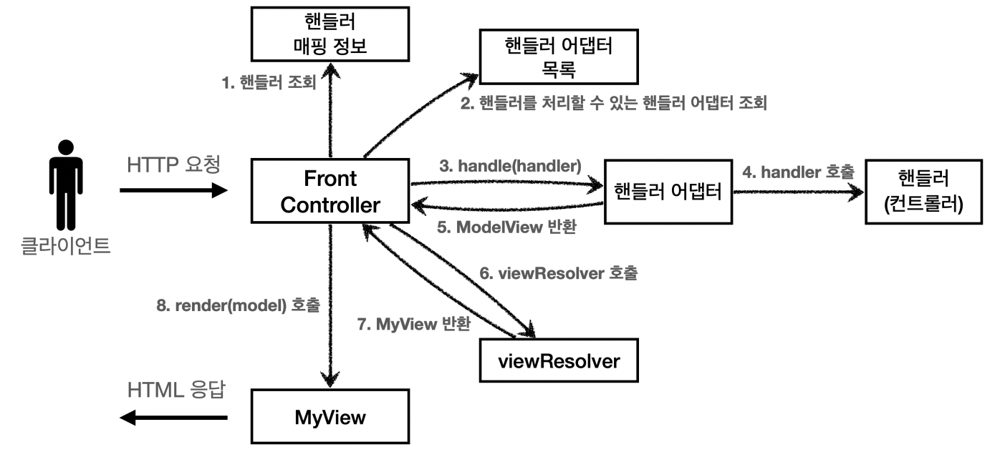
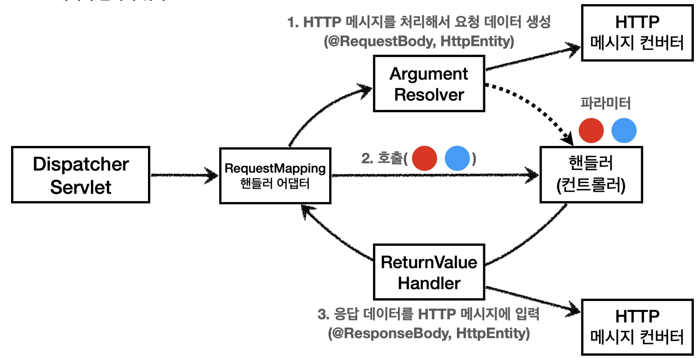
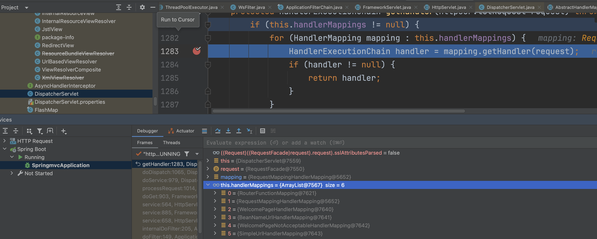
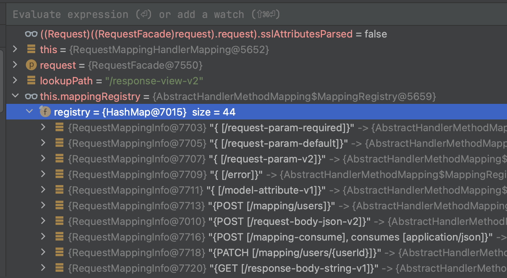
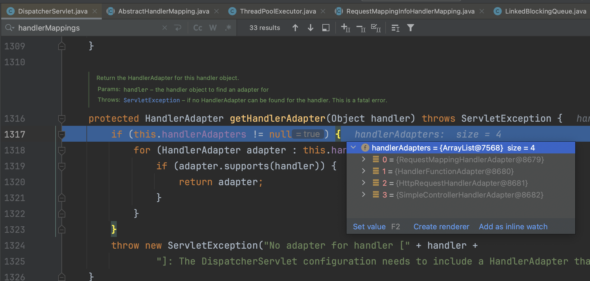
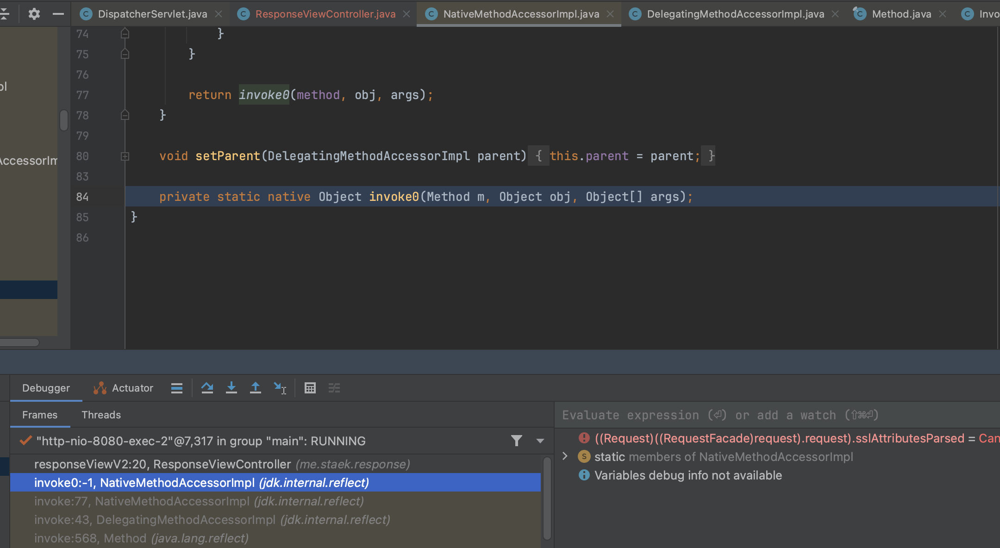
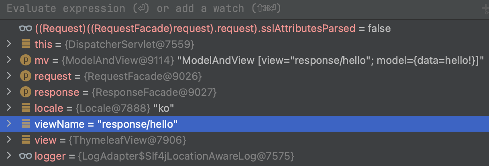
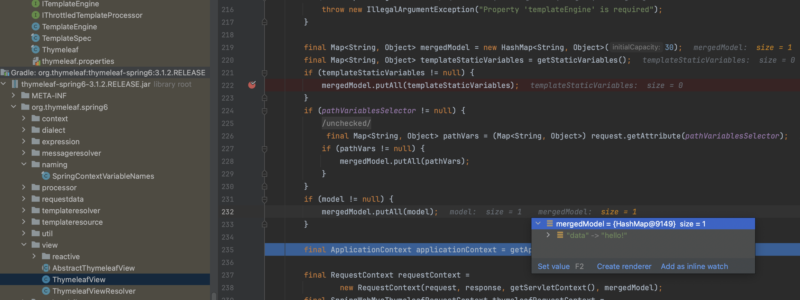
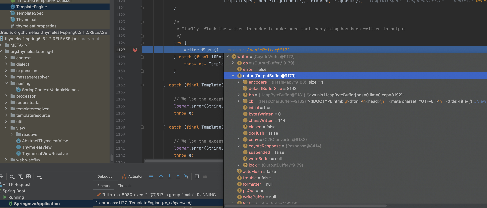

# SpringFramework MVC 분석

~~~
SpringBoot
- 빈을 모두 등록한다.
- 내장톰캣을 실행한다 (WebServerStartStopLifecycle > start())

Tomcat
	worker를 실행한다. worker는 ThreadPoolExecutor객체로 관리한다.
	- BlockingQuere,LinkedBlockingQueue 를 확장한 TaskQueue 를 사용한다.
	- 처음 10개 생성, 최대 200개 생성, 데몬스레드로 실행.
	- LinkedBlockingQueue 의 take()에서 요청이 올 때까지 대기한다.

	NioEndpoint 에서는 worker 스레드를 모두 생성한 후
	Poller, Acceptor 데몬 스레드를 생성한다. Poller는 멀티플렉싱을 지원한다.

  NioEndpoint run() 메서드에서 select() 메서드로 Blocking 멀티플랙싱을 데몬스레드에서 수행한다.
	- 요청이 들어오면 KQueueSelectorImpl 클래스의 poll()를 수행한다.
	- 기본이 Blocking인데, wait중인 worker스레드와 관계가 정확히 어떤지 공부가 필요할 거 같다.

~~~

## handler mapping

스프링에서 지원하는 여러개 핸들러 매핑 중, RequestMapping에 대해 알아보자.

- 참고로 handlermapping에 등록된 Mapping클래스들은 빈에 등록된 상태이다.

### AbstractHandlerMethodMapping

- 빈을 모두 등록한 후 RequestMapping 정보를 Handler에 매핑하는 작업을 진행한다.
- 아래 로직중 `getMappingForMethod` 메서드는 RequestMappingInfoHandlerMapping 에서 구현한, `@RequestMapping`을 작성한 메서드 정보를 가져온다.
- 이후 `registerHandlerMethod` 메서드로 MappingRegistry 타입의 멤버변수에 Map형태로 메서드정보를 저장한다.

~~~java
	protected void detectHandlerMethods(Object handler) {
		Class<?> handlerType = (handler instanceof String beanName ?
				obtainApplicationContext().getType(beanName) : handler.getClass());

		if (handlerType != null) {
			Class<?> userType = ClassUtils.getUserClass(handlerType);
			Map<Method, T> methods = MethodIntrospector.selectMethods(userType,
					(MethodIntrospector.MetadataLookup<T>) method -> {
						try {
							return getMappingForMethod(method, userType);
						}
						catch (Throwable ex) {
							throw new IllegalStateException("Invalid mapping on handler class [" +
									userType.getName() + "]: " + method, ex);
						}
					});
			if (logger.isTraceEnabled()) {
				logger.trace(formatMappings(userType, methods));
			}
			else if (mappingsLogger.isDebugEnabled()) {
				mappingsLogger.debug(formatMappings(userType, methods));
			}
			methods.forEach((method, mapping) -> {
				Method invocableMethod = AopUtils.selectInvocableMethod(method, userType);
				registerHandlerMethod(handler, invocableMethod, mapping);
			});
		}
	}
~~~

### RequestMappingInfoHandlerMapping

- `getMappingForMethod` 는 `createRequestMappingInfo` 를 호출해서 실제 `@RequestMapping` 를 작성한 메서드 리스트를 가져온다.

~~~java
	protected RequestMappingInfo getMappingForMethod(Method method, Class<?> handlerType) {
		RequestMappingInfo info = createRequestMappingInfo(method);
		...
~~~

~~~java
	private RequestMappingInfo createRequestMappingInfo(AnnotatedElement element) {
		RequestMappingInfo requestMappingInfo = null;
		RequestCondition<?> customCondition = (element instanceof Class<?> clazz ?
				getCustomTypeCondition(clazz) : getCustomMethodCondition((Method) element));

		List<AnnotationDescriptor> descriptors = getAnnotationDescriptors(element);

		List<AnnotationDescriptor> requestMappings = descriptors.stream()
				.filter(desc -> desc.annotation instanceof RequestMapping).toList();
~~~

`AbstractHandlerMethodMapping` 클래스에서 `MappingRegistry` 타입 맴버변수 정보를 채운다.

이미 만들어진 @Controller 빈에 대해서 @RequestMapping 어노테이션이 붙은 메서드에 대한 정보를 MappingRegistry로 만들어 저장한다.

~~~java
	protected void registerHandlerMethod(Object handler, Method method, T mapping) {
		this.mappingRegistry.register(mapping, handler, method);
	}
~~~

이렇게 만들어진 매핑정보는 아래와 같다.

### DispatcherServlet

~~~java
	protected void doDispatch(HttpServletRequest request, HttpServletResponse response) throws Exception {
		HttpServletRequest processedRequest = request;
		HandlerExecutionChain mappedHandler = null;
		boolean multipartRequestParsed = false;

		WebAsyncManager asyncManager = WebAsyncUtils.getAsyncManager(request);

		try {
			ModelAndView mv = null;
			Exception dispatchException = null;

			try {
				processedRequest = checkMultipart(request);
				multipartRequestParsed = (processedRequest != request);

				// Determine handler for the current request.
				mappedHandler = getHandler(processedRequest);
				if (mappedHandler == null) {
					noHandlerFound(processedRequest, response);
					return;
				}

				// Determine handler adapter for the current request.
				HandlerAdapter ha = getHandlerAdapter(mappedHandler.getHandler());

				// Process last-modified header, if supported by the handler.
				String method = request.getMethod();
				boolean isGet = HttpMethod.GET.matches(method);
				if (isGet || HttpMethod.HEAD.matches(method)) {
					long lastModified = ha.getLastModified(request, mappedHandler.getHandler());
					if (new ServletWebRequest(request, response).checkNotModified(lastModified) && isGet) {
						return;
					}
				}

				if (!mappedHandler.applyPreHandle(processedRequest, response)) {
					return;
				}

				// Actually invoke the handler.
				mv = ha.handle(processedRequest, response, mappedHandler.getHandler());

				if (asyncManager.isConcurrentHandlingStarted()) {
					return;
				}

				applyDefaultViewName(processedRequest, mv);
				mappedHandler.applyPostHandle(processedRequest, response, mv);
			}
			catch (Exception ex) {
				dispatchException = ex;
			}
			catch (Throwable err) {
				// As of 4.3, we're processing Errors thrown from handler methods as well,
				// making them available for @ExceptionHandler methods and other scenarios.
				dispatchException = new ServletException("Handler dispatch failed: " + err, err);
			}
			processDispatchResult(processedRequest, response, mappedHandler, mv, dispatchException);
		}
		catch (Exception ex) {
			triggerAfterCompletion(processedRequest, response, mappedHandler, ex);
		}
		catch (Throwable err) {
			triggerAfterCompletion(processedRequest, response, mappedHandler,
					new ServletException("Handler processing failed: " + err, err));
		}
		finally {
			if (asyncManager.isConcurrentHandlingStarted()) {
				// Instead of postHandle and afterCompletion
				if (mappedHandler != null) {
					mappedHandler.applyAfterConcurrentHandlingStarted(processedRequest, response);
				}
			}
			else {
				// Clean up any resources used by a multipart request.
				if (multipartRequestParsed) {
					cleanupMultipart(processedRequest);
				}
			}
		}
	}

~~~

DispatcherServlet > getHandler

- RequestMappingInfoHandlerMapping 에서 매핑에 성공한 핸들러를 리턴하게 된다.

~~~java
@Nullable
protected HandlerExecutionChain getHandler(HttpServletRequest request) throws Exception {
  if (this.handlerMappings != null) {
    for (HandlerMapping mapping : this.handlerMappings) {
      HandlerExecutionChain handler = mapping.getHandler(request);
      if (handler != null) {
        return handler;
      }
    }
  }
  return null;
}
~~~

AbstractHandlerMethodMapping > addMatchingMappings

- 실행할 메서드 이름 매칭

~~~java
private void addMatchingMappings(Collection<T> mappings, List<Match> matches, HttpServletRequest request) {
  for (T mapping : mappings) {
    T match = getMatchingMapping(mapping, request);
    if (match != null) {
      matches.add(new Match(match, this.mappingRegistry.getRegistrations().get(mapping)));
    }
  }
}
~~~

~~~java
protected HandlerAdapter getHandlerAdapter(Object handler) throws ServletException {
  if (this.handlerAdapters != null) {
    for (HandlerAdapter adapter : this.handlerAdapters) {
      if (adapter.supports(handler)) {
        return adapter;
      }
    }
  }
  throw new ServletException("No adapter for handler [" + handler +
      "]: The DispatcherServlet configuration needs to include a HandlerAdapter that supports this handler");
}
~~~

 ResponseViewController.java  > responseViewV2

- Controller 실행!

~~~java
@RequestMapping("/response-view-v2")
public String responseViewV2(Model model) {
    model.addAttribute("data", "hello!");
    return "response/hello";
}
~~~

DispatcherServlet > processDispatchResult

- render 메서드 실행

~~~java
private void processDispatchResult(HttpServletRequest request, HttpServletResponse response,
    @Nullable HandlerExecutionChain mappedHandler, @Nullable ModelAndView mv,
    @Nullable Exception exception) throws Exception {

...
  // Did the handler return a view to render?
  if (mv != null && !mv.wasCleared()) {
    render(mv, request, response);
    if (errorView) {
      WebUtils.clearErrorRequestAttributes(request);
    }
  }
  else {
...
}
~~~

~~~java
protected void render(ModelAndView mv, HttpServletRequest request, HttpServletResponse response) throws Exception {
  // Determine locale for request and apply it to the response.
  Locale locale =
      (this.localeResolver != null ? this.localeResolver.resolveLocale(request) : request.getLocale());
  response.setLocale(locale);

  View view;
  String viewName = mv.getViewName();
  if (viewName != null) {
    // We need to resolve the view name.
    view = resolveViewName(viewName, mv.getModelInternal(), locale, request);
    if (view == null) {
      throw new ServletException("Could not resolve view with name '" + mv.getViewName() +
          "' in servlet with name '" + getServletName() + "'");
    }
  }
  else {
    // No need to lookup: the ModelAndView object contains the actual View object.
    view = mv.getView();
    if (view == null) {
      throw new ServletException("ModelAndView [" + mv + "] neither contains a view name nor a " +
          "View object in servlet with name '" + getServletName() + "'");
    }
  }

  // Delegate to the View object for rendering.
  if (logger.isTraceEnabled()) {
    logger.trace("Rendering view [" + view + "] ");
  }
  try {
    if (mv.getStatus() != null) {
      request.setAttribute(View.RESPONSE_STATUS_ATTRIBUTE, mv.getStatus());
      response.setStatus(mv.getStatus().value());
    }
    view.render(mv.getModelInternal(), request, response);
  }
  catch (Exception ex) {
    if (logger.isDebugEnabled()) {
      logger.debug("Error rendering view [" + view + "]", ex);
    }
    throw ex;
  }
}
~~~

ThymeleafView > renderFragment

TemplateEngine >  process

- 

TaskQueue extends LinkedBlockingQueue > take

- worker 스레드는 작업큐를 얻기위해 다시 `await` 된다.

~~~java
public E take() throws InterruptedException {
    final E x;
    final int c;
    final AtomicInteger count = this.count;
    final ReentrantLock takeLock = this.takeLock;
    takeLock.lockInterruptibly();
    try {
        while (count.get() == 0) {
            notEmpty.await();
...
~~~

## ArgumentResolver

AbstractHandlerMethodAdapter > handle

- DispatcherServlet 에서 handle 메서드를 호출함.
- 메서드 호출을 따라 아래로 쭉 이동하면, ModelAttributeMethodProcessor 의 resolveArgument 메서드가 파라메터에 `@ModelAttribute` 가 붙은 인자를 검사하여 값을 request에 세팅한다.
- `RequestMappingHandlerAdapter`는 `HandlerMethodArgumentResolverComposite` 를 맴버변수로 가지고 있으면서,
  `HandlerMethodArgumentResolverComposite`는 `HandlerMethodArgumentResolver` 타입의 맴버변수를 리스트로 가지고 있어
  여러 인자에 대해 대응이 가능하다는걸 일수 있다

~~~java
@Override
@Nullable
public final ModelAndView handle(HttpServletRequest request, HttpServletResponse response, Object handler)
    throws Exception {

  return handleInternal(request, response, (HandlerMethod) handler);
}
~~~

RequestMappingHandlerAdapter

~~~java
	@Nullable
	protected ModelAndView invokeHandlerMethod(HttpServletRequest request,
			HttpServletResponse response, HandlerMethod handlerMethod) throws Exception {
...

		invocableMethod.invokeAndHandle(webRequest, mavContainer);
		..
~~~

ServletInvocableHandlerMethod

- invokeForRequest 메서드에서 resolveArgument 메서드를 통해 요청파라메터를 세팅하고,

  **invoke 메서드를 수행해서 컨트롤러를 호출한다.**

- 이후 `HandlerMethodReturnValueHandlerComposite` 타입의 `handleReturnValue` 메서드를 수행해서
  `@ResponseBody`, `HttyEntity`등을 세팅한다.

~~~java
	public void invokeAndHandle(ServletWebRequest webRequest, ModelAndViewContainer mavContainer,
			Object... providedArgs) throws Exception {

		Object returnValue = invokeForRequest(webRequest, mavContainer, providedArgs);
		...

		try {
			this.returnValueHandlers.handleReturnValue(
					returnValue, getReturnValueType(returnValue), mavContainer, webRequest);
		...
	}
~~~

...

InvocableHandlerMethod

~~~java
	protected Object[] getMethodArgumentValues(NativeWebRequest request, @Nullable ModelAndViewContainer mavContainer,
			Object... providedArgs) throws Exception {
  ...
~~~

HandlerMethodArgumentResolverComposite

~~~java
	@Override
	@Nullable
	public Object resolveArgument(MethodParameter parameter, @Nullable ModelAndViewContainer mavContainer,
			NativeWebRequest webRequest, @Nullable WebDataBinderFactory binderFactory) throws Exception {
		...		
		return resolver.resolveArgument(parameter, mavContainer, webRequest, binderFactory);
	}
~~~

ModelAttributeMethodProcessor > resolveArgument

~~~java
@Override
@Nullable
public final Object resolveArgument(MethodParameter parameter, @Nullable ModelAndViewContainer mavContainer,
    NativeWebRequest webRequest, @Nullable WebDataBinderFactory binderFactory) throws Exception {

  Assert.state(mavContainer != null, "ModelAttributeMethodProcessor requires ModelAndViewContainer");
  Assert.state(binderFactory != null, "ModelAttributeMethodProcessor requires WebDataBinderFactory");

  String name = ModelFactory.getNameForParameter(parameter);
  ModelAttribute ann = parameter.getParameterAnnotation(ModelAttribute.class);
  if (ann != null) {
    mavContainer.setBinding(name, ann.binding());
  }

  Object attribute;
  BindingResult bindingResult = null;
    ...
~~~

## ReturnValueHandler

ServletInvocableHandlerMethod

~~~java
public void invokeAndHandle(ServletWebRequest webRequest, ModelAndViewContainer mavContainer,
  Object... providedArgs) throws Exception {
  ..

try {
  this.returnValueHandlers.handleReturnValue(
      returnValue, getReturnValueType(returnValue), mavContainer, webRequest);
}
~~~

HandlerMethodReturnValueHandlerComposite

~~~java
	@Nullable
	private HandlerMethodReturnValueHandler selectHandler(@Nullable Object value, MethodParameter returnType) {
		boolean isAsyncValue = isAsyncReturnValue(value, returnType);
		for (HandlerMethodReturnValueHandler handler : this.returnValueHandlers) {
			if (isAsyncValue && !(handler instanceof AsyncHandlerMethodReturnValueHandler)) {
				continue;
			}
			if (handler.supportsReturnType(returnType)) {
				return handler;
			}
		}
		return null;
	}
~~~

