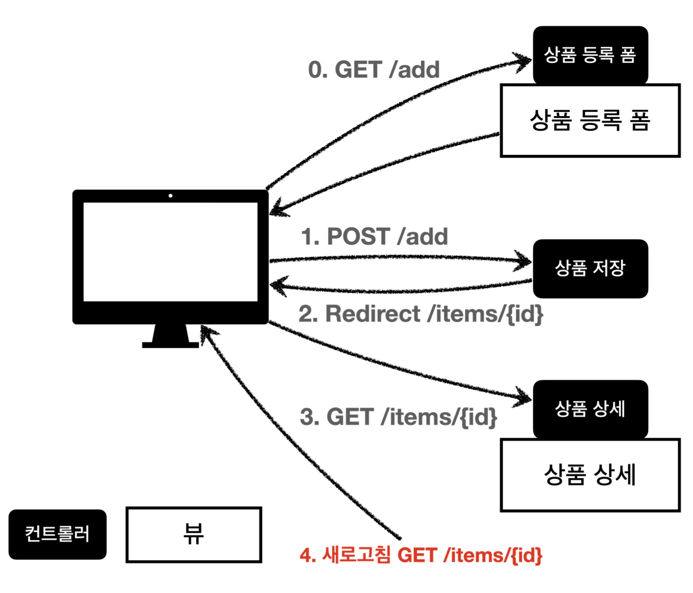

# 섹션 7. 스프링 MVC - 웹 페이지 만들기

## 프로젝트 생성

[https://start.spring.io/](https://start.spring.io/)

- Group: hello
- Artifact: **item-service**
- Name: item-service
- Package name: **hello.itemservice**
- Packaging: **Jar (주의!)**
- Java: 11

## 요구사항 분석

**상품 도메인 모델**

- 상품 ID
- 상품명
- 가격
- 수량

**상품 관리 기능**

- 상품 목록
- 상품 상세
- 상품 등록
- 상품 수정


## 상품 도메인 개발

```java
@Getter @Setter
public class Item {

    private Long id;
    private String itemName;
    private Integer price;
    private Integer quantity;
		...
}

```

기본적으로 사용하는 `Item`의 `model` 구조는 위와 같이 되어있다.

- `Long id` : 상품의 id
- `String itemName` : 상품의 이름
- `Integer price` : 상품의 가격
- `Integer quantity` : 상품의 수량

지금 위에 코드에서는 lombok을 사용하고 있는데. 핵심 도메인 모델에서 `@Data` 같은 애를 사용하기에는 `@Data`는 `getter`, `setter` 외에도 많은 기능들을 제공하고 있기때문에 위험성이 있다.

그러므로 사용할것만 제한해서 사용하는 것이 좋다.

( DTO에 경우에는 `@Data`를 사용하는 경우가 있다고 하긴하는데, 그럴경우에도 주의해서 사용할 것! )

```java
    ...		
    public void update(Long itemId, Item updateParam) {
        Item findItem = findById(itemId);
        findItem.setItemName(updateParam.getItemName());
        findItem.setPrice(updateParam.getPrice());
        findItem.setQuantity(updateParam.getQuantity());
    }
    ...
```

위와 같이 item에 대한 정보를 업데이트해주는 메소드가 있다고할때
가장 좋은 구현방식은 `Item`을 넘겨주고 그 내용을 바탕으로 update를 진행하는 것이 아니라.
`ItemDTO`라는 모델을 만들고 그 모델을 넘겨줘서 데이터를 update하는 것이 개발하는 측면에서 덜 헷갈리고
필요없는 데이터 통신이 최소화 된다.

## 상품 서비스 HTML

bottstrap을 기반으로 사용하는 html 추가.

**HTML, css 파일**

- `/resources/static/css/bootstrap.min.css`
bootstrap을 지원하는 파일 추가.
- `/resources/static/html/items.html`
아이템들의 목록을 보여주는 페이지
- `/resources/static/html/item.html`
아이템의 세부 정보를 보여주는 페이지
- `/resources/static/html/addForm.html`
아이템을 새롭게 등록할 수 있는 페이지
- `/resources/static/html/editForm.html`
기존에 있는 아이템의 정보를 수정할 수 있는 페이지

## 상품 목록 - 타임리프

### **타임리프 간단히 알아보기**

**타임리프 사용 선언**
`<html xmlns:th="http://www.thymeleaf.org">`

**속성 변경 th:href**

- `th:href="@{/css/bootstrap.min.css}"`
- `href="value1"` 을 `th:href="value2"` 의 값으로 변경한다.
- 타임리프 뷰 템플릿을 거치게 되면 원래 값을 `th:xxx` 값으로 변경한다. 만약 값이 없다면 새로 생성한다.
- HTML을 그대로 볼 때는 `href` 속성이 사용되고, 뷰 템플릿을 거치면 `th:href` 의 값이 `href` 로 대체되면서 동적으로 변경할 수 있다.
- 대부분의 HTML 속성을 `th:xxx` 로 변경할 수 있다.

**타임리프 핵심**

- 핵심은 `th:xxx` 가 붙은 부분은 서버사이드에서 렌더링 되고, 기존 것을 대체한다. `th:xxx` 이 없으면 기존 html의 `xxx` 속성이 그대로 사용된다.
- HTML을 파일로 직접 열었을 때, `th:xxx` 가 있어도 웹 브라우저는 `th:` 속성을 알지 못하므로 무시한다.
- 따라서 HTML을 파일 보기를 유지하면서 템플릿 기능도 할 수 있다.

**URL 링크 표현식 @{...}**,
`th:href="@{/css/bootstrap.min.css}"`

- `@{...}` : 타임리프는 URL 링크를 사용하는 경우 `@{...}` 를 사용한다. 이것을 URL 링크 표현식이라 한다.
- URL 링크 표현식을 사용하면 서블릿 컨텍스트를 자동으로 포함한다.

**상품 등록 폼으로 이동**

**속성 변경 th:onclick**

- `onclick="location.href='addForm.html'"`
- `th:onclick="|location.href='@{/basic/items/add}'|"`

여기에는 다음에 설명하는 리터럴 대체 문법이 사용되었다. 자세히 알아보자.

**리터럴 대체 |...|**

`|...|` :이렇게 사용한다.

- 타임리프에서 문자와 표현식 등은 분리되어 있기 때문에 더해서 사용해야 한다.
`<span th:text="'Welcome to our application, ' + ${user.name} + '!'">`
- 다음과 같이 리터럴 대체 문법을 사용하면, 더하기 없이 편리하게 사용할 수 있다.
`<span th:text="|Welcome to our application, ${user.name}!|">`
- 결과를 다음과 같이 만들어야 하는데
`location.href='/basic/items/add'`
- 그냥 사용하면 문자와 표현식을 각각 따로 더해서 사용해야 하므로 다음과 같이 복잡해진다.
`th:onclick="'location.href=' + '\'' + @{/basic/items/add} + '\''"`
- 리터럴 대체 문법을 사용하면 다음과 같이 편리하게 사용할 수 있다.
`th:onclick="|location.href='@{/basic/items/add}'|"`

**반복 출력 th:each**

- `<tr th:each="item : ${items}">`
- 반복은 `th:each` 를 사용한다. 이렇게 하면 모델에 포함된 `items`컬렉션 데이터가 `item` 변수에 하나씩 포함되고, 반복문 안에서 `item` 변수를 사용할 수 있다.
- 컬렉션의 수 만큼 `<tr>..</tr>` 이 하위 테그를 포함해서 생성된다.

**변수 표현식 ${...}**

- `<td th:text="${item.price}">10000</td>`
- 모델에 포함된 값이나, 타임리프 변수로 선언한 값을 조회할 수 있다.
- 프로퍼티 접근법을 사용한다. ( `item.getPrice()` )

**내용 변경 th:text**

- `<td th:text="${item.price}">10000</td>`
- 내용의 값을 `th:text` 의 값으로 변경한다.
- 여기서는 10000을 `${item.price}` 의 값으로 변경한다.

**URL 링크 표현식2 - @{...}**,

- `th:href="@{/basic/items/{itemId}(itemId=${item.id})}"`
- 상품 ID를 선택하는 링크를 확인해보자.
- URL 링크 표현식을 사용하면 경로를 템플릿처럼 편리하게 사용할 수 있다.
- 경로 변수( `{itemId}` ) 뿐만 아니라 쿼리 파라미터도 생성한다.
- 예) `th:href="@{/basic/items/{itemId}(itemId=${item.id}, query='test')}"`
    - 생성 링크: `http://localhost:8080/basic/items/1?query=test`
    ( 매칭되지않은 문자에 경우에는 쿼리파라미터로 사용된다고한다. )

**URL 링크 간단히**

- `th:href="@{|/basic/items/${item.id}|}"`
- 상품 이름을 선택하는 링크를 확인해보자.
- 리터럴 대체 문법을 활용해서 간단히 사용할 수도 있다.

## 상품 상세

## 상품 등록 폼

```java
<form action="item.html" th:action method="post">
	...
</form>
```

`th:action`

HTML form에서 `action` 에 값이 없으면 현재 URL에 데이터를 전송한다.

## 상품 등록 처리 - @ModelAttribute

```java
@PostMapping("/add")
public String addItemV2(@ModelAttribute("item") Item item, Model model) {

    itemRepository.save(item);
    model.addAttribute("item", item); // 자동 추가, 생략 가능
    
    return "basic/item";
}
```

```java
@PostMapping("/add")
public String addItemV2(@ModelAttribute("item") Item item) {

    itemRepository.save(item);
    
    return "basic/item";
}
```

**@ModelAttribute - 요청 파라미터 처리**

`@ModelAttribute` 는 `Item` 객체를 생성하고, 요청 파라미터의 값을 프로퍼티 접근법(setXxx)으로 입력해준다.

**@ModelAttribute - Model 추가**

위에 보여준 코드는 두 코드가 모두 똑같이 동작이 이루어진다.
`@ModelAttribute` 로 지정한 객체를 자동으로 넣어준다. 그러므로 `model.addAttribute` 행동이 생략 가능하다.

`@ModelAttribute("hello")Item item` → 이름을 `hello`로 지정

`model.addAttribute("hello",item);` → 모델에 `hello` 이름으로 저장

위에 코드에서 `@ModelAttribute("item") Item item` 으로 적은 부분이 model에 이름으로 들어가게 되는데.
이름을 지정하는 부분을 생략하고 `@ModelAttribute Item item` 이렇게 적게되면 
`model`에 저장되는 `name`은 클래스명 첫글자만 소문자로 등록 `Item -> item`

## 상품 수정

```java
@GetMapping("/{itemId}")
public String item(@PathVariable("itemId") long itemId, Model model) {
    Item item = itemRepository.findById(itemId);
    model.addAttribute("item", item);
    return "basic/item";
}

...

@PostMapping("/{itemId}/edit")
public String edit(@PathVariable("itemId") Long itemId, @ModelAttribute Item item) {
    itemRepository.update(itemId, item);
    return "redirect:/basic/items/{itemId}";
}
```

### redirect

상품 수정은 마지막에 뷰 템플릿을 호출하는 대신에 상품 상세 화면으로 이동하도록 리다이렉트를 호출한다.

스프링은 `redirect:/...`으로 편리하게 리다이렉트를 지원한다.
`redirect:/basic/items/{itemId}`

컨트롤러에 매핑된 `@PathVariable` 의 값은 `redirect` 에도 사용 할 수 있다.
`redirect:/basic/items/{itemId}` `{itemId}` 는 `@PathVariable Long itemId` 의 값

을 그대로 사용한다.

redirect을 진행하면 해당 url로 다시 요청을 보내기때문에 그 url에 해당하는 view가 다시 실행이 이루어진다.

## PRG Post/Redirect/Get


웹 브라우저의 새로 고침은 마지막에 서버에 전송한 데이터를 다시 전송한다.

상품 등록 폼에서 데이터를 입력하고 저장을 선택하면 `POST /add` + 상품 데이터를 서버로 전송한다.
이 상태에서 새로 고침을 또 선택하면 마지막에 전송한 `POST /add` + 상품 데이터를 서버로 다시 전송하게 된다.

그래서 내용은 같고, ID만 다른 상품 데이터가 계속 쌓이게 된다.
이 문제를 어떻게 해결할 수 있을까? 에 대한 해결점을 제시한 방향을 PRG라고 이야기한다.



기존에는 POST로 데이터를 저장한것을 마지막으로 사용했기때문에 새로고침을 진행하면
마지막에 데이터를 저장했던 행위가 다시 전송되는 문제가 있었는데.
그 문제를 redirect를 사용해서 마지막 요청이 POST가 아닌 GET으로 진행을 시켜버리면 해당 문제를 해결할 수 있다. 코드로 확인을 해보자면

```java
    @PostMapping("/add")
    public String addItemV4(Item item) {

        itemRepository.save(item);
        return "basic/item";
    }
```

기존에는 위와 같이 POST를 진행한 후에 다시 그 view를 불르기위해서 `return "basic/items"` 을 진행한 코드였는데.

```java
    @PostMapping("/add")
    public String addItemV5(Item item) {

        itemRepository.save(item);
        return "redirect:/basic/items/" + item.getId();
    }
```

해당 코드를 위와 같이 저장이 다 끝난 후에 `redirect`을 사용해서 보여줄려고하는 
`view`로 이동하게 만들어버리면 새로고침을 해도 최종적으로 들어간 url은 `return "redirect:/basic/items/" + item.getId();` 이 값에 해당되기때문에 해당 문제를 해결할 수 있다.

## RedirectAttributes

```java
@PostMapping("/add")
public String addItemV5(Item item) {

    itemRepository.save(item);
    return "redirect:/basic/items/" + item.getId();
}
```

`"redirect:/basic/items/" + item.getId()` redirect에서 
`+item.getId()` 처럼 URL에 변수를 더해서 사용하는 것은 URL 인코딩이 안되기 때문에 위험하다. 
다음에 설명하는 `RedirectAttributes` 를 사용하자.

```java
@PostMapping("/add")
public String addItemV6(Item item, RedirectAttributes redirectAttributes) {
    Item saveItem = itemRepository.save(item);
    redirectAttributes.addAttribute("itemId", saveItem.getId());
    redirectAttributes.addAttribute("status", true);
    return "redirect:/basic/items/{itemId}";
}
```

`RedirectAttributes`를 사용하면 위와 같이 사용이 가능하다. 해당 코드가 실행되면 결과물이
`http://localhost:8080/basic/items/3?status=true` 이와 같이 나오게 된다.

**RedirectAttributes**

`RedirectAttributes`를 사용하면 URL 인코딩도 해주고,`pathVariable`, 쿼리 파라미터까지 처리해준다.

- `redirect:/basic/items/{itemId}`
- pathVariable 바인딩: `{itemId}`
- 나머지는 쿼리 파라미터로 처리: `?status=true`

`RedirectAttributes` 을 사용하면 `"redirect:/basic/items/{itemId}"` 이와 같이 바인딩이 가능하여 `item.getId()` 방식을 사용안해도 되도록 수정이 가능해지고, 사용되지않은 나머지값들은

`?status=true` 이와 같이 쿼리 파라미터로 처리되게 된다.

```java
<h2 th:if="${param.status}" th:text="저장 완료!"></h2>
```

- `th:if` : 해당 조건이 참이면 실행
- `${param.status}` : 타임리프에서 쿼리 파라미터를 편리하게 조회하는 기능
원래는 컨트롤러에서 모델에 직접 담고 값을 꺼내야 한다. 그런데 쿼리 파라미터는 자주 사용해서 타임리프에서 직접 지원한다.

그러면 쿼리파라미터로 처리가 된 값을 위와 같이 `html`에서 `th`로 조건문을 걸어서 특정 행동을 해줄 수 있다.