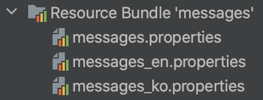

# 3. 메시지, 국제화

## 메시지, 국제화 소개

### 메시지

화면의 보이는 문구 등 프로젝트 곳곳에서 사용된 어떠한 단어 대해 변경요청이 들어왔을때

```java
// addForm.html
<label for="itemName">상품명</label>

// editForm.html
<label for="itemName">상품명</label>
...
```

모든 파일에 일일이 들어가서 키워드들을 전부 수정하는 것은 상당히 비효율적이고 불편한 행동이다.

```java
// messages.properties
item=상품
item.id=상품 ID
item.itemName=상품명
item.price=가격
item.quantity=수량
```

그러한 행동을 위와 같이 `messages`들을 정의해둔 파일을 만들고 

```java
// addForm.html
<label for="itemName" th:text="#{item.itemName}"></label>

// editForm.html
<label for="itemName" th:text="#{item.itemName}"></label>
```

위와 같이 가져다 쓰는 방식을 사용하면 하나의 파일에서만 해당 내용을 바꿀 수 있으니 효율적인 코드 구성을 할 수 있다.

### 국제화

국제화는 메시지 개념에서 더 나아가 나라별로 각각 다른 언어 패키지를 만드는 것을 이야기한다.

**messages_en.properties**

```java
item=Item
item.id=Item ID
item.itemName=Item Name
item.price=price
item.quantity=quantity
```

**messages_ko.properties**

```java
item=상품
item.id=상품 ID
item.itemName=상품명
item.price=가격
item.quantity=수량
```

그러면 언어별로 따로  html을 작성하지않아도 되고 클라이언트의 요구에 따라 불러오는 파일만 다르게 하면 되니 편하게 코드를 작성할 수 있게 된다.

한국에서 접근한 것인지 영어에서 접근한 것인지는 인식하는 방법은 HTTP `accept-language` 해더 값을 사용하거나 사용자가 직접 언어를 선택하도록 하고, 쿠키 등을 사용해서 처리하면 된다.

메시지와 국제화 기능을 직접 구현할 수도 있겠지만, 스프링은 기본적인 메시지와 국제화 기능을 모두 제공한다. 그리고 타임리프도 스프링이 제공하는 메시지와 국제화 기능을 편리하게 통합해서 제공한다.
지금부터 스프링이 제공하는 메시지와 국제화 기능을 알아보자.

## 스프링 메시지 소스 설정

스프링은 기본적인 메시지 관리 기능을 제공한다.

**직접 등록**

```java
@Bean
 public MessageSource messageSource() { 
		ResourceBundleMessageSource messageSource = new
		ResourceBundleMessageSource();
    messageSource.setBasenames("messages", "errors");
    messageSource.setDefaultEncoding("utf-8");
    return messageSource;
}
```

**스프링 부트**
스프링 부트를 사용하면 스프링 부트가 `MessageSource` 를 자동으로 스프링 빈으로 등록한다.

**스프링 부트 메시지 소스 기본 값**
`spring.messages.basename=messages`

`messageSource`를 스프링 빈으로 등록하지 않고, 스프링 부트와 관련된 별도의 설정을 하지 않으면 `messages`라는 이름으로 기본 등록된다. 따라서`messages_en.properties`, `messages_ko.properties`, `[messages.properties](http://messages.properties)` 파일만 등록하면 자동으로 인식된다.
( 사용자에 맞는 언어가 없다면 자동으로 `messages.properties` 사용 )

## 스프링 메시지 소스 사용

```java
@SpringBootTest
public class MessageSourceTest {

    @Autowired
    MessageSource ms;

    ...
}
```

**기본적인 사용방법**

```java
@Test
void helloMessage() {
    String result = ms.getMessage("hello", null, null);
    assertThat(result).isEqualTo("hello");
}
```

`MessageSource ms;` 을 통해서 가져온 ms를 바탕으로 `getMessage` 를 사용하여 



위에 사진과 같은 경로에서 알아서 찾아서 사용할 수 있도록 해준다. 

`key`에 해당하는 `code` 값을 넣어주면 그것에 맞는 `locale`을 탐색하여 실행을 해준다.
( `null`로 되어있는 경우에는 각 컴퓨터마다 설정이 되어있는 `default` 값을 바탕으로 실행이 이루어진다. )

**오류 케이스**

```java
@Test
void notFoundMessageCode() {
    assertThatThrownBy(() -> ms.getMessage("no_code", null, null))
            .isInstanceOf(NoSuchMessageException.class);
}
```

등록이 되어있지않은 `code`값이 들어가게 되면 위와 같이 에러가 발생하게 된다.

**default message**

```java
@Test
void notFoundMessageCodeDefaultMessage() {
    String result = ms.getMessage("no_code", null, "기본 메시지", null);
    assertThat(result).isEqualTo("기본 메시지");
}
```

3번째 인자를 추가적으로 넣어서 값을 넣어주게 되면 등록되어있지않는 `code`값이 들어간다고 하더라도 오류가 발생하지않고 3번째 인자의 값이 담기게된다.

**치환하기**

```java
// messages.properties
hello.name=hello {0}
```

```java
@Test
void argumentMessage() {
    String message = ms.getMessage("hello.name", new Object[]{"Spring"}, null);
    assertThat(message).isEqualTo("hello Spring");
}
```

위와 같이 `[messages.properties](http://messages.properties)` 에 인자로 넣게되면 아래에 test code와 같이 치환이되어 실행이 이루어진다.

**locale 변경하기**

```java
@Test
void defaultLang() {
    assertThat(ms.getMessage("hello", null, null)).isEqualTo("hello");
    assertThat(ms.getMessage("hello", null, Locale.ENGLISH)).isEqualTo("hello");
}

@Test
void koLang() {
    assertThat(ms.getMessage("hello", null, Locale.KOREA)).isEqualTo("안녕");
}
```

위와 같이 `locale`을 지정해서 넣어주면 그것에 해당되는 파일을 찾아서 반환해준다.

## 웹 애플리케이션에 메시지 적용하기

```java
// messages.properties
label.item.id=상품 ID

...

// edit.html
<label for="itemName" th:text="#{label.item.itemName}">상품명</label>
```

사용할때는 위와 같이 `#{…}` 을 사용하면 쉽게 적용하는 것이 가능하다.

**참고로 파라미터는 다음과 같이 사용할 수 있다.**
`hello.name=안녕 {0}`
`<p th:text="#{hello.name(${item.itemName})}"></p>`

## 웹 애플리케이션에 국제화 적용하기

국제화에 경우에는 위에서 학습할대로 `messages_en.properties` 이런식으로 언어만 추가해줘도 클라이언트에 해당하는 언어를 제공해준다.

만약에 클라이언트가 직접 언어를 선택할 수 있게 제공을 해준다면 서버측에서는 쿠키나 세션에 사용자의 데이터를 제공하는 방식으로 구현할 수 있다