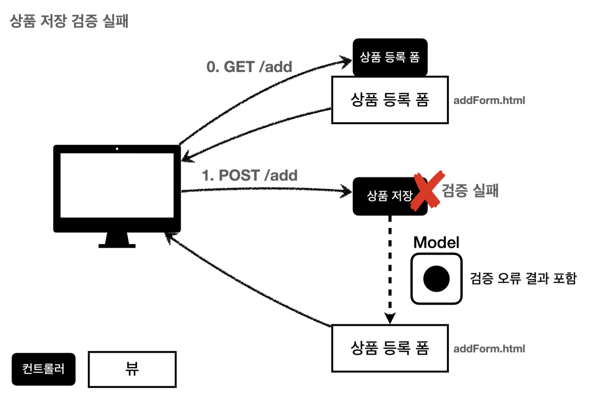
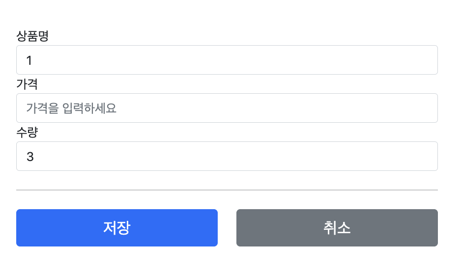

# 4. 검증1 - Validation

## 검증 요구사항

**요구사항: 검증 로직 추가**

- 타입 검증
    - 가격, 수량에 문자가 들어가면 검증 오류 처리
- 필드 검증
    - 상품명: 필수, 공백X
    - 가격: 1000원 이상, 1백만원 이하
    - 수량: 최대 9999
- 특정 필드의 범위를 넘어서는 검증
    - 가격 * 수량의 합은 10,000원 이상

## 검증 직접 처리 - 소개



위쪽에서 해당되는 검증로직에 걸려 문제가 발생된다면 서버는 클라이언트가 입력한 정보를 그대로 가지고,
어떠한 부분에서 문제가 발생되어 반려되어있는지 클라이언트에게 해당 이유와 정보를 같이 다시 보낸다.
(`POST /add`에서는 다시 `GET /add`에 접근하도록 리다이렉션 )

## 검증 직접 처리 - 개발

```java
    		...
    		// 검증 오류 결과를 보관
        Map<String, String> errors = new HashMap<>();

        // 검증 로직
        if (!StringUtils.hasText(item.getItemName())) {
            errors.put("itemName", "상품 이름은 필수입니다.");
        }
        if (item.getPrice() == null || item.getPrice() < 1000 || item.getPrice() > 1000000) {
            errors.put("price", "가격은 1,000 ~ 1,000,000까지 허용합니다.");
        }
        if (item.getQuantity() == null || item.getQuantity() >= 9999) {
            errors.put("quantity", "수량은 최대 9,999까지 허용합니다.");
        }

        // 특정 필드가 아닌 복합 룰 검증

        if (item.getPrice() != null && item.getQuantity() != null) {
            int resultPrice = item.getPrice() * item.getQuantity();
            if (resultPrice < 10000) {
                errors.put("globalError", "가격 * 수량의 합은 10,000원 이상이어야합니다. 현재 값 = " + resultPrice);
            }
        }

        // 검증에 실패하면 다시 입 폼으로
        if (!errors.isEmpty()) {
            log.info("errors = {}", errors);
            model.addAttribute("errors", errors);
            return "validation/v1/addForm";
        }
    		...
```

검증에 해당하는 로직은 위와 같다.
데이터를 받는 ( `@PostMapping(...)` ) 부분에서 데이터에 대한 유효성 검사를 진행하는데.
데이터가 잘못된 것들을 모두 잘못된 input이라는 결과를 내 보내야하니 `Map`을 사용해서 `error`들을 모두 저장하고, error들을  model에 담아 다시 get으로 요청을 보내는 방식을 사용하고 있다.

### 어떻게 데이터가 적혀있을 수 있는가?



데이터를 입력해서 post를 보낼때 일부로 error케이스에 걸리게 요청을 보내면
기존에 적었던 데이터가 그대로 적혀있는 것을 볼 수 있다. 이게 어떻게 가능할 수 있는가?

```java
...
<label for="itemName" th:text="#{label.item.itemName}">상품명</label>
<input type="text" id="itemName" th:field="*{itemName}" class="form-control" placeholder="이름을 입력하세요">
...
```

그것에 대한 해답은 위에 코드에서 볼 수 있다.

```java
    @GetMapping("/add")
    public String addForm(Model model) {
        model.addAttribute("item", new Item());
        return "validation/v1/addForm";
    }
```

기존에 get데이터를 보낼때  빈 item 데이터도 같이 보내어서 유효성 검사를 조금 더 쉽게할 수 있는 방식에 대해서 이야기를 했었는데. 그로 인해 html코드에서는 `th:field="*{itemName}"` 이와 같이 로직을 사용했었다.
그로 인해  post에서 error에 걸릴 시 기존에 적힌 item에 대한 정보도 같이 넘어가기때문에 기존에 적힌 로직이 그대로 적혀 있을 수 있다.

( 기존에 학습했다시피 `@ModelAttribute` 를 사용하면 자동으로 `model`에 `addAttribute` 를 진행해준다. )

### 반환된 값을 바탕으로 에러 표시

```java
<div th:if="${errors?.containsKey('globalError')}">
		<p class="field-error" th:text="${errors['globalError']}">전체 오류 메시지</p>
</div>
```

**참고 Safe Navigation Operator**
만약 여기에서 `errors` 가 `null` 이라면 어떻게 될까?
생각해보면 등록폼에 진입한 시점에는 `errors` 가 없다.
따라서 `errors.containsKey()` 를 호출하는 순간 `NullPointerException` 이 발생한다.

`errors?.` 은 `errors` 가 `null` 일때 `NullPointerException` 이 발생하는 대신, `null` 을 반환하는 문법이다.
`th:if` 에서 `null` 은 실패로 처리되므로 오류 메시지가 출력되지 않는다.

**남은 문제점**

- 뷰 템플릿에서 중복 처리가 많다. 뭔가 비슷하다.
- 타입 오류 처리가 안된다. `Item` 의 `price` , `quantity` 같은 숫자 필드는 타입이 `Integer` 이므로 문자 타입으로 설정하는 것이 불가능하다. 숫자 타입에 문자가 들어오면 오류가 발생한다. 그런데 이러한 오류는 스프링 MVC에서 컨트롤러에 진입하기도 전에 예외가 발생하기 때문에, 컨트롤러가 호출되지도 않고, 400 예외가 발생하면서 오류 페이지를 띄워준다.
- `Item` 의 `price` 에 문자를 입력하는 것 처럼 타입 오류가 발생해도 고객이 입력한 문자를 화면에 남겨야 한다. 만약 컨트롤러가 호출된다고 가정해도 `Item` 의 `price` 는 `Integer` 이므로 문자를 보관할 수가 없다. 결국 문자는 바인딩이 불가능하므로 고객이 입력한 문자가 사라지게 되고, 고객은 본인이 어떤 내용을 입력해서 오류가 발생했는지 이해하기 어렵다.
- 결국 고객이 입력한 값도 어딘가에 별도로 관리가 되어야 한다

## BindingResult1

위에서 나온 문제점들을 쉽게 해결할 수 있도록 지원을 해주는 것이 **`BindingResult`**라는 스프링 자체에서 지원해주는 class가 존재한다.

```java
@PostMapping("/add")
 public String addItemV1(@ModelAttribute Item item, BindingResult bindingResult,
 RedirectAttributes redirectAttributes) {
```

### **BindingResult :**

스프링에서 제공해주는 데이터 바인딩 결과 및 유효성 검사 결과를 저장하는 객체이다.
`@ModelAttribute` 객체 바로 뒤에 `BindingResult` 를 선언하여 사용하는 것이 보편적인 사용방식라고한다.

**필드 오류 FieldError**

```java
if (!StringUtils.hasText(item.getItemName())) {
	bindingResult.addError(new FieldError("item", "itemName", "상품 이름은 필수입니다."));
}

// form
public FieldError(String objectName, String field, String defaultMessage) {}
```

- 필드에 대한 오류를 처리할 수 있는 객체
- `objectName` : `@ModelAttribute` 이름
- `field` : 오류가 발생한 필드 이름
- `defaultMessage` : 오류 기본 메시지

**글로벌 오류 - ObjectError**

```java
// ex
bindingResult.addError(new ObjectError("item", "가격 * 수량의 합은 10,000원 이상이어야 합니다. 현재 값 = " + resultPrice));

// form
public ObjectError(String objectName, String defaultMessage) {}
```

- 특정 필드에서만 발생한 오류가 아닌 경우 
`bjectError` 객체를 생성해서 `bindingResult` 에 담아두면 된다.
- `objectName` : `@ModelAttribute` 의 이름
- `defaultMessage` : 오류 기본 메시지

**타임리프 스프링 검증 오류 통합 기능**

### `#fields`

```html
<div th:if="${#fields.globalErrors()}">
    <p class="field-error" th:each="err : ${#fields.globalErrors()}" th:text="${err}">전체 오류 메시지</p>
</div>
```

- `#fields` : `#fields` 로 `BindingResult` 가 제공하는 검증 오류에 접근할 수 있다.

위에 코드 같은 경우에서는 `#fields`를 바탕으로 global에러가 존재하는지 확인할 수 있었다.

### `th:errorclass` `th:errors`

```html
<div>
    <label for="itemName" th:text="#{label.item.itemName}">상품명</label>
    <input type="text" id="itemName" th:field="*{itemName}"
           th:errorclass="field-error" class="form-control" placeholder="이름을 입력하세요">
    <div class="field-error" th:errors="*{itemName}">
        상품 명 오류
    </div>
</div>
```

- `th:errorclass` : `th:field` 에서 지정한 필드에 오류가 있으면 `class` 정보를 추가한다.
해당 코드는 `th:field="*{itemName}"` 이것을 바탕으로 동작을 하며 `th:field`에 문제가 발생하였다면 해당 코드를 실행시킨다.
- `th:errors` : 해당 필드에 오류가 있는 경우에 태그를 출력한다. `th:if` 의 편의 버전이다.
기존 코드에서는 `th:if` 를 사용해서  `itemName` 이라는 필드가 있는지 없는지 부터 확인을 하는 과정을 진행했었는데. `th:errors` 에 경우에는 이 과정을 한번에 처리해주며 `**itemName`이라는 필드가 존재한다면 해당 요소내에 택스트로 출력하라는 의미를 담고있다.**

잘못된 경우 텍스트박스를 비워주는 역할은 그럼 누가 하는것인가..?

→ 클라이언트가 보낸 텍스트박스가 비워지는 것은 사용자가 사용함에 있어서 좋지않다.
( 클라이언트가 입력한 정보를 모두 날려버리는 것이니 )

해당 역할은 `FieldError` 에서 해당 일이 발생된다고한다.

## BindingResult2

`BindingResult` 가 있으면 `@ModelAttribute` 에 데이터 바인딩 시 오류가 발생해도 컨트롤러가 호출된다!

**예) @ModelAttribute에 바인딩 시 타입 오류가 발생하면?**
`BindingResult` 가 없으면 400 오류가 발생하면서 컨트롤러가 호출되지 않고, 오류 페이지로 이동한다.
`BindingResult` 가 있으면 오류 정보( `FieldError` )를 `BindingResult` 에 담아서 컨트롤러를 정상 호출한다.

즉 타입에러가 발생했을때 에러페이지가 나오지않고 그것에 따라 에러핸들링이 가능하니 사용자 측면에서 최적화가 가능하다.

**indingResult와 Errors**
`org.springframework.validation.Errors`
`org.springframework.validation.BindingResult`

`BindingResult` 는 인터페이스이고, `Errors` 인터페이스를 상속받고 있다.
실제 넘어오는 구현체는 `BeanPropertyBindingResult` 라는 것인데, 둘다 구현하고 있으므로 `BindingResult` 대신에 `Errors` 를 사용해도 된다. `Errors` 인터페이스는 단순한 오류 저장과 조회 기능을 제공한다.
`BindingResult` 는 여기에 더해서 추가적인 기능들을 제공한다. `addError()` 도 `BindingResult` 가 제공하므로 여기서는 `BindingResult` 를 사용하자. **주로 관례상 `BindingResult` 를 많이 사용한다.**

## FieldError, ObjectError

여기서 이야기하는 문제점은 클라이언트가 데이터를 잘못입력하고 post를 보낼경우 지금의 우리 로직은 클라이언트가 작성한 텍스트를 날려버린다. 그것은 사용자 측면에서 좋은 설계가 아니기때문에 개선이 필요하다는 이야기이다.

그것을 어떻게 해결할 수 있는가?

### 해결방법

**개선 전**

```java
bindingResult.addError(new FieldError("item", "itemName", "상품 이름은 필수입니다."));
```

**개선 후**

```java
bindingResult.addError(new FieldError("item", "itemName", item.getItemName(), false, null, null, "상품 이름은 필수입니다."));
```

`FieldError` 는 두 가지 생성자를 제공한다.

```java
 public FieldError(String objectName, String field, String defaultMessage);
 public FieldError(String objectName, String field, @Nullable Object
 rejectedValue, boolean bindingFailure, @Nullable String[] codes, @Nullable
 Object[] arguments, @Nullable String defaultMessage)
```

파라미터 목록

- `objectName` : 오류가 발생한 객체 이름
- `field` : 오류 필드
- `rejectedValue` : 사용자가 입력한 값(거절된 값)
    - 우리가 작성한 검증 로직에 걸려 `FieldError`가 발생이 되었을 때 사용자가 입력한 값은 무엇인지를 같이 넘겨주는 과정이 이루어진다.
- `bindingFailure` : 타입 오류 같은 바인딩 실패인지, 검증 실패인지 구분 값
    - `new FieldError()`를 진행할때 어떠한 조건으로 인해 `new`를 진행하는지에 따라 `true`, `false`가 이야기 된다. ( 우리의 코드와 같이 상품의 이름을 넣지않아서 `new`를 진행한다면 값은 `false`가 되는 형식 )
    - **`true`**인 경우에는 오류 메시지를 표시하거나 추가적인 오류 처리를 수행하는 데 사용
- `codes` : 메시지 코드
- `arguments` : 메시지에서 사용하는 인자
- `defaultMessage` : 기본 오류 메시지

즉 `bindingFailure` 라는 인자를 넣어줌으로서 기본적으로 사용자의 입력데이터를 그대로 유지하여 다시 입력을 해야하는 번거로움을 줄여줄 수 있다.

```java
bindingResult.addError(new ObjectError(String objectName, @Nullable String[] codes, @Nullable Object[] arguments, @Nullable String defaultMessage))
```

`ObjectError`에 경우에도 유사하게 2가지 생성자를 제공

### 그래서 어떻게 그게 가능해?

사용자가 입력한 데이터를 저장해주는 기능이 있다 까지는 이해를 완료하였다.
그런데 아직 풀리지않은 의문점이 존재한다. 만약 사용자가  `price`라는 값에 `qqq`라는 값을 입력을 하면
우리의 `price`는  `Integer` 이기떄문에 `qqq`라는 값 자체를 아예 담을 수 없게된다.
하지만 실제로 로직을 돌리면 `qqq`라는 값을 넣어도 사용자의 값을 그대로 유지해주는 것을 확인할 수 있는데.
이게 어떻게 가능한가?

그것에 대한 비밀은 `FieldError`에 있다.

```java
bindingResult.addError(new FieldError(String objectName, String field, @Nullable Object rejectedValue, boolean bindingFailure, @Nullable String[] codes, @Nullable Object[] arguments, @Nullable String defaultMessage))
```

사용자가 필드 타임에 맞지않는 값을 입력하면 `FieldError`에 있는 `rejectedValue`가 해당 데이터를 들고 있는 다고한다.
그래서 내부적으로 컨트롤러를 실행하기 전에 클라이언트로 부터 받은 값을 바탕으로
 `FieldError`를 돌리고 사전에 `bindingResult` 에 담아둔다고한다.

그러면 또 다른 궁금증이 발생하게 된다.

```html
th:field="*{price}"
```

우리의 html 코드를 보면 타임리프에서는  위와 같이 `price`를 가져다가 사용을 하는데.
`qqq` 같이 `price`필드에 데이터가 제대로 담기지않은 상황에도 `qqq`를 출력해주는 것을 확인해 줄 수 있다.

이게 왜 가능하냐면 타임리프는 상황에 맞춰서 데이터가 잘 담겨있다면 `getPrice()`를 사용해서 데이터를 꺼내서 쓰고, `FieldError` 에서 보관한 값을 사용해서 값을 출력한다고 한다.

그래서 타임리프에서는 오류가 발생이 되었다면 `FieldError` 에 있는 `rejectedValue`를 사용하기때문에 기존코드에서는 `rejectedValue` 가 없었기때문에 비어있었던 것이었다.

## 오류 코드와 메시지 처리1

```java
bindingResult.addError(new FieldError("item", "price", item.getPrice(), true, null, null, "가격은 1,000 ~ 1,000,000까지 허용합니다."));
```

그래서 계속 발전을 하다가 오류처리에 대한 로직을 사용하는 방식은 위와 같다.

그런데 곰곰이 생각을 해보면 `"가격은 1,000 ~ 1,000,000까지 허용합니다."` 이와 같이 직접적으로 메시지를 넣어주고 있는데. 이러한방식말고 이전에 배웠던 메시지와 국제화의 개념을 대입하여 사용할 수 있지않을까? 하는 의문점이 들게되고 해당 내용을 적용시키는 방법에 대해서 이야기를 해본다.

### 메시지 처리 방법

오류처리를 메시지화 하기전에 해줘야하는 작업이 존재한다.

**application.properties**

```java
// default : spring.messages.basename=messages

spring.messages.basename=messages, errors
```

오류 메시지들을 담아둘 `properties` 파일을 생성해야하는데. 모두 `messages.properties` 에 담으면 그것 또한 이상하기때문에 `errors.properties`를 만드는 방식으로 진행을 한다.
그러기 위해서는 기본적으로 설정되어 있는 `properties`의 경로가 `messages`만 되어있기때문에  `errors`를 추가해주는 작업을 진행해야한다.

추가 하는 작업을 해줬기때문에 `errors.properties`는 메시지에서 학습했던 방식과 똑같이 사용할 수 있다.

**사용방법**

```java
bindingResult.addError(new FieldError("item", "price", item.getPrice(), true, new String[]{"range.item.price"}, new Object[]{1000, 1000000}, null));
```

사용방법은 위에 코드와 같다.

기존에 사용하지않았던 `codes`, `arguments` 에 대입을 하여 사용할 수 있고
`codes` : 문자를 가져올 경로를 넣어줘서 `errors.properties`에 있는 `range.item.price` 를 가져와서 사용할 수 있다.

**우선순위**

1. `String` 배열 ( 앞에 있는 것 기준 )
2. `defaultMessage`
3. `error`

`arguments` : codes에서 `가격은 {0} ~ {1} 까지 허용합니다.` 이러한 문구를 사용한다고 했을 때 `new Object[]` 에 넣은 값 순서대로 대입이 되는 방식이다. ( 즉 위에 코드에서는 {0} = 1000, {1} = 1000000 이라고 생각하면 된다 )

위와 같은것도 당연하게 `errors_en.properties`파일을 생성해준다면 국제화 동작이 이루어진다.

## 오류 코드와 메시지 처리2

여기서 이제 또 다른 문제점을 제기한다.
위와 같인 사용하는 방식이 너무 다루기 번거롭고 보기좋지않다는 것이다.
이러한 문제로 어떻게 개선을 할 수 있는가와 오류 코드를 조금 더 자동화 할 수는 없을까? 라는 문제점을 이야기해본다.

곰곰이 이전에 작성한 로직을 생각해보면

```java
addItem(@ModelAttribute Item item, BindingResult bindingResult...
```

형식으로 `@ModelAttribute` 바로 뒤에 `BindingResult`를 넣어준다는 것을 알 수 있었다.
그로 인해 `BindingResult` 는 이미 본인이 검증해야하는 객체를 알고있다는 것이다.

```java
log.info("objectName={}", bindingResult.getObjectName());
log.info("target={}", bindingResult.getTarget());

// output
// objectName=item
// target=Item(id=null, itemName=a, price=1, quantity=2)
```

그래서 위에 코드를 검증하기위해서 출력을 해보면 위와 같이 이미 `bindingResult` 는 알고있다는 것을 확인할 수 있다.

### 사용방법

```java
// form
void rejectValue(@Nullable String var1, String var2, @Nullable Object[] var3, @Nullable String var4);

// example
bindingResult.rejectValue("price", "range", new Object[]{1000, 1000000}, null);
```

```java
// form
void reject(String var1, @Nullable Object[] var2, @Nullable String var3);

// example
bindingResult.reject("totalPriceMin", new Object[]{10000, resultPrice}, null);
```

그래서 실제로 사용할때에는 위와 같이 작성하여 사용할 수 있다.
기존에 `FieldError` 에서 사용했던 것들은 다 덜고

`rejectValue`

1. `field`
2. `codes`
3. `arguments`
4. `defaultMessage`

`reject`

1. `codes`
2. `arguments`
3. `defaultMessage`

이와 같은 순서로 값이 들어가게 된다.

## 오류 코드와 메시지 처리3

“이번 파트에서는 오류코드를 어떻게 설계를 해야하는가?” 에 대해서 이야기를 해본다.

오류 코드를 만들 때 다음과 같이 자세히 만들 수도 있고,
`required.item.itemName` : 상품 이름은 필수 입니다.
`range.item.price` : 상품의 가격 범위 오류 입니다.

또는 다음과 같이 단순하게 만들 수도 있다.
`required` : 필수 값 입니다.
`range` : 범위 오류 입니다.

단순하게 만들면 범용성이 좋아서 여러곳에서 사용할 수 있지만, 메시지를 세밀하게 작성하기 어렵다. 반대로 너무 자세 하게 만들면 범용성이 떨어진다. **가장 좋은 방법은 범용성으로 사용하다가, 세밀하게 작성해야 하는 경우에는 세밀한 내 용이 적용되도록 메시지에 단계를 두는 방법이다**

예를 들어서 `required` 라고 오류 코드를 사용한다고 가정해보자.
다음과 같이 `required` 라는 메시지만 있으면 이 메시지를 선택해서 사용하는 것이다.

```java
```properties
required: 필수 값 입니다.
```
```

그런데 오류 메시지에 `required.item.itemName` 와 같이 객체명과 필드명을 조합한 세밀한 메시지 코드가 있으면 이 메시지를 높은 우선순위로 사용하는 것이다.

```java
```properties
#Level1
required.item.itemName: 상품 이름은 필수 입니다.

#Level2
required: 필수 값 입니다.
```
```

`???` 그러면 서버에서 `bindingResult.rejectValue("itemName", "required"...` 이라고 사용하면 
`required.item.itemName` 에 매칭이 된다는 이야기인가..?
그럼 `required: 필수 값 입니다.` 는 어떻게 해야 사용할 수 있는거지?

→ 예상대로 `required.item.itemName` 가 사용되는 것이 맞다. 우선순위를 가지고 있어서 내가 `reject` 함수에 입력한 값을 기준으로 그 값과 가장 근접한 오류코드를 찾는다. 그것에 대한 우선순위는 아래에서 설명

## 오류 코드와 메시지 처리4

그럼 오류 코드의 우선순위는 어떻게 정해지는가에 대해서 알아보자.

**MessageCodesResolver**

- 검증 오류 코드로 메시지 코드들을 생성한다.
- `MessageCodesResolver` 인터페이스이고 `DefaultMessageCodesResolver` 는 기본 구현체이다.
- 주로 다음과 함께 사용 `ObjectError` , `FieldError`

### 확인코드

```java
    MessageCodesResolver codesResolver = new DefaultMessageCodesResolver();	

    @Test
    void messageCodesResolverObject() {
        String[] messageCodes = codesResolver.resolveMessageCodes("required", "item");
        for (String messageCode : messageCodes) {
            System.out.println("messageCode = " + messageCode);
        }
        assertThat(messageCodes).containsExactly("required.item", "required");
    }
    
// Output
// messageCode = required.item
// messageCode = required
```

실제로 내부 로직을 돌려보면 위와 같다.
우리가 위에서 사용했던 `reject` 내부에서는 `resolveMessageCodes` 이러한 함수를 사용하는데.
저 함수에 `reject`안에 넣었던 값들이 대입이되면서 `output`이 나오게 되는데 저 `output`을 기준으로 
`reject` 내부에서 `ObjectError` 가 돌면서 먼저나온 우선순위를 기준으로 값이 있는지 찾는 방식이라고 한다.

**객체 오류**

```java
객체 오류의 경우 다음 순서로 2가지 생성
1.: code + "." + object name
2.: code

예) 오류 코드: required, object name: item
1.: required.item
2.: required
```

**필드 오류**

```java
필드 오류의 경우 다음 순서로 4가지 메시지 코드 생성
1.: code + "." + object name + "." + field
2.: code + "." + field
3.: code + "." + field type
4.: code

예) 오류 코드: typeMismatch, object name "user", field "age", field type: int
1. "typeMismatch.user.age"
2. "typeMismatch.age"
3. "typeMismatch.int"
4. "typeMismatch”
```

그래서 객체와 필드의 우선순위를 정리하자면 위와 같이 구성할 수 있다.

**동작 방식**

- `rejectValue()` , `reject()` 는 내부에서 `MessageCodesResolver` 를 사용한다. 여기에서 메시지 코드들을 생성한다.
- `FieldError` , `ObjectError` 의 생성자를 보면, 오류 코드를 하나가 아니라 여러 오류 코드를 가질 수 있다. `MessageCodesResolver` 를 통해서 생성된 순서대로 오류 코드를 보관한다.
- 이 부분을 `BindingResult` 의 로그를 통해서 확인해보자.
    - `codes [range.item.price, range.price, range.java.lang.Integer, range]`

- **FieldError** `rejectValue("itemName", "required")`
다음 4가지 오류 코드를 자동으로 생성
- `required.item.itemName`
- `required.itemName`
- `required.java.lang.String`
- `required`

- ***ObjectError*** `reject("totalPriceMin")`
다음 2가지 오류 코드를 자동으로 생성
- `totalPriceMin.item`
- `totalPriceMin`

**오류 메시지 출력**
타임리프 화면을 렌더링 할 때 `th:errors` 가 실행된다. 만약 이때 오류가 있다면 생성된 오류 메시지 코드를 순서대로 돌아가면서 메시지를 찾는다. 그리고 없으면 디폴트 메시지를 출력한다.

## 오류 코드와 메시지 처리5

**핵심은 구체적인 것에서! 덜 구체적인 것으로!**
`MessageCodesResolver` 는 `required.item.itemName` 처럼 구체적인 것을 먼저 만들어주고, `required`처럼 덜 구체적인 것을 가장 나중에 만든다.
이렇게 하면 앞서 말한 것 처럼 메시지와 관련된 공통 전략을 편리하게 도입할 수 있다.

**왜 이렇게 복잡하게 사용하는가?**
모든 오류 코드에 대해서 메시지를 각각 다 정의하면 개발자 입장에서 관리하기 너무 힘들다.
크게 중요하지 않은 메시지는 범용성 있는 `requried` 같은 메시지로 끝내고, 정말 중요한 메시지는 꼭 필요할 때 구체적으로 적어서 사용하는 방식이 더 효과적이다.

### 설계 방법

```java
#Level1
required.item.itemName=상품 이름은 필수입니다.

#Level2 - 생략
// required.itemName=

#Level3
required.java.lang.String = 필수 문자입니다.

#Level4
required = 필수 값 입니다.
```

우선순위를 사용해서 `error msg`도 위와 같이 설계를 하는것이 가능하다.
크게 객체 오류와 필드 오류를 나누었다. 그리고 범용성에 따라 레벨을 나누어두었다.

- `level1` : 해당 `error msg`를 사용하는 경우에는 상품이라는 것을 알기때문에 상품이라는 키워드를 넣어서 확정을 지어 `error msg`를 구성할 수 있다.
- `level2` : 생략
- `level3` : 타입을 바탕으로 `error msg`를 구성하기때문에 문자라는 근거를 얻어 `error msg`를 구성할 수 있다.
- `level4` :  `required` 라는 이름에 맞춰서 가장 작은 근거가 있으니 필수 값이라는 `error msg`를 구성할 수 있다.

위와 같은 규칙을 가지고 설계를 하는 것이 가능하게 된다.
상황에 따라 `msg`가 달라져야한다면 `properties` 에서 우선순위에 맞게 `msg`만 추가해주면 되니`application code`를 변경할 필요없이 `properties`만 변경해서 메시지를 변경할 수 있게 된다.

ValidationUtils

**ValidationUtils 사용 전**

```java
if (!StringUtils.hasText(item.getItemName())) {
		bindingResult.rejectValue("itemName", "required", "기본: 상품 이름은 필수입니다.");
}
```

**ValidationUtils 사용 후**

다음과 같이 한줄로 가능, 제공하는 기능은 `Empty` , 공백 같은 단순한 기능만 제공

```java
ValidationUtils.rejectIfEmptyOrWhitespace(bindingResult, "itemName", "requird");
```

### **정리**

1. `rejectValue()` 호출
2. `MessageCodesResolver` 를 사용해서 검증 오류 코드로 메시지 코드들을 생성
3. `new FieldError()` 를 생성하면서 메시지 코드들을 보관
4. `th:erros` 에서 메시지 코드들로 메시지를 순서대로 메시지에서 찾고, 노출

## 오류 코드와 메시지 처리6

### 스프링이 직접 만든 오류 메시지 처리

1. 개발자가 직접 설정한 오류 코드 → `rejectValue()` 를 직접 호출 
2. 스프링이 직접 검증 오류에 추가한 경우(주로 타입 정보가 맞지 않음)

2번과 같이 스프링이 직접 오류 메시지 출력하는 방식도 우리가 작성한 `errors.properties` 와 다르지않다.

```java
Field error in object 'item' on field 'price': rejected value [qqq]; codes [typeMismatch.item.price,typeMismatch.price,typeMismatch.java.lang.Integer,typeMismatch]; arguments [org.springframework.context.support.DefaultMessageSourceResolvable: codes [item.price,price]; arguments []; default message [price]]; default message [Failed to convert property value of type 'java.lang.String' to required type 'java.lang.Integer' for property 'price'; nested exception is java.lang.NumberFormatException: For input string: "qqq"]
```

integer에 문자를 넣고 나오는 에러문구를 분석해보면

1. `typeMismatch.item.price`
2. `typeMismatch.price`
3. `typeMismatch.java.lang.Integer`
4. `typeMismatch`

위와 같은 우선순위를 기준으로 문구를 찾고 없으면 

`default message [Failed to convert property value of type 'java.lang.String' to required type 'java.lang.Integer' for property 'price'; nested exception is java.lang.NumberFormatException: For input string: "qqq"]`

이러한 `default message`를 사용한다는 이야기이다. 그래서 지금까지는 계속 우선순위 범위에 있는 에러문구를 설정을 안해줘서 계속 `default message` 가 나왔던 것이다.

**errors.properties**

```java
typeMismatch.java.lang.Integer=숫자를 입력해주세요.
typeMismatch=타입 오류입니다.
```

그래서 우선순위 범위에 있는 이름으로 `errors.properties` 에 설정해서 넣어주게 되면 스프링이 직접 만든 오류메시지가 아닌 내가 직접 작성한 오류메시지로 값이 나오게 된다.

## Validator 분리1

코드가 너무 길어지다보니 한눈에 보기가 어렵다.

복잡한 검증 로직을 별도로 분리하자.

컨트롤러에서 검증 로직이 차지하는 부분은 매우 크다. 이런 경우 별도의 클래스로 역할을 분리하는 것이 좋다. 그리고 이렇게 분리한 검증 로직을 재사용 할 수도 있다.

```java
@Component
public class ItemValidator implements Validator {
    @Override
    public boolean supports(Class<?> aClass) {
        return Item.class.isAssignableFrom(aClass);
        // 이렇게 isAssignableFrom을 사용하면 자식 클래스인 경우에도 해당 로직을 통해 검증을 할 수 있기때문에 더 좋다.
    }

    @Override
    public void validate(Object target, Errors errors) {
        Item item = (Item) target;

        // 검증 로직
    }
}

```

## Validator 분리2

스프링이 `Validator` 인터페이스를 별도로 제공하는 이유는 체계적으로 검증 기능을 도입하기 위해서다. 그런데 앞 에서는 검증기를 직접 불러서 사용했고, 이렇게 사용해도 된다. 그런데 `Validator` 인터페이스를 사용해서 검증기를 만들면 스프링의 추가적인 도움을 받을 수 있다.

```java
@InitBinder
public void init(WebDataBinder dataBinder) {
    dataBinder.addValidators(itemValidator);
}
```

이렇게 `WebDataBinder` 에 검증기를 추가하면 해당 컨트롤러에서는 검증기를 자동으로 적용할 수 있다. `@InitBinder` 해당 컨트롤러에만 영향을 준다. 글로벌 설정은 별도로 해야한다. (마지막에 설명)

```java
public String addItemV6(**@Validated** @ModelAttribute Item item, BindingResult bindingResult, RedirectAttributes redirectAttributes, Model model) {
	...
}
```

validator를 직접 호출하는 부분이 사라지고, 대신에 검증 대상 앞에 `@Validated` 가 붙었다.

그러면 자동으로 `itemValidator` 이 실행되고 그것에 대한 결과물에 `bindingResult` 에 담기게 된다.

**글로벌 설정** - **모든 컨트롤러에 다 적용**

```java
@SpringBootApplication
 public class ItemServiceApplication implements WebMvcConfigurer {
     public static void main(String[] args) {
         SpringApplication.run(ItemServiceApplication.class, args);
}
     @Override
     public Validator getValidator() {
         return new ItemValidator();
     }
}
```

이렇게 글로벌 설정을 추가할 수 있다. 기존 컨트롤러의 `@InitBinder` 를 제거해도 글로벌 설정으로 정상 동작하는것을 확인할 수 있다. ( 글로벌로는 거의 할일이 없음 )